# Kaggriculture Feature Model C2.1 — Observable & Derivable riconciliato post-3Q

- **Fase:** Model Foundation C2.1 / Post-3Q Review Pass
- **Stato:** RECONCILED / FOUNDATION POST-3Q COMPLETE
- **Data:** 2026-09-01
- **Ambito:** Rappresentazione formale, causale, period-aware, policy-neutral e no-leakage dello stato dell'ambiente ad uso dei controller
- **Fonti normative congelate:**
  - `results/model_spec_c2/foundation_revision/ANTIGRAVITY_C2_FINAL_ENGINE_CONTRACT_RECONCILIATION.md` (FROZEN)
  - `docs/model/ontology/ONTOLOGY_C2.md` (CONSOLIDATED)
  - `docs/model/state_machine/KAGGRICULTURE_STATE_MACHINE_C2.md` (CONSOLIDATED)
  - `results/model_spec_c2/foundation_revision/CODEX_C2_ENGINE_CONTRACT_PERIOD_LEDGER_AUDIT.md` (FROZEN)
- **Reconciliation Authority:** `results/model_spec_c2/foundation_revision/FOUNDATION_CROSS_REVIEW_RECONCILIATION.md` (CONSOLIDATED)
- **Runtime di riferimento:** `kaggle-environments` 1.32.7 (`kaggriculture` 0.1.0) — Fingerprint: `4378b60f61a3af22ed875969e1be7e7f11af0b0e050b51aa80c0778c4113207d`
- **Baseline congelata:** `docs/model/feature_model/KAGGRICULTURE_FEATURE_MODEL_C2.md`
- **Review candidate preservata:** `docs/model/feature_model/KAGGRICULTURE_FEATURE_MODEL_C2_1_POST_3Q_REVIEW_CANDIDATE.md`
- **Destinazione riconciliata:** `docs/model/feature_model/KAGGRICULTURE_FEATURE_MODEL_C2_1.md`

---

## 1. Scopo, perimetro e separazione architetturale

Il **Kaggriculture Feature Model C2.1** è la revisione riconciliata del terzo layer della Foundation. Formalizza la trasformazione dello stato grezzo dell'ambiente simulato in un insieme strutturato di **feature osservabili e derivabili a tempo $t$**; la baseline C2 resta preservata come riferimento storico congelato.

Il Feature Model risponde alla domanda fondamentale:
> **Quali informazioni può conoscere o calcolare deterministicamente l'agente al tempo $t$, con quale formula, provenienza, livello di osservabilità, unità di misura, validità temporale e assenza di leakage futuro?**

### 1.1 Confine architetturale: Rappresentazione dello Stato vs Policy Decisionale
Il Feature Model modella **la rappresentazione descrittiva dello stato**, NON il processo decisionale o strategico dell'agente.

In particolare:
- **NON contiene scelte di policy:** non prescrive ranking di convenienza, decisioni di acquisto/semina, preferenze di espansione o soglie di profitto;
- **Policy-Neutrality dell'Environment Feature Vector:** le feature derivate dell'ambiente dipendono unicamente dallo stato fisico/biologico primitivo e non dalle scelte di allocazione dell'agente;
- **Quadripartizione Epistemica del Processo Operativo (CORR-13):**
  1. `ACTION_REQUEST` ($A_t$): comando formulato dall'agente partendo da $S_t$;
  2. `SNAPSHOT_ELIGIBILITY`: predicati di legalità `action_eligible_now` calcolati su $S_t$;
  3. `EXECUTION_OUTCOME`: risultato effettivo dell'engine (`SUCCESS`, `NO_OP`, `REJECTED`);
  4. `POST_STATE_EVIDENCE` ($S_{t+1}$): evidenza osservata nello stato risultante post-transizione;
- **Separa il Policy Context:** le variabili deliberative generate dall'agente (`in_working_set`, `reserved_serviceable_before_deadline`, `livestock_serviceable_capacity`, `policy_retirement_due`, `market_orders_in_current_batch`) costituiscono un canale di input distinto verso il controller;
- **Separa la Telemetria di Review:**
  $$\text{REPLAY / EPISODE\_TRACE} \longrightarrow \text{POST\_HOC\_METRICS} \longrightarrow \text{OFFLINE\_REVIEW}$$

---

## 2. No-Future-Leakage Contract e Classi di Osservabilità

### 2.1 Principio No-Future-Leakage
$$\text{FEATURE}_t = f(\text{OBSERVATION}_t, \text{PRIVATE\_STATE}_t, \text{FROZEN\_CONTRACTS}, \text{PAST\_HISTORY}_{\le t})$$
È categoricamente vietato l'accesso o l'incorporazione nel vettore di feature online a tempo $t$ di:
1. Stati futuri dell'ambiente ($\text{STATE}_{t+1}, \dots$);
2. Esiti di estrazioni RNG future (es. spawn casuale weed a EOD);
3. Prezzi di mercato futuri o comportamenti futuri dell'avversario;
4. Realizzazione effettiva a posteriori di servizi logistici (`realized_serviceable_in_window` $\to$ `POST-02`);
5. Reward finale o cassa terminale (`final_money_outcome` $\to$ `POST-01`);
6. Efficienza retrospettiva di routing (`necessary_transit_fraction` $\to$ `POST-29`, `routing_completion_efficiency` $\to$ `POST-30`);
7. Onset retrospettivo di blocco economico (`economic_lock_in_onset` $\to$ `POST-31`).

Tali grandezze sono classificate come `POST_HOC_METRIC` o `TELEMETRY_ONLY` e possono essere calcolate solo offline a fine episodio per scopi di review, diagnostica e replay analysis.

### 2.2 Classi Canoniche di Osservabilità e Provenance

| Classe di Osservabilità | Descrizione | Accessibilità Online ($t$) | Esempi |
|---|---|:---:|---|
| `ONLINE_OBSERVABLE` | Grandezza primitiva presente direttamente nell'osservazione pubblica o nello stato privato al tick corrente. | **SÌ** | `observation.step`, `observation.day`, `farm.money`, `private.seeds`, `farm.tiles[y][x]` |
| `ONLINE_DERIVABLE` | Grandezza calcolata deterministicamente a tempo $t$ da campi osservabili e dal contratto normativo congelato. | **SÌ** | `crop_age_days`, `crop_harvest_readiness`, `tile_care_due_condition`, `action_eligible_now` |
| `POLICY_CONTEXT` | Assegnazione, prenotazione o parametro deliberativo generato dalla policy decisionale dell'agente. | **SÌ (Context)** | `in_working_set`, `reserved_serviceable_before_deadline`, `livestock_serviceable_capacity`, `policy_retirement_due` |
| `ACTION_BATCH_CONTEXT` | Conteggio o stato costruito dall'agente durante l'assemblaggio del batch di comandi dello step corrente. | **SÌ (Batch)** | `market_orders_in_current_batch`, `market_orders_remaining_turn` |
| `ENGINE_INTERNAL` | Variabile interna dell'interpreter non esposta nelle osservazioni. | **NO** | `rng_internal_state`, `market_elasticity_weights` |
| `TELEMETRY_ONLY` | Dato di telemetria intra-step registrato per tracciamento post-azione. | **NO (Post-action)** | `action_execution_result`, `transition_reason`, `market_transaction_value` |
| `OUTCOME_ONLY` / `POST_HOC_METRIC` | Metrica o outcome calcolabile unicamente a fine episodio su log consolidati. | **NO (Review only)** | `final_money_outcome`, `realized_serviceable_in_window`, `routing_completion_efficiency` |

---

## 3. Schema Canonico del Feature Contract

Ogni feature canonica nel catalogo soddisfa lo schema a 17 campi obbligatori:

```text
┌──────────────────────────────┬────────────────────────────────────────────────────────────────────────┐
│ CAMPO SCHEMA                 │ DEFINIZIONE E REQUISITI                                                │
├──────────────────────────────┼────────────────────────────────────────────────────────────────────────┤
│ feature_id                   │ Identificatore univoco e machine-friendly (es. TMP-01, CRP-09, LIV-02)│
│ source_concept_id            │ Mapping concettuale verso ONTOLOGY_C2.md (o NONE_DIRECT)                │
│ domain                       │ TIME, LAND, WORKFORCE, CROP, LIVESTOCK, INVENTORY, MARKET, ELIGIBILITY │
│ semantic_type                │ RAW, PREDICATE, CATEGORICAL, NUMERIC_SCALAR, TIMING_CONSTRAINT,        │
│                              │ AGGREGATE, SPATIAL_COORDINATE, STRUCT_OBJECT                           │
│ epistemic_class              │ ENGINE_FACT, DERIVED_ENGINE_FACT, POLICY_CONTEXT, POST_HOC_METRIC      │
│ evidence_status              │ ENGINE_VERIFIED, DERIVED, POLICY_DECLARED, POST_HOC_METRIC             │
│ observability                │ ONLINE_OBSERVABLE, ONLINE_DERIVABLE, POLICY_CONTEXT, TELEMETRY_ONLY,   │
│                              │ OUTCOME_ONLY                                                           │
│ source_fields                │ Campi primitivi sorgente (es. observation.day, farm.tiles, private)    │
│ formula / derivation         │ Regola o formula deterministica di calcolo                             │
│ unit                         │ Unità fisica (step, days, tiles, units, $, boolean, ratio, categorical)│
│ temporal_reference           │ Clock di riferimento: engine_step, current_day, intra_day_phase, EOD   │
│ validity / preconditions     │ Condizioni di esistenza (es. tile.kind == PLANT)                       │
│ nullability_state            │ Valore assunto se non applicabile (es. null, explicit NONE)            │
│ update_frequency             │ Frequenza di tick: PER_STEP, PER_DAY, ON_DEMAND, TERMINAL_ONLY        │
│ policy_dependency            │ NO (ENGINE) oppure esplicita dipendenza da contesto policy            │
│ future_leakage_risk          │ NO (per tutte le feature online); YES se abusata come online           │
│ notes                        │ Limitazioni, guardie associate e chiarimenti normativi                 │
└──────────────────────────────┴────────────────────────────────────────────────────────────────────────┘
```

---

## 4. Master Canonical Feature Catalog (Materialized Feature Contract)

| feature_id | source_concept_id | domain | semantic_type | epistemic_class | evidence_status | observability | source_fields | formula / derivation | unit | temporal_ref | validity | nullability | update_freq | policy_dep | leakage_risk | notes |
|---|---|---|---|---|---|---|---|---|---|---|---|---|---|:---:|:---:|---|
| **TMP-01** | `canonical_clock_coordinate` | TIME | RAW | `ENGINE_FACT` | `ENGINE_VERIFIED` | `ONLINE_OBSERVABLE` | `observation.step` | `identity` | step | engine_step | Always | None | PER_STEP | NO | NO | Clock primitivo dell'engine |
| **TMP-02** | `canonical_clock_coordinate` | TIME | RAW | `ENGINE_FACT` | `ENGINE_VERIFIED` | `ONLINE_OBSERVABLE` | `observation.day` | `identity` | day | current_day | Always | None | PER_STEP | NO | NO | Giorno biologico/contrattuale corrente |
| **TMP-03** | `canonical_clock_coordinate` | TIME | RAW | `ENGINE_FACT` | `ENGINE_VERIFIED` | `ONLINE_OBSERVABLE` | `observation.hour` | `identity` | hour | intra_day_phase | Always | None | PER_STEP | NO | NO | Fase infra-giornaliera $[0, T-1]$ |
| **TMP-04** | `canonical_clock_coordinate` | TIME | RAW | `ENGINE_FACT` | `ENGINE_VERIFIED` | `ONLINE_OBSERVABLE` | Config parameter | `turnsPerDay` | step/day | configuration | Always | None | STATIC | NO | NO | Costante di discretizzazione $T$ |
| **TMP-05** | `canonical_clock_coordinate` | TIME | NUMERIC_SCALAR | `DERIVED_ENGINE_FACT` | `DERIVED` | `ONLINE_DERIVABLE` | `day, hour, T` | $\text{day} \cdot T + \text{hour}$ | step | canonical_clock | Always | None | PER_STEP | NO | NO | Ricostruzione diagnostica canonica |
| **TMP-06** | `canonical_clock_coordinate` | TIME | TIMING_CONSTRAINT | `DERIVED_ENGINE_FACT` | `DERIVED` | `ONLINE_DERIVABLE` | `hour, T` | $(T - 1) - \text{hour}$ | step | intra_day_phase | Always | None | PER_STEP | NO | NO | Passi mancanti all'attivazione dell'EOD |
| **TMP-07** | `canonical_clock_coordinate` | TIME | PREDICATE | `DERIVED_ENGINE_FACT` | `DERIVED` | `ONLINE_DERIVABLE` | `hour, T` | $\text{hour} == T - 1$ | boolean | intra_day_phase | Always | None | PER_STEP | NO | NO | Indica se lo step corrente chiude la giornata |
| **TMP-08** | `canonical_clock_coordinate` | TIME | TIMING_CONSTRAINT | `DERIVED_ENGINE_FACT` | `DERIVED` | `ONLINE_DERIVABLE` | `step, T, episodeSteps` | $\lfloor (\text{episodeSteps} - 1 - \text{step}) / T \rfloor$ | day | current_day | Always | None | PER_STEP | NO | NO | Giorni interi residui prima del termine |
| **TMP-09** | `canonical_clock_coordinate` | TIME | TIMING_CONSTRAINT | `DERIVED_ENGINE_FACT` | `DERIVED` | `ONLINE_DERIVABLE` | `step, episodeSteps` | $\max(0, \text{episodeSteps} - 1 - \text{step})$ | step | engine_step | Always | None | PER_STEP | NO | NO | Step totali residui nell'episodio |
| **TMP-10** | `canonical_clock_coordinate` | TIME | NUMERIC_SCALAR | `DERIVED_ENGINE_FACT` | `DERIVED` | `ONLINE_DERIVABLE` | `step, episodeSteps` | $\text{step} / (\text{episodeSteps} - 1)$ | ratio | engine_step | Always | None | PER_STEP | NO | NO | Progresso normalizzato $[0, 1]$ |
| **FRM-01** | `current_money_state` | LAND | RAW | `ENGINE_FACT` | `ENGINE_VERIFIED` | `ONLINE_OBSERVABLE` | `farms[player].money` | `identity` | \$ | engine_step | Always | None | PER_STEP | NO | NO | Cassa liquida spendibile online |
| **FRM-02** | `activated_land_surface` | LAND | RAW | `ENGINE_FACT` | `ENGINE_VERIFIED` | `ONLINE_OBSERVABLE` | `farms[player].tiles` | `identity` | grid | engine_step | Always | None | PER_STEP | NO | NO | Griglia bidimensionale nativa delle tile |
| **FRM-03** | `land_surface_total` | LAND | AGGREGATE | `DERIVED_ENGINE_FACT` | `ENGINE_VERIFIED` | `ONLINE_DERIVABLE` | `unlocked_quadrants, boardSize` | $\text{len}(\text{unlocked\_quadrants}) \times (\text{boardSize} // 2)^2$ | tiles | engine_step | Always | None | PER_STEP | NO | NO | Superficie totale posseduta (25 per quad su default 10x10) |
| **FRM-04** | `activated_land_surface` | LAND | AGGREGATE | `DERIVED_ENGINE_FACT` | `DERIVED` | `ONLINE_DERIVABLE` | `tiles` | $\text{count}(\text{kind} \in [\text{PLANT}, \text{COOP}, \text{PASTURE}])$ | tiles | engine_step | Always | None | PER_STEP | NO | NO | Superficie attualmente produttiva/edificata |
| **FRM-05** | `crop_surface_maintained` | LAND | AGGREGATE | `DERIVED_ENGINE_FACT` | `DERIVED` | `ONLINE_DERIVABLE` | `tiles` | $\text{count}(\text{kind} == \text{PLANT})$ | tiles | engine_step | Always | None | PER_STEP | NO | NO | Superficie occupata da piante vive |
| **CRP-01** | `field_cleanliness_state` | CROP | CATEGORICAL | `ENGINE_FACT` | `ENGINE_VERIFIED` | `ONLINE_OBSERVABLE` | `tile.kind` | `identity` | categorical | engine_step | Valid $[x,y]$ | None | PER_STEP | NO | NO | Valore nativo: None, LOCKED, PLANT, WEED, COOP, PASTURE |
| **CRP-02** | `NONE_DIRECT` | CROP | CATEGORICAL | `ENGINE_FACT` | `ENGINE_VERIFIED` | `ONLINE_OBSERVABLE` | `tile.crop` | `identity` | categorical | engine_step | `kind == PLANT` | `null` | PER_STEP | NO | NO | Specie vegetale: WHEAT, CARROT, TOMATO, STRAWBERRY, MELON |
| **CRP-03** | `crop_horizon_alignment` | CROP | RAW | `ENGINE_FACT` | `ENGINE_VERIFIED` | `ONLINE_OBSERVABLE` | `tile.planted_day` | `identity` | day | current_day | `kind == PLANT` | `null` | PER_STEP | NO | NO | Giorno di semina biologica |
| **CRP-04** | `crop_horizon_alignment` | CROP | NUMERIC_SCALAR | `DERIVED_ENGINE_FACT` | `DERIVED` | `ONLINE_DERIVABLE` | `day, planted_day` | $\text{current\_day} - \text{tile.planted\_day}$ | day | current_day | `kind == PLANT` | `null` | PER_STEP | NO | NO | Età biologica della pianta |
| **CRP-05** | `crop_harvest_action_flow` | CROP | RAW | `ENGINE_FACT` | `ENGINE_VERIFIED` | `ONLINE_OBSERVABLE` | `tile.yield_units` | `identity` | units | engine_step | `kind == PLANT` | 0 | PER_STEP | NO | NO | Unità di resa accumulate sulla tile |
| **CRP-06** | `crop_harvest_action_flow` | CROP | NUMERIC_SCALAR | `DERIVED_ENGINE_FACT` | `ENGINE_VERIFIED` | `ONLINE_DERIVABLE` | `tile.crop` | $\text{CROPS}[\text{crop}].\text{max\_yield}$ | units | static | `kind == PLANT` | `null` | STATIC | NO | NO | Resa massima biologica (6 Wheat/Melon, 4 altre) |
| **CRP-07** | `crop_harvest_action_flow` | CROP | NUMERIC_SCALAR | `DERIVED_ENGINE_FACT` | `DERIVED` | `ONLINE_DERIVABLE` | `yield_units, max_yield` | $\text{yield\_units} / \text{max\_yield}$ | ratio | engine_step | `kind == PLANT` | `null` | PER_STEP | NO | NO | Frazione di resa accumulata $[0, 1]$ |
| **CRP-08** | `first_yield_day` | CROP | NUMERIC_SCALAR | `DERIVED_ENGINE_FACT` | `ENGINE_VERIFIED` | `ONLINE_DERIVABLE` | `tile.crop` | $\text{CROPS}[\text{crop}].\text{first\_yield\_day}$ | day | static | `kind == PLANT` | `null` | STATIC | NO | NO | Giorno di prima raccolta legale |
| **CRP-09** | `crop_harvest_readiness` | CROP | TIMING_CONSTRAINT | `DERIVED_ENGINE_FACT` | `DERIVED` | `ONLINE_DERIVABLE` | `crop_age, first_yield` | $\max(0, \text{first\_yield} - \text{crop\_age})$ | day | current_day | `kind == PLANT` | `null` | PER_STEP | NO | NO | Giorni mancanti alla prima raccolta legale |
| **CRP-10** | `crop_harvest_readiness` | CROP | PREDICATE | `DERIVED_ENGINE_FACT` | `DERIVED` | `ONLINE_DERIVABLE` | `kind, yield, age, first_yield` | $\text{kind} == \text{PLANT} \land \text{yield} > 0 \land \text{age} \ge \text{first\_yield}$ | boolean | current_day | Valid $[x,y]$ | False | PER_STEP | NO | NO | Predicato formale di maturità legale |
| **CRP-11** | `watering_execution_rate` | CROP | PREDICATE | `ENGINE_FACT` | `ENGINE_VERIFIED` | `ONLINE_OBSERVABLE` | `tile.watered_today` | `identity` | boolean | current_day | `kind == PLANT` | False | PER_STEP | NO | NO | Flag idrico intra-day |
| **CRP-12** | `crop_decay_risk_window` | CROP | RAW | `ENGINE_FACT` | `ENGINE_VERIFIED` | `ONLINE_OBSERVABLE` | `tile.consecutive_unwatered` | `identity` | count | current_day | `kind == PLANT` | 0 | PER_STEP | NO | NO | Contatore di giorni consecutivi senza acqua |
| **CRP-13** | `crop_decay_risk_window` | CROP | RAW | `ENGINE_FACT` | `ENGINE_VERIFIED` | `ONLINE_OBSERVABLE` | `tile.max_lifespan_step` | `identity` | step | engine_step | `kind == PLANT` | `null` | PER_STEP | NO | NO | Step di inizio del decadimento naturale |
| **CRP-14** | `crop_decay_risk_window` | CROP | TIMING_CONSTRAINT | `DERIVED_ENGINE_FACT` | `DERIVED` | `ONLINE_DERIVABLE` | `step, max_lifespan` | $\max(0, \text{max\_lifespan} - \text{step})$ | step | engine_step | `kind == PLANT` | `null` | PER_STEP | NO | NO | Step mancanti all'inizio del lifespan decay |
| **CRP-15** | `crop_decay_risk_window` | CROP | PREDICATE | `DERIVED_ENGINE_FACT` | `DERIVED` | `ONLINE_DERIVABLE` | `step, max_lifespan` | $\text{step} \ge \text{tile.max\_lifespan\_step}$ | boolean | engine_step | `kind == PLANT` | False | PER_STEP | NO | NO | Indica se il tick decay è attivo |
| **CAR-01** | `crop_care_action_flow` | CROP | PREDICATE | `DERIVED_ENGINE_FACT` | `DERIVED` | `ONLINE_DERIVABLE` | `kind, watered_today` | $\text{kind} == \text{PLANT} \land \text{watered\_today} == \text{False}$ | boolean | current_day | Valid $[x,y]$ | False | PER_STEP | NO | NO | Pianta non ancora irrigata nel giorno corrente |
| **CAR-02** | `tile_care_due_condition` | CROP | PREDICATE | `DERIVED_ENGINE_FACT` | `DERIVED` | `ONLINE_DERIVABLE` | `CAR-01, consecutive_unwatered` | $\text{CAR-01} \land \text{consecutive\_unwatered} == 1$ | boolean | current_day | Valid $[x,y]$ | False | PER_STEP | NO | NO | **Allerta critica anti-loss:** morte certa al prossimo EOD |
| **CAR-03** | `crop_decay_risk_window` | CROP | PREDICATE | `DERIVED_ENGINE_FACT` | `DERIVED` | `ONLINE_DERIVABLE` | `CAR-02` | Uguale a `CAR-02` | boolean | current_day | Valid $[x,y]$ | False | PER_STEP | NO | NO | Rischio di trasformazione deterministica in WEED |
| **CAR-04** | `field_cleanliness_state` | CROP | PREDICATE | `DERIVED_ENGINE_FACT` | `DERIVED` | `ONLINE_DERIVABLE` | `kind, unlocked` | $\text{kind} == \text{None} \land \text{tile\_unlocked}$ | boolean | current_day | Valid $[x,y]$ | False | PER_STEP | NO | NO | Esposizione stocastica al random weed spawn EOD |
| **FRT-01** | `fertilizer_effect_window` | CROP | RAW | `ENGINE_FACT` | `ENGINE_VERIFIED` | `ONLINE_OBSERVABLE` | `tile.fertilized_until_day` | `identity` | day | current_day | `kind == PLANT` | 0 | PER_STEP | NO | NO | Ultimo giorno di efficacia fertilizzante inclusivo |
| **FRT-02** | `fertilizer_effect_window` | CROP | PREDICATE | `DERIVED_ENGINE_FACT` | `DERIVED` | `ONLINE_DERIVABLE` | `day, fertilized_until_day` | $\text{kind} == \text{PLANT} \land \text{day} \le \text{fertilized\_until}$ | boolean | current_day | `kind == PLANT` | False | PER_STEP | NO | NO | Indica se l'effetto fertilizzante è attivo oggi |
| **FRT-03** | `fertilizer_effect_window` | CROP | TIMING_CONSTRAINT | `DERIVED_ENGINE_FACT` | `DERIVED` | `ONLINE_DERIVABLE` | `day, fertilized_until_day` | $\max(0, \text{fertilized\_until} - \text{day} + 1)$ | days | current_day | `kind == PLANT` | 0 | PER_STEP | NO | NO | Giorni residui di effetto fertilizzante |
| **FRT-04** | `crop_fertilizer_bonus` | CROP | NUMERIC_SCALAR | `DERIVED_ENGINE_FACT` | `ENGINE_VERIFIED` | `ONLINE_DERIVABLE` | `FRT-02, watered_today` | 2 unità se `FRT-02` $\land$ `watered_today` altrimenti 1 unità | units | event | `kind == PLANT` | 1 | PER_STEP | NO | NO | Resa incrementale a EOD (richiede irrigazione!) |
| **FRT-05** | `crop_fertilizer_bonus` | CROP | NUMERIC_SCALAR | `DERIVED_ENGINE_FACT` | `ENGINE_VERIFIED` | `ONLINE_DERIVABLE` | `FRT-04` | **+1 unità netta** | units | event | `kind == PLANT` | 0 | PER_STEP | NO | NO | Uplift netto della fertilizzazione |
| **LIV-01** | `livestock_headcount` | LIVESTOCK | CATEGORICAL | `ENGINE_FACT` | `ENGINE_VERIFIED` | `ONLINE_OBSERVABLE` | `tile.animal` | `identity` | categorical | engine_step | Structure tile | `null` | PER_STEP | NO | NO | Specie animale: GOOSE, COW, SHEEP (flat tile field) |
| **LIV-02** | `pasture_capacity_alignment` | LIVESTOCK | CATEGORICAL | `ENGINE_FACT` | `ENGINE_VERIFIED` | `ONLINE_OBSERVABLE` | `tile.kind` | `identity` | categorical | engine_step | Valid $[x,y]$ | `null` | PER_STEP | NO | NO | Tipo struttura: COOP o PASTURE |
| **LIV-03** | `livestock_headcount` | LIVESTOCK | PREDICATE | `DERIVED_ENGINE_FACT` | `DERIVED` | `ONLINE_DERIVABLE` | `LIV-01` | $\text{LIV-01} \neq \text{null}$ | boolean | engine_step | Structure tile | False | PER_STEP | NO | NO | Struttura occupata da animale vivo |
| **LIV-04** | `livestock_headcount` | LIVESTOCK | NUMERIC_SCALAR | `DERIVED_ENGINE_FACT` | `DERIVED` | `ONLINE_DERIVABLE` | `day, tile.placed_day` | $\text{current\_day} - \text{placed\_day}$ | day | current_day | `LIV-03 == True` | `null` | PER_STEP | NO | NO | Età di permanenza dell'animale |
| **LIV-05** | `livestock_feed_action_flow` | LIVESTOCK | PREDICATE | `ENGINE_FACT` | `ENGINE_VERIFIED` | `ONLINE_OBSERVABLE` | `tile.fed_today` | `identity` | boolean | current_day | `LIV-03 == True` | False | PER_STEP | NO | NO | Flag alimentazione intra-day |
| **LIV-06** | `livestock_care_action_flow` | LIVESTOCK | PREDICATE | `ENGINE_FACT` | `ENGINE_VERIFIED` | `ONLINE_OBSERVABLE` | `tile.cared_today` | `identity` | boolean | current_day | `LIV-03 == True` | False | PER_STEP | NO | NO | Flag cura intra-day |
| **LIV-07** | `animal_escape_condition` | LIVESTOCK | RAW | `ENGINE_FACT` | `ENGINE_VERIFIED` | `ONLINE_OBSERVABLE` | `tile.consecutive_unfed` | `identity` | count | current_day | `LIV-03 == True` | 0 | PER_STEP | NO | NO | Giorni consecutivi a digiuno ($0, 1, 2$) |
| **LIV-08** | `animal_escape_condition` | LIVESTOCK | PREDICATE | `DERIVED_ENGINE_FACT` | `DERIVED` | `ONLINE_DERIVABLE` | `LIV-05, LIV-07` | $\text{consecutive\_unfed} == 1 \land \text{fed\_today} == \text{False}$ | boolean | current_day | `LIV-03 == True` | False | PER_STEP | NO | NO | **Allerta fuga EOD:** animale fuggirà se non nutrito |
| **LIV-09** | `pending_care_bonus_accumulation` | LIVESTOCK | RAW | `ENGINE_FACT` | `ENGINE_VERIFIED` | `ONLINE_OBSERVABLE` | `tile.pending_care_bonus` | `identity` | count | current_day | `LIV-03 == True` | 0 | PER_STEP | NO | NO | Bonus di cura (resettato a 0 ad ogni produzione) |
| **LIV-10** | `fertilizer_available_state` | LIVESTOCK | PREDICATE | `ENGINE_FACT` | `ENGINE_VERIFIED` | `ONLINE_OBSERVABLE` | `tile.fertilizer_available` | `identity` | boolean | current_day | Structure tile | False | PER_STEP | NO | NO | Flag fertilizzante prelevabile (non cumulativo) |
| **LIV-11** | `livestock_base_production` | LIVESTOCK | RAW | `ENGINE_FACT` | `ENGINE_VERIFIED` | `ONLINE_OBSERVABLE` | `tile.yield_units` | `identity` | units | current_day | Structure tile | 0 | PER_STEP | NO | NO | Resa accumulata sulla tile della struttura |
| **LIV-12** | `livestock_product_flow` | LIVESTOCK | NUMERIC_SCALAR | `DERIVED_ENGINE_FACT` | `ENGINE_VERIFIED` | `ONLINE_DERIVABLE` | `tile.animal` | Giorno $d_0+4$ (Goose), $d_0+8$ (Cow), $d_0+6$ (Sheep) | day | static | `LIV-03 == True` | `null` | STATIC | NO | NO | Primo giorno biologico di produzione |
| **LIV-13** | `livestock_product_flow` | LIVESTOCK | NUMERIC_SCALAR | `DERIVED_ENGINE_FACT` | `ENGINE_VERIFIED` | `ONLINE_DERIVABLE` | `tile.animal` | 1d (Goose), 2d (Cow), 3d (Sheep) | days | static | `LIV-03 == True` | `null` | STATIC | NO | NO | Intervallo biologico di produzione |
| **LIV-14** | `livestock_base_production` | LIVESTOCK | PREDICATE | `DERIVED_ENGINE_FACT` | `DERIVED` | `ONLINE_DERIVABLE` | `tile.animal, day, placed_day` | Calendario produzione programmata | boolean | current_day | `LIV-03 == True` | False | PER_STEP | NO | NO | Indica se oggi è un giorno di produzione |
| **LIV-15** | `livestock_product_flow` | LIVESTOCK | TIMING_CONSTRAINT | `DERIVED_ENGINE_FACT` | `DERIVED` | `ONLINE_DERIVABLE` | `tile.animal, day, placed_day` | Giorni mancanti al prossimo output biologico | days | current_day | `LIV-03 == True` | `null` | PER_STEP | NO | NO | Countdown prossimo output biologico |
| **LIV-STRUCT** | `livestock_structural_capacity` | LIVESTOCK | AGGREGATE | `DERIVED_ENGINE_FACT` | `DERIVED` | `ONLINE_DERIVABLE` | `tiles` | $\text{count}(\text{COOP}) + \text{count}(\text{PASTURE})$ | slots | engine_step | Always | 0 | PER_STEP | NO | NO | Capacità strutturale; max_held limita resa per tile |
| **WRK-01** | `workforce_headcount` | WORKFORCE | CATEGORICAL | `ENGINE_FACT` | `ENGINE_VERIFIED` | `ONLINE_OBSERVABLE` | `farmer, hands` | ID worker (`farmer`, `hand_0`, $\dots$) | string | engine_step | Active unit | `null` | PER_STEP | NO | NO | ID lavoratore |
| **WRK-02** | `workforce_headcount` | WORKFORCE | CATEGORICAL | `ENGINE_FACT` | `ENGINE_VERIFIED` | `ONLINE_OBSERVABLE` | `idx == 0` | `MAIN_FARMER` o `FARM_HAND` | categorical | engine_step | Active unit | `null` | PER_STEP | NO | NO | Ruolo lavoratore |
| **WRK-03** | `worker_multi_occupancy` | WORKFORCE | SPATIAL_COORDINATE | `ENGINE_FACT` | `ENGINE_VERIFIED` | `ONLINE_OBSERVABLE` | `farm.farmer / hands` | `identity` | $[x, y]$ | engine_step | Active unit | `null` | PER_STEP | NO | NO | Coordinate correnti (multi-occupancy ammessa) |
| **WRK-04** | `worker_action_monetization_rate` | WORKFORCE | NUMERIC_SCALAR | `ENGINE_FACT` | `ENGINE_VERIFIED` | `ONLINE_OBSERVABLE` | `private.inventories[idx]`| $\sum \text{items}$ in inv | units | engine_step | Active unit | 0 | PER_STEP | NO | NO | Somma merci trasportate (unbounded capacity!) |
| **WRK-05** | `worker_action_monetization_rate` | WORKFORCE | STRUCT_OBJECT | `ENGINE_FACT` | `ENGINE_VERIFIED` | `ONLINE_OBSERVABLE` | `private.inventories[idx]`| `identity` | dict | engine_step | Active unit | `{}` | PER_STEP | NO | NO | Inventario dettagliato worker (no carrying limit) |
| **WRK-07** | `workforce_headcount` | WORKFORCE | PREDICATE | `ENGINE_FACT` | `ENGINE_VERIFIED` | `ONLINE_OBSERVABLE` | `idx <= len(hands)` | `identity` | boolean | engine_step | Unit slot | False | PER_STEP | NO | NO | Lavoratore operativo nello step corrente |
| **WRK-08** | `movement_overhead` | WORKFORCE | NUMERIC_SCALAR | `DERIVED_ENGINE_FACT` | `DERIVED` | `ONLINE_DERIVABLE` | `worker_pos, shed_pos` | $|x - x_{\text{shed}}| + |y - y_{\text{shed}}|$ | steps | engine_step | Active unit | `null` | PER_STEP | NO | NO | Distanza geometrica Manhattan dallo shed |
| **WRK-09** | `movement_overhead` | WORKFORCE | NUMERIC_SCALAR | `DERIVED_ENGINE_FACT` | `DERIVED` | `ONLINE_DERIVABLE` | `worker_pos, target_pos`| $|x - x_{\text{target}}| + |y - y_{\text{target}}|$ | steps | engine_step | Target defined | `null` | PER_STEP | NO | NO | Distanza geometrica Manhattan dal target |
| **INV-01** | `shed_inventory_integrity` | INVENTORY | NUMERIC_SCALAR | `ENGINE_FACT` | `ENGINE_VERIFIED` | `ONLINE_OBSERVABLE` | `private.shed` | $\sum \text{items}$ in shed | units | engine_step | Always | 0 | PER_STEP | NO | NO | Totale beni stoccati nello shed centrale |
| **INV-02** | `shed_inventory_integrity` | INVENTORY | STRUCT_OBJECT | `ENGINE_FACT` | `ENGINE_VERIFIED` | `ONLINE_OBSERVABLE` | `private.shed` | `identity` | dict | engine_step | Always | `{}` | PER_STEP | NO | NO | Scorte dettagliate per item nello shed |
| **INV-03** | `shed_inventory_integrity` | INVENTORY | NUMERIC_SCALAR | `DERIVED_ENGINE_FACT` | `ENGINE_VERIFIED` | `ONLINE_DERIVABLE` | Configuration | `configuration.shedCapacity` | units | static | Always | 100 | STATIC | NO | NO | Capienza massima configurata dello shed |
| **INV-04** | `shed_inventory_integrity` | INVENTORY | NUMERIC_SCALAR | `DERIVED_ENGINE_FACT` | `DERIVED` | `ONLINE_DERIVABLE` | `INV-01, INV-03` | $\max(0, \text{shedCapacity} - \text{shed\_total})$ | units | engine_step | Always | 0 | PER_STEP | NO | NO | Spazio residuo di stoccaggio nello shed |
| **INV-05** | `planting_action_flow` | INVENTORY | STRUCT_OBJECT | `ENGINE_FACT` | `ENGINE_VERIFIED` | `ONLINE_OBSERVABLE` | `private.seeds` | `identity` | dict | engine_step | Always | `{}` | PER_STEP | NO | NO | Sementi disponibili per specie colturale |
| **INV-06** | `inventory_to_cash_conversion` | INVENTORY | NUMERIC_SCALAR | `DERIVED_ENGINE_FACT` | `DERIVED` | `ONLINE_DERIVABLE` | `worker_inv, INV-04` | $\min(\text{worker\_inv}, \text{INV-04})$ | units | engine_step | Active unit | 0 | PER_STEP | NO | NO | Quantità trasferibile con PLACE conservativo |
| **INV-07** | `shed_overflow_loss` | INVENTORY | NUMERIC_SCALAR | `DERIVED_ENGINE_FACT` | `DERIVED` | `ONLINE_DERIVABLE` | `worker_inv, INV-04` | $\max(0, \text{worker\_inv} - \text{INV-04})$ | units | engine_step | Active unit | 0 | PER_STEP | NO | NO | Unità distrutte in caso di DROP distruttivo |
| **INV-08** | `shed_overflow_loss` | INVENTORY | NUMERIC_SCALAR | `DERIVED_ENGINE_FACT` | `DERIVED` | `ONLINE_DERIVABLE` | `total_worker_inv, INV-04` | $\max(0, \sum \text{worker\_inv} - \text{INV-04})$ | units | engine_step | Always | 0 | PER_STEP | NO | NO | **Esposizione statica counterfactual EOD auto-drop** |
| **MKT-01** | `current_money_state` | MARKET | NUMERIC_SCALAR | `ENGINE_FACT` | `ENGINE_VERIFIED` | `ONLINE_OBSERVABLE` | `farms[player].money` | `identity` | \$ | engine_step | Always | None | PER_STEP | NO | NO | Saldo cassa spendibile online |
| **MKT-02** | `dynamic_market_price_elasticity` | MARKET | STRUCT_OBJECT | `ENGINE_FACT` | `ENGINE_VERIFIED` | `ONLINE_OBSERVABLE` | `market.prices` | `identity` | dict | engine_step | Always | `{}` | PER_STEP | NO | NO | Prezzi correnti quotati; non garantiscono il prezzo realizzato dopo gli ordini simultanei |
| **MKT-03** | `dynamic_market_price_elasticity` | MARKET | STRUCT_OBJECT | `ENGINE_FACT` | `ENGINE_VERIFIED` | `ONLINE_OBSERVABLE` | `market.inventory` | `identity` | dict | engine_step | Always | `{}` | PER_STEP | NO | NO | Disponibilità corrente pre-commit; non garantisce il fill dopo la contesa |
| **MKT-04** | `market_order_batch_limit` | MARKET | NUMERIC_SCALAR | `POLICY_CONTEXT` | `DERIVED` | `ACTION_BATCH_CONTEXT` | Controller batch | $\text{count}(\text{orders in current batch})$ | count | intra_day_phase | Pre-submission | 0 | PER_STEP | SÌ (Batch) | NO | Conteggio ordini formulati nel turno corrente |
| **MKT-05** | `market_order_batch_limit` | MARKET | NUMERIC_SCALAR | `POLICY_CONTEXT` | `DERIVED` | `ACTION_BATCH_CONTEXT` | `MKT-04, MKT-LIMIT` | $\max(0, \text{maxOrders} - \text{MKT-04})$ | count | intra_day_phase | Pre-submission | 10 | PER_STEP | SÌ (Batch) | NO | Slot ordini residui nel turno corrente |
| **MKT-06** | `land_purchase_timing` | MARKET | NUMERIC_SCALAR | `DERIVED_ENGINE_FACT` | `ENGINE_VERIFIED` | `ONLINE_DERIVABLE` | `unlocked_quadrants` | Costo prossimo quadrante da tabella engine | \$ | engine_step | Always | `null` | PER_STEP | NO | NO | Costo sblocco prossimo quadrante fondiario |
| **MKT-07** | `hire_order_scheduling` | MARKET | NUMERIC_SCALAR | `DERIVED_ENGINE_FACT` | `ENGINE_VERIFIED` | `ONLINE_DERIVABLE` | `hires_today` | $\text{Fib}(\text{hires\_today}) \times \text{mult}$ | \$ | current_day | Always | None | PER_STEP | NO | NO | Unico costo dell'Hands: addebitato interamente al commit di `HIRE`; nessuno stipendio EOD o penalità d'insolvenza |
| **MKT-08** | `NONE_DIRECT` | MARKET | STRUCT_OBJECT | `DERIVED_ENGINE_FACT` | `ENGINE_VERIFIED` | `ONLINE_DERIVABLE` | Configuration | Prezzo sementi per specie | dict | static | Always | `{}` | STATIC | NO | NO | Costo acquisto semi per specie |
| **MKT-09** | `NONE_DIRECT` | MARKET | STRUCT_OBJECT | `DERIVED_ENGINE_FACT` | `ENGINE_VERIFIED` | `ONLINE_DERIVABLE` | Configuration | \$300 Goose, \$400 Cow, \$500 Sheep | dict | static | Always | None | STATIC | NO | NO | Prezzo fisso acquisto capi bestiame |
| **MKT-10** | `shared_market_contention_externality` | MARKET | NUMERIC_SCALAR | `POST_HOC_METRIC` | `DERIVED` | `TELEMETRY_ONLY` | pre/post market snapshot, opponent slot, declared baseline | Delta osservato rispetto alla baseline pre-stato dichiarata | units/\$ | transition | Market order attempted | 0 | PER_EVENT | NO | SÌ | Derivazione diagnostica; non implica attribuzione causale esatta all'avversario |
| **MKT-11** | `market_transaction_value` | MARKET | NUMERIC_SCALAR | `POST_HOC_METRIC` | `DERIVED` | `TELEMETRY_ONLY` | executed_units, realized_unit_price | $\text{executed\_units} \times \text{realized\_unit\_price}$ | \$ | transition | Market order executed | 0 | PER_EVENT | NO | SÌ | Controvalore effettivo post-commit |
| **MKT-12** | `market_order_fill_ratio` | MARKET | NUMERIC_SCALAR | `POST_HOC_METRIC` | `DERIVED` | `TELEMETRY_ONLY` | requested_units, executed_units | $\text{executed}/\max(1,\text{requested})$ | ratio | transition | Market order attempted | 0 | PER_EVENT | NO | SÌ | Misura contesa, disponibilità e guardie di commit |
| **MKT-13** | `market_cash_delta_realized` | MARKET | NUMERIC_SCALAR | `POST_HOC_METRIC` | `DERIVED` | `TELEMETRY_ONLY` | pre/post player money | $\text{money}_{post}-\text{money}_{pre}$ | \$ | transition | Market phase | 0 | PER_EVENT | NO | SÌ | Delta monetario osservato, distinto dal valore richiesto |
| **MKT-LIMIT** | `market_order_batch_limit` | MARKET | NUMERIC_SCALAR | `DERIVED_ENGINE_FACT` | `ENGINE_VERIFIED` | `ONLINE_DERIVABLE` | Configuration | `configuration.maxMarketOrdersPerTurn` | count | static | Always | 10 | STATIC | NO | NO | Limite strutturale max ordini per turno |
| **ELG-01** | `action_eligible_now` | ELIGIBILITY | PREDICATE | `DERIVED_ENGINE_FACT` | `ENGINE_VERIFIED` | `ONLINE_DERIVABLE` | Worker pos, bounds | Opcode `NORTH`/`SOUTH`/`EAST`/`WEST` verso coordinate $\in [0, \text{dim}-1]$ | boolean | engine_step | Active unit | False | PER_STEP | NO | NO | Idoneità immediata movimento direzionale |
| **ELG-02** | `action_eligible_now` | ELIGIBILITY | PREDICATE | `DERIVED_ENGINE_FACT` | `ENGINE_VERIFIED` | `ONLINE_DERIVABLE` | Worker slot | Opcode `PASS` (sempre valido per unit attiva) | boolean | engine_step | Active unit | False | PER_STEP | NO | NO | Idoneità pass |
| **ELG-03** | `action_eligible_now` | ELIGIBILITY | PREDICATE | `DERIVED_ENGINE_FACT` | `ENGINE_VERIFIED` | `ONLINE_DERIVABLE` | Worker pos, shed, shed_inv | Opcode `PICKUP <item> [n]`: adiacente a shed, `shed[item] > 0` | boolean | engine_step | Active unit | False | PER_STEP | NO | NO | Idoneità prelievo beni dallo shed (worker unbounded) |
| **ELG-04** | `action_eligible_now` | ELIGIBILITY | PREDICATE | `DERIVED_ENGINE_FACT` | `ENGINE_VERIFIED` | `ONLINE_DERIVABLE` | Worker pos, shed, inv | Opcode `PLACE <item> [n]` (Shed): adiacente a shed, $\text{worker\_inv}[item] > 0$, spazio shed $> 0$ | boolean | engine_step | Active unit | False | PER_STEP | NO | NO | Idoneità scarico conservativo su shed |
| **ELG-05** | `action_eligible_now` | ELIGIBILITY | PREDICATE | `DERIVED_ENGINE_FACT` | `ENGINE_VERIFIED` | `ONLINE_DERIVABLE` | Worker pos, structure, inv | Opcode `PLACE <animal>`: su struttura vuota corrispondente, animale in inv worker | boolean | engine_step | Active unit | False | PER_STEP | NO | NO | Idoneità collocazione animale in struttura |
| **ELG-06** | `action_eligible_now` | ELIGIBILITY | PREDICATE | `DERIVED_ENGINE_FACT` | `ENGINE_VERIFIED` | `ONLINE_DERIVABLE` | Worker pos, shed, inv | Opcode `DROP`: adiacente a shed, worker possiede $\ge 1$ beni in inventario | boolean | engine_step | Active unit | False | PER_STEP | NO | NO | Idoneità scarico manuale distruttivo |
| **ELG-07** | `action_eligible_now` | ELIGIBILITY | PREDICATE | `DERIVED_ENGINE_FACT` | `ENGINE_VERIFIED` | `ONLINE_DERIVABLE` | Worker pos, tile, seeds | Opcode `PLANT <crop>`: su tile libera posseduta, `seeds[crop] >= total_orders_in_batch` | boolean | engine_step | Active unit | False | PER_STEP | NO | NO | Idoneità semina colturale (batch atomic check) |
| **ELG-08** | `action_eligible_now` | ELIGIBILITY | PREDICATE | `DERIVED_ENGINE_FACT` | `ENGINE_VERIFIED` | `ONLINE_DERIVABLE` | Worker pos, tile | Opcode `WATER`: su tile `kind == PLANT`, $\text{watered\_today} == \text{False}$ | boolean | engine_step | Active unit | False | PER_STEP | NO | NO | Idoneità irrigazione pianta |
| **ELG-09** | `action_eligible_now` | ELIGIBILITY | PREDICATE | `DERIVED_ENGINE_FACT` | `ENGINE_VERIFIED` | `ONLINE_DERIVABLE` | Worker pos, tile | Opcode `HARVEST` (Crop): su `PLANT`, $\text{CRP-10} == \text{True}$ | boolean | engine_step | Active unit | False | PER_STEP | NO | NO | Idoneità raccolta colturale matura |
| **ELG-10** | `action_eligible_now` | ELIGIBILITY | PREDICATE | `DERIVED_ENGINE_FACT` | `ENGINE_VERIFIED` | `ONLINE_DERIVABLE` | Worker pos, tile | Opcode `HARVEST` (Animal): su struttura con animale, `output_available == True` | boolean | engine_step | Active unit | False | PER_STEP | NO | NO | Idoneità raccolta prodotto animale |
| **ELG-11** | `action_eligible_now` | ELIGIBILITY | PREDICATE | `DERIVED_ENGINE_FACT` | `ENGINE_VERIFIED` | `ONLINE_DERIVABLE` | Worker pos, tile, inv | Opcode `FERTILIZE`: su tile `PLANT`, $\text{worker\_inv}[\text{FERTILIZER}] \ge 1$ | boolean | engine_step | Active unit | False | PER_STEP | NO | NO | Idoneità fertilizzazione pianta |
| **ELG-12** | `action_eligible_now` | ELIGIBILITY | PREDICATE | `DERIVED_ENGINE_FACT` | `ENGINE_VERIFIED` | `ONLINE_DERIVABLE` | Worker pos, tile | Opcode `DIG`: su tile arabile (`PLANT`, `WEED`, o struttura vuota priva di animale) | boolean | engine_step | Active unit | False | PER_STEP | NO | NO | Idoneità rimozione/ripulitura tile |
| **ELG-13** | `action_eligible_now` | ELIGIBILITY | PREDICATE | `DERIVED_ENGINE_FACT` | `ENGINE_VERIFIED` | `ONLINE_DERIVABLE` | Worker pos, tile | Opcode `BUILD_COOP`: su tile posseduta con stato `None` (costo 0 cassa) | boolean | engine_step | Active unit | False | PER_STEP | NO | NO | Idoneità edificazione pollaio |
| **ELG-14** | `action_eligible_now` | ELIGIBILITY | PREDICATE | `DERIVED_ENGINE_FACT` | `ENGINE_VERIFIED` | `ONLINE_DERIVABLE` | Worker pos, tile | Opcode `BUILD_PASTURE`: su tile posseduta con stato `None` (costo 0 cassa) | boolean | engine_step | Active unit | False | PER_STEP | NO | NO | Idoneità edificazione pascolo |
| **ELG-15** | `action_eligible_now` | ELIGIBILITY | PREDICATE | `DERIVED_ENGINE_FACT` | `ENGINE_VERIFIED` | `ONLINE_DERIVABLE` | Worker pos, tile, inv | Opcode `FEED`: su struttura con animale, $\text{fed\_today} == \text{False}$, $\text{inv}[\text{WHEAT}] \ge 1$ | boolean | engine_step | Active unit | False | PER_STEP | NO | NO | Idoneità alimentazione animale |
| **ELG-16** | `action_eligible_now` | ELIGIBILITY | PREDICATE | `DERIVED_ENGINE_FACT` | `ENGINE_VERIFIED` | `ONLINE_DERIVABLE` | Worker pos, tile | Opcode `CARE`: su struttura con animale, $\text{cared\_today} == \text{False}$ | boolean | engine_step | Active unit | False | PER_STEP | NO | NO | Idoneità cura animale |
| **ELG-17** | `action_eligible_now` | ELIGIBILITY | PREDICATE | `DERIVED_ENGINE_FACT` | `ENGINE_VERIFIED` | `ONLINE_DERIVABLE` | Worker pos, tile | Opcode `COLLECT_FERTILIZER`: su struttura con animale, `fertilizer_available == True` | boolean | engine_step | Active unit | False | PER_STEP | NO | NO | Idoneità raccolta fertilizzante animale |
| **ELG-18** | `action_eligible_now` | ELIGIBILITY | PREDICATE | `DERIVED_ENGINE_FACT` | `ENGINE_VERIFIED` | `ONLINE_DERIVABLE` | Batch slots, money | Market `BUY_SEED <crop> <n>`: $\text{MKT-05} > 0$, $\text{money} \ge \text{cost}$ | boolean | engine_step | Player scope | False | PER_STEP | SÌ (Batch) | NO | Idoneità ordine acquisto semi |
| **ELG-19** | `action_eligible_now` | ELIGIBILITY | PREDICATE | `DERIVED_ENGINE_FACT` | `ENGINE_VERIFIED` | `ONLINE_DERIVABLE` | Batch slots, money, shed | Market `BUY_PRODUCT <item> <n>`: $\text{MKT-05} > 0$, $\text{money} \ge \text{price}$, spazio shed $> 0$ | boolean | engine_step | Player scope | False | PER_STEP | SÌ (Batch) | NO | Idoneità ordine acquisto prodotti a mercato |
| **ELG-20** | `action_eligible_now` | ELIGIBILITY | PREDICATE | `DERIVED_ENGINE_FACT` | `ENGINE_VERIFIED` | `ONLINE_DERIVABLE` | Batch slots, money, shed | Market `BUY_ANIMAL <animal> <n>`: $\text{MKT-05} > 0$, $\text{money} \ge \text{cost}$, spazio shed $> 0$ | boolean | engine_step | Player scope | False | PER_STEP | SÌ (Batch) | NO | Idoneità ordine acquisto animali |
| **ELG-21** | `action_eligible_now` | ELIGIBILITY | PREDICATE | `DERIVED_ENGINE_FACT` | `ENGINE_VERIFIED` | `ONLINE_DERIVABLE` | Batch slots, shed_inv | Market `SELL <item> <n>`: $\text{MKT-05} > 0$, $\text{shed}[item] \ge 1$ | boolean | engine_step | Player scope | False | PER_STEP | SÌ (Batch) | NO | Idoneità ordine vendita merci a mercato |
| **ELG-22** | `action_eligible_now` | ELIGIBILITY | PREDICATE | `DERIVED_ENGINE_FACT` | `ENGINE_VERIFIED` | `ONLINE_DERIVABLE` | Batch slots, money | Market `HIRE`: $\text{MKT-05} > 0$, $\text{money} \ge \text{hire\_cost}$ | boolean | engine_step | Player scope | False | PER_STEP | SÌ (Batch) | NO | Idoneità ordine assunzione farm hand |
| **ELG-23** | `action_eligible_now` | ELIGIBILITY | PREDICATE | `DERIVED_ENGINE_FACT` | `ENGINE_VERIFIED` | `ONLINE_DERIVABLE` | Batch slots, money, locked | Market `BUY_LAND`: $\text{MKT-05} > 0$, $\text{money} \ge \text{land\_cost}$, quadranti residui | boolean | engine_step | Player scope | False | PER_STEP | SÌ (Batch) | NO | Idoneità ordine sblocco quadrante fondiario |
| **POL-WS** | `crop_surface_maintained` | LAND | PREDICATE | `POLICY_CONTEXT` | `POLICY_DECLARED` | `POLICY_CONTEXT` | Policy assignment | Coordinate $[x,y] \in \text{working\_set}$ | boolean | decision_context | Valid $[x,y]$ | False | ON_DEMAND | SÌ (Policy) | NO | Assegnazione coordinata al working set operativo |
| **POL-RES** | `reserved_serviceable_before_deadline` | TIME | PREDICATE | `POLICY_CONTEXT` | `POLICY_DECLARED` | `POLICY_CONTEXT` | Policy schedule | Worker pianificato per completare entro deadline | boolean | decision_context | Valid target | False | ON_DEMAND | SÌ (Policy) | NO | Prenotazione deliberativa di raggiungibilità |
| **POL-CAP** | `livestock_serviceable_capacity` | LIVESTOCK | NUMERIC_SCALAR | `POLICY_CONTEXT` | `POLICY_DECLARED` | `POLICY_CONTEXT` | Policy plan | Numero capi zootecnici sostenibili logisticamente | count | decision_context | Player scope | 0 | ON_DEMAND | SÌ (Policy) | NO | Capacità deliberativa zootecnica pianificata |
| **POL-RET** | `crop_care_action_flow` | CROP | PREDICATE | `POLICY_CONTEXT` | `POLICY_DECLARED` | `POLICY_CONTEXT` | Policy assignment | Flag deliberativo pianta candidata alla rimozione/DIG | boolean | decision_context | `kind == PLANT` | False | ON_DEMAND | SÌ (Policy) | NO | Overlay di policy per retirement deliberativo |

---

## 5. Policy-Neutral Derived Tile Classifier

Il classifier delle **Derived Tile Lifecycle Views** è rigorosamente **policy-neutral**: classifica lo stato fisico dell'ambiente basandosi unicamente sulle variabili engine-native e non sulla policy decisionale dell'agente.

### 5.1 Algoritmo Canonico Environment-Derived (Cascata Deterministica) (CORR-07)

```text
┌────────────────────────────────────────────────────────────────────────────────────────────────────────┐
│ CLASSIFIER AMBIENTALE CANONICO: classify_environment_tile(x, y) -> ENVIRONMENT_TILE_VIEW             │
├────────────────────────────────────────────────────────────────────────────────────────────────────────┤
│ 1. Se (x, y) è in quadrante non posseduto / "LOCKED"                  ==> OUT_OF_SCOPE                 │
│ 2. Se tile.kind in ["COOP", "PASTURE"]                                ==> OUT_OF_SCOPE (non-arabile)   │
│ 3. Se tile.kind == "WEED"                                             ==> LOST_WEED                    │
│ 4. Se tile.kind == None (libera, sbloccata)                           ==> EMPTY_AVAILABLE              │
│ 5. Se tile.kind == "PLANT":                                                                            │
│    a. Se crop_harvest_readiness == True                               ==> HARVEST_READY                │
│    b. Fallback per pianta viva in accrescimento                       ==> GROWING                      │
│ 6. Fallback diagnostico                                               ==> DIAGNOSTIC_ERROR             │
└────────────────────────────────────────────────────────────────────────────────────────────────────────┘
```

### 5.2 Viste Derivate e Overlay di Policy

| Vista Ambientale / Overlay | Formula Logica Chiusa | Epistemic Class | Policy Dependency |
|---|---|---|:---:|
| `OUT_OF_SCOPE` | `tile == "LOCKED" or tile.kind in ["COOP", "PASTURE"]` | `DERIVED_ENGINE_FACT` | **NO** |
| `LOST_WEED` | `tile.kind == "WEED"` | `DERIVED_ENGINE_FACT` | **NO** |
| `EMPTY_AVAILABLE` | `tile.kind == None and tile_unlocked` | `DERIVED_ENGINE_FACT` | **NO** |
| `HARVEST_READY` | `tile.kind == "PLANT" and crop_harvest_readiness == True` | `DERIVED_ENGINE_FACT` | **NO** |
| `GROWING` | `tile.kind == "PLANT" and crop_harvest_readiness == False` | `DERIVED_ENGINE_FACT` | **NO** |
| `policy_retirement_due` (`POL-RET`) | Assegnato dal Decision Controller secondo criteri di policy downstream | `POLICY_CONTEXT` | **SÌ** |
| `in_working_set` (`POL-WS`) | $[x, y] \in \text{policy\_assigned\_perimeter}$ | `POLICY_CONTEXT` | **SÌ** |

---

## 6. Crop Features e Period Ledger

$$\text{crop\_age\_days} = \text{current\_day} - \text{tile.planted\_day}$$

$$\text{crop\_harvest\_readiness} \iff \begin{cases} \text{tile.kind} == \text{PLANT} \\ \text{tile.yield\_units} > 0 \\ \text{crop\_age\_days} \ge \text{CROPS}[\text{tile.crop}].\text{first\_yield\_day} \end{cases}$$

### Parametri Biologici Frozen per Specie:
- **`WHEAT`:** `first_yield_day = 2`, finestre resa $2 \dots 4$, `max_yield = 6`, non-ongoing, lifespan $(d_0 + 5) \cdot T$.
- **`CARROT`:** `first_yield_day = 2`, finestre resa $2 \dots 3$, `max_yield = 4`, non-ongoing, lifespan $(d_0 + 4) \cdot T$.
- **`TOMATO`:** `first_yield_day = 8`, intervallo 1 giorno (4 eventi), `max_yield = 4`, ongoing, lifespan $(d_0 + 12) \cdot T$.
- **`STRAWBERRY`:** `first_yield_day = 10`, intervallo 2 giorni (4 eventi), `max_yield = 4`, ongoing, lifespan $(d_0 + 17) \cdot T$.
- **`MELON`:** `first_yield_day = 10`, finestre resa $6 \dots 12$, `max_yield = 6`, non-ongoing, lifespan $(d_0 + 13) \cdot T$.

---

## 7. Crop Care, Allerte e Rischio di Perdita

$$\text{not\_watered\_today} \iff \text{tile.kind} == \text{PLANT} \quad \land \quad \text{tile.watered\_today} == \text{False}$$

$$\text{tile\_care\_due\_condition} \iff \text{not\_watered\_today} \quad \land \quad \text{tile.consecutive\_unwatered} == 1$$

- `CAR-01` (`not_watered_today`): bisogno generico intra-day;
- `CAR-02` (`tile_care_due_condition`): **allerta critica anti-loss** (morte certa al prossimo EOD se non irrigata);
- `CAR-04` (`empty_random_weed_hazard`): esposizione stocastica delle tile libere al draw casuale EOD.

---

## 8. Fertilizer Features

- `FRT-01..03`: finestra attiva $\text{current\_day} \dots \text{current\_day} + 2$ (3 giorni inclusivi);
- `FRT-04..05`: resa incrementale EOD $= 2$ (richiede congiuntamente `was_watered == True`), resa base $= 1$, **uplift netto $= +1$**;
- *Invarianza:* la fertilizzazione non accelera l'età biologica della pianta e non anticipa `first_yield_day`.

---

## 9. Livestock Subsystem Features

Closed species set: `GOOSE` (Coop, \$300, max_held tile 4), `COW` (Pasture, \$400, max_held tile 6), `SHEEP` (Pasture, \$500, max_held tile 6). `CHICKEN = NOT_SUPPORTED`.

- `LIV-05` (`fed_today`): impostato a `True` dall'azione intra-day `FEED` (richiede Wheat in inventario);
- `LIV-07..08` (`consecutive_unfed`, `escape_at_next_eod_if_unfed`): aggiornato a EOD; fuga deterministica su $\text{consecutive\_unfed} \ge 2$;
- `LIV-11..14` (`base_output = 1`): disaccoppiato da `FEED` nel giorno schedulato se l'animale non è fuggito;
- `LIV-09` (`pending_care_bonus`): accumulato a EOD *dopo* la produzione e **resettato a 0 ad ogni giorno di produzione programmata**;
- `LIV-10` (`fertilizer_available`): flag booleano non-cumulativo impostato a `True` a EOD per animali vivi.

---

## 10. Worker, Posizioni e Movimento Features

- `WRK-03` (`worker_position`): coordinate $[x, y]$ con $\text{worker\_multi\_occupancy} = \text{allowed}$;
- `WRK-04..05` (`worker_inventory`): scorte trasportate (inventario a capienza illimitata, `_inv_add`);
- `WRK-08..09` (`geometric_distance_to_shed`, `geometric_distance_to_target`): distanze geometriche Manhattan;
- `necessary_transit_fraction` e `routing_completion_efficiency` sono allocate a `POST-29` e `POST-30`.

---

## 11. Inventory, Storage e Semantica di Overflow

- `INV-01..04`: capienza shed configurabile (`shedCapacity`, default 100 unità);
- `INV-06` (`place_transferable_qty`): conservativo (l'eccedenza resta nel lavoratore);
- `INV-07` (`manual_drop_overflow_qty`): distruttivo (l'eccedenza viene cancellata);
- `INV-08` (`eod_auto_drop_overflow_if_state_unchanged`): **esposizione statica counterfactual allo stato corrente**.

---

## 12. Market, Capitale e Contesto Ordini

- `MKT-01` (`current_money_state`): saldo liquido spendibile online;
- `MKT-02..03`: prezzo e disponibilità correnti pre-commit; non sono una promessa di fill o prezzo realizzato;
- `MKT-04` (`market_orders_in_current_batch`): conteggio ordini formulati nel batch corrente (`ACTION_BATCH_CONTEXT`);
- `MKT-05` (`market_orders_remaining_turn`): slot residui nel turno ($\max(0, \text{maxOrders} - \text{MKT-04})$);
- `MKT-07`: costo Fibonacci applicato una volta al commit di `HIRE`; non esiste un salario ricorrente a EOD;
- `MKT-10..13`: telemetria post-transizione per contesa, controvalore, fill e delta cassa; vietata come input online anticipato;
- `MKT-LIMIT` (`market_order_batch_limit`): limite strutturale da configurazione (default 10);
- `final_money_outcome` è classificata come `OUTCOME_ONLY` (`POST-01`).

---

## 13. Catalogo Action Eligibility (`action_eligible_now`)

Formalizzati i 23 predicati deterministici `ELG-01` .. `ELG-23` per tutte le action/request forms supportate dall'engine (si veda Sezione 4 Master Catalog per la specifica esaustiva).

---

## 14. Serviceability Tripartition & Multi-Dimensional Capacity

1. **`action_eligible_now` (`ONLINE_DERIVABLE`):** predicati deterministici validi al tick $t$ (`ELG-01`..`ELG-23`);
2. **`reserved_serviceable_before_deadline` (`POLICY_CONTEXT`):** prenotazione logica di policy (`POL-RES`);
3. **`realized_serviceable_in_window` (`POST_HOC_METRIC`):** consuntivo post-hoc a fine finestra (`POST-02`).

Dimensioni di capacità separate: `shed_storage_capacity` (`INV-03`), `livestock_structural_capacity` (`LIV-STRUCT`), `livestock_output_storage_capacity` (`ANIMALS.max_held`), `livestock_serviceable_capacity` (`POL-CAP`), `market_batch_capacity` (`MKT-LIMIT`).

---

## 15. Struttura del Vettore di Feature e Livelli di Aggregazione

```text
┌────────────────────────────────────────────────────────────────────────────────────────┐
│ 1. GLOBAL FEATURES (TMP-01..10, MKT-01..03, MKT-06..09, MKT-LIMIT, FRM-01..05)        │
├────────────────────────────────────────────────────────────────────────────────────────┤
│ 2. PER-TILE FEATURES (CRP-01..15, CAR-01..04, FRT-01..05, Environment Tile Views)     │
├────────────────────────────────────────────────────────────────────────────────────────┤
│ 3. PER-ANIMAL FEATURES (LIV-01..15, LIV-STRUCT)                                        │
├────────────────────────────────────────────────────────────────────────────────────────┤
│ 4. PER-WORKER FEATURES (WRK-01..05, WRK-07..09, ELG-01..23)                           │
├────────────────────────────────────────────────────────────────────────────────────────┤
│ 5. POLICY CONTEXT (POL-WS, POL-RES, POL-CAP, POL-RET, MKT-04, MKT-05)                  │
└────────────────────────────────────────────────────────────────────────────────────────┘
```

---

## 16. Performance Decomposition Telemetry (Offline Review Only)

### 16.1 Saldo Finale e Serviceability Consuntiva
- **`POST-01`** (`final_money_outcome`): saldo cassa finale dell'episodio a step terminale (Reward);
- **`POST-02`** (`realized_serviceable_in_window`): frazione di bisogni colturali/animali effettivamente soddisfatti entro la deadline.

### 16.2 Breakdown Ricavi Diretti Monetizzati a Mercato
- **`POST-03`** (`revenue_by_crop_species`): ricavi monetari realizzati da vendite di ciascuna specie vegetale (`WHEAT`, `CARROT`, `TOMATO`, `STRAWBERRY`, `MELON`);
- **`POST-04`** (`revenue_by_livestock_species`): ricavi monetari realizzati da vendite di ciascun prodotto animale (`EGG`, `MILK`, `WOOL`);
- **`POST-05`** (`revenue_by_other_item_category`): ricavi realizzati da vendita di fertilizzante eccedente.

### 16.3 Breakdown Costi Diretti di Investimento e Conduzione
- **`POST-06`** (`seed_purchase_cost_by_crop`): spesa cassa per acquisto sementi per specie;
- **`POST-07`** (`animal_purchase_cost_by_species`): spesa cassa per acquisto capi bestiame (`GOOSE`, `COW`, `SHEEP`);
- **`POST-08`** (`structure_build_count_by_type`): conteggio strutture edificate per tipo (`COOP`, `PASTURE`), con costo monetario diretto pari a \$0;
- **`POST-09`** (`wheat_market_purchase_cost_total`): spesa cassa complessiva in valuta per acquisto Wheat a mercato;
- **`POST-10`** (`fertilizer_purchase_cost`): spesa cassa per acquisto fertilizzante a mercato;
- **`POST-11`** (`hire_cost_total`): spesa complessiva per assunzione farm hands;
- **`POST-12`** (`land_unlock_cost_total`): spesa per sblocco dei quadranti fondiari.

### 16.4 Bilancio dei Flussi di Produzione Fisica (Generata, Raccolta, Venduta, Persa)
- **`POST-13`** (`production_units_generated_by_crop_species`): unità biologiche maturate sulle piante per specie;
- **`POST-14`** (`production_units_generated_by_livestock_species`): unità biologiche erogate dagli animali per specie;
- **`POST-15`** (`production_units_harvested_by_crop_species`): unità vegetali effettivamente raccolte dai worker;
- **`POST-16`** (`production_units_collected_by_livestock_species`): prodotti animali primari raccolti dai worker;
- **`POST-17`** (`production_units_sold_by_crop_species`): unità vegetali vendute a mercato;
- **`POST-18`** (`production_units_sold_by_livestock_species`): prodotti animali venduti a mercato;
- **`POST-19`** (`production_units_lost_by_crop_species`): unità colturali distrutte per decadimento lifespan o weed;
- **`POST-20`** (`production_units_lost_by_livestock_species`): prodotti animali persi per fuga del capo.

### 16.5 Gestione Mangime, Bilancio Fertilizzante e Wheat Flow Accounting (CORR-09)
- **`POST-21`** (`feed_consumption_units_by_livestock_species`): unità di Wheat effettivamente somministrate agli animali per specie;
- **`POST-22`** (`fertilizer_generated_by_livestock_species`): eventi di generazione fertilizzante a EOD (tenendo conto della saturazione booleana);
- **`POST-23`** (`fertilizer_collected_by_livestock_species`): unità di fertilizzante raccolte dai worker;
- **`POST-24`** (`fertilizer_applied_by_crop_species`): unità fisiche di fertilizzante applicate alle colture per specie;
- **`POST-25`** (`fertilizer_sold_units`): unità di fertilizzante vendute a mercato.

*Wheat Mass Balance Conservation Equation (Dimensionally Rigorous):*
$$\text{Stock}_{t=0} + \text{Wheat Purchased Units} + \text{Wheat Harvested } (\text{POST-15}) = \text{Wheat Fed } (\text{POST-21}) + \text{Wheat Sold } (\text{POST-17}) + \text{Wheat Lost } (\text{POST-19}/\text{POST-32}) + \text{Stock}_{t=\text{end}}$$
dove $\text{Stock} = \text{Shed Stock} + \sum \text{Worker Inv} + \sum \text{Tile Yield Units}$.

### 16.6 Timing e Attivazione Operativa
- **`POST-26`** (`activation_day_by_category`): primo giorno in cui una specie vegetale/animale viene piantata o alloggiata;
- **`POST-27`** (`first_realized_output_day_by_species`): primo giorno in cui viene raccolto un output per specie;
- **`POST-28`** (`last_realized_output_day_by_species`): ultimo giorno di raccolta utile per specie.

### 16.7 Assorbimento Risorse, Routing, Lock-in e Worker Action Decomposition
- **`POST-29`** (`necessary_transit_fraction`): quota minima teorica di movimento rispetto ai passi totali eseguiti;
- **`POST-30`** (`routing_completion_efficiency`): rapporto tra azioni utili e budget di passi lavoratore;
- **`POST-31`** (`economic_lock_in_onset`): step diagnostico post-hoc consolidato di inizio blocco economico del capitale;
- **`POST-32`** (`shed_overflow_losses_total`): unità distrutte per overflow dello shed centrale oltre capienza;
- **`POST-33`** (`missed_water_weed_losses`): piante distrutte per disidratazione al 2° EOD consecutivo;
- **`POST-34`** (`animal_escapes_total`): capi fuggiti per mancata alimentazione al 2° EOD consecutivo;
- **`POST-35`** (`tile_days_occupied_by_crop_species`): giorni-terreno assorbiti da ciascuna specie vegetale;
- **`POST-36`** (`structure_days_occupied_by_livestock_species`): giorni-struttura occupati da ciascuna specie animale;
- **`POST-37`** (`worker_actions_by_category`): conteggio azioni ripartite su base **`EXECUTED SUCCESSFUL ACTIONS`** per tutte le 23 forme (`ELG-01`..`ELG-23`) articolate nelle macro-categorie:
  - *Movement:* `MOVE` (North, South, East, West), `PASS`;
  - *Logistics:* `PICKUP`, `PLACE` (Shed branch), `DROP` (manuale distruttivo);
  - *Setup:* `BUILD_COOP`, `BUILD_PASTURE`, `PLACE` (Animal branch), `DIG`;
  - *Crop Operations:* `PLANT`, `WATER`, `HARVEST` (Crop), `FERTILIZE`;
  - *Livestock Operations:* `FEED`, `CARE`, `HARVEST` (Animal), `COLLECT_FERTILIZER`;
  - *Market Orders:* `BUY_SEED`, `BUY_PRODUCT`, `BUY_ANIMAL`, `SELL`, `HIRE`, `BUY_LAND`;
- **`POST-38`** (`direct_net_cash_contribution_by_species`): contributo monetario contabile netto diretto per specie ($\text{ricavi diretti} - \text{spese dirette dedicate}$);
- **`POST-39`** (`feed_actions_by_livestock_species`): conteggio azioni `FEED` riuscite per specie animale (`GOOSE`, `COW`, `SHEEP`);
- **`POST-40`** (`care_actions_by_livestock_species`): conteggio azioni `CARE` riuscite per specie animale (`GOOSE`, `COW`, `SHEEP`);
- **`POST-41`** (`fertilizer_actions_by_crop_species`): conteggio azioni `FERTILIZE` riuscite per specie colturale (`WHEAT`, `CARROT`, `TOMATO`, `STRAWBERRY`, `MELON`);
- **`POST-42`** (`productive_actions_by_category`): conteggio azioni che generano o realizzano direttamente output economico (`PLANT`, `HARVEST` Crop/Animal, `SELL`);
- **`POST-43`** (`service_actions_by_category`): conteggio azioni di servizio e mantenimento biologico (`WATER`, `FEED`, `CARE`, `FERTILIZE`, `COLLECT_FERTILIZER`).

### 16.8 Telemetria operativa post-3Q C2.1
- **`POST-44`** (`market_requested_units_by_item`): unità richieste per item e tipo di ordine;
- **`POST-45`** (`market_executed_units_by_item`): unità effettivamente eseguite per item;
- **`POST-46`** (`market_fill_ratio_by_item`): rapporto eseguite/richieste indicizzato almeno per `seat`, `order_slot`, `order_type` e `item`; usa $\text{executed}/\max(1,\text{requested})$ e registra separatamente `requested == 0`;
- **`POST-47`** (`market_realized_unit_price_by_item`): prezzo unitario effettivamente regolato;
- **`POST-48`** (`market_cash_delta_by_order`): delta monetario post-commit per ordine;
- **`POST-49`** (`market_contention_delta_by_item`): differenza rispetto a una baseline pre-stato dichiarata, indicizzata almeno per `seat`, `order_slot`, `order_type` e `item`; non attesta un controfattuale causale esatto;
- **`POST-50`** (`movement_per_productive_action`): movimenti riusciti divisi per azioni produttive riuscite;
- **`POST-51`** (`movement_per_operational_action`): movimenti riusciti divisi per azioni produttive e di servizio riuscite;
- **`POST-52`** (`pass_decomposition`): `PASS` separati in attesa intenzionale, unità inattiva e desincronizzazione della routine;
- **`POST-53`** (`routine_desynchronization_events`): comandi non eseguibili o divergenze tra indice open-loop e stato osservato;
- **`POST-54`** (`serviceability_by_quadrant`): bisogni dovuti e soddisfatti per Q0, Q1 e Q2;
- **`POST-55`** (`feed_obligations_covered_by_quadrant`): eventi di alimentazione dovuti/coperti per quadrante e specie;
- **`POST-56`** (`peak_active_worker_count`): picco di Farmer + Hands attivi nello stesso step;
- **`POST-57`** (`strategy_provenance`): record immutabile con `implementation_sha256`, `routine_action_table_sha256` quando esiste, `routine_origin`, `parent_routine_sha256`, `behavioral_delta` e `independence_status`. Nessun campo può sostituire l'altro; per policy senza action table il valore della tabella è `NONE`.

Tutte le feature `POST-44..57` sono `TELEMETRY_ONLY`: servono per diagnosi causale e confronto sperimentale, non costituiscono una routine, una sequenza di azioni o una policy condivisa.

---

## 17. Metadata di Provenance dell'Episodio e Run (CORR-10)

Ogni run sperimentale o di torneo associa stabilmente ai dati i seguenti metadati di provenance:
- `run_id`: identificativo univoco dell'esperimento o sessione di benchmark;
- `episode_id`: identificativo progressivo del match;
- `(run_id, episode_id)`: chiave primaria composita univoca;
- `seed`: seed numerico di inizializzazione della simulazione;
- `agent_id`: identificativo del controllore/modello in esecuzione;
- `model_spec_version`: versione formale del MODEL_SPEC adottato;
- `foundation_version`: versione del layer normativo (`C2` per la baseline storica, `C2.1` per la Foundation riconciliata);
- `player_position`: indice del giocatore (`0` o `1`);
- `opponent_id`: identificativo dell'avversario o configurazione baseline;
- `engine_fingerprint`: hash SHA-256 canonico (`4378b60f61a3af22ed875969e1be7e7f11af0b0e050b51aa80c0778c4113207d`);
- `configuration_hash`: hash immutabile della configurazione (`boardSize`, `turnsPerDay`, `shedCapacity`, `maxMarketOrdersPerTurn`, `episodeSteps`);
- `configuration_snapshot`: dizionario serializzato dei parametri attivi;
- `feature_schema_version`: versione dello schema del Feature Model;
- `telemetry_schema_version`: versione dello schema di telemetria POST.

---

## 18. Diagramma Mermaid del Feature Model C2

```mermaid
flowchart TB
%% ==========================================
%% STILI PER CLASSI EPISTEMICHE
%% ==========================================
classDef rawObs fill:#e1f5fe,stroke:#0288d1,stroke-width:1.5px,color:#01579b;
classDef derivedFact fill:#e8f5e9,stroke:#388e3c,stroke-width:1.5px,color:#1b5e20;
classDef policyContext fill:#fff3e0,stroke:#f57c00,stroke-width:1.5px,color:#e65100;
classDef controllerView fill:#f3e5f5,stroke:#7b1fa2,stroke-width:1.5px,color:#4a148c;
classDef postHocMetric fill:#ffebee,stroke:#d32f2f,stroke-width:1.5px,color:#b71c1c;

%% ==========================================
%% RAMO ONLINE (TEMPO REALE t)
%% ==========================================
subgraph ONLINE_PIPELINE ["Online Feature Pipeline (Execution Time t)"]
    direction TB

    subgraph RAW_LAYER ["1. Raw Environment Observations and Private State"]
        RAW_CLK["Temporal Fields<br>(step, day, hour, turnsPerDay)"]:::rawObs
        RAW_GRID["Board and Tiles<br>(tile.kind, crop, yield, watered, unwatered)"]:::rawObs
        RAW_WORK["Workforce Fields<br>(positions, inventories, active status)"]:::rawObs
        RAW_STORE["Storage and Market<br>(private.shed, private.seeds, market quotes)"]:::rawObs
        RAW_CASH["Liquid Capital<br>(farm.money)"]:::rawObs
    end

    subgraph DERIVATION_LAYER ["2. Deterministic Derivations (Policy-Neutral, No Leakage)"]
        DER_TIME["Parametric Temporal Features<br>(steps_until_eod, is_eod, days_remaining)"]:::derivedFact
        DER_TILE["Policy-Neutral Tile Views<br>(OUT_OF_SCOPE..LOST_WEED)"]:::derivedFact
        DER_CARE["Anti-Loss Alert Condition<br>(tile_care_due_condition)"]:::derivedFact
        DER_CROP["Crop Biological Readiness<br>(crop_age, legal first_yield_day gate)"]:::derivedFact
        DER_FERT["Fertilizer Active Window and Uplift<br>(day..day+2, net uplift +1)"]:::derivedFact
        DER_LIV["Livestock State and Base Prod<br>(escape risk, scheduled day, pending bonus)"]:::derivedFact
        DER_ELG["Action Eligibility Predicates<br>(action_eligible_now for 23 actions)"]:::derivedFact
    end

    subgraph ENV_FEATURE_VECTOR ["3. Environment Feature Vector (Pure State)"]
        FV_GLOB["Global Features Vector<br>(clock, money, order limits, aggregates)"]:::controllerView
        FV_TILE["Per-Tile Features Tensor<br>(views, readiness, care_due, yield)"]:::controllerView
        FV_ANIMAL["Per-Animal Features Tensor<br>(species, feed/care flags, escape risk)"]:::controllerView
        FV_WORK["Per-Worker Features Tensor<br>(position, inv, geometric dist, eligibility)"]:::controllerView
    end

    subgraph POLICY_LAYER ["4. Policy and Planning Context (Separate Input)"]
        POL_WS["Working Set Map<br>(POL-WS in_working_set)"]:::policyContext
        POL_RES["Planned Serviceability<br>(POL-RES reserved_serviceable)"]:::policyContext
        POL_CAP["Serviceable Cap<br>(POL-CAP serviceable_capacity)"]:::policyContext
        POL_RET["Retirement Due Overlay<br>(POL-RET policy_retirement_due)"]:::policyContext
        POL_BAT["Batch Context<br>(MKT-04, MKT-05 orders_in_batch)"]:::policyContext
    end

    CONTROLLER["DECISION CONTROLLER<br>(Policy Logic / MODEL_SPEC)"]:::controllerView

    RAW_CLK --> DER_TIME
    RAW_GRID --> DER_TILE
    RAW_GRID --> DER_CARE
    RAW_GRID --> DER_CROP
    RAW_GRID --> DER_FERT
    RAW_WORK --> DER_ELG
    RAW_STORE --> DER_ELG
    RAW_CASH --> DER_ELG

    DER_TIME --> FV_GLOB
    RAW_CASH --> FV_GLOB
    DER_TILE --> FV_TILE
    DER_CARE --> FV_TILE
    DER_CROP --> FV_TILE
    DER_FERT --> FV_TILE
    DER_LIV --> FV_ANIMAL
    DER_ELG --> FV_WORK
    RAW_WORK --> FV_WORK

    FV_GLOB --> CONTROLLER
    FV_TILE --> CONTROLLER
    FV_ANIMAL --> CONTROLLER
    FV_WORK --> CONTROLLER

    POL_WS --> CONTROLLER
    POL_RES --> CONTROLLER
    POL_CAP --> CONTROLLER
    POL_RET --> CONTROLLER
    POL_BAT --> CONTROLLER
end

%% ==========================================
%% RAMO OFFLINE (POST-HOC / REVIEW ONLY)
%% ==========================================
subgraph OFFLINE_PIPELINE ["Offline Review and Diagnostics Pipeline (Post-Episode Only)"]
    direction TB
    TRACE["Replay Log and Execution Trace<br>(episode metadata, full action history)"]:::postHocMetric

    subgraph POST_HOC_METRICS ["Post-Hoc Metric Decomposition (POST-01..43)"]
        MET_REWARD["Terminal Reward<br>(POST-01 final_money_outcome)"]:::postHocMetric
        MET_SERV["Realized Serviceability<br>(POST-02 realized_serviceable)"]:::postHocMetric
        MET_TRANS["Transit Efficiency<br>(POST-29 necessary_transit_fraction)"]:::postHocMetric
        MET_ROUTE["Routing Efficiency<br>(POST-30 routing_completion_efficiency)"]:::postHocMetric
        MET_LOCK["Economic Lock-in Onset<br>(POST-31 economic_lock_in_onset)"]:::postHocMetric
        MET_LOSS["Decomposed Loss Metrics<br>(POST-32..34 weed, overflow, escape losses)"]:::postHocMetric
        MET_ECON["Economic and Physical Decomposition<br>(POST-03..28, POST-35..43)"]:::postHocMetric
    end

    TRACE --> MET_REWARD
    TRACE --> MET_SERV
    TRACE --> MET_TRANS
    TRACE --> MET_ROUTE
    TRACE --> MET_LOCK
    TRACE --> MET_LOSS
    TRACE --> MET_ECON

    MET_REWARD --> REVIEW_DASH["Offline Review Dashboard<br>(MODEL_SPEC evaluation and analysis)"]:::postHocMetric
    MET_SERV --> REVIEW_DASH
    MET_TRANS --> REVIEW_DASH
    MET_ROUTE --> REVIEW_DASH
    MET_LOCK --> REVIEW_DASH
    MET_LOSS --> REVIEW_DASH
    MET_ECON --> REVIEW_DASH
end
```



---

## 19. Matrice di Copertura delle Riconciliazioni Engine (14 Ref IDs)

| Ref ID | Descrizione Prescrizione Frozen Engine Contract | Copertura nel Feature Model C2 | Feature IDs Coinvolte | Observability | Stato Validazione |
|---|---|:---:|---|---|:---:|
| **CLK-01** | Clock canonico parametrico in $T=\text{turnsPerDay}$; $\text{step} \equiv \text{day} \cdot T + \text{hour}$; $\text{EOD\_STEP}(d) = (d+1)T - 1$ | **COVERED** | `TMP-01` .. `TMP-10` | `ONLINE_OBSERVABLE` / `DERIVABLE` | Conforme |
| **ANI-01** | Base animal output = 1 disaccoppiato da FEED; fuga su $\text{consecutive\_unfed} \ge 2$ a EOD | **COVERED** | `LIV-07`, `LIV-08`, `LIV-14`, `ELG-15` | `ONLINE_OBSERVABLE` / `DERIVABLE` | Conforme |
| **ANI-02** | `pending_care_bonus` resettato a 0 ad ogni produzione programmata | **COVERED** | `LIV-06`, `LIV-09`, `ELG-16` | `ONLINE_OBSERVABLE` / `DERIVABLE` | Conforme |
| **FER-01** | Incremento totale $=2$, base $=1$, uplift netto canonico $= +1$ (richiede `was_watered == True`) | **COVERED** | `FRT-04`, `FRT-05` | `ONLINE_DERIVABLE` | Conforme |
| **FER-02** | Durata 3 giorni inclusivi (`day..day+2`); flag animale boolean non cumulativo | **COVERED** | `FRT-01` .. `FRT-03`, `LIV-10`, `ELG-17` | `ONLINE_OBSERVABLE` / `DERIVABLE` | Conforme |
| **INV-01** | `PLACE` conservativo; `DROP` ed `EOD_AUTO_DROP` distruttivi su eccedenza | **COVERED** | `INV-06`, `INV-07`, `INV-08`, `ELG-04`, `ELG-06`| `ONLINE_DERIVABLE` | Conforme |
| **INV-02** | Rinominazione canonica `shed_overflow_loss` ed eliminazione riferimenti obsoleti | **COVERED** | `INV-07`, `INV-08`, `POST-32` | `ONLINE_DERIVABLE` / `POST_HOC` | Conforme |
| **SVC-01** | Tripartizione serviceability: `ACTION_ELIGIBLE_NOW` vs `RESERVED` vs `REALIZED` | **COVERED** | `ELG-01`..`ELG-23`, `POL-RES`, `POST-02` | `DERIVED` / `POLICY` / `POST_HOC` | Conforme |
| **CAP-01** | Capacità come upper bound multi-dimensionale (worker inventory unbounded) | **COVERED** | `INV-04`, `MKT-LIMIT`, `LIV-STRUCT`, `POL-CAP` | `ONLINE_DERIVABLE` / `POLICY` | Conforme |
| **OBS-01** | Allineamento causale $S_t \to A_t \to S_{t+1}$; quadripartizione epistemica | **COVERED** | `ELG-01` .. `ELG-23` | `ONLINE_DERIVABLE` | Conforme |
| **HAR-01** | Early harvest immaturo è silent no-op (guardia legale su `first_yield_day`) | **COVERED** | `CRP-09`, `CRP-10`, `ELG-09` | `ONLINE_DERIVABLE` | Conforme |
| **SPC-01** | Insieme chiuso 5 colture + 3 animali; `CHICKEN = NOT_SUPPORTED` | **COVERED** | `CRP-02`, `LIV-01`, `MKT-08`, `MKT-09` | `ONLINE_OBSERVABLE` | Conforme |
| **PER-01** | Formule biologiche origin-relative in giorni parametrizzate in $T$ | **COVERED** | `CRP-04`, `CRP-08`, `CRP-14`, `LIV-12`, `LIV-15`| `ONLINE_DERIVABLE` | Conforme |
| **AGG-01** | Validazione e conformità della pipeline di serializzazione canonica SHA-256 | **COVERED** | Metadati report e intestazione | Metadati | Fingerprint verificato |

---

## 20. Matrice di Mapping Concettuale Ontology $\to$ Feature Model

| Dominio Ontology | Concetto Canonico Ontology | Trattamento nel Feature Model C2 | Feature IDs / Mapping Esatti |
|---|---|---|---|
| **A. Terreno** | `land_surface_total`, `activated_land_surface`, `crop_surface_maintained` | `FEATURE` (Aggregati online osservabili/derivabili) | `FRM-03`, `FRM-04`, `FRM-05` |
| **A. Terreno** | `pasture_surface_maintained`, `maintained_productive_surface` | `FEATURE` (Aggregati online) | `FRM-04`, `LIV-STRUCT` |
| **A. Terreno** | `land_activation_payback`, `pasture_arable_surface_tradeoff` | `CONTEXT_ONLY` / `POLICY_CONTEXT` | Demandato a decision/model_spec |
| **B. Workforce**| `workforce_headcount`, `worker_capacity_available`, `worker_action_monetization_rate` | `FEATURE` (Metriche capacità e inventari) | `WRK-01`, `WRK-02`, `WRK-04`, `WRK-05` |
| **B. Workforce**| `necessary_transit_fraction`, `routing_completion_efficiency` | `POST_HOC_ONLY` (Escluse da decision time) | `POST-29`, `POST-30` |
| **B. Workforce**| `worker_multi_occupancy` | `FEATURE` (Proprietà fisica dello spazio) | `WRK-03`, `ELG-01` |
| **C. Crop** | `crop_care_action_flow`, `planting_action_flow`, `crop_harvest_readiness`, `first_yield_day` | `FEATURE` (Feature biologiche online) | `CRP-04`, `CRP-08`, `CRP-10`, `ELG-07`, `ELG-09` |
| **C. Crop** | `crop_fertilizer_bonus`, `fertilizer_effect_window` | `FEATURE` (Uplift $+1$, finestra $d..d+2$, richiede irrigazione) | `FRT-01` .. `FRT-05`, `ELG-11` |
| **D. Livestock**| `livestock_headcount`, `livestock_base_production`, `pending_care_bonus_accumulation`, `animal_escape_condition` | `FEATURE` (Stato zootecnico online) | `LIV-01` .. `LIV-15`, `ELG-15`, `ELG-16` |
| **D. Livestock**| `livestock_structural_capacity` vs `livestock_serviceable_capacity` | `FEATURE` vs `POLICY_CONTEXT` | `LIV-STRUCT` vs `POL-CAP` |
| **E. Capitale** | `current_money_state`, `market_order_batch_limit` | `FEATURE` (Cassa online, batch limits) | `MKT-01`, `MKT-04`, `MKT-05`, `MKT-LIMIT`, `ELG-18`..`23` |
| **E. Capitale** | `market_transaction_value`, `shared_market_contention_externality` | `POST_HOC_ONLY` (fill, prezzo e delta effettivi) | `MKT-10`..`MKT-13`, `POST-44`..`POST-49` |
| **E. Capitale** | `final_money_outcome` | `OUTCOME_ONLY` / `POST_HOC_ONLY` | `POST-01` |
| **E. Capitale** | `economic_lock_in_onset` | `POST_HOC_ONLY` | `POST-31` |
| **F. Storage** | `shed_inventory_integrity`, `shed_overflow_loss` | `FEATURE` (Capacità shed, overflow exposure) | `INV-01` .. `INV-08`, `ELG-04`, `ELG-06` |
| **G. Campo** | `tile_lifecycle_state`, `tile_care_due_condition`, `preventive_dig_action`, `recovery_dig_action` | `FEATURE` (Classifier 5 viste, allerta anti-loss) | `CRP-01..10`, `CAR-02`, `ELG-12` |
| **H. Vincoli** | `action_order_slot_pressure`, `state_capacity_alignment` | `FEATURE` / `CONTEXT_ONLY` | `MKT-05`, `LIV-STRUCT` |
| **I. Clock** | `canonical_clock_coordinate`, `action_eligible_now` | `FEATURE` (Clock $T$, predicati ammissibilità) | `TMP-01` .. `TMP-10`, `ELG-01` .. `ELG-23` |
| **I. Clock** | `reserved_serviceable_before_deadline` | `POLICY_CONTEXT` | `POL-RES` |
| **I. Clock** | `realized_serviceable_in_window` | `POST_HOC_ONLY` | `POST-02` |

---

## 21. Delta C2.1 sottoposti a revisione

1. distinto il market snapshot online dagli outcome effettivi post-commit;
2. corretto `MKT-03` come disponibilità corrente anziché duplicato dei prezzi;
3. formalizzata l'assenza di salari a EOD;
4. aggiunta la telemetria di contesa, fill, efficienza operativa, serviceability 3Q e provenienza strategica;
5. ribadito che la telemetria comune non deve contenere né imporre routine condivise.

**Fine di KAGGRICULTURE_FEATURE_MODEL C2.1 (Reconciled; Foundation post-3Q completata).**


## Checkpoint operativo 2026-09-08: V48 e PASS

Telemetria richiesta per il prossimo modello: PASS per persona/ora e motivo verificato, lavoro dovuto/fattibile/scartato, tempo di servizio e viaggio, carico previsto/realizzato, copertura dei servizi e perdite produttive. Le previsioni usano solo stato e regole disponibili al decision time; i replay futuri sono esclusivamente evidenza offline. Queste feature diagnostiche sono proposte, non tutte implementate.

Pianificazione e inventario downstream: [V48 e priorità PASS](../V48_PLANNING_AND_BUILD_IT.md). Nessuna modifica alle costanti dell’engine; supplemento operativo alla baseline riconciliata.
