```mermaid
flowchart TB
%% ==========================================
%% STILI PER CLASSI EPISTEMICHE
%% ==========================================
classDef rawObs fill:#e1f5fe,stroke:#0288d1,stroke-width:1.5px,color:#01579b;
classDef derivedFact fill:#e8f5e9,stroke:#388e3c,stroke-width:1.5px,color:#1b5e20;
classDef policyContext fill:#fff3e0,stroke:#f57c00,stroke-width:1.5px,color:#e65100;
classDef controllerView fill:#f3e5f5,stroke:#7b1fa2,stroke-width:1.5px,color:#4a148c;
classDef postHocMetric fill:#ffebee,stroke:#d32f2f,stroke-width:1.5px,color:#b71c1c;

%% ==========================================
%% RAMO ONLINE (TEMPO REALE t)
%% ==========================================
subgraph ONLINE_PIPELINE ["Online Feature Pipeline (Execution Time t)"]
    direction TB

    subgraph RAW_LAYER ["1. Raw Environment Observations and Private State"]
        RAW_CLK["Temporal Fields<br>(step, day, hour, turnsPerDay)"]:::rawObs
        RAW_GRID["Board and Tiles<br>(tile.kind, crop, yield, watered, unwatered)"]:::rawObs
        RAW_WORK["Workforce Fields<br>(positions, inventories, active status)"]:::rawObs
        RAW_STORE["Storage and Market<br>(private.shed, private.seeds, market quotes)"]:::rawObs
        RAW_CASH["Liquid Capital<br>(farm.money)"]:::rawObs
    end

    subgraph DERIVATION_LAYER ["2. Deterministic Derivations (Policy-Neutral, No Leakage)"]
        DER_TIME["Parametric Temporal Features<br>(steps_until_eod, is_eod, days_remaining)"]:::derivedFact
        DER_TILE["Policy-Neutral Tile Views<br>(OUT_OF_SCOPE..LOST_WEED)"]:::derivedFact
        DER_CARE["Anti-Loss Alert Condition<br>(tile_care_due_condition)"]:::derivedFact
        DER_CROP["Crop Biological Readiness<br>(crop_age, legal first_yield_day gate)"]:::derivedFact
        DER_FERT["Fertilizer Active Window and Uplift<br>(day..day+2, net uplift +1)"]:::derivedFact
        DER_LIV["Livestock State and Base Prod<br>(escape risk, scheduled day, pending bonus)"]:::derivedFact
        DER_ELG["Action Eligibility Predicates<br>(action_eligible_now for 23 actions)"]:::derivedFact
    end

    subgraph ENV_FEATURE_VECTOR ["3. Environment Feature Vector (Pure State)"]
        FV_GLOB["Global Features Vector<br>(clock, money, order limits, aggregates)"]:::controllerView
        FV_TILE["Per-Tile Features Tensor<br>(views, readiness, care_due, yield)"]:::controllerView
        FV_ANIMAL["Per-Animal Features Tensor<br>(species, feed/care flags, escape risk)"]:::controllerView
        FV_WORK["Per-Worker Features Tensor<br>(position, inv, geometric dist, eligibility)"]:::controllerView
    end

    subgraph POLICY_LAYER ["4. Policy and Planning Context (Separate Input)"]
        POL_WS["Working Set Map<br>(POL-WS in_working_set)"]:::policyContext
        POL_RES["Planned Serviceability<br>(POL-RES reserved_serviceable)"]:::policyContext
        POL_CAP["Serviceable Cap<br>(POL-CAP serviceable_capacity)"]:::policyContext
        POL_RET["Retirement Due Overlay<br>(POL-RET policy_retirement_due)"]:::policyContext
        POL_BAT["Batch Context<br>(MKT-04, MKT-05 orders_in_batch)"]:::policyContext
    end

    CONTROLLER["DECISION CONTROLLER<br>(Policy Logic / MODEL_SPEC)"]:::controllerView

    RAW_CLK --> DER_TIME
    RAW_GRID --> DER_TILE
    RAW_GRID --> DER_CARE
    RAW_GRID --> DER_CROP
    RAW_GRID --> DER_FERT
    RAW_WORK --> DER_ELG
    RAW_STORE --> DER_ELG
    RAW_CASH --> DER_ELG

    DER_TIME --> FV_GLOB
    RAW_CASH --> FV_GLOB
    DER_TILE --> FV_TILE
    DER_CARE --> FV_TILE
    DER_CROP --> FV_TILE
    DER_FERT --> FV_TILE
    DER_LIV --> FV_ANIMAL
    DER_ELG --> FV_WORK
    RAW_WORK --> FV_WORK

    FV_GLOB --> CONTROLLER
    FV_TILE --> CONTROLLER
    FV_ANIMAL --> CONTROLLER
    FV_WORK --> CONTROLLER

    POL_WS --> CONTROLLER
    POL_RES --> CONTROLLER
    POL_CAP --> CONTROLLER
    POL_RET --> CONTROLLER
    POL_BAT --> CONTROLLER
end

%% ==========================================
%% RAMO OFFLINE (POST-HOC / REVIEW ONLY)
%% ==========================================
subgraph OFFLINE_PIPELINE ["Offline Review and Diagnostics Pipeline (Post-Episode Only)"]
    direction TB
    TRACE["Replay Log and Execution Trace<br>(episode metadata, full action history)"]:::postHocMetric

    subgraph POST_HOC_METRICS ["Post-Hoc Metric Decomposition (POST-01..43)"]
        MET_REWARD["Terminal Reward<br>(POST-01 final_money_outcome)"]:::postHocMetric
        MET_SERV["Realized Serviceability<br>(POST-02 realized_serviceable)"]:::postHocMetric
        MET_TRANS["Transit Efficiency<br>(POST-29 necessary_transit_fraction)"]:::postHocMetric
        MET_ROUTE["Routing Efficiency<br>(POST-30 routing_completion_efficiency)"]:::postHocMetric
        MET_LOCK["Economic Lock-in Onset<br>(POST-31 economic_lock_in_onset)"]:::postHocMetric
        MET_LOSS["Decomposed Loss Metrics<br>(POST-32..34 weed, overflow, escape losses)"]:::postHocMetric
        MET_ECON["Economic and Physical Decomposition<br>(POST-03..28, POST-35..43)"]:::postHocMetric
    end

    TRACE --> MET_REWARD
    TRACE --> MET_SERV
    TRACE --> MET_TRANS
    TRACE --> MET_ROUTE
    TRACE --> MET_LOCK
    TRACE --> MET_LOSS
    TRACE --> MET_ECON

    MET_REWARD --> REVIEW_DASH["Offline Review Dashboard<br>(MODEL_SPEC evaluation and analysis)"]:::postHocMetric
    MET_SERV --> REVIEW_DASH
    MET_TRANS --> REVIEW_DASH
    MET_ROUTE --> REVIEW_DASH
    MET_LOCK --> REVIEW_DASH
    MET_LOSS --> REVIEW_DASH
    MET_ECON --> REVIEW_DASH
end
```

# Feature Model — informazioni disponibili per decidere

Il Feature Model descrive come trasformare lo stato del gioco in informazioni
utilizzabili da una policy. Per ogni informazione stabilisce significato,
fonte, formula, unità di misura e momento in cui è disponibile. Non assegna
priorità alle azioni e non sceglie la strategia.

## Dallo stato alle misure

| Informazione | Come si ottiene | Uso e limite |
|---|---|---|
| Cassa, posizione, oggetti presenti | Lettura dell'osservazione corrente. | Descrivono la situazione al momento della decisione. |
| Età di una pianta, distanza, capacità residua del deposito | Calcolo sui campi osservati e sulle regole. | Richiedono formule e unità esplicite. |
| Lavoro previsto e prenotazioni di persone | Calcolo del planner del singolo modello. | Sono previsioni o decisioni di policy, non fatti garantiti dall'engine. |
| Servizi riusciti, perdite, ricavi realizzati | Confronto degli stati prima e dopo l'esecuzione. | Misurano ciò che è avvenuto; non anticipano l'esito di un'azione futura. |

Per esempio, il numero di WATER riusciti non misura da solo la copertura
idrica: deve essere confrontato con le piante che richiedevano acqua nella
stessa finestra temporale. Analogamente, PASS misura un comando di attesa;
per stabilire se fosse evitabile servono stato, lavori disponibili e vincoli.

## Completezza e uso nel codice

Una feature utilizzabile richiede formula, denominatore quando applicabile,
finestra temporale e provenienza. Se uno di questi elementi non è definito,
il limite deve essere dichiarato: un nome plausibile non basta a rendere
una misura operativa.

La MODEL_SPEC indica quali feature usa e quali file le calcolano e le
consumano. La sola dichiarazione di utilizzo non dimostra che influenzino
le decisioni: la verifica richiede un collegamento al percorso eseguito nel codice.

L'[ontologia](../ontology/ONTOLOGY_C2_1.md) definisce i concetti; la
[macchina a stati](../state_machine/KAGGRICULTURE_STATE_MACHINE_C2_1.md) definisce
gli eventi da cui derivano. Il catalogo tecnico seguente è il riferimento
per implementare misure coerenti fra modelli e report.

### Confine architetturale: Rappresentazione dello Stato vs Policy Decisionale
Il Feature Model modella **la rappresentazione descrittiva dello stato**, NON il processo decisionale o strategico dell'agente.

In particolare:
- **NON contiene scelte di policy:** non prescrive ranking di convenienza, decisioni di acquisto/semina, preferenze di espansione o soglie di profitto;
- **Policy-Neutrality dell'Environment Feature Vector:** le feature derivate dell'ambiente dipendono unicamente dallo stato fisico/biologico primitivo e non dalle scelte di allocazione dell'agente;
- **Quadripartizione Epistemica del Processo Operativo:**
  1. `ACTION_REQUEST` ($A_t$): comando formulato dall'agente partendo da $S_t$;
  2. `SNAPSHOT_ELIGIBILITY`: predicati di legalità `action_eligible_now` calcolati su $S_t$;
  3. `EXECUTION_OUTCOME`: risultato effettivo dell'engine (`SUCCESS`, `NO_OP`, `REJECTED`);
  4. `POST_STATE_EVIDENCE` ($S_{t+1}$): evidenza osservata nello stato risultante post-transizione;
- **Separa il Policy Context:** le variabili deliberative generate dall'agente (`in_working_set`, `reserved_serviceable_before_deadline`, `livestock_serviceable_capacity`, `policy_retirement_due`, `market_orders_in_current_batch`) costituiscono un canale di input distinto verso il controller;
- **Separa la Telemetria di Review:**
  $$\text{REPLAY / EPISODE\_TRACE} \longrightarrow \text{POST\_HOC\_METRICS} \longrightarrow \text{OFFLINE\_REVIEW}$$

---

## No-Future-Leakage Contract e Classi di Osservabilità

### Principio No-Future-Leakage
$$\text{FEATURE}_t = f(\text{OBSERVATION}_t, \text{PRIVATE\_STATE}_t, \text{FROZEN\_CONTRACTS}, \text{PAST\_HISTORY}_{\le t})$$
È categoricamente vietato l'accesso o l'incorporazione nel vettore di feature online a tempo $t$ di:
1. Stati futuri dell'ambiente ($\text{STATE}_{t+1}, \dots$);
2. Esiti di estrazioni RNG future (es. spawn casuale weed a EOD);
3. Prezzi di mercato futuri o comportamenti futuri dell'avversario;
4. Realizzazione effettiva a posteriori di servizi logistici (`realized_serviceable_in_window` $\to$ `POST-02`);
5. Reward finale o cassa terminale (`final_money_outcome` $\to$ `POST-01`);
6. Efficienza retrospettiva di routing (`necessary_transit_fraction` $\to$ `POST-29`, `routing_completion_efficiency` $\to$ `POST-30`);
7. Onset retrospettivo di blocco economico (`economic_lock_in_onset` $\to$ `POST-31`).

Tali grandezze sono classificate come `POST_HOC_METRIC` o `TELEMETRY_ONLY` e possono essere calcolate solo offline a fine episodio per scopi di review, diagnostica e replay analysis.

### Classi Canoniche di Osservabilità e Provenance

| Classe di Osservabilità | Descrizione | Accessibilità Online ($t$) | Esempi |
|---|---|:---:|---|
| `ONLINE_OBSERVABLE` | Grandezza primitiva presente direttamente nell'osservazione pubblica o nello stato privato al tick corrente. | **SÌ** | `observation.step`, `observation.day`, `farm.money`, `private.seeds`, `farm.tiles[y][x]` |
| `ONLINE_DERIVABLE` | Grandezza calcolata deterministicamente a tempo $t$ da campi osservabili e dal contratto normativo congelato. | **SÌ** | `crop_age_days`, `crop_harvest_readiness`, `tile_care_due_condition`, `action_eligible_now` |
| `POLICY_CONTEXT` | Assegnazione, prenotazione o parametro deliberativo generato dalla policy decisionale dell'agente. | **SÌ (Context)** | `in_working_set`, `reserved_serviceable_before_deadline`, `livestock_serviceable_capacity`, `policy_retirement_due` |
| `ACTION_BATCH_CONTEXT` | Conteggio o stato costruito dall'agente durante l'assemblaggio del batch di comandi dello step corrente. | **SÌ (Batch)** | `market_orders_in_current_batch`, `market_orders_remaining_turn` |
| `ENGINE_INTERNAL` | Variabile interna dell'interpreter non esposta nelle osservazioni. | **NO** | `rng_internal_state`, `market_elasticity_weights` |
| `TELEMETRY_ONLY` | Dato di telemetria intra-step registrato per tracciamento post-azione. | **NO (Post-action)** | `action_execution_result`, `transition_reason`, `market_transaction_value` |
| `OUTCOME_ONLY` / `POST_HOC_METRIC` | Metrica o outcome calcolabile unicamente a fine episodio su log consolidati. | **NO (Review only)** | `final_money_outcome`, `realized_serviceable_in_window`, `routing_completion_efficiency` |

---

## Schema Canonico del Feature Contract

Ogni feature canonica nel catalogo soddisfa lo schema a 17 campi obbligatori:

```text
┌──────────────────────────────┬────────────────────────────────────────────────────────────────────────┐
│ CAMPO SCHEMA                 │ DEFINIZIONE E REQUISITI                                                │
├──────────────────────────────┼────────────────────────────────────────────────────────────────────────┤
│ feature_id                   │ Identificatore univoco e machine-friendly (es. TMP-01, CRP-09, LIV-02)│
│ source_concept_id            │ Mapping concettuale verso l’ontologia (o NONE_DIRECT)                │
│ domain                       │ TIME, LAND, WORKFORCE, CROP, LIVESTOCK, INVENTORY, MARKET, ELIGIBILITY │
│ semantic_type                │ RAW, PREDICATE, CATEGORICAL, NUMERIC_SCALAR, TIMING_CONSTRAINT,        │
│                              │ AGGREGATE, SPATIAL_COORDINATE, STRUCT_OBJECT                           │
│ epistemic_class              │ ENGINE_FACT, DERIVED_ENGINE_FACT, POLICY_CONTEXT, POST_HOC_METRIC      │
│ evidence_status              │ ENGINE_VERIFIED, DERIVED, POLICY_DECLARED, POST_HOC_METRIC             │
│ observability                │ ONLINE_OBSERVABLE, ONLINE_DERIVABLE, POLICY_CONTEXT, TELEMETRY_ONLY,   │
│                              │ OUTCOME_ONLY                                                           │
│ source_fields                │ Campi primitivi sorgente (es. observation.day, farm.tiles, private)    │
│ formula / derivation         │ Regola o formula deterministica di calcolo                             │
│ unit                         │ Unità fisica (step, days, tiles, units, $, boolean, ratio, categorical)│
│ temporal_reference           │ Clock di riferimento: engine_step, current_day, intra_day_phase, EOD   │
│ validity / preconditions     │ Condizioni di esistenza (es. tile.kind == PLANT)                       │
│ nullability_state            │ Valore assunto se non applicabile (es. null, explicit NONE)            │
│ update_frequency             │ Frequenza di tick: PER_STEP, PER_DAY, ON_DEMAND, TERMINAL_ONLY        │
│ policy_dependency            │ NO (ENGINE) oppure esplicita dipendenza da contesto policy            │
│ future_leakage_risk          │ NO (per tutte le feature online); YES se abusata come online           │
│ notes                        │ Limitazioni, guardie associate e chiarimenti normativi                 │
└──────────────────────────────┴────────────────────────────────────────────────────────────────────────┘
```

---

## Master Canonical Feature Catalog (Materialized Feature Contract)

La [tabella completa delle feature](FEATURE_CATALOG.md) raccoglie identificatori, campi sorgente, formule, unità, condizioni di validità e limiti di osservabilità. È separata da questa spiegazione perché serve come riferimento di implementazione.

---

## Policy-Neutral Derived Tile Classifier

Il classifier delle **Derived Tile Lifecycle Views** è rigorosamente **policy-neutral**: classifica lo stato fisico dell'ambiente basandosi unicamente sulle variabili engine-native e non sulla policy decisionale dell'agente.

### Algoritmo Canonico Environment-Derived (Cascata Deterministica)

```text
┌────────────────────────────────────────────────────────────────────────────────────────────────────────┐
│ CLASSIFIER AMBIENTALE CANONICO: classify_environment_tile(x, y) -> ENVIRONMENT_TILE_VIEW             │
├────────────────────────────────────────────────────────────────────────────────────────────────────────┤
│ 1. Se (x, y) è in quadrante non posseduto / "LOCKED"                  ==> OUT_OF_SCOPE                 │
│ 2. Se tile.kind in ["COOP", "PASTURE"]                                ==> OUT_OF_SCOPE (non-arabile)   │
│ 3. Se tile.kind == "WEED"                                             ==> LOST_WEED                    │
│ 4. Se tile.kind == None (libera, sbloccata)                           ==> EMPTY_AVAILABLE              │
│ 5. Se tile.kind == "PLANT":                                                                            │
│    a. Se crop_harvest_readiness == True                               ==> HARVEST_READY                │
│    b. Fallback per pianta viva in accrescimento                       ==> GROWING                      │
│ 6. Fallback diagnostico                                               ==> DIAGNOSTIC_ERROR             │
└────────────────────────────────────────────────────────────────────────────────────────────────────────┘
```

### Viste Derivate e Overlay di Policy

| Vista Ambientale / Overlay | Formula Logica Chiusa | Epistemic Class | Policy Dependency |
|---|---|---|:---:|
| `OUT_OF_SCOPE` | `tile == "LOCKED" or tile.kind in ["COOP", "PASTURE"]` | `DERIVED_ENGINE_FACT` | **NO** |
| `LOST_WEED` | `tile.kind == "WEED"` | `DERIVED_ENGINE_FACT` | **NO** |
| `EMPTY_AVAILABLE` | `tile.kind == None and tile_unlocked` | `DERIVED_ENGINE_FACT` | **NO** |
| `HARVEST_READY` | `tile.kind == "PLANT" and crop_harvest_readiness == True` | `DERIVED_ENGINE_FACT` | **NO** |
| `GROWING` | `tile.kind == "PLANT" and crop_harvest_readiness == False` | `DERIVED_ENGINE_FACT` | **NO** |
| `policy_retirement_due` (`POL-RET`) | Assegnato dal Decision Controller secondo criteri di policy downstream | `POLICY_CONTEXT` | **SÌ** |
| `in_working_set` (`POL-WS`) | $[x, y] \in \text{policy\_assigned\_perimeter}$ | `POLICY_CONTEXT` | **SÌ** |

---

## Crop Features e Period Ledger

$$\text{crop\_age\_days} = \text{current\_day} - \text{tile.planted\_day}$$

$$\text{crop\_harvest\_readiness} \iff \begin{cases} \text{tile.kind} == \text{PLANT} \\ \text{tile.yield\_units} > 0 \\ \text{crop\_age\_days} \ge \text{CROPS}[\text{tile.crop}].\text{first\_yield\_day} \end{cases}$$

### Parametri Biologici per Specie:
- **`WHEAT`:** `first_yield_day = 2`, finestre resa $2 \dots 4$, `max_yield = 6`, non-ongoing, lifespan $(d_0 + 5) \cdot T$.
- **`CARROT`:** `first_yield_day = 2`, finestre resa $2 \dots 3$, `max_yield = 4`, non-ongoing, lifespan $(d_0 + 4) \cdot T$.
- **`TOMATO`:** `first_yield_day = 8`, intervallo 1 giorno (4 eventi), `max_yield = 4`, ongoing, lifespan $(d_0 + 12) \cdot T$.
- **`STRAWBERRY`:** `first_yield_day = 10`, intervallo 2 giorni (4 eventi), `max_yield = 4`, ongoing, lifespan $(d_0 + 17) \cdot T$.
- **`MELON`:** `first_yield_day = 10`, finestre resa $6 \dots 12$, `max_yield = 6`, non-ongoing, lifespan $(d_0 + 13) \cdot T$.

---

## Crop Care, Allerte e Rischio di Perdita

$$\text{not\_watered\_today} \iff \text{tile.kind} == \text{PLANT} \quad \land \quad \text{tile.watered\_today} == \text{False}$$

$$\text{tile\_care\_due\_condition} \iff \text{not\_watered\_today} \quad \land \quad \text{tile.consecutive\_unwatered} == 1$$

- `CAR-01` (`not_watered_today`): bisogno generico intra-day;
- `CAR-02` (`tile_care_due_condition`): **allerta critica anti-loss** (morte certa al prossimo EOD se non irrigata);
- `CAR-04` (`empty_random_weed_hazard`): esposizione stocastica delle tile libere al draw casuale EOD.

---

## Fertilizer Features

- `FRT-01..03`: finestra attiva $\text{current\_day} \dots \text{current\_day} + 2$ (3 giorni inclusivi);
- `FRT-04..05`: resa incrementale EOD $= 2$ (richiede congiuntamente `was_watered == True`), resa base $= 1$, **uplift netto $= +1$**;
- *Invarianza:* la fertilizzazione non accelera l'età biologica della pianta e non anticipa `first_yield_day`.

---

## Livestock Subsystem Features

Closed species set: `GOOSE` (Coop, \$300, max_held tile 4), `COW` (Pasture, \$400, max_held tile 6), `SHEEP` (Pasture, \$500, max_held tile 6). `CHICKEN = NOT_SUPPORTED`.

- `LIV-05` (`fed_today`): impostato a `True` dall'azione intra-day `FEED` (richiede Wheat in inventario);
- `LIV-07..08` (`consecutive_unfed`, `escape_at_next_eod_if_unfed`): aggiornato a EOD; fuga deterministica su $\text{consecutive\_unfed} \ge 2$;
- `LIV-11..14` (`base_output = 1`): disaccoppiato da `FEED` nel giorno schedulato se l'animale non è fuggito;
- `LIV-09` (`pending_care_bonus`): accumulato a EOD *dopo* la produzione e **resettato a 0 ad ogni giorno di produzione programmata**;
- `LIV-10` (`fertilizer_available`): flag booleano non-cumulativo impostato a `True` a EOD per animali vivi.

---

## Worker, Posizioni e Movimento Features

- `WRK-03` (`worker_position`): coordinate $[x, y]$ con $\text{worker\_multi\_occupancy} = \text{allowed}$;
- `WRK-04..05` (`worker_inventory`): scorte trasportate (inventario a capienza illimitata, `_inv_add`);
- `WRK-08..09` (`geometric_distance_to_shed`, `geometric_distance_to_target`): distanze geometriche Manhattan;
- `necessary_transit_fraction` e `routing_completion_efficiency` sono allocate a `POST-29` e `POST-30`.

---

## Inventory, Storage e Semantica di Overflow

- `INV-01..04`: capienza shed configurabile (`shedCapacity`, default 100 unità);
- `INV-06` (`place_transferable_qty`): conservativo (l'eccedenza resta nel lavoratore);
- `INV-07` (`manual_drop_overflow_qty`): distruttivo (l'eccedenza viene cancellata);
- `INV-08` (`eod_auto_drop_overflow_if_state_unchanged`): **esposizione statica counterfactual allo stato corrente**.

---

## Market, Capitale e Contesto Ordini

- `MKT-01` (`current_money_state`): saldo liquido spendibile online;
- `MKT-02..03`: prezzo e disponibilità correnti pre-commit; non sono una promessa di fill o prezzo realizzato;
- `MKT-04` (`market_orders_in_current_batch`): conteggio ordini formulati nel batch corrente (`ACTION_BATCH_CONTEXT`);
- `MKT-05` (`market_orders_remaining_turn`): slot residui nel turno ($\max(0, \text{maxOrders} - \text{MKT-04})$);
- `MKT-07`: costo Fibonacci applicato una volta al commit di `HIRE`; non esiste un salario ricorrente a EOD;
- `MKT-10..13`: telemetria post-transizione per contesa, controvalore, fill e delta cassa; vietata come input online anticipato;
- `MKT-LIMIT` (`market_order_batch_limit`): limite strutturale da configurazione (default 10);
- `final_money_outcome` è classificata come `OUTCOME_ONLY` (`POST-01`).

---

## Catalogo Action Eligibility (`action_eligible_now`)

Formalizzati i 23 predicati deterministici `ELG-01` .. `ELG-23` per tutte le action/request forms supportate dall'engine (si veda Sezione 4 Master Catalog per la specifica esaustiva).

---

## Serviceability Tripartition & Multi-Dimensional Capacity

1. **`action_eligible_now` (`ONLINE_DERIVABLE`):** predicati deterministici validi al tick $t$ (`ELG-01`..`ELG-23`);
2. **`reserved_serviceable_before_deadline` (`POLICY_CONTEXT`):** prenotazione logica di policy (`POL-RES`);
3. **`realized_serviceable_in_window` (`POST_HOC_METRIC`):** consuntivo post-hoc a fine finestra (`POST-02`).

Dimensioni di capacità separate: `shed_storage_capacity` (`INV-03`), `livestock_structural_capacity` (`LIV-STRUCT`), `livestock_output_storage_capacity` (`ANIMALS.max_held`), `livestock_serviceable_capacity` (`POL-CAP`), `market_batch_capacity` (`MKT-LIMIT`).

---

## Struttura del Vettore di Feature e Livelli di Aggregazione

```text
┌────────────────────────────────────────────────────────────────────────────────────────┐
│ 1. GLOBAL FEATURES (TMP-01..10, MKT-01..03, MKT-06..09, MKT-LIMIT, FRM-01..05)        │
├────────────────────────────────────────────────────────────────────────────────────────┤
│ 2. PER-TILE FEATURES (CRP-01..15, CAR-01..04, FRT-01..05, Environment Tile Views)     │
├────────────────────────────────────────────────────────────────────────────────────────┤
│ 3. PER-ANIMAL FEATURES (LIV-01..15, LIV-STRUCT)                                        │
├────────────────────────────────────────────────────────────────────────────────────────┤
│ 4. PER-WORKER FEATURES (WRK-01..05, WRK-07..09, ELG-01..23)                           │
├────────────────────────────────────────────────────────────────────────────────────────┤
│ 5. POLICY CONTEXT (POL-WS, POL-RES, POL-CAP, POL-RET, MKT-04, MKT-05)                  │
└────────────────────────────────────────────────────────────────────────────────────────┘
```

---

## Performance Decomposition Telemetry (Offline Review Only)

### Saldo Finale e Serviceability Consuntiva
- **`POST-01`** (`final_money_outcome`): saldo cassa finale dell'episodio a step terminale (Reward);
- **`POST-02`** (`realized_serviceable_in_window`): frazione di bisogni colturali/animali effettivamente soddisfatti entro la deadline.

### Breakdown Ricavi Diretti Monetizzati a Mercato
- **`POST-03`** (`revenue_by_crop_species`): ricavi monetari realizzati da vendite di ciascuna specie vegetale (`WHEAT`, `CARROT`, `TOMATO`, `STRAWBERRY`, `MELON`);
- **`POST-04`** (`revenue_by_livestock_species`): ricavi monetari realizzati da vendite di ciascun prodotto animale (`EGG`, `MILK`, `WOOL`);
- **`POST-05`** (`revenue_by_other_item_category`): ricavi realizzati da vendita di fertilizzante eccedente.

### Breakdown Costi Diretti di Investimento e Conduzione
- **`POST-06`** (`seed_purchase_cost_by_crop`): spesa cassa per acquisto sementi per specie;
- **`POST-07`** (`animal_purchase_cost_by_species`): spesa cassa per acquisto capi bestiame (`GOOSE`, `COW`, `SHEEP`);
- **`POST-08`** (`structure_build_count_by_type`): conteggio strutture edificate per tipo (`COOP`, `PASTURE`), con costo monetario diretto pari a \$0;
- **`POST-09`** (`wheat_market_purchase_cost_total`): spesa cassa complessiva in valuta per acquisto Wheat a mercato;
- **`POST-10`** (`fertilizer_purchase_cost`): spesa cassa per acquisto fertilizzante a mercato;
- **`POST-11`** (`hire_cost_total`): spesa complessiva per assunzione farm hands;
- **`POST-12`** (`land_unlock_cost_total`): spesa per sblocco dei quadranti fondiari.

### Bilancio dei Flussi di Produzione Fisica (Generata, Raccolta, Venduta, Persa)
- **`POST-13`** (`production_units_generated_by_crop_species`): unità biologiche maturate sulle piante per specie;
- **`POST-14`** (`production_units_generated_by_livestock_species`): unità biologiche erogate dagli animali per specie;
- **`POST-15`** (`production_units_harvested_by_crop_species`): unità vegetali effettivamente raccolte dai worker;
- **`POST-16`** (`production_units_collected_by_livestock_species`): prodotti animali primari raccolti dai worker;
- **`POST-17`** (`production_units_sold_by_crop_species`): unità vegetali vendute a mercato;
- **`POST-18`** (`production_units_sold_by_livestock_species`): prodotti animali venduti a mercato;
- **`POST-19`** (`production_units_lost_by_crop_species`): unità colturali distrutte per decadimento lifespan o weed;
- **`POST-20`** (`production_units_lost_by_livestock_species`): prodotti animali persi per fuga del capo.

### Gestione Mangime, Bilancio Fertilizzante e Wheat Flow Accounting
- **`POST-21`** (`feed_consumption_units_by_livestock_species`): unità di Wheat effettivamente somministrate agli animali per specie;
- **`POST-22`** (`fertilizer_generated_by_livestock_species`): eventi di generazione fertilizzante a EOD (tenendo conto della saturazione booleana);
- **`POST-23`** (`fertilizer_collected_by_livestock_species`): unità di fertilizzante raccolte dai worker;
- **`POST-24`** (`fertilizer_applied_by_crop_species`): unità fisiche di fertilizzante applicate alle colture per specie;
- **`POST-25`** (`fertilizer_sold_units`): unità di fertilizzante vendute a mercato.

*Wheat Mass Balance Conservation Equation (Dimensionally Rigorous):*
$$\text{Stock}_{t=0} + \text{Wheat Purchased Units} + \text{Wheat Harvested } (\text{POST-15}) = \text{Wheat Fed } (\text{POST-21}) + \text{Wheat Sold } (\text{POST-17}) + \text{Wheat Lost } (\text{POST-19}/\text{POST-32}) + \text{Stock}_{t=\text{end}}$$
dove $\text{Stock} = \text{Shed Stock} + \sum \text{Worker Inv} + \sum \text{Tile Yield Units}$.

### Timing e Attivazione Operativa
- **`POST-26`** (`activation_day_by_category`): primo giorno in cui una specie vegetale/animale viene piantata o alloggiata;
- **`POST-27`** (`first_realized_output_day_by_species`): primo giorno in cui viene raccolto un output per specie;
- **`POST-28`** (`last_realized_output_day_by_species`): ultimo giorno di raccolta utile per specie.

### Assorbimento Risorse, Routing, Lock-in e Worker Action Decomposition
- **`POST-29`** (`necessary_transit_fraction`): quota minima teorica di movimento rispetto ai passi totali eseguiti;
- **`POST-30`** (`routing_completion_efficiency`): rapporto tra azioni utili e budget di passi lavoratore;
- **`POST-31`** (`economic_lock_in_onset`): step diagnostico post-hoc consolidato di inizio blocco economico del capitale;
- **`POST-32`** (`shed_overflow_losses_total`): unità distrutte per overflow dello shed centrale oltre capienza;
- **`POST-33`** (`missed_water_weed_losses`): piante distrutte per disidratazione al 2° EOD consecutivo;
- **`POST-34`** (`animal_escapes_total`): capi fuggiti per mancata alimentazione al 2° EOD consecutivo;
- **`POST-35`** (`tile_days_occupied_by_crop_species`): giorni-terreno assorbiti da ciascuna specie vegetale;
- **`POST-36`** (`structure_days_occupied_by_livestock_species`): giorni-struttura occupati da ciascuna specie animale;
- **`POST-37`** (`worker_actions_by_category`): conteggio azioni ripartite su base **`EXECUTED SUCCESSFUL ACTIONS`** per tutte le 23 forme (`ELG-01`..`ELG-23`) articolate nelle macro-categorie:
  - *Movement:* `MOVE` (North, South, East, West), `PASS`;
  - *Logistics:* `PICKUP`, `PLACE` (Shed branch), `DROP` (manuale distruttivo);
  - *Setup:* `BUILD_COOP`, `BUILD_PASTURE`, `PLACE` (Animal branch), `DIG`;
  - *Crop Operations:* `PLANT`, `WATER`, `HARVEST` (Crop), `FERTILIZE`;
  - *Livestock Operations:* `FEED`, `CARE`, `HARVEST` (Animal), `COLLECT_FERTILIZER`;
  - *Market Orders:* `BUY_SEED`, `BUY_PRODUCT`, `BUY_ANIMAL`, `SELL`, `HIRE`, `BUY_LAND`;
- **`POST-38`** (`direct_net_cash_contribution_by_species`): contributo monetario contabile netto diretto per specie ($\text{ricavi diretti} - \text{spese dirette dedicate}$);
- **`POST-39`** (`feed_actions_by_livestock_species`): conteggio azioni `FEED` riuscite per specie animale (`GOOSE`, `COW`, `SHEEP`);
- **`POST-40`** (`care_actions_by_livestock_species`): conteggio azioni `CARE` riuscite per specie animale (`GOOSE`, `COW`, `SHEEP`);
- **`POST-41`** (`fertilizer_actions_by_crop_species`): conteggio azioni `FERTILIZE` riuscite per specie colturale (`WHEAT`, `CARROT`, `TOMATO`, `STRAWBERRY`, `MELON`);
- **`POST-42`** (`productive_actions_by_category`): conteggio azioni che generano o realizzano direttamente output economico (`PLANT`, `HARVEST` Crop/Animal, `SELL`);
- **`POST-43`** (`service_actions_by_category`): conteggio azioni di servizio e mantenimento biologico (`WATER`, `FEED`, `CARE`, `FERTILIZE`, `COLLECT_FERTILIZER`).

### Telemetria operativa
- **`POST-44`** (`market_requested_units_by_item`): unità richieste per item e tipo di ordine;
- **`POST-45`** (`market_executed_units_by_item`): unità effettivamente eseguite per item;
- **`POST-46`** (`market_fill_ratio_by_item`): rapporto eseguite/richieste indicizzato almeno per `seat`, `order_slot`, `order_type` e `item`; usa $\text{executed}/\max(1,\text{requested})$ e registra separatamente `requested == 0`;
- **`POST-47`** (`market_realized_unit_price_by_item`): prezzo unitario effettivamente regolato;
- **`POST-48`** (`market_cash_delta_by_order`): delta monetario post-commit per ordine;
- **`POST-49`** (`market_contention_delta_by_item`): differenza rispetto a una baseline pre-stato dichiarata, indicizzata almeno per `seat`, `order_slot`, `order_type` e `item`; non attesta un controfattuale causale esatto;
- **`POST-50`** (`movement_per_productive_action`): movimenti riusciti divisi per azioni produttive riuscite;
- **`POST-51`** (`movement_per_operational_action`): movimenti riusciti divisi per azioni produttive e di servizio riuscite;
- **`POST-52`** (`pass_decomposition`): `PASS` separati in attesa intenzionale, unità inattiva e desincronizzazione della routine;
- **`POST-53`** (`routine_desynchronization_events`): comandi non eseguibili o divergenze tra indice open-loop e stato osservato;
- **`POST-54`** (`serviceability_by_quadrant`): bisogni dovuti e soddisfatti per Q0, Q1 e Q2;
- **`POST-55`** (`feed_obligations_covered_by_quadrant`): eventi di alimentazione dovuti/coperti per quadrante e specie;
- **`POST-56`** (`peak_active_worker_count`): picco di Farmer + Hands attivi nello stesso step;
- **`POST-57`** (`strategy_provenance`): record immutabile con `implementation_sha256`, `routine_action_table_sha256` quando esiste, `routine_origin`, `parent_routine_sha256`, `behavioral_delta` e `independence_status`. Nessun campo può sostituire l'altro; per policy senza action table il valore della tabella è `NONE`.

Tutte le feature `POST-44..57` sono `TELEMETRY_ONLY`: servono per diagnosi causale e confronto sperimentale, non costituiscono una routine, una sequenza di azioni o una policy condivisa.

---

## Metadata di Provenance dell'Episodio e Run

Ogni run sperimentale o di torneo associa stabilmente ai dati i seguenti metadati di provenance:
- `run_id`: identificativo univoco dell'esperimento o sessione di benchmark;
- `episode_id`: identificativo progressivo del match;
- `(run_id, episode_id)`: chiave primaria composita univoca;
- `seed`: seed numerico di inizializzazione della simulazione;
- `agent_id`: identificativo del controllore/modello in esecuzione;
- `model_spec_version`: versione formale del MODEL_SPEC adottato;
- `foundation_version`: versione del layer normativo (`C2` per la baseline storica, `C2.1` per la Foundation riconciliata);
- `player_position`: indice del giocatore (`0` o `1`);
- `opponent_id`: identificativo dell'avversario o configurazione baseline;
- `engine_fingerprint`: hash SHA-256 canonico (`4378b60f61a3af22ed875969e1be7e7f11af0b0e050b51aa80c0778c4113207d`);
- `configuration_hash`: hash immutabile della configurazione (`boardSize`, `turnsPerDay`, `shedCapacity`, `maxMarketOrdersPerTurn`, `episodeSteps`);
- `configuration_snapshot`: dizionario serializzato dei parametri attivi;
- `feature_schema_version`: versione dello schema del Feature Model;
- `telemetry_schema_version`: versione dello schema di telemetria POST.

---

## Diagramma Mermaid del Feature Model



---

## Matrice di Mapping Concettuale Ontology $\to$ Feature Model

| Dominio Ontology | Concetto Canonico Ontology | Trattamento nel Feature Model C2 | Feature IDs / Mapping Esatti |
|---|---|---|---|
| **A. Terreno** | `land_surface_total`, `activated_land_surface`, `crop_surface_maintained` | `FEATURE` (Aggregati online osservabili/derivabili) | `FRM-03`, `FRM-04`, `FRM-05` |
| **A. Terreno** | `pasture_surface_maintained`, `maintained_productive_surface` | `FEATURE` (Aggregati online) | `FRM-04`, `LIV-STRUCT` |
| **A. Terreno** | `land_activation_payback`, `pasture_arable_surface_tradeoff` | `CONTEXT_ONLY` / `POLICY_CONTEXT` | Demandato a decision/model_spec |
| **B. Workforce**| `workforce_headcount`, `worker_capacity_available`, `worker_action_monetization_rate` | `FEATURE` (Metriche capacità e inventari) | `WRK-01`, `WRK-02`, `WRK-04`, `WRK-05` |
| **B. Workforce**| `necessary_transit_fraction`, `routing_completion_efficiency` | `POST_HOC_ONLY` (Escluse da decision time) | `POST-29`, `POST-30` |
| **B. Workforce**| `worker_multi_occupancy` | `FEATURE` (Proprietà fisica dello spazio) | `WRK-03`, `ELG-01` |
| **C. Crop** | `crop_care_action_flow`, `planting_action_flow`, `crop_harvest_readiness`, `first_yield_day` | `FEATURE` (Feature biologiche online) | `CRP-04`, `CRP-08`, `CRP-10`, `ELG-07`, `ELG-09` |
| **C. Crop** | `crop_fertilizer_bonus`, `fertilizer_effect_window` | `FEATURE` (Uplift $+1$, finestra $d..d+2$, richiede irrigazione) | `FRT-01` .. `FRT-05`, `ELG-11` |
| **D. Livestock**| `livestock_headcount`, `livestock_base_production`, `pending_care_bonus_accumulation`, `animal_escape_condition` | `FEATURE` (Stato zootecnico online) | `LIV-01` .. `LIV-15`, `ELG-15`, `ELG-16` |
| **D. Livestock**| `livestock_structural_capacity` vs `livestock_serviceable_capacity` | `FEATURE` vs `POLICY_CONTEXT` | `LIV-STRUCT` vs `POL-CAP` |
| **E. Capitale** | `current_money_state`, `market_order_batch_limit` | `FEATURE` (Cassa online, batch limits) | `MKT-01`, `MKT-04`, `MKT-05`, `MKT-LIMIT`, `ELG-18`..`23` |
| **E. Capitale** | `market_transaction_value`, `shared_market_contention_externality` | `POST_HOC_ONLY` (fill, prezzo e delta effettivi) | `MKT-10`..`MKT-13`, `POST-44`..`POST-49` |
| **E. Capitale** | `final_money_outcome` | `OUTCOME_ONLY` / `POST_HOC_ONLY` | `POST-01` |
| **E. Capitale** | `economic_lock_in_onset` | `POST_HOC_ONLY` | `POST-31` |
| **F. Storage** | `shed_inventory_integrity`, `shed_overflow_loss` | `FEATURE` (Capacità shed, overflow exposure) | `INV-01` .. `INV-08`, `ELG-04`, `ELG-06` |
| **G. Campo** | `tile_lifecycle_state`, `tile_care_due_condition`, `preventive_dig_action`, `recovery_dig_action` | `FEATURE` (Classifier 5 viste, allerta anti-loss) | `CRP-01..10`, `CAR-02`, `ELG-12` |
| **H. Vincoli** | `action_order_slot_pressure`, `state_capacity_alignment` | `FEATURE` / `CONTEXT_ONLY` | `MKT-05`, `LIV-STRUCT` |
| **I. Clock** | `canonical_clock_coordinate`, `action_eligible_now` | `FEATURE` (Clock $T$, predicati ammissibilità) | `TMP-01` .. `TMP-10`, `ELG-01` .. `ELG-23` |
| **I. Clock** | `reserved_serviceable_before_deadline` | `POLICY_CONTEXT` | `POL-RES` |
| **I. Clock** | `realized_serviceable_in_window` | `POST_HOC_ONLY` | `POST-02` |

## Fonti e documenti precedenti

Le regole sono descritte nel [contratto dell’engine](../ENGINE_CONTRACT.md).
Le versioni precedenti e i verbali sono [conservati nell’archivio](../../governance/history/foundation_documentation_20260908/README.md).
I nomi tecnici e le formule del catalogo rimangono riferimenti di implementazione; questa revisione riorganizza la documentazione e non modifica il codice del gioco.
