# Kaggriculture State Machine C1

```text
CANDIDATE C1
NOT FROZEN
PENDING INDEPENDENT REVIEW
```

## 1. Scopo, perimetro ed evidence status

Questo documento descrive la parte della macchina a stati di Kaggriculture già
verificata durante la forensic diagnosis E16-A-R1 e il successivo tile lifecycle
feature audit. Non è un `MODEL_SPEC`, non è un'ontologia e non introduce un
nuovo trattamento. È una ricostruzione descrittiva dell'ambiente e dei suoi
stati osservabili, integrata con stati derivati utili a interpretare la policy.

La ricostruzione riusa, senza rigenerarla:

- `experiments/archive/e16/artifacts/diagnostics/tile_lifecycle_feature/E16_TILE_LIFECYCLE_FEATURE_AUDIT.md`;
- `experiments/archive/e16/artifacts/diagnostics/tile_lifecycle_feature/E16_TILE_STATE_TRANSITIONS.csv`;
- `experiments/archive/e16/artifacts/diagnostics/tile_lifecycle_feature/E16_TILE_LIFECYCLE_FEATURE_SCHEMA.json`;
- `experiments/archive/e16/artifacts/diagnostics/e16_a_r1_crop_attainment/E16_A_R1_CROP_ATTAINMENT_FORENSIC_DIAGNOSIS.md`;
- le regole già lette in `kaggriculture.py`, `kaggriculture.json`, `README.md` e `AGENTS.md`.

### Evidence status canonici

| Status | Significato in questo documento |
|---|---|
| `ENGINE_VERIFIED` | Regola osservata direttamente nel codice/schema/documentazione engine già letti, eventualmente corroborata dai ledger R1. |
| `DERIVED` | Stato, predicato o relazione calcolabile da campi engine, ma non memorizzato dall'engine con quel nome. |
| `PARTIALLY_KNOWN` | Sottosistema di cui sono state verificate alcune transizioni, senza audit end-to-end. |
| `NOT_ANALYZED` | Parte deliberatamente non ricostruita; non viene completata per inferenza. |

Il lifecycle crop/tile e la sequenza principale del loop globale sono
`ENGINE_VERIFIED`. Gli stati `EMPTY_ASSIGNED`, `GROWING`, `HARVEST_READY`,
`RETIREMENT_DUE` e `LOST_WEED` sono `DERIVED` da campi engine. Workforce,
livestock e market sono documentati soltanto nel perimetro già verificato e
mantengono qualificazioni `PARTIALLY_KNOWN` dove opportuno.

## 2. Clock e ciclo globale dell'engine

### 2.1 Clock

| Campo | Ruolo | Status |
|---|---|---|
| `step` | Contatore della fase di episodio usato dall'interpreter e dalle regole per-step. | `ENGINE_VERIFIED` |
| `day` | Giorno di gioco, 0-indexed. | `ENGINE_VERIFIED` |
| `hour` | Fase del giorno, 0-indexed in `[0, turnsPerDay-1]`. | `ENGINE_VERIFIED` |
| `turnsPerDay` | Numero di step per giorno; default 24. | `ENGINE_VERIFIED` |
| `day * turnsPerDay + hour` | Clock canonico diagnostico usato per superare il difetto R1 di `state_rows.step` nel seat 1. | `DERIVED` |

Il clock derivato non sostituisce semanticamente `step` nell'engine. Serve a
ricostruire la sequenza online da due campi condivisi che nei replay R1 sono
risultati affidabili. L'esatta interazione tra il contatore framework e il
difetto seat-specific della telemetry R1 rimane un punto di review.

### 2.2 Ordine globale già verificato

Per ogni step attivo:

1. se la farm non è inizializzata, l'engine crea farm, private state, market e town;
2. legge le azioni dei player;
3. valida atomicamente la domanda `PLANT` per crop del singolo player;
4. applica prima l'azione del main farmer e poi quelle dei farm hands;
5. processa gli ordini market;
6. applica il consumo town già previsto per quello step;
7. applica `_decay_plants`;
8. se lo step chiude il giorno, esegue l'end-of-day refresh;
9. aggiorna `day` e `hour` per l'osservazione successiva;
10. alla fine dell'episodio assegna come reward il denaro della farm.

L'end-of-day refresh già verificato include, in quest'ordine logico:

- refresh PLANT;
- refresh animal;
- spawn RNG di WEED su tile `None`;
- trasferimento degli inventari worker allo shed entro capacità;
- reset del farmer alla spawn position;
- rimozione dei farm hands e reset di `hires_today`;
- ricostruzione dell'inventario worker iniziale;
- eventuale aggiornamento town/shop secondo il calendario engine.

Gli effetti town/shop sono `PARTIALLY_KNOWN`: è verificata la loro presenza nel
ciclo, non è stata auditata sistematicamente l'intera macchina town.

## 3. Stato della farm e delle tile

### 3.1 Farm pubblica

Una farm pubblica espone almeno:

```text
money
tiles[y][x]
farmer
hands
unlocked_quadrants
hires_today
```

Lo stato privato del singolo player espone almeno:

```text
shed
seeds
inventories
```

`farms`, market e town sono condivisi nelle osservazioni; `private` appartiene
al player. Questa distinzione è `ENGINE_VERIFIED`.

### 3.2 Valori tile engine

| Valore | Significato | Status |
|---|---|---|
| `None` | Tile vuota e sbloccata. | `ENGINE_VERIFIED` |
| `"LOCKED"` | Tile appartenente a un quadrante non acquistato. | `ENGINE_VERIFIED` |
| `{"kind": "PLANT", ...}` | Crop viva con stato di produzione/care. | `ENGINE_VERIFIED` |
| `{"kind": "WEED"}` | Tile bloccata da WEED. | `ENGINE_VERIFIED` |
| `{"kind": "COOP", ...}` | Struttura per `GOOSE`, vuota o occupata. | `ENGINE_VERIFIED`, lifecycle `PARTIALLY_KNOWN` |
| `{"kind": "PASTURE", ...}` | Struttura per `COW`/`SHEEP`, vuota o occupata. | `ENGINE_VERIFIED`, lifecycle `PARTIALLY_KNOWN` |

Le tile iniziali del quadrante NW sono `None`; le altre sono `LOCKED`. Il main
farmer nasce su una shed-access tile del quadrante disponibile.

### 3.3 Working set

`working_set_member`, `CROP_POSITIONS`, il numero target di crop e la selezione
delle posizioni **non sono stati engine**. Sono contesto della policy. Per
questo motivo:

```text
None + working_set_member     -> EMPTY_ASSIGNED (DERIVED)
None + not working_set_member -> empty farm surface, non assegnata
```

La stessa tile engine può quindi ricevere una classificazione derivata diversa
senza che il suo stato nativo cambi.

## 4. Lifecycle crop/tile verificato

### 4.1 Stati derivati canonici

| Stato | Definizione | Status |
|---|---|---|
| `OUT_OF_SCOPE` | Posizione non assegnata, locked o occupata da struttura non-crop. | `DERIVED` |
| `EMPTY_ASSIGNED` | Posizione del working set con tile `None`. | `DERIVED` |
| `GROWING` | `PLANT` non ancora validamente raccoglibile e con produzione futura possibile. | `DERIVED` |
| `HARVEST_READY` | `PLANT`, `yield_units > 0` e age almeno `first_yield_day`. | `DERIVED` da regole `ENGINE_VERIFIED` |
| `RETIREMENT_DUE` | Crop ongoing dopo l'ultima produzione raccolta, senza ulteriore produzione prevista e con lifespan impostato. | `DERIVED` |
| `LOST_WEED` | `tile.kind == "WEED"`. | `DERIVED` da stato `ENGINE_VERIFIED` |

`POST_HARVEST_REPLANT_DUE` non viene conservato come stato separato per crop
non-ongoing: dopo HARVEST la tile è `None`, e l'azione valida coincide con
`EMPTY_ASSIGNED -> PLANT`. `CARE_DUE` resta ortogonale al lifecycle strutturale.

### 4.2 Transizioni principali

```text
EMPTY_ASSIGNED --PLANT--> GROWING
GROWING --maturity/production--> HARVEST_READY
HARVEST_READY --HARVEST non-ongoing--> EMPTY_ASSIGNED
HARVEST_READY --HARVEST ongoing, altre produzioni--> GROWING
HARVEST_READY --HARVEST ongoing finale--> RETIREMENT_DUE
RETIREMENT_DUE --DIG--> EMPTY_ASSIGNED

GROWING/HARVEST_READY --missed WATER o lifespan--> LOST_WEED
RETIREMENT_DUE --lifespan--> LOST_WEED
EMPTY_ASSIGNED --RNG spawn a EOD--> LOST_WEED
LOST_WEED --DIG--> EMPTY_ASSIGNED
```

### 4.3 Azioni crop/tile

- `PLANT`: richiede tile esattamente `None`, crop valida e seed disponibile;
  consuma un seed e crea la PLANT. Se la domanda same-turn per una crop supera
  i seed disponibili, l'engine blocca atomicamente tutte quelle richieste.
- `WATER`: richiede `PLANT` e `watered_today == false`; imposta il flag e può
  aumentare il yield non-ongoing nella finestra prevista.
- `HARVEST`: richiede tile dict e `yield_units > 0`; per PLANT richiede anche
  age almeno `first_yield_day`.
- `DIG`: rende `None` una PLANT, una WEED o una struttura vuota; non rimuove un
  animale già collocato.
- `FERTILIZE`: la regola base è stata letta, ma il suo lifecycle economico e
  produttivo completo non è stato analizzato (`PARTIALLY_KNOWN`).

## 5. Macchina WATER/care

Una nuova PLANT nasce con:

```text
watered_today = false
consecutive_unwatered = 1
```

Al refresh di fine giornata:

```text
if watered_today:
    consecutive_unwatered = 0
else:
    consecutive_unwatered += 1

watered_today = false

if consecutive_unwatered >= 2:
    tile = WEED
```

Conseguenze `ENGINE_VERIFIED`:

- il giorno di planting conta già come non irrigato: senza WATER nello stesso
  giorno la crop diventa WEED al primo refresh;
- dopo un giorno servito, un singolo giorno mancato porta il contatore a 1 e la
  crop sopravvive;
- il secondo giorno consecutivo mancato porta deterministicamente a WEED.

Predicati derivati online:

```text
care_due = kind == PLANT and not watered_today

water_loss_at_eod_if_unserved =
    care_due and consecutive_unwatered + 1 >= 2

action_phases_until_eod_refresh = turnsPerDay - hour
```

Il confine di perdita è deterministico e osservabile. Il livello di priorità
assegnato a WATER resta invece una scelta della policy.

## 6. Macchina HARVEST/production

### 6.1 Readiness

```text
harvest_ready(tile, current_day) =
    tile.kind == PLANT
    and tile.yield_units > 0
    and current_day - tile.planted_day
        >= CROPS[tile.crop].first_yield_day
```

`yield_units > 0` da solo non basta. WHEAT e MELON non-ongoing nascono con un
yield iniziale, ma HARVEST prematuro è un silent no-op. Nei ledger R1, 5.804 su
5.804 HARVEST crop falliti precedono `first_yield_day`.

### 6.2 Crop non-ongoing

- WATER può incrementare `yield_units` nella finestra crop-specifica;
- HARVEST valido trasferisce tutte le unità all'inventario worker;
- la tile diventa `None`;
- per riaprire il ciclo serve un nuovo `PLANT` e quindi un nuovo seed;
- `max_lifespan_step` è determinato al planting.

### 6.3 Crop ongoing

- `yield_units` nasce a zero;
- la produzione viene aggiunta a EOD secondo `planted_day`,
  `first_yield_day` e `interval`;
- HARVEST azzera il yield ma lascia la PLANT;
- il calendario rimane ancorato al planting originale, non all'ultimo HARVEST;
- al numero massimo di produzioni l'engine imposta `max_lifespan_step`;
- dopo l'ultima raccolta la tile è derivabile come `RETIREMENT_DUE` e richiede
  clearance esplicita per tornare suolo produttivo.

Le crop R1 esercitate sono WHEAT, STRAWBERRY e MELON. CARROT e TOMATO sono
definite dall'engine ma non hanno validazione empirica R1 in questo lavoro.

## 7. WEED lifecycle

| Causa | Tile sorgente | Meccanismo | Prevenzione | Recovery | Status |
|---|---|---|---|---|---|
| Missed-WATER | `PLANT` | EOD con `consecutive_unwatered >= 2` | WATER entro il refresh; evitare planting non serviceable | DIG, poi PLANT | `ENGINE_VERIFIED`, deterministico |
| Lifespan | `PLANT` | decremento di `yield_units` ai tick di decay fino a `<=0` | HARVEST valido; clearance ongoing finale | DIG, poi PLANT | `ENGINE_VERIFIED`, deterministico |
| RNG spawn | `None` | draw `< weedSpawnChance` a EOD | ridurre l'esposizione EMPTY; il draw non è prevedibile | DIG, poi PLANT | `ENGINE_VERIFIED`, stocastico |

Lo spawn RNG non sostituisce direttamente una crop viva. Il seed del draw non è
online, quindi `time_to_loss` non può essere un countdown deterministico per
EMPTY. La forma corretta è `empty_random_weed_eligible`.

La clearance `DIG` su `RETIREMENT_DUE` è preventiva; `DIG` su `LOST_WEED` è
recovery. Nei 28 ledger R1 non è presente alcun evento DIG: una WEED nella
policy frozen resta quindi un sink permanente.

## 8. Worker/unit lifecycle

**Evidence status complessivo: `PARTIALLY_KNOWN`.**

### 8.1 Parte verificata

- la farm ha sempre un main farmer;
- i farm hands sono aggiunti tramite `HIRE` e hanno inventari separati;
- ogni unità occupa una posizione `[x, y]`;
- il movimento ortogonale cambia la posizione se resta nel board;
- il movimento su `LOCKED` è consentito, mentre le operazioni tile sono no-op;
- nello step l'engine applica main farmer e poi hands;
- `PASS` è un no-op esplicito;
- azioni illegali o con precondizioni insoddisfatte sono silent no-op;
- a EOD gli inventari worker vengono trasferiti allo shed entro capacità;
- il main farmer torna alla spawn position;
- tutti i hands vengono rimossi e `hires_today` torna a zero;
- il giorno seguente i hands devono essere assunti nuovamente se la policy li
  vuole disponibili.

`HIRE` usa una sequenza Fibonacci giornaliera moltiplicata da
`farmHandCostMult`; il costo si resetta con `hires_today` a EOD. Un hand assunto
nella market phase diventa osservabile per gli step successivi.

### 8.2 Limiti

Non sono stati auditati end-to-end collisioni/occupancy fra unità, tutte le
combinazioni shed-access spawn, fairness multi-player o ogni precondizione di
`PICKUP`, `DROP` e `PLACE`. Il routing nearest-task, le reservation e il target
di dieci hands appartengono alla policy E16, non all'engine.

## 9. Livestock lifecycle

**Evidence status complessivo: `PARTIALLY_KNOWN`.**

Tipi conosciuti:

| Animal | Struttura | Prima produzione | Intervallo | Prodotto |
|---|---|---:|---:|---|
| `GOOSE` | `COOP` | day 4 | 1 | `EGG` |
| `COW` | `PASTURE` | day 8 | 2 | `MILK` |
| `SHEEP` | `PASTURE` | day 6 | 3 | `WOOL` |

Transizioni verificate:

```text
None --BUILD_COOP/BUILD_PASTURE--> EMPTY_STRUCTURE
EMPTY_STRUCTURE --PLACE matching animal--> OCCUPIED_STRUCTURE
OCCUPIED_STRUCTURE --FEED with WHEAT--> fed_today=true
OCCUPIED_STRUCTURE --CARE--> cared_today=true
OCCUPIED_STRUCTURE --scheduled EOD production--> yield_units increases
OCCUPIED_STRUCTURE --HARVEST--> yield_units=0 + product in worker inventory
OCCUPIED_STRUCTURE --two consecutive unfed refreshes--> EMPTY_STRUCTURE
EMPTY_STRUCTURE --DIG--> None
```

Un animale che raggiunge la soglia `consecutive_unfed >= 2` scappa e lascia la
struttura. A EOD l'engine rende disponibile fertilizer e gestisce un bonus care
quando FEED e CARE sono soddisfatti; `FEED` consuma WHEAT. `DIG` non rimuove un
animale collocato.

Non sono stati ricostruiti completamente la catena fertilizer, la temporizzazione
di ogni bonus, la redditività per specie, i vincoli economici di acquisizione o
le interazioni fra livestock e crop. Tali parti restano `PARTIALLY_KNOWN` o
`NOT_ANALYZED` come indicato nei known unknowns.

## 10. Market/economic lifecycle

**Evidence status complessivo: `PARTIALLY_KNOWN`.**

### 10.1 Regole engine già verificate

- `money` è stato della farm e reward terminale;
- seed e animali sono acquistati con costi engine;
- `BUY_SEED` aumenta `private.seeds`; `PLANT` consuma il seed;
- gli ordini sono processati per unità con un limite configurabile per step;
- se il denaro non basta, l'acquisto non prosegue;
- `SELL` converte prodotto disponibile in cash e aggiorna il market;
- il market condiviso espone inventory e prezzi per prodotto;
- i prezzi dipendono dall'inventory e hanno un price floor engine;
- town/shop consumano prodotti dal market secondo il calendario configurato;
- `HIRE` è un ordine market con costo Fibonacci giornaliero;
- `BUY_LAND` spende cash e sblocca quadranti;
- gli inventari worker confluiscono nello shed a EOD e l'overflow oltre la
  capacità viene perso.

Il perimetro buy-product verificato dalla documentazione include WHEAT e
FERTILIZER. La procedura completa di quote, batching e tutte le curve custom
`marketParams` non è stata auditata sistematicamente.

### 10.2 Regole policy da non confondere con l'engine

Il floor operativo `$300`, la scelta di acquistare due quadranti, il crop mix,
la pianificazione seed, il target hands e la shutdown window sono decisioni
della policy/configurazione E16. L'engine impone soltanto disponibilità cash e
costi/precondizioni proprie; non contiene il floor operativo E16.

Nei 28 ledger R1, 544 ordini seed sono eseguiti e nessuno fallisce. Questo è un
finding del trattamento osservato, non una garanzia generale dell'engine.

## 11. Diagramma Mermaid complessivo

Il diagramma include solo transizioni già supportate. I nomi in maiuscolo nei
sottografi crop e livestock sono stati derivati per leggibilità.

```mermaid
flowchart TB
    subgraph Global[Global engine cycle]
        U[UNINITIALIZED] -->|initialize| S[STEP_OPEN]
        S -->|farmer and hands actions| A[ACTIONS_APPLIED]
        A -->|market orders| M[MARKET_UPDATED]
        M -->|town consumption| T[TOWN_UPDATED]
        T -->|plant decay| D[DECAY_APPLIED]
        D --> E{end of day?}
        E -->|no| N[NEXT_OBSERVATION]
        E -->|yes| R[PLANT_AND_ANIMAL_REFRESH]
        R --> WSP[EMPTY_TILE_WEED_SPAWN]
        WSP --> WR[INVENTORY_AND_WORKER_RESET]
        WR --> N
        N -->|episode active| S
        N -->|terminal step| Z[DONE_REWARD_EQUALS_MONEY]
    end

    subgraph Crop[Crop and tile lifecycle - DERIVED states]
        L[LOCKED_OR_OUT_OF_SCOPE] -->|BUY_LAND plus policy assignment| EA[EMPTY_ASSIGNED]
        EA -->|PLANT| G[GROWING]
        G -->|maturity or ongoing production| HR[HARVEST_READY]
        HR -->|HARVEST non-ongoing| EA
        HR -->|HARVEST ongoing with future production| G
        HR -->|final ongoing HARVEST| RD[RETIREMENT_DUE]
        RD -->|preventive DIG| EA
        G -->|missed WATER| LW[LOST_WEED]
        G -->|lifespan| LW
        HR -->|lifespan| LW
        RD -->|lifespan| LW
        EA -->|end-of-day RNG| LW
        LW -->|recovery DIG| EA
    end

    subgraph Workforce[Worker lifecycle - PARTIALLY_KNOWN]
        MF[MAIN_FARMER_AVAILABLE] -->|MOVE or ACTION| MF
        NH[NO_HAND] -->|HIRE market order| HA[HAND_AVAILABLE]
        HA -->|MOVE or ACTION| HA
        HA -->|end-of-day| NH
        MF -->|end-of-day reset position| MF
        INV[WORKER_INVENTORY] -->|end-of-day up to capacity| SHED[SHED]
    end

    subgraph Livestock[Livestock - PARTIALLY_KNOWN]
        SOIL[None] -->|BUILD_COOP or BUILD_PASTURE| ES[EMPTY_STRUCTURE]
        ES -->|PLACE matching animal| OS[OCCUPIED_STRUCTURE]
        OS -->|FEED or CARE| OS
        OS -->|scheduled production| PY[PRODUCT_YIELD_AVAILABLE]
        PY -->|HARVEST| OS
        OS -->|two consecutive unfed refreshes| ES
        ES -->|DIG| SOIL
    end

    subgraph Economic[Market and economic - PARTIALLY_KNOWN]
        CASH[CASH] -->|BUY_SEED| SEED[PRIVATE_SEEDS]
        SEED -->|PLANT| G
        CASH -->|BUY_ANIMAL| AINV[ANIMAL_INVENTORY]
        AINV -->|PLACE| OS
        CASH -->|HIRE| HA
        CASH -->|BUY_LAND| EA
        SHED -->|SELL| CASH
        MARKET[MARKET_INVENTORY] -->|price refresh| PRICE[MARKET_PRICE]
        TOWN[TOWN_CONSUMPTION] -->|reduces inventory| MARKET
    end
```



## 12. Tabella canonica delle transizioni

`online_observable` descrive l'informazione disponibile prima della decisione;
non implica che la policy frozen la utilizzi correttamente.

| subsystem | from_state | to_state | trigger | engine_condition | deterministic/stochastic | online_observable | action | evidence_status | evidence_source |
|---|---|---|---|---|---|---|---|---|---|
| global | `UNINITIALIZED` | `STEP_OPEN` | initialize | farms non presenti | deterministic | framework | none | `ENGINE_VERIFIED` | `kaggriculture.py::_initialize` |
| global | `STEP_OPEN` | `ACTIONS_APPLIED` | action phase | episodio active | deterministic | yes | farmer/hands actions | `ENGINE_VERIFIED` | `interpreter`, event ledger |
| global | `ACTIONS_APPLIED` | `MARKET_UPDATED` | market phase | ordini validati/processati | deterministic given orders/state | partial | market orders | `ENGINE_VERIFIED` | `_process_market`, README |
| global | `MARKET_UPDATED` | `TOWN_UPDATED` | town tick | calendario configurato | deterministic given town state | yes | none | `ENGINE_VERIFIED` | `_town_consume` |
| global | `TOWN_UPDATED` | `DECAY_APPLIED` | per-step decay | PLANT con lifespan attivo | deterministic | yes | preventive HARVEST/DIG earlier | `ENGINE_VERIFIED` | `_decay_plants` |
| global | `DECAY_APPLIED` | `DAY_REFRESHED` | EOD | `(step+1) % turnsPerDay == 0` | mixed | yes except RNG draw | WATER/care before EOD | `ENGINE_VERIFIED` | `_end_of_day` |
| global | `NEXT_OBSERVATION` | `DONE` | terminal step | episode limit | deterministic | yes | none | `ENGINE_VERIFIED` | `interpreter` |
| crop | `EMPTY_ASSIGNED` | `GROWING` | PLANT | tile `None`, crop valida, seed e atomic validation | deterministic | yes | `PLANT` | `ENGINE_VERIFIED` + `DERIVED` states | tile audit T02 |
| crop | `GROWING` | `GROWING` | WATER | PLANT non già irrigata | deterministic | yes | `WATER` | `ENGINE_VERIFIED` + `DERIVED` states | tile audit T03 |
| crop | `GROWING` | `HARVEST_READY` | maturity | age >= first yield e yield > 0 | deterministic | yes | none | `ENGINE_VERIFIED` + `DERIVED` state | tile audit T04/T05 |
| crop | `HARVEST_READY` | `EMPTY_ASSIGNED` | non-ongoing harvest | readiness valida | deterministic | yes | `HARVEST` | `ENGINE_VERIFIED` + `DERIVED` states | tile audit T06 |
| crop | `HARVEST_READY` | `GROWING` | ongoing harvest | future produzioni presenti | deterministic | yes | `HARVEST` | `ENGINE_VERIFIED` + `DERIVED` states | tile audit T07 |
| crop | `HARVEST_READY` | `RETIREMENT_DUE` | final ongoing harvest | ultima produzione, yield raccolto | deterministic | yes | `HARVEST` | `DERIVED` da engine verificato | tile audit T08 |
| crop | `GROWING` | `LOST_WEED` | missed WATER | EOD counter >= 2 | deterministic | yes | preventive `WATER` | `ENGINE_VERIFIED` + `DERIVED` states | tile audit T10 |
| crop | `HARVEST_READY` | `LOST_WEED` | lifespan | decay porta yield <= 0 | deterministic | yes | preventive `HARVEST` | `ENGINE_VERIFIED` + `DERIVED` states | tile audit T12 |
| crop | `RETIREMENT_DUE` | `LOST_WEED` | lifespan | ongoing yield zero al decay | deterministic | yes | preventive `DIG` | `ENGINE_VERIFIED` + `DERIVED` states | tile audit T13 |
| crop | `EMPTY_ASSIGNED` | `LOST_WEED` | random spawn | tile `None` a EOD e draw sotto chance | stochastic | exposure yes, draw no | timely occupancy; recovery `DIG` | `ENGINE_VERIFIED` + `DERIVED` states | tile audit T14 |
| crop | `LOST_WEED` | `EMPTY_ASSIGNED` | clear | tile WEED | deterministic | yes | `DIG` | `ENGINE_VERIFIED` + `DERIVED` states | tile audit T15 |
| crop | `RETIREMENT_DUE` | `EMPTY_ASSIGNED` | planned clear | exhausted ongoing PLANT | deterministic | yes | `DIG` | `ENGINE_VERIFIED` + `DERIVED` states | tile audit T16 |
| worker | `POSITION_XY` | `POSITION_XY_NEXT` | movement | destinazione dentro board | deterministic | yes | cardinal move | `ENGINE_VERIFIED` | `_apply_unit_action` |
| worker | `ACTIVE_UNIT` | `ACTIVE_UNIT` | tile/inventory action | precondizioni op-specifiche | deterministic | yes/partial | action | `PARTIALLY_KNOWN` | `_apply_unit_action`, R1 ledger |
| worker | `ACTIVE_UNIT` | `NO_EFFECT` | PASS/illegal action | PASS o precondizione fallita | deterministic | yes/partial | `PASS` or invalid op | `ENGINE_VERIFIED` | engine, event ledger |
| worker | `NO_HAND` | `HAND_AVAILABLE` | hire | cash e ordine validi | deterministic | yes | `HIRE` | `ENGINE_VERIFIED` | hire functions, README |
| worker | `HAND_AVAILABLE` | `NO_HAND` | EOD reset | end-of-day refresh | deterministic | yes | renewed `HIRE` later | `ENGINE_VERIFIED` | `_end_of_day` |
| worker | `WORKER_INVENTORY` | `SHED` | EOD drop | room entro shed capacity | deterministic | yes | none | `ENGINE_VERIFIED` | `_drop_inventories_to_shed` |
| livestock | `None` | `EMPTY_STRUCTURE` | build | tile `None` | deterministic | yes | `BUILD_COOP`/`BUILD_PASTURE` | `ENGINE_VERIFIED` | `_apply_unit_action` |
| livestock | `EMPTY_STRUCTURE` | `OCCUPIED_STRUCTURE` | placement | animal matching e disponibile | deterministic | yes | `PLACE` | `ENGINE_VERIFIED` | `_apply_unit_action` |
| livestock | `OCCUPIED_STRUCTURE` | `FED_TODAY` | feed | WHEAT in worker inventory, non fed | deterministic | yes | `FEED` | `ENGINE_VERIFIED`, subsystem `PARTIALLY_KNOWN` | `_apply_unit_action` |
| livestock | `OCCUPIED_STRUCTURE` | `CARED_TODAY` | care | non già cared | deterministic | yes | `CARE` | `ENGINE_VERIFIED`, subsystem `PARTIALLY_KNOWN` | `_apply_unit_action` |
| livestock | `OCCUPIED_STRUCTURE` | `PRODUCT_YIELD_AVAILABLE` | scheduled EOD production | age/interval e surviving animal | deterministic | yes | maintain FEED/CARE | `ENGINE_VERIFIED`, subsystem `PARTIALLY_KNOWN` | `_daily_refresh_animals` |
| livestock | `PRODUCT_YIELD_AVAILABLE` | `OCCUPIED_STRUCTURE` | collect product | yield > 0 | deterministic | yes | `HARVEST` | `ENGINE_VERIFIED`, subsystem `PARTIALLY_KNOWN` | HARVEST branch |
| livestock | `OCCUPIED_STRUCTURE` | `EMPTY_STRUCTURE` | animal escape | consecutive unfed >= 2 | deterministic | yes | preventive `FEED` | `ENGINE_VERIFIED`, subsystem `PARTIALLY_KNOWN` | `_daily_refresh_animals` |
| livestock | `EMPTY_STRUCTURE` | `None` | clear | struttura senza animale | deterministic | yes | `DIG` | `ENGINE_VERIFIED` | DIG branch |
| market | `CASH` | `PRIVATE_SEEDS` | seed purchase | valid order e cash | deterministic given price/order | yes | `BUY_SEED` | `ENGINE_VERIFIED`, subsystem `PARTIALLY_KNOWN` | market functions, R1 ledger |
| market | `SHED_PRODUCT` | `CASH` | sale | product available e valid order | deterministic given quote/order | yes | `SELL` | `ENGINE_VERIFIED`, subsystem `PARTIALLY_KNOWN` | market functions, README |
| market | `CASH` | `ANIMAL_INVENTORY` | animal purchase | valid order e cash | deterministic | yes | `BUY_ANIMAL` | `ENGINE_VERIFIED`, subsystem `PARTIALLY_KNOWN` | market functions, README |
| market | `CASH` | `HAND_AVAILABLE` | hire | daily Fibonacci cost affordable | deterministic | yes | `HIRE` | `ENGINE_VERIFIED` | hire functions |
| market | `CASH` | `UNLOCKED_LAND` | land purchase | next quadrant price affordable | deterministic | yes | `BUY_LAND` | `ENGINE_VERIFIED`, selection details `PARTIALLY_KNOWN` | land functions, README |
| market | `MARKET_INVENTORY` | `MARKET_PRICE` | price refresh | curve e inventory correnti | deterministic | yes | buy/sell/town indirectly | `PARTIALLY_KNOWN` | `market_price`, README |

## 13. Separazione ENGINE vs POLICY

Questa separazione è normativa per leggere correttamente il documento.

| Regola/stato | ENGINE o POLICY | Nota |
|---|---|---|
| `None`, `LOCKED`, `PLANT`, `WEED`, `COOP`, `PASTURE` | ENGINE | Stati tile nativi. |
| `watered_today`, `consecutive_unwatered`, `yield_units`, `max_lifespan_step` | ENGINE | Campi pubblici della PLANT. |
| `first_yield_day`, ongoing, interval, max yield | ENGINE | Definizioni crop. |
| threshold WATER loss `>=2` | ENGINE | Confine deterministico. |
| RNG WEED su tile `None` | ENGINE | Draw non osservabile online. |
| `EMPTY_ASSIGNED`, `GROWING`, `HARVEST_READY`, `RETIREMENT_DUE`, `LOST_WEED` | DERIVED | Classificazione, non storage engine. |
| working set e `working_set_member` | POLICY | Assegnazione di posizioni operative. |
| `crop_working_set_target` | POLICY/EXPERIMENT | Target E16, non capacità engine. |
| WATER priority band | POLICY/EXPERIMENT | Ordine di dispatch, non soglia di sopravvivenza. |
| deterministic nearest-task routing | POLICY | L'engine offre movimenti, non questa strategia. |
| reservation dei target worker | POLICY | Coordinamento interno del dispatcher. |
| workforce target 10 | POLICY/EXPERIMENT | L'engine consente HIRE; non impone questo target. |
| daily HIRE removal/reset | ENGINE | Renewal giornaliero richiesto dalla meccanica. |
| operating cash floor `$300` | POLICY | L'engine richiede solo affordability. |
| price floor market | ENGINE | Distinto dal cash floor della policy. |
| crop mix 40/40/20 | POLICY/EXPERIMENT | Non regola engine. |
| due quadranti e timing BUY_LAND | POLICY/EXPERIMENT | Land e prezzi sono engine; la scelta è policy. |
| shutdown ultimi 48 step | POLICY/EXPERIMENT | Non termination engine. |
| action failure, coverage, attainment, maintained surface | TELEMETRY/DERIVED | Metriche, non stati nativi. |

Una regola derivata può essere completamente engine-grounded senza diventare
per questo un campo engine. Analogamente, una scelta di policy può usare un
campo engine senza acquisire status di regola dell'ambiente.

## 14. Known unknowns

### `PARTIALLY_KNOWN`

- lifecycle livestock completo, inclusi accumulo/consumo dei care bonus;
- lifecycle fertilizer completo, dalla disponibilità alla monetizzazione;
- market order batching, quote per-unit e tutti i failure edge cases;
- curve `marketParams` custom e loro effetti dinamici;
- town center e shop lifecycle completo, inclusi unlock stochastic e duplicati;
- land acquisition: selezione esatta del quadrante in ogni configurazione;
- `PICKUP`, `DROP`, `PLACE` e shed overflow in tutte le combinazioni;
- occupancy/collisioni fra unità e spawn dei hands in casi saturi;
- comportamento multi-player percepito come simultaneo rispetto all'ordine
  interno di applicazione;
- semantica generale di `RETIREMENT_DUE` fuori dalle crop R1 esercitate;
- CARROT e TOMATO: regole engine note, comportamento non corroborato da R1.

### `NOT_ANALYZED`

- ottimalità economica di qualsiasi crop, animal, land o workforce choice;
- strategia avversaria e dinamica competitiva completa;
- parità/fairness e tie resolution a fine episodio;
- fidelity remota Kaggle rispetto all'ambiente locale oltre i controlli già
  eseguiti per E16;
- tutte le configurazioni non-default e combinazioni patologiche;
- feature importance, causal effect o reward uplift di un lifecycle dispatcher;
- nuovo design sperimentale, treatment o Stage B;
- ontologia o MODEL_SPEC conseguenti a questa descrizione.

## 15. OPEN REVIEW POINTS

Antigravity e Copilot dovranno sottoporre a review indipendente almeno:

1. ordine delle fasi globali e possibili off-by-one fra `step`, `day`, `hour` e
   il framework Kaggle;
2. completezza e non ridondanza degli stati derivati crop, in particolare
   `RETIREMENT_DUE`;
3. formula di readiness per tutte le cinque crop, non soltanto il mix R1;
4. distinzione fra DIG preventivo di fine ciclo e DIG recovery di WEED;
5. copertura delle tre cause WEED e assenza di altre cause engine;
6. lifecycle livestock, FEED/CARE bonus, fertilizer e animal escape;
7. lifecycle market/town, ordine per-unit, limiti ordine e price refresh;
8. lifecycle workforce nei casi di occupancy, spawn saturo e interazione fra
   player;
9. separazione ENGINE/POLICY per working set, WATER priority, routing, cash
   floor, target e shutdown;
10. qualificazione del difetto R1 seat-1 `state_rows.step` e uso del clock
    canonico derivato;
11. aderenza del diagramma Mermaid e della tabella canonica alle sole
    transizioni supportate;
12. sufficienza delle fonti e degli hash prima di qualsiasi freeze successivo.

Fino al completamento di queste review il documento resta:

```text
CANDIDATE C1
NOT FROZEN
PENDING INDEPENDENT REVIEW
```
