# Macchina a stati — come evolve la fattoria

La macchina a stati descrive come un'azione o il passare del tempo modifica
la partita. Per ogni transizione identifica lo stato iniziale, le condizioni
necessarie e il risultato. Il piano dell'agente sceglie le azioni; l'engine
decide quali effetti producono.

## Le trasformazioni principali

| Sistema | Evoluzione | Evento determinante |
|---|---|---|
| Coltura | Casella vuota → pianta in crescita → raccolta disponibile → terreno libero o nuova produzione. | Semina, età biologica e HARVEST. |
| Fine ciclo | Pianta esaurita → perdita della resa residua → infestante. | Decadimento dopo la fine della vita produttiva. |
| Carenza idrica | Pianta → infestante. | Raggiungimento della soglia di giorni senza acqua al refresh. |
| Animale | Struttura vuota → animale presente → prodotto disponibile. | Collocazione e calendario di produzione. |
| Carenza alimentare | Struttura con animale → struttura vuota. | Fuga al raggiungimento della soglia senza alimentazione. |
| Lavoro | Assunzione → persona disponibile → fine del contratto giornaliero. | HIRE e cambio di giornata. |
| Prodotto | Casella → inventario della persona → deposito → denaro. | Raccolta, trasferimento e vendita. |

Le transizioni avvengono in un ordine preciso. Le azioni delle persone
precedono il mercato; decadimento e refresh vengono dopo. Lo stato mostrato
prima di un turno non è il risultato delle azioni che verranno eseguite in
quel turno. Le sezioni seguenti definiscono guardie, clock e ordine degli eventi.

Il [contratto dell'engine](../ENGINE_CONTRACT.md) introduce il funzionamento
generale; l'[ontologia](../ontology/ONTOLOGY_C2_1.md) definisce i concetti usati qui.

### Separazione di principio: Dinamica dell'Ambiente vs Policy agent-local
La State Machine modella **esclusivamente le leggi causali della simulazione**, non il processo cognitivo o decisionale dell'agente.

In particolare:
- **NON contiene stati deliberativi dell'agente:** concetti come `DEFINE`, `PLAN`, `COMMITTED`, `VERIFY` e `REVIEW` sono scelte architetturali agent-local e sono categoricamente esclusi dalla Foundation condivisa;
- **NON prescrive scelte o strategie:** non include preferenze colturali, ranking di profitto, target di animali, calendari fissi di espansione, soglie di cassa, regole di dispatching o algoritmi di routing;
- **Quadripartizione Epistemica del Processo Operativo:**
  $$\text{STATE}_t \xrightarrow{\text{ACTION\_REQUEST}_t} \text{SNAPSHOT\_ELIGIBILITY} \xrightarrow{\text{EXECUTION\_OUTCOME}} \text{STATE}_{t+1} \xrightarrow{\text{POST\_STATE\_EVIDENCE}}$$

### Evidence Status Canonici

| Status | Significato formale in questo documento |
|---|---|
| `ENGINE_VERIFIED` | Regola, transizione, guardia o formula verificata direttamente nel codice sorgente dell'ambiente (`kaggriculture.py`), schema o ledger empirici congelati. |
| `DERIVED_ENGINE_FACT` / `DERIVED` | Stato discreto, predicato o grandezza calcolabile deterministicamente da campi primitivi dell'engine senza gradi di libertà o assunzioni di strategia. |
| `POLICY_CONTEXT` | Contesto, prenotazione o piano generato dalla sfera deliberativa dell'agente (es. `reserved_serviceable_before_deadline`, `in_working_set`, `policy_retirement_due`), esterno alle leggi causali dell'environment. |
| `POST_HOC_METRIC` | Grandezza o evidenza ricostruibile unicamente a posteriori tramite log, telemetria o replay (es. `realized_serviceable_in_window`, `final_money_outcome`). |

---

## Clock, fase e ciclo globale dell'engine

### Clock canonico parametrico ($T$) e configurazione
L'orologio della simulazione è parametrizzato sulla costante di discretizzazione giornaliera $T = \text{turnsPerDay}$ (configurabile dall'engine; default $T=24$). Nessuna costante assoluta di step (es. 24, 48, 72) è assunta come universale.

Le coordinate temporali canoniche soddisfano l'invariante universale:
$$\text{step} \equiv \text{day} \cdot T + \text{hour}, \quad \text{con } \text{hour} \in [0, T-1]$$

- $\text{day} = \lfloor \text{step} / T \rfloor$ (0-indexed, unità biologica e contrattuale fondamentale);
- $\text{hour} = \text{step} \pmod T$ (fase infra-giornaliera);
- **Trigger End-of-Day (EOD):** l'evento di fine giornata si attiva all'ultimo step di ciascun giorno:
  $$\text{EOD\_STEP}(d) = (d + 1) \cdot T - 1 \iff (\text{step} + 1) \pmod T == 0$$

### Phase Contract e ordine deterministico del ciclo di esecuzione
A ogni step $t$ dell'episodio, l'interpreter dell'ambiente esegue le operazioni secondo una sequenza deterministica ordinata in 11 fasi:

1. **Inizializzazione (`_initialize`):** se $\text{step} == 0$, creazione dello stato globale pubblico (`farms`, `market`, `town`) e privato (`private.shed`, `private.seeds`, `private.inventories`);
2. **Ricezione azioni (`read_actions`):** lettura dei comandi inviati dai giocatori per il main farmer, per ciascun farm hand attivo e per il market;
3. **Validazione atomica `PLANT`:** validazione aggregata delle richieste di semina same-player per specie; se la domanda aggregata per una specie nello step supera i semi posseduti in `private.seeds[crop]`, **tutte le azioni `PLANT` di quella specie nello step falliscono atomicamente (silent no-op)** (`kaggriculture.py:417-429`);
4. **Esecuzione sequenziale azioni Worker (`_apply_unit_action`):** esecuzione ordinata per worker (Main Farmer, poi Hands in sequenza). Ogni azione muta lo stato immediatamente; i worker successivi osservano e operano sullo stato già mutato dai worker precedenti; se la guardia fallisce, l'azione è un silent no-op;
5. **Market Orders Processing (`_process_market`):** elaborazione e regolamento degli ordini `BUY`, `SELL`, `BUY_LAND`, `HIRE` nel limite configurato di `maxMarketOrdersPerTurn` (default: 10 ordini/turno);
6. **Town Consumption (`_town_consume`):** consumo programmato di beni dal market da parte della città;
7. **Plant Lifespan Decay (`_decay_plants`):** tick di decadimento per-step; per le piante che hanno raggiunto $\text{step} \ge \text{max\_lifespan\_step}$, decremento di `yield_units` di 1 unità ogni 2 step fino a 0 e successiva trasformazione in `WEED`;
8. **End-of-Day Refresh (EOD):** se $(\text{step} + 1) \pmod T == 0$, esecuzione della sequenza EOD all'interno della transizione che produce $S_{t+1}$ secondo la Sezione 2.3;
9. **Aggiornamento coordinate temporali:** se EOD, $\text{day} \leftarrow \text{day} + 1$, $\text{hour} \leftarrow 0$; altrimenti $\text{hour} \leftarrow \text{hour} + 1$;
10. **Emissione stato risultante $S_{t+1}$:** generazione dell'osservazione post-transizione;
11. **Terminal Evaluation:** se $\text{step} + 1 \ge \text{episodeSteps}$, transizione a terminale e assegnazione del saldo monetario `farms[player].money` come `final_money_outcome`.

### Ordine causale dettagliato della sequenza EOD (Fase 8)

```text
[EOD Step: hour == T - 1]
    │
    ├─► 8.1. Daily Refresh Plants (_daily_refresh_plants)
    │     ├─ Controllo idrico: se watered_today == True: consecutive_unwatered = 0
    │     │                   altrimenti: consecutive_unwatered += 1
    │     ├─ Reset: watered_today = False
    │     ├─ Transizione WEED: se consecutive_unwatered >= 2: tile diventa {"kind": "WEED"}
    │     └─ Produzione Ongoing: per piante con ciclo attivo in giorno di produzione biologica:
    │          se was_watered == True E fertilized_until_day >= current_day:
    │              yield_units += 2 (uplift netto +1)
    │          altrimenti:
    │              yield_units += 1
    │          (fino al limite di max_yield della specie)
    │
    ├─► 8.2. Daily Refresh Animals (_daily_refresh_animals)
    │     ├─ 1. Controllo alimentazione: se not fed_today: consecutive_unfed += 1
    │     │                             altrimenti: consecutive_unfed = 0
    │     ├─ 2. Transizione Fuga (Escape): se consecutive_unfed >= 2:
    │     │      l'animale scappa, struttura torna EMPTY_STRUCTURE, tile["pending_care_bonus"] = 0
    │     └─ 3. Per animali NON fuggiti (sopravvissuti):
    │          ├─ Produzione Programmata del Giorno:
    │          │    se giorno biologico di produzione:
    │          │      base_output = 1 (erogato a schedule, DISACCOPPIATO da FEED!)
    │          │      care_bonus = pending_care_bonus se fed_today == True altrimenti 0
    │          │      yield_units = min(max_held, yield_units + base_output + care_bonus)
    │          │      pending_care_bonus = 0 (RESET PROGRAMMATO AD OGNI PRODUZIONE!)
    │          ├─ Accumulo Care Bonus (DOPO la produzione del giorno):
    │          │    se fed_today == True AND cared_today == True:
    │          │      pending_care_bonus += 1 (salvato per produzioni FUTURE)
    │          ├─ Flag fertilizzante: fertilizer_available = True (boolean non cumulativo)
    │          └─ Reset flags giornalieri: fed_today = False, cared_today = False
    │
    ├─► 8.3. Stocastico RNG Weed Spawn
    │     └─ Per ciascuna tile None posseduta: estrazione RNG (se draw < weedSpawnChance -> tile diventa WEED)
    │
    ├─► 8.4. Auto-drop Inventari Worker allo Shed (_drop_inventories_to_shed)
    │     ├─ Trasferimento di tutti i beni portati dai worker a private.shed fino a capienza shedCapacity (default 100)
    │     └─ Distruzione irreversibile dell'eccedenza oltre capienza (shed_overflow_loss)
    │
    ├─► 8.5. Reset Workforce
    │     ├─ Main Farmer riposizionato alla coordinata di spawn dello shed
    │     ├─ Tutti i Farm Hands a contratto giornaliero vengono rimossi
    │     └─ Reset hires_today = 0
    │
    └─► 8.6. Aggiornamento Mercato / Town Shop
```

---

## Crop & Tile State Machine

### Variabili Engine-Native e Derived Tile Lifecycle Views

La State Machine separa rigorosamente le **variabili e stati primitivi memorizzati dall'engine** dalle **viste derivate di lifecycle**.

#### A. Stato e Variabili Engine-Native
L'engine mantiene e muta deterministicamente le seguenti grandezze per ciascuna cella $[x, y]$:
- **Ownership:** sblocco del quadrante fondiario (`unlocked_quadrants` vs `"LOCKED"`);
- **`tile.kind`:** valore strutturale (`None`, `"LOCKED"`, `"PLANT"`, `"WEED"`, `"COOP"`, `"PASTURE"`);
- **Specie vegetale (`crop`):** `WHEAT`, `CARROT`, `TOMATO`, `STRAWBERRY`, `MELON` (se `kind == "PLANT"`);
- **Parametri di crescita:** `planted_day`, `yield_units`, `max_lifespan_step`;
- **Flags idrici:** `watered_today` (Boolean), `consecutive_unwatered` (Intero $\ge 0$);
- **Finestra fertilizzazione:** `fertilized_until_day` (Intero indicante l'ultimo giorno di efficacia);
- **Strutture e Bestiame:** tipo struttura (`COOP`, `PASTURE`), specie animale (`animal`), `consecutive_unfed`, `fed_today`, `cared_today`, `pending_care_bonus`, `fertilizer_available`, `yield_units`.

#### B. Derived Tile Lifecycle Views (5 Viste Ambientali Pure)
La partizione ambientale esaustiva dell'ambiente fisico consiste di **5 viste derivate deterministiche**:

```text
OUT_OF_SCOPE   : [DERIVED VIEW] tile non posseduta ("LOCKED") o struttura ("COOP", "PASTURE")
LOST_WEED      : [DERIVED VIEW] tile infestata da "WEED" che blocca l'uso arabile
EMPTY_AVAILABLE: [DERIVED VIEW] tile arabile sbloccata libera (None) e disponibile per semina/costruzione
HARVEST_READY  : [DERIVED VIEW] tile con PLANT matura soddisfacente crop_harvest_readiness (yield_units > 0 e age >= first_yield_day)
GROWING        : [DERIVED VIEW] tile con PLANT attiva in accrescimento non ancora matura
```

*Policy Overlays (Separate dal modello fisico):*
- **`in_working_set` (`POL-WS`):** assegnazione deliberativa della tile al perimetro operativo dell'agente (`POLICY_CONTEXT`);
- **`policy_retirement_due` (`POL-RET`):** marcatura deliberativa di una pianta da estirpare tramite `DIG` (`POLICY_CONTEXT`).

### Condizione ortogonale `tile_care_due_condition` (Anti-Loss Alert)
$$\text{tile\_care\_due\_condition}(\text{tile}) \iff \text{tile.kind} == \text{PLANT} \quad \land \quad \text{tile.watered\_today} == \text{False} \quad \land \quad \text{tile.consecutive\_unwatered} == 1$$

### Predicato formale di HARVEST Readiness e Silent No-Op
$$\text{crop\_harvest\_readiness} \iff \begin{cases} \text{tile.kind} == \text{PLANT} \\ \text{tile.yield\_units} > 0 \\ \text{current\_day} - \text{tile.planted\_day} \ge \text{first\_yield\_day} \end{cases}$$

Se un worker emette `HARVEST` quando $\text{current\_day} - \text{tile.planted\_day} < \text{first\_yield\_day}$, l'azione è un **silent no-op**: la pianta **non viene distrutta** e il suo stato biologico rimane inalterato.

### Parametri biologici e period ledger delle colture

| Specie | Tipo | `first_yield_day` | Water Yield Ages | Ongoing Interval | Max Yield | Max Lifespan ($\text{step}$) | Resa per Irrigazione (Base / Fert) |
|---|---|:---:|:---:|:---:|:---:|:---:|:---:|
| `WHEAT` | Non-Ongoing | **2** | Giorni $2 \dots 4$ | N/A | **6** | $(d_0 + 5) \cdot T$ | $1$ / $2$ (uplift $+1$) |
| `CARROT` | Non-Ongoing | **2** | Giorni $2 \dots 3$ | N/A | **4** | $(d_0 + 4) \cdot T$ | $1$ / $2$ (uplift $+1$) |
| `TOMATO` | Ongoing | **8** | N/A | **1 giorno** (4 eventi: d8, d9, d10, d11) | **4** | $(d_0 + 12) \cdot T$ | $1$ / $2$ a EOD refresh (se irrigata) |
| `STRAWBERRY` | Ongoing | **10** | N/A | **2 giorni** (4 eventi: d10, d12, d14, d16) | **4** | $(d_0 + 17) \cdot T$ | $1$ / $2$ a EOD refresh (se irrigata) |
| `MELON` | Non-Ongoing | **10** | Giorni $6 \dots 12$ | N/A | **6** | $(d_0 + 13) \cdot T$ | $1$ / $2$ (uplift $+1$) |

---

## Fertilizer State Machine

### Applicazione e Finestra Temporale (`fertilizer_effect_window`)
L'azione atomica `FERTILIZE` eseguita su una tile `PLANT` consuma 1 unità di `FERTILIZER` dal worker inventory e imposta:
$$\text{fertilized\_until\_day} = \max(\text{precedente}, \text{current\_day} + 2)$$
avente durata di **3 giorni di calendario inclusivi** ($\text{current\_day} \dots \text{current\_day} + 2$).

### Semantica di resa ed esclusioni causali
- **Resa e Uplift Netto:** L'incremento per evento passa da 1 a 2 ($\text{FERTILIZER\_UPLIFT} = \mathbf{+1}$) **se e solo se la pianta è stata irrigata nel giorno corrente** (`was_watered == True` $\land$ `fertilized_until_day >= current_day`).
- **Invarianza Biologica:** Il fertilizzante **NON accelera l'età biologica (`age`)**, **NON anticipa `first_yield_day`** e **NON modifica la data di lifespan decay**.

---

## Livestock State Machine

### Specie supportate, strutture e allocazione

| Specie | Costo Acquisto | Struttura Dedicata | Costo Costruzione | Max Held Tile Resa | Primo Output | Intervallo Produzione | Prodotto Primario | Prodotto Secondario |
|---|:---:|:---:|:---:|:---:|:---:|:---:|:---:|:---:|
| `GOOSE` | \$300 | `COOP` | **\$0 cassa** | 4 | **Giorno $d_0 + 4$** | **1 giorno** | `EGG` | `FERTILIZER` |
| `COW` | \$400 | `PASTURE` | **\$0 cassa** | 6 | **Giorno $d_0 + 8$** | **2 giorni** | `MILK` | `FERTILIZER` |
| `SHEEP` | \$500 | `PASTURE` | **\$0 cassa** | 6 | **Giorno $d_0 + 6$** | **3 giorni** | `WOOL` | `FERTILIZER` |

*Nota:* `ANIMALS.max_held` è il limite di resa accumulabile sulla tile della struttura zootecnica. **L'inventario del lavoratore non ha limiti di capienza** (`kaggriculture.py:299-309`). `BUILD_COOP` e `BUILD_PASTURE` costano **0 cassa**.

### Struttura degli stati dell'entità animale
```text
EMPTY_STRUCTURE   : struttura costruita (COOP/PASTURE), priva di animale
OCCUPIED_ANIMAL   : animale presente alloggiato (consecutive_unfed in [0, 1])
ESCAPED_ANIMAL    : transizione a EOD su consecutive_unfed >= 2 -> la struttura torna EMPTY_STRUCTURE
```

### Meccanica di alimentazione (`FEED`), fuga e disaccoppiamento produzione base
- **Azione `FEED`:** richiede 1 `WHEAT` nel worker inventory. Consuma 1 Wheat e imposta **`fed_today = True`**;
- **Aggiornamento Digiuno e Fuga a EOD:** se `fed_today == True` $\implies \text{consecutive\_unfed} = 0$; altrimenti $\text{consecutive\_unfed} += 1$. Se $\text{consecutive\_unfed} \ge 2$, l'animale fugge all'EOD;
- **Produzione di Base (Disaccoppiata da FEED):** nel giorno biologico programmato, se l'animale non è fuggito, viene erogato **$\text{base\_output} = 1$**. `FEED` **NON è il gate abilitante del base output**.

### Meccanica di cura (`CARE`) e reset programmato del bonus
- **Azione `CARE`:** imposta `cared_today = True`;
- **Ordine causale EOD di Consumo, Reset e Accumulo:**
  1. *Consumo e Reset:* ad ogni giorno di produzione programmata, se `fed_today == True`, viene applicato il `pending_care_bonus` preesistente. **In ogni caso, a ogni produzione programmata, `pending_care_bonus` viene resettato a 0** (`kaggriculture.py:823-828`);
  2. *Accumulo:* **dopo** la produzione, se `fed_today == True AND cared_today == True`, $\text{pending\_care\_bonus} \leftarrow \text{pending\_care\_bonus} + 1$ (salvato per produzioni future).

### Fertilizer Animale e raccolta
- A ogni EOD in cui l'animale sopravvive, $\text{fertilizer\_available} = \text{True}$ (flag booleano non-cumulativo);
- `COLLECT_FERTILIZER` trasferisce 1 `FERTILIZER` al worker inventory e reimposta $\text{fertilizer\_available} = \text{False}$.

---

## Workforce, Movimento e Inventory State Machine

### Multi-Occupancy e Assenza di Collisioni
$$\text{worker\_multi\_occupancy} \implies \text{ENGINE\_VERIFIED}$$
L'engine consente a molteplici worker di occupare contemporaneamente la medesima coordinata spaziale $(x, y)$ senza collisioni fisiche.

### Ciclo di vita dei Worker e Inventario
- **Main Farmer:** permanente, attivo dal tick 0. A ogni EOD viene riposizionato alla coordinata di spawn dello shed;
- **Farm Hands:** assunti tramite `HIRE`. Operativi a $t+1$, hanno contratto giornaliero e vengono rimossi a EOD, con reset di $\text{hires\_today} = 0$;
- **Costo di `HIRE`:** viene addebitato una sola volta al commit dell'ordine secondo la progressione Fibonacci configurata per `hires_today`. L'engine non applica salario, wage floor o costo ricorrente a EOD;
- **Scadenza senza insolvenza:** la rimozione degli Hands a EOD è una transizione temporale incondizionata, non un licenziamento causato da liquidità insufficiente;
- **Capienza Inventario Worker:** l'inventario del lavoratore è un dizionario dinamico **privo di limite di carico** (`_inv_add` inserisce senza guardie di spazio).

### Semantica di scarico inventario e gestione Overflow
L'ambiente modella tre modalità distinte di trasferimento merci verso lo shed centrale (`shedCapacity`, default 100):

```text
┌────────────────────────────────────────────────────────────────────────────────────────┐
│ MODALITÀ DI TRASFERIMENTO MERCI ALLO SHED                                              │
├──────────────────┬─────────────────────────────────────────────────────────────────────┤
│ 1. PLACE         │ CONSERVATIVO: trasferisce fino a capienza residua dello shed;        │
│    (Azione tick) │ L'eccedenza rimane intatta nell'inventario del lavoratore.         │
├──────────────────┼─────────────────────────────────────────────────────────────────────┤
│ 2. MANUAL_DROP   │ DISTRUTTIVO: deposita fino a capienza residua dello shed;           │
│    (Azione tick) │ L'intero inventario eccedente del lavoratore viene irreversibilmente │
│                  │ CANCELLATO dall'ambiente (shed_overflow_loss).                      │
├──────────────────┼─────────────────────────────────────────────────────────────────────┤
│ 3. EOD_AUTO_DROP │ DISTRUTTIVO: procedura automatica di fine giornata;                │
│    (Fase 8 EOD)  │ Trasferisce tutti gli inventari dei worker fino a capienza shed;     │
│                  │ L'eccedenza totale viene DISTRUTTA (shed_overflow_loss).            │
└──────────────────┴─────────────────────────────────────────────────────────────────────┘
```

---

## Market, Capitale e Monetizzazione State Machine

### Ordini di mercato e batch limit
Gli ordini di mercato vengono elaborati nella Fase 5 del ciclo di step:
- Ordini ammessi: `BUY_SEED`, `BUY_PRODUCT`, `BUY_ANIMAL`, `SELL`, `BUY_LAND`, `HIRE`;
- **Limite di batch:** $\text{maxMarketOrdersPerTurn}$ ordini per turno (default 10); ordini eccedenti vengono ignorati;
- **Troncamento iniziale:** per ciascun giocatore l'engine conserva al massimo i primi `maxMarketOrdersPerTurn` ordini del batch;
- **Ordini discreti:** `BUY_LAND` e `HIRE` vengono risolti in ordine deterministico di giocatore; il commit di ciascun ordine può modificare immediatamente cassa, quadranti, `hires_today` e costo successivo;
- **Ordini per unità:** per ogni slot di mercato e per ogni unità richiesta, l'engine calcola le quote di entrambi i giocatori sul medesimo pre-stato di quella unità. I commit avvengono poi nell'ordine deterministico Player 0, Player 1, ma ciascuno usa la propria quota già congelata;
- **Re-quote per unità:** dopo i commit riusciti, l'iterazione successiva della stessa quantità ricalcola entrambe le quote sul nuovo inventario di mercato. `_refresh_prices` viene eseguito al termine dello slot d'ordine;
- **Guardie effettive:** `_commit_unit` rivaluta cassa, inventario privato e capienza shed del giocatore. Per `BUY_PRODUCT` non esiste una guardia di stock residuo del mercato e l'inventario condiviso può diventare negativo; è quindi errato descrivere Player 0 come capace di esaurire lo stock impedendo automaticamente il fill di Player 1;
- **Fill:** quantità richiesta non implica quantità eseguita, ma i fallimenti dipendono dalle guardie effettivamente implementate, non da una disponibilità di market non verificata;
- **Contesa simultanea:** l'ordine avversario del medesimo slot non è noto online prima della transizione. Fill, prezzo realizzato e controvalore effettivo sono pertanto telemetria post-stato;
- **Prezzi dinamici:** i prezzi fluttuano in base alle scorte del market, ai volumi scambiati e ai consumi cittadini.

La risoluzione causale minima è:

```text
truncate_batches -> for order_slot -> collect_same_slot_intents
                 -> quote_both_on_same_pre_unit_state
                 -> commit(player_0, frozen_quote_0)
                 -> commit(player_1, frozen_quote_1)
                 -> next_unit_requote_on_updated_market_state
                 -> end_slot_refresh_prices -> expose_post_transition_outcomes
```

L'ordine effettivo dei giocatori è parte del contratto dell'engine e deve essere controbilanciato nei tornei usando entrambi i seat. Il solo ordine di commit non dimostra però un vantaggio di stock: ogni asimmetria deve essere attribuita tramite ledger post-transizione e guardie reali.

### Separazione Cassa Online vs Outcome Terminale
- `current_money_state`: saldo liquido osservabile in tempo reale (`farms[player].money`);
- `final_money_outcome`: saldo terminale a $\text{step} \ge \text{episodeSteps}$, costituente la reward della simulazione.

---

## Diagramma Mermaid Complessivo (Environment / Domain)

```mermaid
flowchart TB
%% ==========================================
%% STILI PER CLASSI EPISTEMICHE
%% ==========================================
classDef enginePhase fill:#e1f5fe,stroke:#0288d1,stroke-width:1.5px,color:#01579b;
classDef cropState fill:#e8f5e9,stroke:#388e3c,stroke-width:1.5px,color:#1b5e20;
classDef animalState fill:#fff3e0,stroke:#f57c00,stroke-width:1.5px,color:#e65100;
classDef storageState fill:#f3e5f5,stroke:#7b1fa2,stroke-width:1.5px,color:#4a148c;
classDef marketState fill:#ede7f6,stroke:#512da8,stroke-width:1.5px,color:#311b92;
classDef alertState fill:#ffebee,stroke:#d32f2f,stroke-width:1.5px,color:#b71c1c;

%% ==========================================
%% CICLO GLOBALE ENGINE & ACTION PIPELINE
%% ==========================================
subgraph GLOBAL_CYCLE ["1. Global Engine Cycle and Action Pipeline (T = turnsPerDay)"]
    direction TB
    S0["1. UNINITIALIZED<br>(step == 0)"]:::enginePhase --> S1["2. STEP_OPEN<br>(step = day*T + hour)"]:::enginePhase
    S1 --> S2["3. READ_ACTION_REQUESTS<br>(Farmer, Hands, Market)"]:::enginePhase
    S2 --> S3["4. VALIDATE_ACTIONS<br>(Atomic PLANT demand check)"]:::enginePhase
    S3 -->|guard passed| S4["5. EXECUTE_ACTIONS<br>(_apply_unit_action per worker)"]:::enginePhase
    S3 -->|guard failed| S4_NOOP["SILENT_NO_OP<br>(state unchanged)"]:::alertState
    S4_NOOP --> S5["6. MARKET_ORDERS_PROCESSING<br>(maxMarketOrdersPerTurn)"]:::enginePhase
    S4 --> S5
    S5 --> S6["7. TOWN_CONSUMPTION<br>(_town_consume)"]:::enginePhase
    S6 --> S7["8. PLANT_LIFESPAN_DECAY<br>(_decay_plants if step ge MLS)"]:::enginePhase
    S7 --> EOD_CHECK{9. End of Day?<br>hour == T - 1}

    EOD_CHECK -->|No| NEXT_TICK["10. NEXT_HOUR_STEP<br>(hour += 1)"]:::enginePhase
    EOD_CHECK -->|Yes| EOD_1["8.1. Daily Refresh Plants<br>(water check -> unwatered count -> WEED check -> ongoing yield)"]:::enginePhase

    EOD_1 --> EOD_2["8.2. Daily Refresh Animals<br>(escape check -> fertilizer avail -> base prod -> care reset/accumulation)"]:::enginePhase
    EOD_2 --> EOD_3["8.3. Stochastic RNG Weed Spawn<br>(draw under weedSpawnChance on None tiles)"]:::enginePhase
    EOD_3 --> EOD_4["8.4. Worker Inventories Auto-Drop<br>(transfer to shed up to capacity, excess lost)"]:::enginePhase
    EOD_4 --> EOD_5["8.5. Workforce Reset<br>(Farmer to spawn, Hands removed, hires_today = 0)"]:::enginePhase
    EOD_5 --> EOD_6["8.6. Town and Shop Updates<br>(calendar refresh)"]:::enginePhase
    EOD_6 --> NEXT_DAY["10. NEXT_DAY_STEP<br>(day += 1, hour = 0)"]:::enginePhase

    NEXT_TICK --> S1
    NEXT_DAY --> S1
    NEXT_TICK -->|episode completed| TERM["11. TERMINAL_EVALUATION<br>(reward = final_money_outcome)"]:::enginePhase
    NEXT_DAY -->|episode completed| TERM
end

%% ==========================================
%% CROP & TILE LIFECYCLE
%% ==========================================
subgraph CROP_LIFECYCLE ["2. Crop and Tile Lifecycle (5 Pure Derived Views)"]
    direction TB
    T_OUT["OUT_OF_SCOPE<br>(LOCKED tile or structure)"]:::cropState -->|BUY_LAND| T_EMP["EMPTY_AVAILABLE<br>(None tile posseduta)"]:::cropState
    T_EMP -->|PLANT: seed required| T_GROW["GROWING<br>(age under first_yield_day)"]:::cropState
    T_GROW -->|WATER action| T_GROW
    T_GROW -->|FERTILIZE: window day..day+2| T_GROW
    T_GROW -->|maturity: age ge first_yield_day and yield gt 0| T_READY["HARVEST_READY<br>(crop_harvest_readiness = True)"]:::cropState

    T_READY -->|HARVEST non-ongoing| T_EMP
    T_READY -->|HARVEST ongoing: yield reset| T_GROW
    T_GROW -->|DIG action| T_EMP
    T_READY -->|DIG action| T_EMP

    T_GROW -->|missed water: 2nd EOD unwatered| T_WEED["LOST_WEED<br>(infestazione WEED)"]:::cropState
    T_READY -->|missed water: 2nd EOD unwatered| T_WEED
    T_GROW -->|lifespan decay at Phase 7| T_WEED
    T_READY -->|lifespan decay at Phase 7| T_WEED
    T_EMP -->|RNG draw under weedSpawnChance at EOD| T_WEED
    T_WEED -->|recovery DIG action| T_EMP

    T_GROW -.->|early HARVEST attempt| NO_OP_HARV["SILENT NO-OP<br>(guard fails, plant preserved)"]:::alertState
end

%% ==========================================
%% ORTHOGONAL CARE CONDITION
%% ==========================================
subgraph CARE_ALERT ["3. Anti-Loss Care Alert Condition"]
    direction TB
    PLANT_ST["Tile PLANT: unwatered today"]:::cropState --> ALERT_CD["tile_care_due_condition<br>(consecutive_unwatered == 1 and not watered_today)"]:::alertState
    ALERT_CD -->|WATER executed before EOD| OK_WATER["watered_today = True<br>(consecutive_unwatered reset to 0 at EOD)"]:::cropState
    ALERT_CD -->|No WATER before EOD| T_WEED
end

%% ==========================================
%% LIVESTOCK SUBSYSTEM
%% ==========================================
subgraph LIVESTOCK_SYSTEM ["4. Livestock Subsystem (GOOSE, COW, SHEEP - No CHICKEN)"]
    direction TB
    L_NONE["None Tile"]:::animalState -->|BUILD_COOP or BUILD_PASTURE: cost 0| L_EMPTY["EMPTY_STRUCTURE<br>(COOP o PASTURE vuota)"]:::animalState
    L_EMPTY -->|PLACE animal from inventory| L_OCC["OCCUPIED_ANIMAL<br>(animale vivo nella struttura)"]:::animalState

    L_OCC -->|FEED action: 1 Wheat consumed| L_FED["fed_today = True"]:::animalState
    L_OCC -->|CARE action: grooming| L_CARED["cared_today = True"]:::animalState

    L_OCC -->|EOD check 1: consecutive_unfed ge 2| L_ESCAPE["ANIMAL ESCAPE<br>(fuga a EOD)"]:::alertState
    L_ESCAPE --> L_EMPTY

    L_OCC -->|EOD check 2: animal survives| L_FERT["fertilizer_available = True<br>(boolean non-cumulativo)"]:::animalState
    L_FERT -->|COLLECT_FERTILIZER action| WINV_FERT["Worker Inventory: FERTILIZER"]:::storageState

    L_OCC -->|EOD check 3: scheduled production day| L_PROD_EVENT["Production Event<br>(Base output = 1 independent of FEED)"]:::animalState
    L_PROD_EVENT -->|Yield available on tile| YIELD_AVAIL["Output Available<br>(EGG, MILK, WOOL, cap max_held)"]:::animalState
    L_BONUS_EXISTING["Existing pending_care_bonus"]:::animalState -.->|consumed if fed_today == True| YIELD_AVAIL

    L_FED -->|EOD check 4: after production| L_BONUS_ACC["Accumulate pending_care_bonus += 1<br>(saved for FUTURE production)"]:::animalState
    L_CARED -->|EOD check 4: if fed_today and cared_today| L_BONUS_ACC
    L_BONUS_ACC --> L_BONUS_EXISTING

    YIELD_AVAIL -->|HARVEST action| WINV_PROD["Worker Inventory: Animal Product"]:::storageState
    L_EMPTY -->|DIG action| L_NONE
end

%% ==========================================
%% STORAGE, LOSS & INVENTORY
%% ==========================================
subgraph INVENTORY_STORAGE ["5. Storage, Inventory and Overflow Semantics"]
    direction TB
    WINV["Worker Inventory<br>(Unbounded Capacity)"]:::storageState
    SHED["Central Shed Storage<br>(shedCapacity, default 100)"]:::storageState

    WINV -->|PLACE action: conservative| SHED
    WINV -.->|PLACE: excess retained in worker inventory| WINV

    WINV -->|MANUAL_DROP action: destructive| SHED
    WINV -->|MANUAL_DROP: excess destroyed| LOSS_MAN["shed_overflow_loss<br>(worker inventory deleted)"]:::alertState

    WINV -->|EOD_AUTO_DROP: Phase 8.4| SHED
    WINV -->|EOD_AUTO_DROP: excess destroyed| LOSS_EOD["shed_overflow_loss<br>(excess over capacity deleted)"]:::alertState
end

%% ==========================================
%% MARKET & CAPITAL CONVERSION
%% ==========================================
subgraph MARKET_CAPITAL ["6. Market, Capital and Monetization Flow"]
    direction TB
    SHED -->|SELL orders: max per turn| MKT_EXEC["Market Transaction Execution<br>(observed_fill_price)"]:::marketState
    MKT_EXEC -->|Realized revenue| CASH["current_money_state<br>(farms[player].money)"]:::marketState

    CASH -->|BUY_SEED orders| SEEDS["private.seeds[crop]"]:::storageState
    CASH -->|BUY_ANIMAL orders| WINV_ANIM["Worker Inventory (Animal)"]:::storageState
    CASH -->|BUY_LAND orders| T_OUT
    CASH -->|HIRE orders| HANDS_ACT["Farm Hands activated at step t+1"]:::enginePhase

    CASH -->|At episode completion| TERM
end

%% ==========================================
%% WORKFORCE MULTI-OCCUPANCY
%% ==========================================
subgraph WORKFORCE_SPATIAL ["7. Workforce Dynamics (ENGINE_VERIFIED)"]
    direction TB
    W_FARMER["Main Farmer<br>(permanent, respawn at EOD)"]:::enginePhase
    W_HANDS["Farm Hands<br>(daily contract, removed at EOD)"]:::enginePhase
    W_FARMER --> CO_LOC["Co-location on (x, y)<br>(No physical collision stall)"]:::enginePhase
    W_HANDS --> CO_LOC
end
```



---

## Tabella Canonica delle Transizioni

| Subsystem | Stato Iniziale | Stato Finale | Trigger Event | Condizione / Guardia Engine | Natura | Osservabilità | Azione Coinvolta | Evidence Status |
|---|---|---|---|---|---|---|---|:---:|
| **Global** | `UNINITIALIZED` | `STEP_OPEN` | `_initialize` | $\text{step} == 0$ | Deterministica | Framework | None | `ENGINE_VERIFIED` |
| **Global** | `STEP_OPEN` | `READ_ACTIONS` | Step Tick | Input comandi player | Deterministica | Online Obs | None | `ENGINE_VERIFIED` |
| **Global** | `READ_ACTIONS` | `ACTIONS_VALIDATED` | Atomic Check | $\text{demand\_seeds} \le \text{seeds\_available}$ | Deterministica | Online Obs | None | `ENGINE_VERIFIED` |
| **Global** | `ACTIONS_VALIDATED` | `ACTIONS_EXECUTED` | Action Phase | Guardie $\_apply\_unit\_action$ | Deterministica | Online Obs | Farmer/Hands actions | `ENGINE_VERIFIED` |
| **Global** | `ACTIONS_VALIDATED` | `ACTIONS_EXECUTED` | Action Phase | Guardia fallita $\implies$ no-op | Deterministica | Online Obs | Silent no-op | `ENGINE_VERIFIED` |
| **Global** | `ACTIONS_EXECUTED` | `MARKET_PROCESSED` | Market Phase | $\le \text{maxOrders}$, cassa/merci ok | Deterministica | Online Deriv | Market orders | `ENGINE_VERIFIED` |
| **Global** | `MARKET_PROCESSED` | `TOWN_CONSUMED` | Town Tick | Schedule consumo urbano | Deterministica | Online Obs | None | `ENGINE_VERIFIED` |
| **Global** | `TOWN_CONSUMED` | `DECAY_APPLIED` | Step Decay | $\text{step} \ge \text{max\_lifespan\_step}$ | Deterministica | Online Deriv | None | `ENGINE_VERIFIED` |
| **Global** | `DECAY_APPLIED` | `DAY_REFRESHED` | EOD Trigger | $(\text{step} + 1) \pmod T == 0$ | Mista (RNG) | Online Obs | EOD procedure | `ENGINE_VERIFIED` |
| **Global** | `DAY_REFRESHED` | `TERMINAL` | Episode End | $\text{step} + 1 \ge \text{episodeSteps}$ | Deterministica | Outcome Only | None | `ENGINE_VERIFIED` |
| **Crop** | `OUT_OF_SCOPE` | `EMPTY_AVAILABLE` | `BUY_LAND` | Cassa $\ge$ costo sblocco quadrante | Deterministica | Online Obs | `BUY_LAND` | `ENGINE_VERIFIED` |
| **Crop** | `EMPTY_AVAILABLE` | `GROWING` | `PLANT` | Tile `None` posseduta, seed $>0$ | Deterministica | Online Obs | `PLANT` | `ENGINE_VERIFIED` |
| **Crop** | `GROWING` | `GROWING` | `WATER` | Tile `PLANT`, prima WATER del giorno | Deterministica | Online Obs | `WATER` | `ENGINE_VERIFIED` |
| **Crop** | `GROWING` | `GROWING` | `FERTILIZE` | Worker ha `FERTILIZER`, tile `PLANT` | Deterministica | Online Obs | `FERTILIZE` | `ENGINE_VERIFIED` |
| **Crop** | `GROWING` | `HARVEST_READY` | Biological Age | $\text{day} - \text{planted\_day} \ge \text{first\_yield\_day} \land \text{yield} > 0$ | Deterministica | Online Deriv | None | `ENGINE_VERIFIED` |
| **Crop** | `GROWING` | `GROWING` (No-Op) | Early `HARVEST` | $\text{day} - \text{planted\_day} < \text{first\_yield\_day}$ | Deterministica | Online Deriv | `HARVEST` (No-op) | `ENGINE_VERIFIED` |
| **Crop** | `HARVEST_READY` | `EMPTY_AVAILABLE` | Non-Ongoing `HARVEST` | Coltura non-ongoing matura | Deterministica | Online Obs | `HARVEST` | `ENGINE_VERIFIED` |
| **Crop** | `HARVEST_READY` | `GROWING` | Ongoing `HARVEST` | Coltura ongoing (yield azzerato, pianta permane) | Deterministica | Online Obs | `HARVEST` | `ENGINE_VERIFIED` |
| **Crop** | `GROWING` / `HARVEST_READY` | `EMPTY_AVAILABLE` | `DIG` Action | Worker esegue DIG su pianta | Deterministica | Online Obs | `DIG` | `ENGINE_VERIFIED` |
| **Crop** | `GROWING` / `HARVEST_READY` | `LOST_WEED` | Missed WATER EOD | EOD con $\text{consecutive\_unwatered} \ge 2$ | Deterministica | Online Deriv | None (Mancata WATER) | `ENGINE_VERIFIED` |
| **Crop** | `GROWING` / `HARVEST_READY` | `LOST_WEED` | Lifespan Decay | $\text{step} \ge \text{MLS}$ e resa scesa a 0 | Deterministica | Online Deriv | None | `ENGINE_VERIFIED` |
| **Crop** | `EMPTY_AVAILABLE` | `LOST_WEED` | Random Weed Spawn | EOD su tile `None`, draw $< \text{chance}$ | Stocastica | Telemetry | None | `ENGINE_VERIFIED` |
| **Crop** | `LOST_WEED` | `EMPTY_AVAILABLE` | Recovery `DIG` | Tile `WEED` bonificata dal worker | Deterministica | Online Obs | `recovery_dig_action` | `DERIVED_ENGINE_FACT` |
| **Livestock** | `None` | `EMPTY_STRUCTURE` | `BUILD` | Tile `None` posseduta (costo 0 cassa) | Deterministica | Online Obs | `BUILD_COOP` / `BUILD_PASTURE` | `ENGINE_VERIFIED` |
| **Livestock** | `EMPTY_STRUCTURE` | `OCCUPIED_ANIMAL` | `PLACE` | Struttura corrispondente vuota, animale in inv | Deterministica | Online Obs | `PLACE` | `ENGINE_VERIFIED` |
| **Livestock** | `OCCUPIED_ANIMAL` | `OCCUPIED_ANIMAL` | `FEED` | Worker ha `WHEAT` (imposta `fed_today = True`) | Deterministica | Online Obs | `FEED` | `ENGINE_VERIFIED` |
| **Livestock** | `OCCUPIED_ANIMAL` | `OCCUPIED_ANIMAL` | `CARE` | Animale presente (imposta `cared_today = True`) | Deterministica | Online Obs | `CARE` | `ENGINE_VERIFIED` |
| **Livestock** | `OCCUPIED_ANIMAL` | `EMPTY_STRUCTURE` | Animal Escape | EOD con $\text{consecutive\_unfed} \ge 2$ | Deterministica | Online Deriv | None (Mancato FEED) | `ENGINE_VERIFIED` |
| **Livestock** | `OCCUPIED_ANIMAL` | Output Disponibile | EOD Base Production | Giorno produzione, non fuggito (Base output $=1$) | Deterministica | Online Deriv | None (Schedule biologico) | `ENGINE_VERIFIED` |
| **Livestock** | `OCCUPIED_ANIMAL` | Bonus Consumato & Reset | EOD Care Consumption | Giorno produzione, $\text{fed\_today} == \text{True}$ (reset bonus) | Deterministica | Online Deriv | None (Consuma e resetta) | `ENGINE_VERIFIED` |
| **Livestock** | `OCCUPIED_ANIMAL` | Bonus Incrementato | EOD Care Accumulation | Dopo produzione: $\text{fed\_today} \land \text{cared\_today}$ | Deterministica | Online Deriv | None (Accumula per il futuro) | `ENGINE_VERIFIED` |
| **Livestock** | `OCCUPIED_ANIMAL` | Flag Attivo | EOD Fertilizer Gen | Animale sopravvissuto a EOD | Deterministica | Online Obs | None | `ENGINE_VERIFIED` |
| **Livestock** | Flag Attivo | Flag Disattivato | `COLLECT_FERTILIZER` | $\text{fertilizer\_available} == \text{True}$ | Deterministica | Online Obs | `COLLECT_FERTILIZER` | `ENGINE_VERIFIED` |
| **Inventory** | `Worker Inventory` | `Central Shed` | `PLACE` to Shed | Adiacenza shed, spazio residuo | Deterministica | Online Obs | `PLACE` | `ENGINE_VERIFIED` |
| **Inventory** | `Worker Inventory` | `shed_overflow_loss` | `MANUAL_DROP` | Adiacenza shed, eccedenza oltre capienza | Deterministica | Online Deriv | `DROP` | `ENGINE_VERIFIED` |
| **Inventory** | `Worker Inventory` | `shed_overflow_loss` | `EOD_AUTO_DROP` | EOD refresh, somma inventari $>$ shedCapacity | Deterministica | Online Deriv | None (EOD trigger) | `ENGINE_VERIFIED` |
| **Workforce** | `NO_HANDS` | `HANDS_ACTIVATED` | `HIRE` Order | Cassa $\ge \text{costo HIRE}$, slot ordine | Deterministica | Online Obs | `HIRE` (attivo da $t+1$) | `ENGINE_VERIFIED` |
| **Workforce** | `HANDS_ACTIVATED` | `NO_HANDS` | EOD Contract Expiry | EOD refresh (Fase 8.5) | Deterministica | Online Obs | None (EOD reset) | `ENGINE_VERIFIED` |

## Fonti e documenti precedenti

Le regole sono descritte nel [contratto dell’engine](../ENGINE_CONTRACT.md).
Le versioni precedenti e i verbali sono [conservati nell’archivio](../../governance/history/foundation_documentation_20260908/README.md).
I nomi tecnici e le formule del catalogo rimangono riferimenti di implementazione; questa revisione riorganizza la documentazione e non modifica il codice del gioco.
