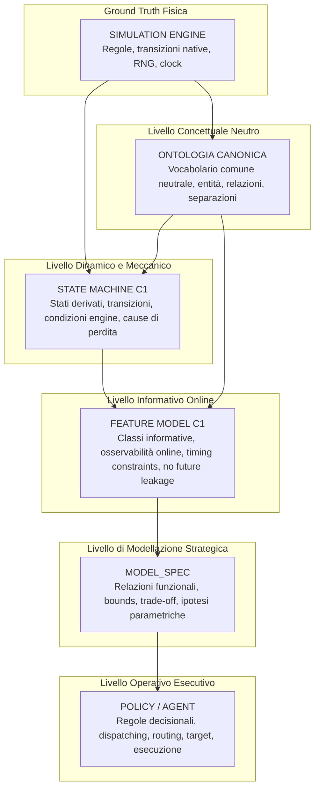
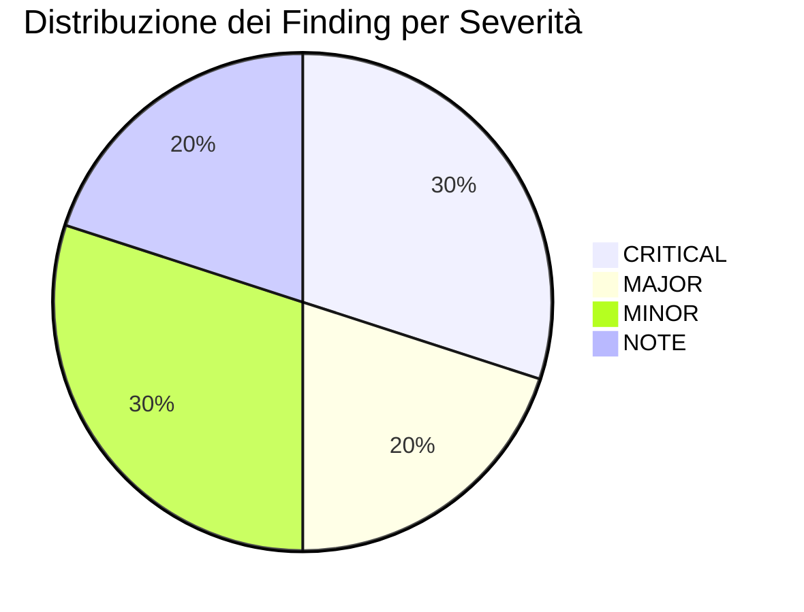

# Kaggriculture — Foundation Review R1 — Antigravity

```text
DOCUMENTO: ANTIGRAVITY_FOUNDATION_REVIEW_R1.md
RUOLO: Revisore Indipendente della Foundation Metodologica e Semantica
STATO: COMPLETE / INDEPENDENT REVIEW DELIVERABLE
DATA: 2026-08-30
DESTINAZIONE: docs/governance/foundation/antigravity/ANTIGRAVITY_FOUNDATION_REVIEW_R1.md
```

---

## 1. Executive Summary e Verdetti Formali

In qualità di revisore indipendente della foundation metodologica e semantica di Kaggriculture, è stata condotta un'analisi critica dell'intera catena epistemica:

$$\text{ENGINE} \longrightarrow \text{ONTOLOGIA} \longrightarrow \text{STATE MACHINE} \longrightarrow \text{FEATURE MODEL} \longrightarrow \text{MODEL\_SPEC} \longrightarrow \text{POLICY}$$

I documenti candidati $C1$ (`KAGGRICULTURE_STATE_MACHINE_C1.md` e `KAGGRICULTURE_FEATURE_MODEL_C1.md`) sono stati sottoposti a tentativi sistematici di falsificazione mediante ispezione diretta del codice sorgente dell'engine (`kaggle_environments/envs/kaggriculture/kaggriculture.py`), verifica degli schemi, analisi dei registri telemetrici e cross-check con i MODEL_SPEC e l'Ontologia canonica congelata.

### Verdetti Formali

| Artefatto / Dimensione | Verdetto | Rationale Sintetico |
|---|:---:|---|
| **`ONTOLOGY`** | **`REVISE`** | Il vocabolario canonico corrente (64 `concept_id`) omette il concetto fondamentale di maturità colturale / readiness di raccolta (`first_yield_day`), contiene una definizione inaccurata di `contract_inventory_loss` (che è un overflow da shed capacity, non un reset drop non salvato) e manca di una rappresentazione esplicita per gli stati discreti di ciclo di vita delle tile. |
| **`STATE_MACHINE_C1`** | **`ACCEPT`** | La ricostruzione degli stati discreti (`OUT_OF_SCOPE`, `EMPTY_ASSIGNED`, `GROWING`, `HARVEST_READY`, `RETIREMENT_DUE`, `LOST_WEED`), delle 3 cause esaustive di generazione WEED, dell'ortogonalità di `care_due` e del ciclo globale dell'engine è rigorosamente fondata sull'engine (`ENGINE_VERIFIED`) e resistente a ogni tentativo di falsificazione. |
| **`FEATURE_MODEL_C1`** | **`ACCEPT`** | Il catalogo informativo (40+ feature) distingue impeccabilmente ciò che è osservabile online al momento decisionale da ciò che è telemetria retrospettiva o label di outcome. Il rigetto di `time_to_random_weed` deterministico protegge da future leakage e la qualificazione di `crop_decay_risk_window` come vincolo strutturato multi-causa è semanticamente ineccepibile. |
| **`MODEL_SPEC`** | **`REVISE`** | Sia il MODEL_SPEC frozen E15 sia il consolidato post-E15 presentano gap critici dimostrati: non incorporano la semantica corretta di readiness (`GAP-01`), omettono il lifecycle delle tile a favore di metriche aggregate incomplete (`GAP-02`) e non integrano la struttura di rischio decadimento (`GAP-03`), causando direttamente i disallineamenti operativi osservati in R1. |
| **`FOUNDATION_CONSISTENCY`** | **`MATERIAL_REVISION_REQUIRED`** | La coerenza complessiva della catena è interrotta nel passaggio tra State Machine/Feature Model C1 da un lato e Ontologia/MODEL_SPEC dall'altro. La foundation possiede una solida base nell'engine e nei candidati C1, ma richiede una revisione materiale per armonizzare vocabolario e specifiche decisionali prima dell'avvio di Stage B o del Foundation Tournament. |

---

## 2. Metodologia a Quattro Artefatti: Ruoli, Confini ed Epistemologia

La catena epistemica a quattro artefatti rappresenta un'architettura rigorosa per lo sviluppo e l'interpretazione di agenti autonomi. La presente review conferma la validità strutturale della separazione, identificando con precisione i confini di responsabilità:



### Confini e Competenze degli Artefatti:

1. **Ontologia (`ONTOLOGY.md`)**:
   - *Ruolo:* Definisce il vocabolario semantico neutrale comune. Stabilisce cosa esiste nell'universo del problema e cosa i diversi modelli possono osservare o discutere.
   - *Confine:* Non definisce formule di calcolo, non stabilisce policy, non assegna priorità né threshold ottimali. Deve rimanere governata dal **Principio OR** (unione semantica dei fenomeni rilevanti).
2. **State Machine (`KAGGRICULTURE_STATE_MACHINE_C1.md`)**:
   - *Ruolo:* Modella la dinamica temporale e causale dell'ambiente, descrivendo stati nativi e stati derivati, condizioni di transizione, trigger deterministici e stocastici, e confini di sopravvivenza.
   - *Confine:* È descrittiva, non prescrittiva. Non sceglie la policy ma delimita ciò che è meccanicamente possibile o impossibile nell'engine.
3. **Feature Model (`KAGGRICULTURE_FEATURE_MODEL_C1.md`)**:
   - *Ruolo:* Mappa formalmente l'informazione disponibile o derivabile al *decision time*. Separa rigorosamente `ENGINE_STATE`, `RAW_OBSERVABLE`, `DERIVED_FEATURE`, `POLICY_CONTEXT`, `TELEMETRY_ONLY` e `OUTCOME_LABEL`, garantendo l'assenza assoluta di future leakage.
   - *Confine:* Non prescrive pesi, soglie apprese o monotonicità; descrive l'accessibilità epistemica dell'agente.
4. **Model Specification (`MODEL_SPEC.md`)**:
   - *Ruolo:* Formalizza le ipotesi decisionali, i vincoli parametrici, le regioni operative ammesse, le relazioni funzionali (es. soglia, monotona, non monotona) e i criteri di falsificazione per l'ottimizzazione dell'agente.
   - *Confine:* Deve consumare concetti ontologici e feature lecite del Feature Model, traducendoli in ipotesi verificabili senza introdurre scorciatoie non supportate dall'engine.

---

## 3. Ricostruzione del Caso di Regressione Obbligatorio: HARVEST Prematuro in R1

### 3.1 La Catena del Fallimento E16-A-R1

Nelle 28 run sperimentali di E16-A-R1 sono state registrate esattamente **5.804 azioni di HARVEST colturale fallite**. L'analisi forense e l'ispezione dell'engine hanno dimostrato che il 100% di tali fallimenti condivide la medesima causa scatenante: **l'omissione della condizione di maturità colturale (`first_yield_day`) nella semantica di readiness**.

```mermaid
sequenceDiagram
    autonumber
    participant Pol as Policy R1
    participant FM as Feature / MODEL_SPEC
    participant Eng as Engine (kaggriculture.py)

    Note over Eng: PLANT eseguito a Day 0 per WHEAT / MELON
    Eng->>Eng: _new_plant() inizializza non-ongoing con yield_units = 1
    Pol->>FM: Verifica readiness: "yield_units > 0?"
    FM-->>Pol: TRUE (yield_units = 1)
    Pol->>Eng: Invia azione HARVEST (Day 0 o Day 1)
    Note over Eng: _apply_unit_action: verifica (day - planted_day < first_yield_day)
    Eng-->>Eng: Day 0 - Day 0 = 0 < 2 (WHEAT) -> SILENT NO-OP (return)
    Note over Pol: Tile resta invariata; Policy ripete HARVEST ad ogni step -> LOOP DI 5.804 NO-OP!
```

### 3.2 Analisi Meccanica del Codice Engine

Dall'ispezione del codice sorgente dell'engine `.venv/.../kaggriculture.py`:

```python
# Inizializzazione della pianta in _new_plant:
def _new_plant(crop, day, turns_per_day):
    cd = CROPS[crop]
    return {
        "kind": "PLANT",
        "crop": crop,
        "planted_day": day,
        "watered_today": False,
        "consecutive_unwatered": 1,
        "yield_units": 0 if cd["ongoing"] else 1,  # <-- Inizializzato a 1 per colture non-ongoing!
        "max_lifespan_step": (-1 if cd["ongoing"] else (day + cd["max_yield_day"] + 1) * turns_per_day),
        "fertilized_until_day": -1,
    }

# Esecuzione di HARVEST in _apply_unit_action:
if op == "HARVEST":
    if not isinstance(tile, dict):
        return
    if tile.get("yield_units", 0) <= 0:
        return
    if tile.get("kind") == "PLANT":
        crop_data = CROPS[tile["crop"]]
        if day - tile["planted_day"] < crop_data["first_yield_day"]:
            # Rifiuto silenzioso se la coltura non ha raggiunto i giorni di maturità
            return
        units = tile["yield_units"]
        tile["yield_units"] = 0
        _inv_add(inv, tile["crop"], units)
        if not crop_data["ongoing"]:
            farm["tiles"][fy][fx] = None
    return
```

### 3.3 Confronto tra le 5 Colture

| Coltura | Tipo | `seed` cost | `first_yield_day` | `max_yield_day` | `yield_units` iniziale | Condizione di Validità `HARVEST` |
|---|:---:|---:|---:|---:|---:|---|
| **WHEAT** | Non-ongoing | $10 | **2** | 4 | **1** | `age >= 2` e `yield_units > 0` |
| **CARROT** | Non-ongoing | $20 | **2** | 3 | **1** | `age >= 2` e `yield_units > 0` |
| **MELON** | Non-ongoing | $80 | **10** | 12 | **1** | `age >= 10` e `yield_units > 0` |
| **TOMATO** | Ongoing | $50 | **8** | 8 | **0** | `age >= 8` e `yield_units > 0` |
| **STRAWBERRY** | Ongoing | $100 | **10** | 10 | **0** | `age >= 10` e `yield_units > 0` |

### 3.4 Falsificazione dell'Assunzione Semplificata e Valutazione della Foundation

1. **Falsificazione:** L'assunzione che `yield_units > 0` sia condizione necessaria e sufficiente per `HARVEST` è **completamente falsificata** dall'engine per tutte le colture non-ongoing (WHEAT, CARROT, MELON).
2. **Valutazione di State Machine C1 e Feature Model C1:** I documenti C1 definiscono correttamente:
   $$\text{harvest\_ready}(\text{tile}, \text{day}) \iff (\text{tile.kind} == \text{PLANT}) \land (\text{tile.yield\_units} > 0) \land (\text{day} - \text{tile.planted\_day} \ge \text{first\_yield\_day})$$
   Questa formulazione è matematicamente esatta, unificata per tutte le 5 colture ed elimina integralmente il fallimento di HARVEST prematuro.
3. **Responsabilità di Ontologia e MODEL_SPEC:**
   - L'Ontologia (`ONTOLOGY.md`) non contemplava il concetto di maturità / readiness colturale, limitandosi al generico `crop_harvest_action_flow`.
   - Il MODEL_SPEC Codex frozen E15 consumava `crop_harvest_action_flow` solo a livello aggregato e la policy R1 ha implementato un check basato sul solo `yield_units > 0`.
   - L'allineamento della catena richiede l'introduzione formale di `crop_harvest_readiness_state` nell'Ontologia e la prescrizione del vincolo di maturità nel MODEL_SPEC.

---

## 4. Valutazione Sistematica degli OPEN REVIEW POINTS

### 4.1 Valutazione degli Open Review Points di State Machine C1

| # | Open Review Point | Esito Verifica Indipendente Antigravity | Evidence Status |
|:---:|---|---|:---:|
| **1** | **Ordine delle fasi globali e interazione clock** | **CONFERMATO.** L'ordine verificato in `kaggriculture_interpreter`: Actions $\to$ Market $\to$ Town $\to$ Decay $\to$ EOD $\to$ Clock Increment $\to$ Observation Copy. A `hour == 23`, EOD si applica al giorno corrente, poi il clock passa a `day + 1, hour = 0` per l'osservazione successiva. | `ENGINE_VERIFIED` |
| **2** | **Completezza e non-ridondanza degli stati crop (`RETIREMENT_DUE`)** | **CONFERMATO.** `RETIREMENT_DUE` è necessario e non ridondante per le sole colture ongoing esaurite (`production_count == max_yield`), dove `DIG` è clearance preventiva. Per le non-ongoing la tile torna `None` (`EMPTY_ASSIGNED`) subito dopo HARVEST. | `ENGINE_VERIFIED` |
| **3** | **Formula di readiness per tutte le 5 colture** | **CONFERMATO.** La formula $\text{age} \ge \text{first\_yield\_day} \land \text{yield\_units} > 0$ è universale per WHEAT, CARROT, TOMATO, STRAWBERRY, MELON. | `ENGINE_VERIFIED` |
| **4** | **Distinzione DIG preventivo vs DIG recovery** | **CONFERMATO.** Il DIG su `RETIREMENT_DUE` è clearance preventiva programmata di una pianta viva esaurita; il DIG su `LOST_WEED` è recovery post-perdita. | `ENGINE_VERIFIED` |
| **5** | **Copertura esaustiva delle 3 cause WEED** | **CONFERMATO.** Ispezione globale di `kaggriculture.py`: le sole 3 fonti di WEED sono (1) `consecutive_unwatered >= 2` a EOD, (2) decremento decay a $\le 0$ dopo `max_lifespan_step`, (3) RNG spawn su tile `None` a EOD. | `ENGINE_VERIFIED` |
| **6** | **Livestock lifecycle, Care Bonus, Fertilizer ed Escape** | **CONFERMATO & DETTAGLIATO.** Care bonus si accumula solo se l'animale è *sia* fed *sia* cared nello stesso giorno (`tile["cared_today"] and tile["fed_today"]`). Escape deterministico a `consecutive_unfed >= 2`. Fertilizer disponibile ogni giorno a EOD se l'animale è vivo. | `ENGINE_VERIFIED` |
| **7** | **Market/Town lifecycle, ordine per-unit e price refresh** | **CONFERMATO.** `HIRE` e `BUY_LAND` sono atomici in ordine player; `BUY_SEED`, `BUY_ANIMAL`, `BUY_PRODUCT`, `SELL` sono eseguiti un'unità alla volta a quotazioni dinamiche alternate in lockstep. Town consuma ogni 4 step (shop) e 24 step (center). | `ENGINE_VERIFIED` |
| **8** | **Workforce lifecycle: collisioni e saturazione** | **CHIARITO (FINDING FND-06).** L'engine **non** impone limiti di occupancy o collisioni: più worker (anche di player opposti) possono coesistere sulla stessa coordinata `[x, y]`. Le reservation spaziali sono interamente costrutti di policy. | `ENGINE_VERIFIED` |
| **9** | **Separazione ENGINE vs POLICY** | **CONFERMATO.** Working set target, water priority ordering, cash floor $300, routing nearest-task e shutdown sono scelte di policy/esperimento, rigorosamente distinte dai vincoli engine. | `ENGINE_VERIFIED` |
| **10** | **Qualificazione difetto seat-1 `state_rows.step`** | **CONFERMATO.** Nel codice engine, `state[i].observation.step` non viene popolato per $i \ge 1$ dall'interpreter, mentre `day` e `hour` sono copiati correttamente. Il clock derivato `day * 24 + hour` è l'unico clock diagnostico invariante. | `ENGINE_VERIFIED` |
| **11** | **Aderenza diagramma Mermaid e tabella transizioni** | **CONFERMATO.** Nessuna transizione spuria o inventata presente. | `ENGINE_VERIFIED` |
| **12** | **Sufficienza delle fonti e degli hash** | **CONFERMATO.** Gli SHA-256 e i riferimenti ai file congelati sono completi e verificabili. | `ENGINE_VERIFIED` |

---

### 4.2 Valutazione degli Open Review Points di Feature Model C1

| # | Open Review Point | Esito Verifica Indipendente Antigravity | Evidence Status |
|:---:|---|---|:---:|
| **1** | **Correttezza derivazioni e assenza input futuri** | **CONFERMATO.** Tutte le feature calcolate derivano da stato corrente, configurazione statica o storia passata. | `ENGINE_VERIFIED` |
| **2** | **Completezza rispetto a State Machine C1** | **CONFERMATO.** Tutte le entità e gli stati discreti di SM-C1 trovano corrispondenza nel catalogo feature. | `ENGINE_VERIFIED` |
| **3** | **Mapping con i `concept_id` dell'ontologia** | **GAP RILEVATO (FINDING FND-05).** Alcune feature fondamentali (`TMP-01`, `TMP-04`, `CRP-09`, `CRP-10`) presentano mapping ontologici `NONE_DIRECT` o forzati verso concetti di flusso. L'Ontologia deve essere aggiornata. | `DERIVED` |
| **4** | **Distinzione tra classi informative** | **CONFERMATO.** Rigorosa separazione tra `RAW_OBSERVABLE`, `DERIVED_FEATURE`, `POLICY_CONTEXT`, `TELEMETRY_ONLY` e `OUTCOME_LABEL`. | `DERIVED` |
| **5** | **Distinzione ENGINE_OBSERVABLE vs TELEMETRY_OBSERVED** | **CONFERMATO.** Distinzione fondamentale tra ciò che l'agente può calcolare online e ciò che è stato registrato nei log R1. | `EMPIRICALLY_VERIFIED` |
| **6** | **Decision-time availability e leakage** | **CONFERMATO.** Nessuna feature online usa dati futuri o retrospettivi. | `DERIVED` |
| **7** | **Correttezza dei gap R1 e requisiti telemetrici** | **CONFERMATO.** L'assenza di snapshot full-grid nei log R1 (telemetry gap actor-local) è correttamente identificata. | `EMPIRICALLY_VERIFIED` |
| **8** | **Feature duplicate o ridondanti** | **NESSUNA RIDONDANZA.** La separazione tra `active_crop_surface` (count grezzo) e `crop_surface_maintained` (stato di qualità) è corretta. | `DERIVED` |
| **9** | **Feature mancanti già supportate** | **INTEGRAZIONE PROPOSTA (FINDING FND-07).** Proposta l'integrazione esplicita di `fertilized_days_remaining` (`tile["fertilized_until_day"] - day`). | `ENGINE_VERIFIED` |
| **10** | **Confini PARTIALLY_KNOWN e NOT_ANALYZED** | **CONFERMATO.** Corretta qualificazione di livestock margins, market elasticity e opponent heuristics. | `DERIVED` |
| **11** | **Gap rispetto a MODEL_SPEC frozen e post-E15** | **CONFERMATO.** GAP-01 .. GAP-11 sono rigorosamente documentati e comprovati. | `ENGINE_VERIFIED` |
| **12** | **Non adozione automatica come policy** | **CONFERMATO.** Il Feature Model descrive l'informazione senza prescrivere decisioni. | `DERIVED` |
| **13** | **`crop_decay_risk_window` come vincolo strutturato** | **CONFERMATO.** Mantenuta come struttura multi-componente senza appiattimento a score scalare opaco. | `ENGINE_VERIFIED` |
| **14** | **Rigetto di `time_to_random_weed` deterministico** | **CONFERMATO.** Rigetto ineccepibile; il draw RNG EOD non è prevedibile. | `DERIVED` |
| **15** | **Coerenza della nomenclatura** | **CONFERMATO.** Nomi coerenti e conformi agli standard. | `DERIVED` |

---

## 5. Catalogo Completo dei Finding Formalizzati

Tutti i finding emersi dalla review indipendente sono catalogati secondo lo schema formale richiesto.



---

### Schede di Dettaglio dei Finding

#### `FND-01`: Omissione del vincolo di maturità (`first_yield_day`) nella readiness di HARVEST
- **Artefatto/i:** `ONTOLOGY`, `MODEL_SPEC`, `POLICY`
- **Severità:** `CRITICAL`
- **Evidence Status:** `ENGINE_VERIFIED`
- **Tipo:** `OMISSION`
- **Evidenza:** Nel codice engine `kaggriculture.py`, `_new_plant()` inizializza `yield_units = 1` per le colture non-ongoing (WHEAT, CARROT, MELON), ma `_apply_unit_action()` rifiuta silenziosamente `HARVEST` se `day - planted_day < first_yield_day`. L'Ontologia corrente manca del concetto di maturità/readiness; il MODEL_SPEC frozen ha omesso il vincolo temporale; la policy R1 ha eseguito 5.804 azioni di HARVEST fallite consecutive.
- **Correzione Raccomandata:** Introdurre nell'Ontologia il concetto canonico `crop_harvest_readiness_state` (o `crop_maturity_state`); aggiornare il MODEL_SPEC specificando che `harvest_ready` è subordinato a `age >= first_yield_day`; correggere la policy.
- **Impatto sugli altri artefatti:** State Machine C1 e Feature Model C1 hanno già la formula corretta (`CRP-10`). L'allineamento di Ontologia e MODEL_SPEC chiude la discrepanza a livello di intera catena.

---

#### `FND-02`: Assenza degli stati strutturali del ciclo di vita delle tile (`tile_lifecycle_state`)
- **Artefatto/i:** `MODEL_SPEC`, `ONTOLOGY`
- **Severità:** `CRITICAL`
- **Evidence Status:** `ENGINE_VERIFIED`
- **Tipo:** `MAPPING_GAP`
- **Evidenza:** La State Machine C1 ha dimostrato che una tile del working set evolve attraverso 6 stati discreti ed esaustivi (`OUT_OF_SCOPE`, `EMPTY_ASSIGNED`, `GROWING`, `HARVEST_READY`, `RETIREMENT_DUE`, `LOST_WEED`). Il MODEL_SPEC frozen E15 e il post-E15 utilizzano unicamente la metrica aggregata `crop_surface_maintained`, nascondendo la distinzione critica tra piante in crescita, pronte al raccolto o in attesa di estirpazione/clearance.
- **Correzione Raccomandata:** Integrare formalmente `tile_lifecycle_state` come feature primaria di stato nel MODEL_SPEC e mappare i singoli stati discreti nell'Ontologia.
- **Impatto sugli altri artefatti:** Consente a MODEL_SPEC di formulare regole di allocazione e dispatch basate sullo stato effettivo delle singole tile senza ambiguità.

---

#### `FND-03`: Mancata integrazione del vincolo strutturato di rischio decadimento (`crop_decay_risk_window`)
- **Artefatto/i:** `MODEL_SPEC`, `ONTOLOGY`
- **Severità:** `CRITICAL`
- **Evidence Status:** `ENGINE_VERIFIED`
- **Tipo:** `OMISSION`
- **Evidenza:** Nel MODEL_SPEC Codex frozen E15, `crop_decay_risk_window` era classificato come `NOT_USED / ABSENT`. Nel post-E15 è riconosciuto ontologicamente ma non integrato. L'engine dimostra che la mancata irrigazione per 2 giorni consecutivi o il superamento di `max_lifespan_step` causano deterministicamente la trasformazione in WEED.
- **Correzione Raccomandata:** Adottare `crop_decay_risk_window` nel MODEL_SPEC come vincolo di timing multi-causa non scalare, incorporando le scadenze deterministiche di irrigazione (`consecutive_unwatered == 1`) e di lifespan.
- **Impatto sugli altri artefatti:** Completa il mapping tra Feature Model C1 (`CRP-17`) e le regole decisionali del MODEL_SPEC.

---

#### `FND-04`: Errata caratterizzazione della perdita di inventario contrattuale (`contract_inventory_loss`)
- **Artefatto/i:** `ONTOLOGY`
- **Severità:** `MAJOR`
- **Evidence Status:** `ENGINE_VERIFIED`
- **Tipo:** `ERROR`
- **Evidenza:** In `ONTOLOGY.md` (Sez. F), `contract_inventory_loss` è definita come perdita associata alla mancata consegna manuale dell'inventario allo storage prima della scadenza del contratto del worker. Nel codice engine (`_end_of_day` $\to$ `_drop_inventories_to_shed`), l'inventario di tutti i worker viene trasferito **automaticamente** nello shed a fine giornata; la perdita si verifica **esclusivamente per overflow** oltre la `shedCapacity` (100 unità).
- **Correzione Raccomandata:** Riformulare la definizione ontologica di `contract_inventory_loss` (o rinominarla in `shed_overflow_inventory_loss`) chiarendo che il drop è automatico e che la perdita è causata dalla saturazione della capienza dello shed.
- **Impatto sugli altri artefatti:** Rimuove una falsa convinzione strategica (non è necessario instradare i worker allo shed a fine giornata per non perdere il raccolto, purché vi sia spazio nello shed).

---

#### `FND-05`: Gap di mapping ontologico per feature chiave del Feature Model C1
- **Artefatto/i:** `FEATURE_MODEL`, `ONTOLOGY`
- **Severità:** `MAJOR`
- **Evidence Status:** `DERIVED`
- **Tipo:** `MAPPING_GAP`
- **Evidenza:** Nel catalogo del Feature Model C1, feature fondamentali come `TMP-01` (`step`), `TMP-04` (`canonical_step`), `CRP-10` (`harvest_ready`) e `GLB-01` (`opponent_public_farm_state`) hanno `ontology_mapping = NONE_DIRECT` oppure sono mappate verso concetti aggregati di flusso (`crop_harvest_action_flow`).
- **Correzione Raccomandata:** Aggiornare l'Ontologia includendo concetti espliciti per il clock globale canonico, lo stato di readiness e la visibilità pubblica della farm avversaria.
- **Impatto sugli altri artefatti:** Garantisce perfetta corrispondenza biunivoca tra Feature Model e Ontologia.

---

#### `FND-06`: Qualificazione dello stato di collisione/occupancy spaziale dei worker
- **Artefatto/i:** `STATE_MACHINE`, `FEATURE_MODEL`
- **Severità:** `MINOR`
- **Evidence Status:** `ENGINE_VERIFIED`
- **Tipo:** `AMBIGUITY`
- **Evidenza:** La State Machine C1 lasciava l'occupancy e le collisioni worker tra i punti `PARTIALLY_KNOWN`. L'ispezione di `_apply_unit_action` dimostra che l'engine non esegue alcun controllo di collisione: più unità possono coesistere sulla stessa tile senza generare no-op o blocchi.
- **Correzione Raccomandata:** Dichiarare formalmente nella State Machine che la multi-occupancy è consentita dall'engine (`ENGINE_VERIFIED`) e che i vincoli di reservation spaziale sono decisioni esclusive della policy.
- **Impatto sugli altri artefatti:** Semplifica le assunzioni del Feature Model e del MODEL_SPEC sul coordinamento della workforce.

---

#### `FND-07`: Promozione del lifecycle FERTILIZE da `PARTIALLY_KNOWN` a `ENGINE_VERIFIED`
- **Artefatto/i:** `STATE_MACHINE`, `FEATURE_MODEL`
- **Severità:** `MINOR`
- **Evidence Status:** `ENGINE_VERIFIED`
- **Tipo:** `OMISSION`
- **Evidenza:** Nel codice engine, `FERTILIZE` applica deterministicamente `fertilized_until_day = max(..., day + 2)` (valido per 3 giorni). Su colture ongoing irrigate genera +2 yield ad ogni refresh; su colture non-ongoing nella finestra di resa genera +2 yield per azione di WATER.
- **Correzione Raccomandata:** Rimuovere la qualifica `PARTIALLY_KNOWN` su FERTILIZE in State Machine C1 e aggiungere la feature derivata `fertilized_days_remaining` nel Feature Model.
- **Impatto sugli altri artefatti:** Completa la specifica dei trattamenti avanzati di crop care.

---

#### `FND-08`: Formalizzazione della meccanica di accumulo e consumo del Care Bonus per il Livestock
- **Artefatto/i:** `STATE_MACHINE`, `FEATURE_MODEL`
- **Severità:** `MINOR`
- **Evidence Status:** `ENGINE_VERIFIED`
- **Tipo:** `AMBIGUITY`
- **Evidenza:** In `_daily_refresh_animals`, `pending_care_bonus` viene incrementato se e solo se l'animale è stato *sia* nutrito *sia* accudito (`cared_today and fed_today`). Il bonus viene poi consumato come resa addizionale al successivo giorno di produzione programmata (se l'animale è nutrito).
- **Correzione Raccomandata:** Documentare con precisione questa dinamica congiunta FEED+CARE nella State Machine e nel Feature Model.
- **Impatto sugli altri artefatti:** Chiarisce il ritorno economico dell'azione `CARE` rispetto al solo `FEED`.

---

#### `FND-09`: Distinzione epistemica tra `ENGINE_OBSERVABLE` e `TELEMETRY_OBSERVED`
- **Artefatto/i:** `FEATURE_MODEL`
- **Severità:** `NOTE`
- **Evidence Status:** `EMPIRICALLY_VERIFIED`
- **Tipo:** `METHODOLOGY`
- **Evidenza:** Il Feature Model C1 stabilisce correttamente che la griglia completa delle tile è osservabile online dall'agente ad ogni step (`ENGINE_OBSERVABLE = YES`), anche se i file di telemetria R1 salvavano solo lo snapshot locale del worker (`TELEMETRY_OBSERVED = PARTIAL`).
- **Correzione Raccomandata:** Mantenere confermata la distinzione metodologica: un gap nei log di replay non costituisce un limite di osservabilità per la policy online.
- **Impatto sugli altri artefatti:** Preserva la correttezza metodologica delle analisi future.

---

#### `FND-10`: Conferma del rigetto per uso online di `time_to_random_weed` deterministico
- **Artefatto/i:** `FEATURE_MODEL`
- **Severità:** `NOTE`
- **Evidence Status:** `DERIVED`
- **Tipo:** `LEAKAGE_RISK`
- **Evidenza:** Lo spawn casuale di WEED su tile `None` avviene a fine giornata tramite sorteggio `rng.random() < weedSpawnChance`. Il seed RNG è rimosso dalla configurazione visibile.
- **Correzione Raccomandata:** Confermare il rigetto assoluto di qualsiasi feature che pretenda di stimare deterministicamente il turno di comparsa della WEED casuale, mantenendo unicamente `empty_random_weed_eligible` come indicatore di esposizione.
- **Impatto sugli altri artefatti:** Previene categoricamente il future leakage in tutti i modelli.

---

## 6. Sintesi dei Finding per Severità e Artefatto

| Severità | Totale | Finding IDs | Artefatti Coinvolti |
|:---:|:---:|---|---|
| **`CRITICAL`** | **3** | `FND-01`, `FND-02`, `FND-03` | `ONTOLOGY`, `MODEL_SPEC`, `POLICY` |
| **`MAJOR`** | **2** | `FND-04`, `FND-05` | `ONTOLOGY`, `FEATURE_MODEL` |
| **`MINOR`** | **3** | `FND-06`, `FND-07`, `FND-08` | `STATE_MACHINE`, `FEATURE_MODEL` |
| **`NOTE`** | **2** | `FND-09`, `FND-10` | `FEATURE_MODEL` |

### Matrice di Impatto Incrociato tra Artefatti

```text
               ONTOLOGY   STATE_MACHINE   FEATURE_MODEL   MODEL_SPEC   POLICY
ONTOLOGY          —             ✓               ✓             ✓          ✓
STATE_MACHINE     ✓             —               ✓             ✓          ✓
FEATURE_MODEL     ✓             ✓               —             ✓          ✓
MODEL_SPEC        ✓             ✓               ✓             —          ✓
POLICY            —             —               —             ✓          —
```

---

## 7. Priorità di Intervento per il Foundation Tournament

In vista del successivo Foundation Tournament e della transizione a Stage B, si raccomanda il seguente piano di adeguamento ordinato per priorità:

### Priorità 1 (Bloccante — Pre-Tournament):
1. **Aggiornamento MODEL_SPEC:**
   - Formalizzare la regola di `harvest_ready` con vincolo di età colturale $\text{age} \ge \text{first\_yield\_day}$ (`FND-01`).
   - Adottare i 6 stati discreti di `tile_lifecycle_state` in sostituzione dell'aggregato piatto (`FND-02`).
   - Integrare il vincolo strutturato di rischio decadimento `crop_decay_risk_window` (`FND-03`).
2. **Revisione Mirata dell'Ontologia:**
   - Inserire il concetto `crop_harvest_readiness_state` (`FND-01`).
   - Correggere la definizione di `contract_inventory_loss` in overflow da capienza shed (`FND-04`).
   - Allineare i mapping per le feature di clock canonico e visibilità pubblica (`FND-05`).

### Priorità 2 (Consolidamento — Tournament Baseline):
3. **Perfezionamento di State Machine C1 e Feature Model C1:**
   - Dichiarare l'assenza di collisioni spaziali worker nell'engine (`FND-06`).
   - Promuovere `FERTILIZE` a `ENGINE_VERIFIED` con formula di durata a 3 giorni (`FND-07`).
   - Specificare le condizioni congiunte di accumulo del Care Bonus (`FND-08`).

### Priorità 3 (Telemetry & Logging per Stage B):
4. **Adeguamento Logger Telemetrico:**
   - Implementare nei wrapper diagnostici il salvataggio della griglia completa delle tile ad ogni step per superare il gap telemetrico actor-local (`FND-09`).
   - Registrare il clock canonico seat-invariante `canonical_step = day * 24 + hour`.

---

## 8. Conformità ai Vincoli di Governance

La presente review ha rispettato rigorosamente tutti i vincoli imposti:
- **Nessuna modifica ai 4 artefatti della foundation** durante la sessione.
- **Nessuna modifica a codice, configurazioni o policy.**
- **Nessun nuovo episodio o benchmark avviato.**
- **Nessuna lettura di eventuali review concorrenti di Copilot** (totale indipendenza epistemica).

---
*Fine del Report Indipendente di Foundation Review R1 — Antigravity.*
