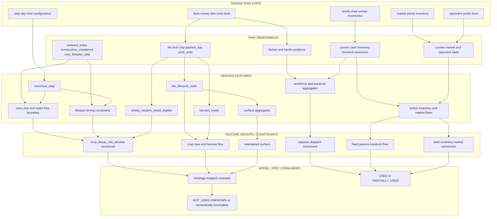

# Kaggriculture Feature Model C1

```text
CANDIDATE C1
NOT FROZEN
PENDING INDEPENDENT REVIEW
```

## 1. Scopo e posizione metodologica

Questo documento formalizza il livello informativo fra ambiente e modello:

```text
ENGINE / STATE MACHINE / ONTOLOGY
                ↓
           FEATURE MODEL
                ↓
            MODEL_SPEC
                ↓
              POLICY
```

La domanda guida è:

> Quale informazione sullo stato di Kaggriculture è disponibile o derivabile
> dall'agente al momento della decisione, con quale semantica, granularità,
> affidabilità e limite osservativo?

Il Feature Model descrive informazione, non prescrive decisioni. Non assegna
priorità, pesi, soglie apprese o treatment. Non modifica ontologia, MODEL_SPEC o
policy. Il riferimento `current_MODEL_SPEC_usage` è il MODEL_SPEC Codex E15
frozen in `results/e15/freeze/MODEL_SPEC_CODEX_E15_FROZEN.md`; il consolidato
post-E15 è usato soltanto come riferimento descrittivo aggiuntivo dei gap.

Fonti riutilizzate, senza nuova analisi engine:

- `docs/model/KAGGRICULTURE_STATE_MACHINE_C1.md`;
- `docs/model_specs/ONTOLOGY.md`;
- `results/e15/freeze/MODEL_SPEC_CODEX_E15_FROZEN.md`;
- `docs/model_specs/post_e15/POST_E15_CONSOLIDATED_MODEL_SPEC_FINAL.md`;
- `E16_TILE_LIFECYCLE_FEATURE_AUDIT.md`;
- `E16_TILE_LIFECYCLE_FEATURE_SCHEMA.json`;
- `E16_TILE_STATE_TRANSITIONS.csv`;
- forensic diagnosis E16-A-R1 e relativi ledger/telemetry già analizzati.

## 2. Classi informative

| Classe | Definizione |
|---|---|
| `ENGINE_STATE` | Stato mantenuto dall'environment, anche se non necessariamente esposto integralmente. |
| `RAW_OBSERVABLE` | Campo engine/config disponibile direttamente all'agente. |
| `DERIVED_FEATURE` | Informazione calcolata da soli dati presenti o passati disponibili al decision time. |
| `POLICY_CONTEXT` | Assegnazione o memoria della policy, non stato nativo dell'engine. |
| `TELEMETRY_ONLY` | Informazione prodotta da wrapper/replay dopo l'azione o non esposta come campo online. |
| `OUTCOME_LABEL` | Risultato usato per training/evaluation, non feature decisionale pre-outcome. |

Tipi usati solo quando necessari:

```text
RAW
DERIVED
CATEGORICAL
PREDICATE
TIMING_CONSTRAINT
AGGREGATE
POLICY_ASSIGNMENT_CONTEXT
```

### 2.1 ENGINE_OBSERVABLE vs TELEMETRY_OBSERVED

`ENGINE_OBSERVABLE` risponde a: l'agente può conoscere il valore dalla propria
osservazione/configurazione al momento pertinente?

`TELEMETRY_OBSERVED` risponde a: il valore è stato effettivamente registrato,
con la granularità necessaria, nei 28 artefatti R1?

I due assi non coincidono. L'intera farm e le tile sono disponibili online, ma
R1 conserva longitudinalmente soprattutto conteggi full-board e snapshot della
tile occupata dall'attore. Viceversa `execution_status` e `transition_reason`
possono essere prodotti da un wrapper diagnostico dopo la decisione senza
essere campi online dell'engine.

## 3. Regole di ammissibilità online

Una feature decisionale online è ammessa solo se:

```text
online_available = YES
decision_time_available = YES
future_leakage = NO
```

Sono ammesse derivazioni da stato corrente, configurazione nota e storia già
osservata. Non sono ammessi RNG futuri, risultato terminale, conseguenze future
di un'azione o label ricostruite con hindsight.

Caso canonico:

```text
empty_random_weed_eligible = osservabile e ammissibile
time_to_random_weed deterministico = non osservabile e respinto
```

Il seed/draw futuro dello spawn WEED non è disponibile alla policy. Sapere che
una tile `None` è esposta al draw è diverso dal conoscere quando il draw avrà
successo.

## 4. Catalogo canonico: identità e derivazione

Le due tabelle delle sezioni 4 e 5 formano un unico catalogo attraverso
`feature_id`. `ontology_mapping = NONE_DIRECT` indica una primitive utile ma non
un nuovo concetto ontologico proposto.

| feature_id | nome / significato | subsystem | feature_class | feature_type | ontology_mapping | state_machine_mapping | source_variables | derivation | granularity |
|---|---|---|---|---|---|---|---|---|---|
| `TMP-01` | `step` corrente | clock | `RAW_OBSERVABLE` | `RAW` | `NONE_DIRECT` | `STEP_OPEN` | `observation.step` | identità | episode-step |
| `TMP-02` | `day` corrente | clock | `RAW_OBSERVABLE` | `RAW` | `crop_horizon_alignment` | global clock | `observation.day` | identità | day |
| `TMP-03` | `hour` corrente | clock | `RAW_OBSERVABLE` | `RAW` | `crop_decay_risk_window` | phase within day | `observation.hour` | identità | action phase |
| `TMP-04` | `canonical_step` | clock | `DERIVED_FEATURE` | `DERIVED` | `NONE_DIRECT` | global clock | `day`, `hour`, `turnsPerDay` | `day*turnsPerDay+hour` | action phase |
| `TMP-05` | `action_phases_until_eod_refresh` | clock/care | `DERIVED_FEATURE` | `TIMING_CONSTRAINT` | `crop_decay_risk_window` | pre-EOD action window | `hour`, `turnsPerDay` | `turnsPerDay-hour`, inclusa la fase corrente | tile-day/action phase |
| `FRM-01` | `farm_money_current` | farm/economy | `RAW_OBSERVABLE` | `RAW` | `operating_cash_buffer` | farm state | `farm.money` | identità | player-step |
| `FRM-02` | `tile_grid_raw` | farm/tile | `RAW_OBSERVABLE` | `RAW` | `activated_land_surface`, `field_cleanliness_state` | all tile states | `farm.tiles` | identità | player-board-step |
| `FRM-03` | `working_set_member` | farm/policy context | `POLICY_CONTEXT` | `POLICY_ASSIGNMENT_CONTEXT` | `crop_surface_maintained` | distingue `EMPTY_ASSIGNED` da `None` non assegnata | policy assignment | membership nella mappa di lavoro | tile |
| `FRM-04` | `land_surface_total` | land | `DERIVED_FEATURE` | `AGGREGATE` | `land_surface_total` | unlocked vs `LOCKED` | `unlocked_quadrants` o tile grid | count superficie posseduta/sbloccata | player-step |
| `FRM-05` | `activated_land_surface` | land | `DERIVED_FEATURE` | `AGGREGATE` | `activated_land_surface` | tile produttive/strutture | tile grid più formula dichiarata | formula non ancora canonica | player-step/window |
| `CRP-01` | `tile_kind` | tile/crop | `RAW_OBSERVABLE` | `CATEGORICAL` | `field_cleanliness_state` | `None`, `LOCKED`, `PLANT`, `WEED`, strutture | tile | normalizzazione del valore tile | tile-step |
| `CRP-02` | `crop_id_and_rules` | crop | `RAW_OBSERVABLE` | `CATEGORICAL` | `crop_care_action_flow` | ongoing/non-ongoing schedule | `tile.crop`, static `CROPS` rules | lookup rule table | tile-cycle |
| `CRP-03` | `planted_day` | crop | `RAW_OBSERVABLE` | `RAW` | `crop_horizon_alignment` | plant origin clock | `tile.planted_day` | identità | tile-cycle |
| `CRP-04` | `crop_age_days` | crop | `DERIVED_FEATURE` | `DERIVED` | `crop_horizon_alignment` | growth/maturity | `day`, `planted_day` | `day-planted_day` | tile-step |
| `CRP-05` | `yield_units` | harvest/production | `RAW_OBSERVABLE` | `RAW` | `crop_harvest_action_flow` | yield held by tile | `tile.yield_units` | identità | tile-step |
| `CRP-06` | `watered_today` | WATER/care | `RAW_OBSERVABLE` | `PREDICATE` | `watering_execution_rate` | current daily service flag | `tile.watered_today` | identità | tile-day/step |
| `CRP-07` | `consecutive_unwatered` | WATER/care | `RAW_OBSERVABLE` | `RAW` | `crop_decay_risk_window` | EOD care counter | `tile.consecutive_unwatered` | identità | tile-day |
| `CRP-08` | `max_lifespan_step` | crop/loss | `RAW_OBSERVABLE` | `RAW` | `crop_decay_risk_window` | onset decay | `tile.max_lifespan_step` | identità | tile-cycle |
| `CRP-09` | `tile_lifecycle_state` | tile/crop | `DERIVED_FEATURE` | `CATEGORICAL` | `crop_care_action_flow`, `crop_harvest_action_flow`, `crop_decay_risk_window` | `OUT_OF_SCOPE`, `EMPTY_ASSIGNED`, `GROWING`, `HARVEST_READY`, `RETIREMENT_DUE`, `LOST_WEED` | working-set context, tile fields, clock, crop rules | schema audit C1 con precedence dichiarata | tile-step |
| `CRP-10` | `harvest_ready` | HARVEST | `DERIVED_FEATURE` | `PREDICATE` | `crop_harvest_action_flow` | `GROWING -> HARVEST_READY` | kind, yield, day, planted day, first yield | PLANT e `yield_units>0` e age sufficiente | tile-step |
| `CRP-11` | `care_due` | WATER/care | `DERIVED_FEATURE` | `PREDICATE` | `crop_care_completion_rate` | orthogonal care state | kind, watered today | PLANT e non irrigata oggi | tile-step |
| `CRP-12` | `water_loss_at_eod_if_unserved` | WATER/loss | `DERIVED_FEATURE` | `PREDICATE` | `crop_decay_risk_window` | deterministic loss boundary | care due, consecutive unwatered | `care_due and counter+1>=2` | tile-action phase |
| `CRP-13` | `lifespan_decay_started` | crop/loss | `DERIVED_FEATURE` | `PREDICATE` | `crop_decay_risk_window` | decay phase | max lifespan, canonical step | lifespan noto e clock oltre onset | tile-action phase |
| `CRP-14` | `next_lifespan_decay_phase` | crop/loss | `DERIVED_FEATURE` | `TIMING_CONSTRAINT` | `crop_decay_risk_window` | next even-offset decay | max lifespan, canonical step | primo phase compatibile con periodicità engine | tile-action phase |
| `CRP-15` | `lifespan_loss_phase_if_no_action` | crop/loss | `DERIVED_FEATURE` | `TIMING_CONSTRAINT` | `crop_decay_risk_window` | deterministic no-action loss | next decay, yield units | tick di decay che porta yield a `<=0` | tile-cycle |
| `CRP-16` | `empty_random_weed_eligible` | WEED/loss | `DERIVED_FEATURE` | `PREDICATE` | `crop_decay_risk_window`, `field_cleanliness_state` | `EMPTY_ASSIGNED -> LOST_WEED` exposure | working set, tile `None`, EOD phase | esposizione al draw, non esito | tile-EOD |
| `CRP-17` | `crop_decay_risk_window` strutturato | crop/loss | `DERIVED_FEATURE` | `TIMING_CONSTRAINT` | `crop_decay_risk_window` | WATER, lifespan e random exposure | `CRP-11..16`, clock | struttura multi-causa; nessuno score scalare | tile-action phase |
| `CRP-18` | `active_crop_surface` | crop/farm | `DERIVED_FEATURE` | `AGGREGATE` | proxy di `crop_surface_maintained` | count PLANT | tile grid | count `kind==PLANT` | player-step |
| `CRP-19` | `crop_surface_maintained` | crop/farm | `DERIVED_FEATURE` | `AGGREGATE` | `crop_surface_maintained` | maintained lifecycle states | tile lifecycle e maintenance rule | formula deve dichiarare cosa conta come maintained | player-day/window |
| `CRP-20` | `watering_execution_rate` | WATER/care | `DERIVED_FEATURE` | `AGGREGATE` | `watering_execution_rate` | executed WATER over need | care demand, WATER effects | numerator/denominator dichiarati | player-day/window |
| `CRP-21` | `watering_continuity` | WATER/care | `DERIVED_FEATURE` | `AGGREGATE` | `watering_continuity` | service persistence | daily watering rate/history | quota/frequenza di giorni serviti secondo formula | player-window |
| `CRP-22` | `crop_care_completion_rate` | crop/care | `DERIVED_FEATURE` | `AGGREGATE` | `crop_care_completion_rate` | completion of explicit needs | WATER, planting, harvest/turnover obligations | completed needs / declared needs | player-day/window |
| `CRP-23` | `crop_harvest_action_flow` | HARVEST | `DERIVED_FEATURE` | `AGGREGATE` | `crop_harvest_action_flow` | readiness-to-collection flow | eligible HARVEST, executed actions, units | requested/executed/valid/yielded breakdown | player-window |
| `CRP-24` | `field_cleanliness_state` | WEED | `DERIVED_FEATURE` | `AGGREGATE` | `field_cleanliness_state` | distribution of WEED | tile grid | count/mappa WEED con scope dichiarato | board-step |
| `CRP-25` | `weed_backlog_cost` | WEED/recovery | `DERIVED_FEATURE` | `AGGREGATE` | `weed_backlog_cost` | recovery burden | WEED positions, working-set role, recovery path | actions/opportunity cost con formula dichiarata | player-window |
| `WRK-01` | `unit_positions` | workforce | `RAW_OBSERVABLE` | `RAW` | `movement_overhead` | worker positions | farmer, hands | identità | unit-step |
| `WRK-02` | `workforce_headcount` | workforce | `DERIVED_FEATURE` | `AGGREGATE` | `workforce_headcount` | available workers | farmer, hands | `1+len(hands)` se farmer incluso | player-step/day |
| `WRK-03` | `worker_capacity_available` | workforce | `DERIVED_FEATURE` | `AGGREGATE` | `worker_capacity_available` | action slots available | active units, time window | capacità teorica con denominatore dichiarato | player-step/window |
| `WRK-04` | `movement_overhead` | workforce/routing | `DERIVED_FEATURE` | `AGGREGATE` | `movement_overhead` | MOVE consumption | action history | movement count/share, senza assumere spreco | player-window |
| `WRK-05` | `action_dispatch_failure` | dispatch | `DERIVED_FEATURE` | `AGGREGATE` | `action_dispatch_failure` | no-effect/redundant loop | requested/applied/executed action, state change | failure taxonomy execution-aware | action/window |
| `WRK-06` | `productive_action_share` | workforce | `DERIVED_FEATURE` | `AGGREGATE` | `productive_action_share` | useful action composition | classified action history | useful actions / declared denominator | player-window |
| `LIV-01` | `livestock_headcount` | livestock | `DERIVED_FEATURE` | `AGGREGATE` | `livestock_headcount` | occupied animal structures | tile grid, animal id | count per species | player-step |
| `LIV-02` | `animal_service_state` | livestock | `DERIVED_FEATURE` | `CATEGORICAL` | `feed_availability`, `livestock_product_flow` | fed/cared/unfed/yield flags | animal tile fields | tuple/categorical state, formula non consolidata | animal-step |
| `LIV-03` | `feed_availability` | feed/livestock | `DERIVED_FEATURE` | `AGGREGATE` | `feed_availability` | available WHEAT feed | shed, worker inventories, known production | compartment-aware available feed | player-step |
| `LIV-04` | `pasture_surface_maintained` | land/livestock | `DERIVED_FEATURE` | `AGGREGATE` | `pasture_surface_maintained` | functional pasture | tile grid, occupancy/service rule | maintained pasture formula non completa | player-day/window |
| `LIV-05` | `livestock_product_flow` | livestock/economy | `DERIVED_FEATURE` | `AGGREGATE` | `livestock_product_flow` | production-collection-sale | animal yield, HARVEST, inventory, SELL | stage-wise flow per product | player-window |
| `INV-01` | `seed_inventory` | inventory/crop | `RAW_OBSERVABLE` | `RAW` | `planting_action_flow` | PLANT resource | `private.seeds` | identità per crop | player-step |
| `INV-02` | `shed_inventory` | inventory | `RAW_OBSERVABLE` | `RAW` | `shed_inventory_integrity`, `inventory_to_cash_conversion` | persistent storage | `private.shed` | identità per item | player-step |
| `INV-03` | `worker_inventory` | inventory/workforce | `RAW_OBSERVABLE` | `RAW` | `contract_inventory_loss` | transient carried items | `private.inventories` | identità per unit/item | unit-step |
| `INV-04` | `inventory_to_cash_conversion` | inventory/economy | `DERIVED_FEATURE` | `AGGREGATE` | `inventory_to_cash_conversion` | collected/stored/sold chain | inventory deltas, SELL executions, cash deltas | converted quantity/value over declared window | player-window |
| `MKT-01` | `market_state_current` | market | `RAW_OBSERVABLE` | `RAW` | `dynamic_market_price_elasticity` | shared prices/inventory | observation market | identità | product-step |
| `MKT-02` | `market_transaction_value` | market/economy | `TELEMETRY_ONLY` | `AGGREGATE` | `market_transaction_value` | executed BUY/SELL | realized quantity, realized price | sum executed quantity*realized price | order/transaction |
| `MKT-03` | `operating_cash_buffer` | economy | `POLICY_CONTEXT` | `DERIVED` | `operating_cash_buffer` | cash relative to declared obligations | current money, obligation model | money minus declared obligations; no canonical threshold | player-step/window |
| `MKT-04` | `market_order_batch_limit` | market | `RAW_OBSERVABLE` | `TIMING_CONSTRAINT` | `market_order_batch_limit` | market phase capacity | configuration max orders, planned orders | structural limit and remaining slots | player-step |
| `GLB-01` | `opponent_public_farm_state` | opponent/global | `RAW_OBSERVABLE` | `RAW` | `NONE_DIRECT` | other public farm | `farms[opponent]` | identità | opponent-board-step |
| `GLB-02` | `action_execution_result` | global/dispatch | `TELEMETRY_ONLY` | `CATEGORICAL` | `action_dispatch_failure` | requested/accepted/executed/no-op | wrapper event before/after | post-action attribution | action event |
| `GLB-03` | `transition_reason` | global/subsystems | `TELEMETRY_ONLY` | `CATEGORICAL` | observability support for multiple concepts | action/EOD/decay/RNG reason | instrumented engine transition | post-transition attribution | transition event |
| `LBL-01` | `final_money_outcome` | outcome | `OUTCOME_LABEL` | `AGGREGATE` | `final_money_outcome` | terminal reward | terminal money/reward | identity at terminal state | episode/player |
| `REJ-01` | `time_to_random_weed` deterministico | WEED/loss | `DERIVED_FEATURE` | `TIMING_CONSTRAINT` | nessun mapping ammissibile | future RNG outcome | hidden future draw/seed | richiederebbe informazione futura | tile-future |

## 5. Catalogo canonico: osservabilità, evidenza e uso

Valori `telemetry_observed`: `YES`, `PARTIAL`, `NO`. `PARTIAL` indica
granularità, scope o fase insufficienti, non assenza totale.

| feature_id | engine_observable | online_available | decision_time_available | telemetry_observed R1 | future_leakage | evidence_status | validity_limits | current_MODEL_SPEC_usage |
|---|---|---|---|---|---|---|---|---|
| `TMP-01` | YES | YES | YES | PARTIAL | NO | `ENGINE_VERIFIED` | difetto `state_rows.step` seat 1 | UNKNOWN |
| `TMP-02` | YES | YES | YES | YES | NO | `ENGINE_VERIFIED` | nessuno nel regime R1 | PARTIALLY_USED |
| `TMP-03` | YES | YES | YES | YES | NO | `ENGINE_VERIFIED` | nessuno nel regime R1 | PARTIALLY_USED |
| `TMP-04` | derivabile | YES | YES | YES da day/hour | NO | `DERIVED_ENGINE_GROUNDED` | non sostituisce il contatore framework | NOT_USED |
| `TMP-05` | derivabile | YES | YES | PARTIAL | NO | `DERIVED_ENGINE_GROUNDED` | richiede `turnsPerDay` noto | NOT_USED |
| `FRM-01` | YES | YES | YES | YES | NO | `ENGINE_VERIFIED` | cash corrente non è buffer senza obblighi | USED |
| `FRM-02` | YES | YES | YES | PARTIAL | NO | `ENGINE_VERIFIED` | R1 non persiste full board longitudinalmente | PARTIALLY_USED |
| `FRM-03` | NO, policy context | YES | YES | YES da config/policy | NO | `DERIVED_ENGINE_GROUNDED` | dipende dall'assegnazione corrente | PARTIALLY_USED |
| `FRM-04` | derivabile | YES | YES | YES | NO | `ENGINE_VERIFIED` | superficie non implica attivazione | USED |
| `FRM-05` | derivabile | CONDITIONAL | CONDITIONAL | PARTIAL | NO se formula causale | `PARTIALLY_KNOWN` | formula canonicale non stabilita | USED |
| `CRP-01` | YES | YES | YES | PARTIAL | NO | `ENGINE_VERIFIED` | actor-local longitudinal coverage | PARTIALLY_USED |
| `CRP-02` | YES + regole statiche | YES | YES | YES/PARTIAL | NO | `ENGINE_VERIFIED` | crop non-R1 senza supporto empirico | PARTIALLY_USED |
| `CRP-03` | YES | YES | YES | PARTIAL | NO | `ENGINE_VERIFIED` | solo PLANT | PARTIALLY_USED |
| `CRP-04` | derivabile | YES | YES | PARTIAL | NO | `DERIVED_ENGINE_GROUNDED` | clock e planted day validi | PARTIALLY_USED |
| `CRP-05` | YES | YES | YES | PARTIAL | NO | `ENGINE_VERIFIED` | non equivale a readiness | PARTIALLY_USED |
| `CRP-06` | YES | YES | YES | PARTIAL | NO | `ENGINE_VERIFIED` | reset EOD | PARTIALLY_USED |
| `CRP-07` | YES | YES | YES | PARTIAL | NO | `ENGINE_VERIFIED` | planting day parte da 1 | NOT_USED |
| `CRP-08` | YES | YES | YES | PARTIAL | NO | `ENGINE_VERIFIED` | `-1` finché ongoing non entra nel final cycle | NOT_USED |
| `CRP-09` | derivabile | YES | YES | PARTIAL | NO | `SUPPORTED_WITH_TELEMETRY_GAP` | stato strutturale, care resta ortogonale | NOT_USED |
| `CRP-10` | derivabile | YES | YES | PARTIAL | NO | `DERIVED_ENGINE_GROUNDED` + `EMPIRICALLY_SUPPORTED` | richiede crop rules corrette | PARTIALLY_USED |
| `CRP-11` | derivabile | YES | YES | PARTIAL | NO | `DERIVED_ENGINE_GROUNDED` | non dice da solo l'urgenza | PARTIALLY_USED |
| `CRP-12` | derivabile | YES | YES | PARTIAL | NO | `DERIVED_ENGINE_GROUNDED` | deadline EOD deterministico | NOT_USED |
| `CRP-13` | derivabile | YES | YES | PARTIAL | NO | `DERIVED_ENGINE_GROUNDED` | dipende dal clock canonico | NOT_USED |
| `CRP-14` | derivabile | YES | YES | PARTIAL | NO | `DERIVED_ENGINE_GROUNDED` | periodicità engine, nessun RNG | NOT_USED |
| `CRP-15` | derivabile | YES | YES | PARTIAL | NO | `DERIVED_ENGINE_GROUNDED` | condizionale a nessuna azione futura | NOT_USED |
| `CRP-16` | derivabile | YES | YES | PARTIAL | NO | `DERIVED_ENGINE_GROUNDED` | osserva esposizione, non draw | NOT_USED |
| `CRP-17` | derivabile | YES | YES | PARTIAL | NO | `SUPPORTED_WITH_TELEMETRY_GAP` | deve restare struttura multi-causa | NOT_USED |
| `CRP-18` | derivabile | YES | YES | YES come count | NO | `ENGINE_VERIFIED` | active non equivale a maintained | PARTIALLY_USED |
| `CRP-19` | derivabile | CONDITIONAL | CONDITIONAL | PARTIAL | NO se formula non usa outcome | `PARTIALLY_KNOWN` + `EMPIRICALLY_SUPPORTED` | criteri maintenance incompleti | USED |
| `CRP-20` | derivabile con history | YES | YES | YES | NO | `EMPIRICALLY_SUPPORTED` | denominatore need esplicito | PARTIALLY_USED |
| `CRP-21` | derivabile con history | YES | YES | YES | NO | `EMPIRICALLY_SUPPORTED` | formula/window dichiarate | PARTIALLY_USED |
| `CRP-22` | derivabile con history | CONDITIONAL | CONDITIONAL | PARTIAL | NO | `PARTIALLY_KNOWN` | bisogno completo non ancora formalizzato | PARTIALLY_USED |
| `CRP-23` | derivabile con history | YES | YES | YES/PARTIAL | NO | `EMPIRICALLY_SUPPORTED` | separare request, execution, validity, units | PARTIALLY_USED |
| `CRP-24` | derivabile | YES | YES | PARTIAL | NO | `ENGINE_VERIFIED` | objective autonomo distinto da observable | USED |
| `CRP-25` | derivabile | CONDITIONAL | CONDITIONAL | PARTIAL | rischio se usa future revenue | `PARTIALLY_KNOWN` | formula opportunity cost non canonica | USED |
| `WRK-01` | YES | YES | YES | PARTIAL | NO | `ENGINE_VERIFIED` | history completa non persistita full-state | USED |
| `WRK-02` | derivabile | YES | YES | YES | NO | `ENGINE_VERIFIED` | dichiarare inclusione farmer | USED |
| `WRK-03` | derivabile | YES | YES | YES | NO | `DERIVED_ENGINE_GROUNDED` | capacità teorica non utile/effectful | USED |
| `WRK-04` | derivabile con history | YES | YES | YES | NO | `EMPIRICALLY_SUPPORTED` | movimento non equivale a spreco | USED |
| `WRK-05` | non come campo raw | YES con confronto/memoria | YES per history passata | YES via wrapper | NO | `EMPIRICALLY_SUPPORTED` | cause spontanee richiedono transition telemetry | PARTIALLY_USED |
| `WRK-06` | derivabile con history | CONDITIONAL | CONDITIONAL | YES | NO | `PARTIALLY_KNOWN` | tassonomia useful e denominatore non canonici | USED |
| `LIV-01` | derivabile | YES | YES | YES | NO | `ENGINE_VERIFIED` | disaggregare specie | USED |
| `LIV-02` | YES nei campi tile | YES | YES | PARTIAL | NO | `PARTIALLY_KNOWN` | lifecycle bonus/fertilizer non completo | PARTIALLY_USED |
| `LIV-03` | YES per inventory corrente | YES | YES | PARTIAL | NO se esclude produzione futura non certa | `PARTIALLY_KNOWN` | distinguere compartments | USED |
| `LIV-04` | derivabile | CONDITIONAL | CONDITIONAL | YES/PARTIAL | NO | `PARTIALLY_KNOWN` | maintained/functional formula incompleta | PARTIALLY_USED |
| `LIV-05` | derivabile con history | CONDITIONAL | CONDITIONAL | YES | NO per flow passato | `PARTIALLY_KNOWN` | produzione, raccolta e vendita separate | USED |
| `INV-01` | YES | YES | YES | YES | NO | `ENGINE_VERIFIED` | crop-specific | PARTIALLY_USED |
| `INV-02` | YES | YES | YES | YES | NO | `ENGINE_VERIFIED` | quantità non equivale a valore | USED |
| `INV-03` | YES | YES | YES | YES/PARTIAL | NO | `ENGINE_VERIFIED` | transiente e subject a EOD drop | PARTIALLY_USED |
| `INV-04` | derivabile con history | YES | YES | YES | NO per conversione passata | `EMPIRICALLY_SUPPORTED` | attribuzione per product/order | USED |
| `MKT-01` | YES | YES | YES | PARTIAL | NO | `ENGINE_VERIFIED` | R1 conserva soprattutto eventi transaction | PARTIALLY_USED |
| `MKT-02` | NO prima dell'esecuzione | NO come valore futuro | NO | YES | YES se usato prima dell'execution | `EMPIRICALLY_SUPPORTED` | feature di analisi, non quote futura | NOT_USED |
| `MKT-03` | money sì, obblighi policy | CONDITIONAL | CONDITIONAL | YES/PARTIAL | NO se solo stato/obblighi noti | `PARTIALLY_KNOWN` | floor `$300` E16 non è engine | USED |
| `MKT-04` | configuration | YES | YES | YES da config | NO | `ENGINE_VERIFIED` | slot pressure è concetto distinto | UNKNOWN |
| `GLB-01` | YES | YES | YES | PARTIAL/NO full history | NO | `ENGINE_VERIFIED` | nessuna feature relativa formalizzata | UNKNOWN |
| `GLB-02` | NO come campo engine | NO per azione corrente | NO | YES | NO come label post-action | `EMPIRICALLY_SUPPORTED` | disponibile solo dopo mutation wrapper | PARTIALLY_USED |
| `GLB-03` | NO come campo unico | NO per transizione futura | NO | PARTIAL | YES se anticipato | `SUPPORTED_WITH_TELEMETRY_GAP` | reason EOD/spawn/decay non persistito in R1 | NOT_USED |
| `LBL-01` | terminale soltanto | NO pre-termine | NO pre-termine | YES | YES se input decisionale anticipato | `EMPIRICALLY_SUPPORTED` | target, non spiegazione causale | USED |
| `REJ-01` | NO | NO | NO | NO | YES | `REJECTED_FOR_ONLINE_USE` | dipende dal futuro RNG hidden | NOT_USED |

## 6. Feature group e constraint

### 6.1 Clock/temporal

Primitive: `step`, `day`, `hour`. Derivazioni ammissibili:
`canonical_step` e `action_phases_until_eod_refresh`. Il difetto R1 del campo
`state_rows.step` non rende il clock engine non osservabile; rende incompleta
quella specifica telemetry seat 1.

### 6.2 Farm, land e assignment

`tile_grid_raw` e `land_surface_total` sono engine-grounded. Il working set è
`POLICY_ASSIGNMENT_CONTEXT`. `activated_land_surface` resta semanticamente
incompleta perché non esiste ancora una formula canonica per "activated".

### 6.3 Tile lifecycle

`tile_lifecycle_state` integra senza modifiche i valori:

```text
OUT_OF_SCOPE
EMPTY_ASSIGNED
GROWING
HARVEST_READY
RETIREMENT_DUE
LOST_WEED
```

È una feature categoriale strutturale. `care_due` è ortogonale: una tile può
essere contemporaneamente `HARVEST_READY` e non irrigata.

### 6.4 HARVEST/production

`harvest_ready` è un predicato, non sinonimo di `yield_units > 0`. La produzione
ongoing/non-ongoing e il post-HARVEST sono qualificati dal lifecycle. Gli
aggregati di harvest devono conservare request, execution, validity e quantità.

### 6.5 WATER/care e loss risk

`crop_decay_risk_window` è una struttura composta da:

```text
care_due
water_loss_at_eod_if_unserved
action_phases_until_eod_refresh
lifespan_decay_started
next_lifespan_decay_phase
lifespan_loss_phase_if_no_action
empty_random_weed_eligible
```

Non è uno score scalare. Le componenti deterministiche espongono una condition o
deadline meccanica; lo spawn EMPTY espone solo eligibility al draw.

### 6.6 Workforce

Posizioni e headcount sono osservabili. Capacity, overhead, failure e productive
share richiedono storia/tassonomia. La disponibilità online non garantisce che
R1 abbia conservato ogni posizione e causa con granularità full-state.

### 6.7 Livestock

Headcount e campi animal sono osservabili, ma le feature composte di service,
pasture maintenance e product flow restano `PARTIALLY_KNOWN`. Non vengono
formalizzati margini o score di specie.

### 6.8 Inventory, market ed economia

Seed, shed, worker inventory e market corrente sono raw observables. Valore
realizzato, conversion e flow sono storici/telemetrici. `farm_money_current` non
equivale a `operating_cash_buffer`: quest'ultimo richiede obblighi dichiarati.

### 6.9 Opponent/global

La farm pubblica avversaria è online. Non è stata verificata una feature relativa
canonica, quindi confronto, pressure o threat score restano `NOT_ANALYZED`.

## 7. Diagramma delle dipendenze informative

Le frecce rappresentano derivabilità/consumo informativo, non causalità
economica e non priorità di policy.



## 8. Feature engine-grounded, telemetry e leakage

### 8.1 Engine-grounded e online

Sono direttamente engine-grounded: clock, farm money, tile grid, tile fields,
crop rules, positions, inventories, current market e opponent farm. Sono
derived engine-grounded: lifecycle, readiness, care predicates, deterministic
loss timing, headcount e surface counts.

### 8.2 Online ma insufficientemente registrate in R1

- full `tile_grid_raw` per ogni step/fase;
- `tile_lifecycle_state` per ogni posizione del working set;
- esatto pre-loss signal per ogni WEED transition;
- worker positions full-state e task eligibility;
- animal service state tile-level;
- opponent farm history completa;
- distinction pre-action/post-refresh.

R1 ha registrato conteggi full-board e snapshot actor-local sufficienti per
supportare la semantica, non per classificare temporalmente ogni transizione.

### 8.3 Telemetry-only

- `action_execution_result` del mutation wrapper;
- `transition_reason` esplicito;
- per-unit `realized_price` e `realized_value` dopo execution;
- outcome e metriche aggregate post-episode.

Queste informazioni possono essere label o strumenti diagnostici. Non diventano
automaticamente input online.

### 8.4 Respinte per uso online

- `time_to_random_weed` deterministico;
- `final_money_outcome` prima della fine;
- future revenue o terminal inventory usate come input corrente;
- realized transaction value prima dell'esecuzione;
- causa futura di una transizione non ancora avvenuta;
- qualsiasi metrica che scelga retrospettivamente la propria finestra/soglia in
  base al risultato.

## 9. FEATURE MODEL → CURRENT MODEL_SPEC GAP

Questa sezione registra discrepanze dimostrabili; non corregge il MODEL_SPEC.

### GAP-01: HARVEST readiness incompleta

Il MODEL_SPEC frozen consuma `crop_harvest_action_flow` solo in forma
`PARTIALLY_USED/BROADER`. La policy R1 ha concretizzato una semantica incompleta:

```text
yield_units > 0
```

non equivale a:

```text
harvest_ready =
    yield_units > 0
    and day - planted_day >= first_yield_day
```

R1 ha prodotto 5.804 HARVEST crop prematuri, tutti precedenti la maturity
engine. Il gap è semantico e verificato; non implica automaticamente che la
feature debba essere adottata dal prossimo MODEL_SPEC.

### GAP-02: tile lifecycle non rappresentato

Il MODEL_SPEC frozen usa `crop_surface_maintained`, ma non consuma
`tile_lifecycle_state`. Non distingue formalmente `GROWING`, `HARVEST_READY`,
`RETIREMENT_DUE` e `LOST_WEED`. La surface feature è quindi più aggregata della
macchina a stati ora documentata.

### GAP-03: decay risk assente

`crop_decay_risk_window` è `NOT_USED/ABSENT` nel MODEL_SPEC Codex frozen. La
regola engine è ora verificata e la candidate feature è disponibile online, ma
la validazione R1 resta `SUPPORTED_WITH_TELEMETRY_GAP`. Il consolidato post-E15
la riconosce ontologicamente, non la integra come lifecycle consumer.

### GAP-04: care completion senza denominatore lifecycle completo

`crop_care_completion_rate` è `PARTIALLY_USED/BROADER`. Il Feature Model mostra
obblighi distinti di WATER, readiness, turnover ongoing e recovery. Non esiste
ancora una formula canonica del denominatore completo.

### GAP-05: active surface vs maintained surface

`active_crop_surface` è un count engine-grounded; `crop_surface_maintained` è
una feature semantica che richiede una maintenance rule. Il MODEL_SPEC usa la
seconda, ma R1 dispone anche di proxy active/serviced non equivalenti. La formula
resta incompleta.

### GAP-06: action dispatch failure

Il MODEL_SPEC frozen mappa `action_dispatch_failure` solo parzialmente come
sintomo. Il ledger R1 distingue request/execution/no-op e ha rivelato il loop
HARVEST; mancano però transition reason engine e task eligibility completi.

### GAP-07: field cleanliness non è un objective necessario

Il MODEL_SPEC frozen usa parzialmente `field_cleanliness_state` e
`weed_backlog_cost`; il consolidato post-E15 classifica la cleanliness come
`NOT_FEATURE` se intesa come objective autonomo. Il Feature Model conserva
legittimamente WEED state/exposure come informazione, senza trasformarla in
obiettivo.

### GAP-08: market observability vs online input

`market_transaction_value` è `NOT_USED` nel frozen, ma R1 lo registra dopo
execution. Esso è utile come telemetry/evidence; il valore realizzato futuro non
è feature decisionale al request time. Current market price resta raw observable.

### GAP-09: money vs operating cash buffer

Il MODEL_SPEC usa parzialmente `operating_cash_buffer`. Il Feature Model separa
`farm_money_current` engine da buffer derivato rispetto a obblighi policy. Il
floor E16 `$300` non è una soglia engine né una definizione canonica.

### GAP-10: full online state vs replay persistence

Tile, unit e opponent state sono disponibili online, ma R1 non ne conserva una
history completa. Un requisito di telemetry non deve essere confuso con assenza
della feature online.

### GAP-11: outcome non è feature

`final_money_outcome` è `USED/FULL` come benchmark outcome. È una label
terminale, non un input esplicativo disponibile prima della fine.

## 10. Requisiti di telemetry per validare il Feature Model

Tutti gli elementi seguenti sono `OBSERVABILITY_REQUIREMENT`, non feature di
policy e non treatment.

### 10.1 Clock e tile/crop

- clock canonico `day/hour/turnsPerDay` e framework `step` con seat attribution;
- snapshot full working-set tile, non solo actor-local;
- stato `pre-action` e `post-refresh` separato;
- campi crop completi: kind, crop, planted day, water flags, yield, lifespan;
- transition reason: action, missed-WATER, lifespan decay, RNG spawn;
- task eligibility e predicato che l'ha generata;
- deadline meccanica disponibile al decision time;
- distinzione `preventive clearance` di `RETIREMENT_DUE` da recovery di
  `LOST_WEED`;
- provenance della derivazione lifecycle e versione engine/schema.

### 10.2 Workforce/dispatch

- posizioni di tutte le unità a ogni phase;
- availability/hire/reset lifecycle;
- requested, applied, executed e state effect per unità;
- target/reservation/task class e eligibility;
- movement necessario vs avoidable con regola di attribution;
- idle/PASS/no-op reason;
- worker inventory pre/post EOD drop.

### 10.3 Livestock

- animal tile state full-history;
- FEED/CARE need, execution ed effect;
- consecutive unfed e animal escape reason;
- production, harvest e fertilizer transition reason;
- pasture occupancy e service state;
- feed compartment e consumo per animal/day.

### 10.4 Inventory, market e land

- seed/shed/worker inventory delta per causa;
- EOD transfer, capacity e overflow loss reason;
- market order requested/executed quantity per unit;
- displayed quote, realized price/value e cash delta;
- remaining batch slots e rejection reason;
- current market inventory/price snapshot con provenance;
- quadrants owned, purchase timing e activation state separati;
- opponent public snapshot solo se una feature relativa viene formalizzata.

## 11. Razionalizzazione dei nomi, senza modifica degli artefatti

- usare `canonical_step` solo per il clock derivato, non come alias distruttivo
  di `observation.step`;
- riservare `HARVEST_READY` al valore categoriale di lifecycle e
  `harvest_ready` al predicato booleano equivalente;
- mantenere `active_crop_surface` distinto da `crop_surface_maintained`;
- mantenere `field_cleanliness_state` distinto da `weed_backlog_cost`;
- mantenere `farm_money_current` distinto da `operating_cash_buffer`;
- mantenere `market_state_current` distinto da transaction value realizzato;
- mantenere `crop_decay_risk_window` come struttura, non abbreviare in un risk
  score privo di causa/deadline;
- usare `working_set_member` solo come `POLICY_ASSIGNMENT_CONTEXT`.

## 12. PARTIALLY_KNOWN e NOT_ANALYZED

### `PARTIALLY_KNOWN`

- formula di `activated_land_surface`;
- formula di `crop_surface_maintained` e maintained productive aggregates;
- denominatore completo di `crop_care_completion_rate`;
- `weed_backlog_cost` monetario/opportunity-cost;
- useful action taxonomy per `productive_action_share`;
- animal service state, care bonus e fertilizer flow;
- pasture maintenance e livestock product flow completi;
- operating obligations per `operating_cash_buffer`;
- market price dynamics e transaction batching end-to-end;
- full state persistence di opponent e unità nei replay.

### `NOT_ANALYZED`

- feature relative/strategiche dell'opponent;
- normalization, embedding o encoding per apprendimento;
- importanza predittiva e selezione delle feature;
- pesi, monotonicità o soglie ottimali;
- feature causalmente sufficienti per final money;
- margin differential per specie e land payback;
- comportamento generalizzato in configurazioni non R1;
- feature per Kaggle remote fidelity oltre la telemetry nota;
- candidate feature che richiedano nuova ispezione engine.

## 13. Review indipendente Antigravity/Copilot

La review deve verificare almeno:

1. correttezza di ogni derivazione e assenza di input futuri;
2. completezza rispetto a `KAGGRICULTURE_STATE_MACHINE_C1.md`;
3. mapping con i `concept_id` dell'ontologia corrente;
4. distinzione fra `ENGINE_STATE`, `RAW_OBSERVABLE`, `DERIVED_FEATURE`,
   `POLICY_CONTEXT`, `TELEMETRY_ONLY` e `OUTCOME_LABEL`;
5. distinzione fra `ENGINE_OBSERVABLE` e `TELEMETRY_OBSERVED`;
6. disponibilità al decision time e future leakage;
7. correttezza dei gap R1 e dei requisiti di telemetry;
8. feature duplicate, ridondanti o troppo aggregate;
9. feature mancanti già supportate dalle fonti esistenti;
10. feature che richiederebbero nuova analisi e devono restare
    `PARTIALLY_KNOWN`/`NOT_ANALYZED`;
11. gap dimostrabili rispetto al MODEL_SPEC frozen e al consolidato post-E15;
12. correttezza della non adozione automatica delle candidate feature;
13. mantenimento di `crop_decay_risk_window` come constraint strutturato;
14. rifiuto di `time_to_random_weed` deterministico;
15. coerenza dei nomi prima di qualunque freeze successivo.

Fino al completamento della review:

```text
CANDIDATE C1
NOT FROZEN
PENDING INDEPENDENT REVIEW
```
