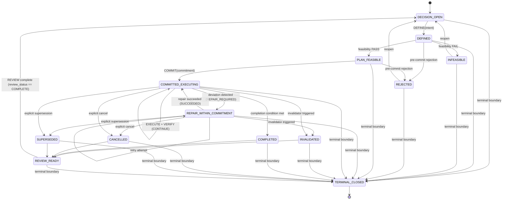

# KAGGRICULTURE — DECISION LIFECYCLE CONTRACT C2

```text
DOCUMENT_ID: KAGGRICULTURE_DECISION_LIFECYCLE_CONTRACT_C2
VERSION: C2-DRAFT-02
DATE: 2026-08-31
LAYER: Model Foundation / Decision Lifecycle Contract (Layer 5)
STATUS: FROZEN — CERTIFIED BY TARGETED FINAL FREEZE REVIEW
AUTHORING_ROLE: Foundation Architecture
RECONCILIATION_AUTHORITY: results/model_spec_c2/foundation_revision/DECISION_LIFECYCLE_REVIEW_RECONCILIATION.md
FREEZE_AUTHORITY: results/model_spec_c2/foundation_revision/DECISION_LIFECYCLE_TARGETED_FINAL_FREEZE_REVIEW.md
UPSTREAM:
  - Frozen Engine Contract (ANTIGRAVITY_C2_FINAL_ENGINE_CONTRACT_RECONCILIATION.md)
  - Frozen Period Ledger Audit (CODEX_C2_ENGINE_CONTRACT_PERIOD_LEDGER_AUDIT.md)
  - Frozen Ontology C2 (ONTOLOGY_C2.md)
  - Frozen Environment State Machine C2 (KAGGRICULTURE_STATE_MACHINE_C2.md)
  - Frozen Feature Model C2 (KAGGRICULTURE_FEATURE_MODEL_C2.md)
DOWNSTREAM:
  - MODEL_SPEC_ANTIGRAVITY
  - MODEL_SPEC_CODEX
  - MODEL_SPEC_COPILOT
```

---

## 1. Scopo

Il **Decision Lifecycle Contract (DLC)** definisce il protocollo deliberativo comune con cui un agente Kaggriculture:

1. riconosce che esiste una decisione da prendere (`DECISION_OPEN`);
2. definisce un intento strategico (`DEFINED`);
3. costruisce e verifica la fattibilità formale di un piano (`PLAN_FEASIBLE` / `INFEASIBLE`);
4. assume un commitment vincolante (`COMMITTED_EXECUTING`);
5. esegue senza oscillare arbitrariamente tra strategie (`NO_REPLAN_WITHOUT_LIFECYCLE_CAUSE`);
6. verifica continuamente gli effetti reali dell'esecuzione (`VERIFY`);
7. ripara localmente (`REPAIR_WITHIN_COMMITMENT`), invalida (`INVALIDATED`), cancella (`CANCELLED`) o sostituisce (`SUPERSEDED`) un commitment quando l'evidenza lo richiede;
8. chiude e riesamina formalmente una decisione (`REVIEW_READY`);
9. riapre il ciclo deliberativo sulla base dello stato corrente;
10. gestisce la chiusura terminale globale dell'episodio (`TERMINAL_CLOSED`).

Il DLC **non sceglie la strategia**. Esso standardizza il protocollo, l'evidence timing, la provenance e le transizioni attraverso cui strategie eterogenee possono essere formalizzate, eseguite e confrontate.

La relazione architetturale è:

```text
ENGINE CONTRACT
      ↓
   ONTOLOGY
      ↓
ENVIRONMENT STATE MACHINE
      ↓
FEATURE MODEL
      ↓
DECISION LIFECYCLE CONTRACT (Layer 5 Condiviso)
      ↓
AGENT-SPECIFIC MODEL_SPEC (Antigravity, Codex, Copilot)
      ↓
IMPLEMENTATION / CONTROLLER
```

---

## 2. Principio operativo

Il ciclo metodologico di riferimento è:

```text
DEFINE → PLAN → BUILD/EXECUTE → VERIFY → REVIEW → SHIP/CLOSE
```

Nel controller Kaggriculture viene tradotto nel seguente principio:

> **REACT nei punti di decisione; dopo il commitment, PLAN ed EXECUTE fino al completamento o a una invalidazione/chiusura dimostrata; VERIFY durante l'esecuzione; REVIEW alla chiusura; nuova DEFINE prima del ciclo successivo.**

`REACT` e `VERIFY` non sono stati deliberativi sequenziali lineari:

- **REACT** è il meccanismo di intake degli eventi/evidenze che aggiorna i fatti noti e valuta le guardie di transizione del lifecycle o attiva decisioni esplicite dell'agente.
- **VERIFY** è l'attività ricorrente che confronta le azioni richieste, l'ammissibilità a priori, gli esiti dell'engine e l'evidenza post-stato durante `COMMITTED_EXECUTING`.

Questo disaccoppiamento impedisce che il controller degeneri in un ciclo caotico di silent replanning ad ogni tick.

---

## 3. Boundary normativo

### 3.1 Il DLC definisce (Foundation Required)
Il DLC definisce esclusivamente:
- stati e transizioni deliberative comuni;
- identità e versionamento di decisioni, piani, commitment, repair e review;
- evidence snapshot e vincoli di immutabilità temporale;
- protocollo e classi di feasibility;
- struttura generica del commitment e delle reservation envelope;
- formato di registrazione delle invarianti e degli invalidatori dichiarati;
- ledger delle richieste, esiti ed evidenze di verifica;
- gerarchia deterministica di precedenza delle guardie di transizione;
- semantica distinta di repair, invalidation, cancellation, supersession e terminal closure;
- review contract e guardie di riapertura;
- regole di provenance e conformance invariants.

### 3.2 Il DLC non definisce (MODEL_SPEC Required)
Restano obbligatoriamente nei `MODEL_SPEC` agent-specific:
- obiettivo economico e funzione di utilità;
- scoring, pesi e ranking delle alternative decisionali;
- crop mix e livestock mix;
- livestock ON/OFF;
- dimensionamento della workforce e calendari di assunzione;
- perimetro del working set;
- algoritmi di routing, pathfinding e dispatching;
- politica di espansione fondiaria;
- politica di mercato (ordini BUY/SELL);
- planning horizon e commitment duration;
- soglie quantitative di invalidazione;
- cash/feed/inventory buffers;
- risk tolerance ed exploration;
- retirement/liquidation ed endgame timing;
- priorità delle azioni ed euristiche di reazione agli avversari.

Il DLC definisce la **struttura dei campi** per registrare tali grandezze quando dichiarate dal MODEL_SPEC, ma non prescrive mai il valore, la soglia o la regola che le determina.

---

## 4. Separazione dei due sistemi di stato

Il DLC non sostituisce né modifica la Environment State Machine.

Definiamo:
- $S_t$: stato fisico dell'ambiente simulato al transition index $t$ (governato dall'Environment State Machine);
- $D_t$: stato deliberativo dell'agente al transition index $t$ (governato dal Decision Lifecycle Contract).

La Environment State Machine governa le leggi causali della simulazione:
$$S_t \xrightarrow{A_t} \text{Engine Processing} \longrightarrow S_{t+1}$$

Il Decision Lifecycle Contract governa l'evoluzione del ragionamento dell'agente:
$$D_t + \text{evidence disponibile al decision boundary corrente} \longrightarrow D_{t+1}$$

Una transizione fisica dell'ambiente non forza automaticamente un cambio di stato deliberativo, e una transizione deliberativa dell'agente non altera direttamente le leggi fisiche della simulazione.

---

## 5. Evidence Timing Contract (DLC-CORR-09)

Il DLC adotta senza modifiche la quadripartizione epistemica della Foundation:
1. `ACTION_REQUEST` ($A_t$): comando emesso dall'agente partendo da $S_t$;
2. `SNAPSHOT_ELIGIBILITY`: legalità teorica dell'azione valutata sullo snapshot $S_t$ prima dell'esecuzione (`action_eligible_now`);
3. `EXECUTION_OUTCOME`: risultato effettivo dell'engine (`SUCCESS`, `NO_OP`, `REJECTED`);
4. `POST_STATE_EVIDENCE`: evidenza empirica osservata nello stato risultante $S_{t+1}$ post-transizione.

### Ordine Causale Canonico:
$$S_t \longrightarrow A_t \longrightarrow \text{SNAPSHOT\_ELIGIBILITY}_t \longrightarrow \text{ENGINE} \longrightarrow \text{EXECUTION\_OUTCOME}_t \longrightarrow S_{t+1} \longrightarrow \text{POST\_STATE\_EVIDENCE}_{t+1} \longrightarrow \text{VERIFY}$$

### Evidence Snapshot Record (Append-Only):
Ogni snapshot di evidenza è immutabile e traccia:
```text
evidence_snapshot_id
captured_at_transition_id
available_at_decision_boundary_id
source_state_id
target_state_id?
evidence_class (RAW_OBSERVABLE | ONLINE_DERIVABLE | TELEMETRY_RECORD)
snapshot_version
```

**Regola Fondamentale di No-Future-Leakage:**
$$\text{EVIDENCE\_AVAILABLE\_AT\_DECISION\_TIME} \subseteq \text{information observable/derivable at or before that decision boundary}$$

Nessun `EXECUTION_OUTCOME` o `POST_STATE_EVIDENCE` può essere retroattivamente utilizzato per giustificare decisioni (`DEFINE`, `PLAN`, `COMMIT`) assunte prima della disponibilità di tale evidenza.

---

## 6. Stati canonici del Decision Lifecycle

### 6.1 `DECISION_OPEN`
Punto deliberativo aperto; nessun commitment attivo. L'agente acquisisce l'evidence snapshot e invoca il proprio MODEL_SPEC.
- **Uscite:**
  - `DECISION_OPEN → DEFINED` (formulazione intent)
  - `DECISION_OPEN → TERMINAL_CLOSED` (terminal boundary)

### 6.2 `DEFINED`
L'agente ha formulato un **decision intent** identificabile senza ancora assumere un commitment esecutivo.
- **Record Minimo:**
  ```text
  decision_id
  decision_version
  created_at_transition_id
  owner_agent
  evidence_snapshot_id
  intent_type
  intent_payload (agent-specific)
  parent_decision_id?
  ```
- **Uscite:**
  - `DEFINED → PLAN_FEASIBLE` (feasibility check PASS)
  - `DEFINED → INFEASIBLE` (feasibility check FAIL)
  - `DEFINED → REJECTED` (pre-commit rejection per policy/preemption, distinta da INFEASIBLE)
  - `DEFINED → TERMINAL_CLOSED` (terminal boundary)

### 6.3 `PLAN_FEASIBLE`
Il piano candidato ha superato il feasibility gate dichiarato necessario dal MODEL_SPEC.
- **Record Minimo:**
  ```text
  plan_id
  plan_version
  decision_id
  feasibility_result = FEASIBLE
  feasibility_evidence_snapshot_id
  declared_requirements
  declared_reservations
  declared_invariants
  declared_invalidators
  feasibility_captured_at_transition_id
  feasibility_valid_until?
  revalidation_policy_version?
  revalidated_before_commit
  ```
- **Uscite:**
  - `PLAN_FEASIBLE → COMMITTED_EXECUTING` (assunzione del commitment)
  - `PLAN_FEASIBLE → REJECTED` (rifiuto deliberativo pre-commit)
  - `PLAN_FEASIBLE → TERMINAL_CLOSED` (terminal boundary)

### 6.4 `INFEASIBLE` (DLC-CORR-04)
Il piano candidato non supera formalmente uno o più controlli di fattibilità eseguiti nel feasibility gate.
- **Semantica:** `INFEASIBLE` è riservato esclusivamente all'esito `FAIL` del feasibility gate.
- **Record Minimo:**
  ```text
  decision_id
  plan_id
  feasibility_result = INFEASIBLE
  reason_codes[] (FEASIBILITY_RESOURCE | FEASIBILITY_TIME | FEASIBILITY_CAPACITY | ...)
  evidence_snapshot_id
  ```
- **Uscite:**
  - `INFEASIBLE → DECISION_OPEN` (esito deliberativo ordinario)
  - `INFEASIBLE → TERMINAL_CLOSED` (terminal boundary)

### 6.5 `REJECTED` (DLC-CORR-04)
Un intent o un piano feasible viene abbandonato prima del commitment per cause deliberative diverse dal fallimento del feasibility gate (es. `PRE_COMMIT_POLICY_REJECTION`, `PRE_COMMIT_PREEMPTION`).
- **Uscite:**
  - `REJECTED → DECISION_OPEN`
  - `REJECTED → TERMINAL_CLOSED` (terminal boundary)

### 6.6 `COMMITTED_EXECUTING`
Esiste un commitment attivo e vincolante.
- **Record Minimo:**
  ```text
  commitment_id
  commitment_version
  decision_id
  plan_id
  plan_version
  commitment_start_transition
  scope
  declared_completion_condition
  declared_invariants[]
  declared_invalidators[]
  completion_invalidation_precedence_policy? (opzionale)
  reservation_envelope?
  ```
- **Principio di Stabilità:** `NO_REPLAN_WITHOUT_LIFECYCLE_CAUSE`. L'agente non può abbandonare tacitamente il piano per mere fluttuazioni ambientali se non ricorre una condizione di transizione esplicita.
- **Uscite (ordinate per precedenza):**
  - `COMMITTED_EXECUTING → TERMINAL_CLOSED`
  - `COMMITTED_EXECUTING → INVALIDATED`
  - `COMMITTED_EXECUTING → COMPLETED`
  - `COMMITTED_EXECUTING → CANCELLED`
  - `COMMITTED_EXECUTING → SUPERSEDED`
  - `COMMITTED_EXECUTING → REPAIR_WITHIN_COMMITMENT`
  - `COMMITTED_EXECUTING → COMMITTED_EXECUTING` (self-loop / CONTINUE)

### 6.7 `REPAIR_WITHIN_COMMITMENT` (DLC-CORR-05)
L'esecuzione richiede un adattamento locale, preservando l'identità del commitment, l'intento strategico e la completion condition originaria.
- **Repair Record:**
  ```text
  repair_id
  commitment_id
  repair_attempt
  trigger_evidence_snapshot_id
  repair_policy_version
  plan_version_before
  plan_version_after?
  repair_result = SUCCEEDED | FAILED | ABORTED
  ```
- **Semantica di Fallimento:** Il fallimento del repair locale (`FAILED`) non implica automaticamente `INVALIDATED` a meno che non sia violato un invalidatore dichiarato.
- **Uscite ammesse:**
  - `REPAIR_WITHIN_COMMITMENT → COMMITTED_EXECUTING` (repair riuscito)
  - `REPAIR_WITHIN_COMMITMENT → REPAIR_WITHIN_COMMITMENT` (nuovo tentativo ammesso da policy)
  - `REPAIR_WITHIN_COMMITMENT → INVALIDATED` (invalidatore attivato)
  - `REPAIR_WITHIN_COMMITMENT → CANCELLED` (cancellazione esplicita)
  - `REPAIR_WITHIN_COMMITMENT → SUPERSEDED` (supersession esplicita)
  - `REPAIR_WITHIN_COMMITMENT → TERMINAL_CLOSED` (terminal boundary)

### 6.8 `INVALIDATED`
Una condizione necessaria o un'invariante dichiarata per il commitment è stata violata sulla base dell'evidenza post-stato.
- **Record Minimo:**
  ```text
  commitment_id
  invalidated_transition_id
  invalidator_id
  invalidator_evidence
  post_state_evidence_id
  ```
- **Uscite:**
  - `INVALIDATED → REVIEW_READY`
  - `INVALIDATED → TERMINAL_CLOSED` (terminal boundary)

### 6.9 `CANCELLED` (DLC-CORR-06)
Il commitment attivo viene terminato volontariamente dall'agente senza che sia stato reso oggettivamente impossibile dall'ambiente.
- **Record di Governance:**
  ```text
  commitment_id
  decision_boundary_id
  cancellation_policy_version
  authority_reference
  reason_code (EXPLICIT_CANCEL)
  evidence_snapshot_id
  ```
- **Uscite:**
  - `CANCELLED → REVIEW_READY`
  - `CANCELLED → TERMINAL_CLOSED` (terminal boundary)

### 6.10 `SUPERSEDED` (DLC-CORR-01, DLC-CORR-06)
Un commitment viene formalmente sostituito da una decisione successiva per decisione deliberativa dell'agente.
- **Risoluzione della Dipendenza Circolare:** Al momento della chiusura del commitment A, il campo `successor_decision_id` è nullable e viene generato un `supersession_intent_id`. Il link finale con `decision_B` viene materializzato all'atto di `DEFINED(decision_B)` dopo la review.
- **Record di Chiusura:**
  ```text
  superseded_commitment_id
  supersession_intent_id
  decision_boundary_id
  supersession_reason_code
  supersession_policy_version
  authority_reference
  supersession_evidence_snapshot_id
  successor_decision_id? (valorizzato in DEFINED)
  ```
- **Uscite:**
  - `SUPERSEDED → REVIEW_READY`
  - `SUPERSEDED → TERMINAL_CLOSED` (terminal boundary)

### 6.11 `COMPLETED`
La completion condition dichiarata dal commitment risulta verificata con successo dall'evidenza post-stato.
- **Record Minimo:**
  ```text
  commitment_id
  completion_transition_id
  completion_evidence
  ```
- **Uscite:**
  - `COMPLETED → REVIEW_READY`
  - `COMPLETED → TERMINAL_CLOSED` (terminal boundary)

### 6.12 `REVIEW_READY` (DLC-CORR-10)
Il ciclo decisionale è chiuso operativamente ed è pronto per la fase di review.
- **Guardia di Riapertura:** La transizione verso `DECISION_OPEN` è consentita **se e solo se** `review_status == COMPLETE` e il `review_id` è stato generato e salvato.
- **Review Record:**
  ```text
  review_id
  review_version
  decision_id
  commitment_id?
  review_status = PENDING | COMPLETE
  closure_type (COMPLETED | INVALIDATED | CANCELLED | SUPERSEDED | TERMINAL_PREEMPTION)
  start_evidence_snapshot
  end_evidence_snapshot
  execution_summary
  accounting_summary?
  diagnostic_summary?
  review_disposition? = EXPAND | MAINTAIN | REDUCE | REMOVE | INCONCLUSIVE
  ```
- **Uscite:**
  - `REVIEW_READY → DECISION_OPEN` (dopo review completata)
  - `REVIEW_READY → TERMINAL_CLOSED` (terminal boundary)

### 6.13 `TERMINAL_CLOSED` (DLC-CORR-03)
Stato assorbente terminale dell'episodio.
- **Precedenza Globale:** Il terminal boundary ($\text{step} + 1 \ge \text{episodeSteps}$) forza la chiusura diretta da qualsiasi stato attivo non terminale.
- **Terminal Closure Record:**
  ```text
  terminal_closure_id
  previous_lifecycle_state
  decision_id?
  plan_id?
  commitment_id?
  terminal_transition_id
  terminal_evidence_snapshot_id
  closure_disposition = TERMINAL_PREEMPTION | TERMINAL_AFTER_COMPLETION | TERMINAL_AFTER_REVIEW
  ```
- **Invarianza:** Nessun nuovo intent o piano online può essere aperto dopo `TERMINAL_CLOSED`. Sono consentite unicamente materializzazioni offline di review e telemetria post-hoc.

---

## 7. Macchina a stati canonica del Decision Lifecycle (DLC-CORR-11)



---

## 8. REACT Contract (DLC-CORR-11)

`REACT` non è una scorciatoia per bypassare la pianificazione o il commitment. Esso rappresenta il meccanismo di intake degli eventi e opera su due livelli distinti:

1. **Intake Passivo e Guard Evaluation:** Riceve eventi ambientali (`ENVIRONMENT_CHANGE`, `RESOURCE_CHANGE`, `MARKET_CHANGE`, `BIOLOGICAL_EVENT`, `POST_STATE_EVIDENCE`), aggiorna gli snapshot di evidenza e valuta le guardie pre-dichiarate (`invariants`, `invalidators`, `completion_condition`);
2. **Deliberazione Esplicita di Policy:** Quando invocato dal controller a un decision boundary, valuta se attivare legittimamente transizioni esplicite (`CANCELLED` o `SUPERSEDED`) secondo le regole dichiarate nel proprio `MODEL_SPEC`.

---

## 9. VERIFY Contract & Precedence Hierarchy (DLC-CORR-02, DLC-CORR-08)

Durante `COMMITTED_EXECUTING`, `VERIFY` viene eseguito ad ogni transition step collegando la catena causale dell'azione.

### 9.1 VERIFY Execution-Evidence Record
```text
verify_event_id
lifecycle_event_id
decision_id
commitment_id
commitment_version
transition_id
action_request_ids[]
snapshot_eligibility_ids[]
execution_outcome_ids[] (SUCCESS | NO_OP | REJECTED)
post_state_evidence_id
invariant_results[]
invalidator_results[]
completion_status (MET | NOT_MET)
terminal_status (TRIGGERED | CLEAR)
repair_trigger_result?
precedence_policy_reference?
precedence_result
verification_result
```

Le collezioni possono essere vuote quando non esiste alcuna request. Quando una request o un batch è stato emesso, devono contenere tutti i riferimenti disponibili, preservando cardinalità, ordine seriale e outcome `NO_OP`/`REJECTED`.

### 9.2 Gerarchia Deterministica di Precedenza delle Guardie
In presenza di trigger simultanei allo stesso transition step, `VERIFY` applica la seguente gerarchia rigorosa:

1. **`TERMINAL_CLOSED`:** Precedenza assoluta (step terminale);
2. **`COMPLETION / INVALIDATION CONFLICT RESOLUTION`:**
   - Se `completion_status == MET` e `invalidators_status == TRIGGERED`:
     - Se il MODEL_SPEC ha pre-dichiarato prima del commit una `completion_invalidation_precedence_policy`, si applica tale policy;
     - In assenza di dichiarazione preventiva, si applica il **fallback deterministico e conservativo: `INVALIDATED`**;
     - Entrambi gli esiti restano registrati nel ledger di verifica per auditabilità;
3. **`INVALIDATED`:** Invalidator attivato o invariante violata;
4. **`COMPLETED`:** Completion condition soddisfatta;
5. **`EXPLICIT CANCEL / SUPERSEDE`:** Decisione deliberata di cancellazione o sostituzione;
6. **`REPAIR_REQUIRED`:** Deviazione locale riparabile (`REPAIR_WITHIN_COMMITMENT`);
7. **`CONTINUE`:** Esecuzione conforme (`COMMITTED_EXECUTING`).

---

## 10. Feasibility Contract & Class Ledger (DLC-CORR-07)

Il DLC standardizza il protocollo di verifica della fattibilità senza imporre l'algoritmo matematico del controller.

### 10.1 Feasibility Ledger Record
Il record di fattibilità traccia, per ciascuna classe di verifica applicabile:
```text
feasibility_check_id
feasibility_subcheck_id
decision_id
plan_id
check_class =
  SNAPSHOT_ACTION_ELIGIBILITY     (legalità istantanea delle prime azioni)
  ATOMIC_BATCH_FEASIBILITY        (domanda aggregata semi e risorse nel batch)
  SERIALIZATION_FEASIBILITY       (ordine sequenziale dei worker e mutazioni)
  CAPACITY_FEASIBILITY            (vincoli fisici storage, mercato, strutture)
  RESERVED_FUTURE_SERVICEABILITY  (stima di policy RESERVED_SERVICEABLE, POLICY_CONTEXT)
  MODEL_SPEC_OTHER                (controlli specifici del modellatore)
snapshot_id
batch_id?
execution_order_reference?
check_result = PASS | FAIL | NOT_APPLICABLE
not_applicable_reason?
feasibility_captured_at_transition_id
feasibility_valid_until?
revalidation_policy_version?
revalidated_before_commit (Boolean)
```

Il MODEL_SPEC definisce i vincoli quantitativi, i margini di sicurezza e gli orizzonti temporali; il DLC garantisce la verificabilità e la tracciabilità delle verifiche eseguite.

---

## 11. Commitment & Anti-Oscillation Contract

Un commitment esecutivo deve essere:
1. **Identificabile e Versionato:** `commitment_id` e `commitment_version` immutabili;
2. **Delimitato nello Scope:** Target, perimetro operativo e orizzonte temporale definiti;
3. **Provvisto di Condizione di Chiusura:** `completion_condition` verificabile da evidenza;
4. **Vincolato a Invarianti e Invalidatori:** Condizioni dichiarate a priori che ne delimitano la validità;
5. **Protetto da Anti-Oscillazione:** Nessun abbandono o mutazione tacita senza transizione formale registrata.

---

## 12. Reservation Envelope

Il DLC fornisce uno schema generico e multidimensionale per le prenotazioni di risorse:
```text
reservation_id
commitment_id
resource_type (SEED | CASH | WORKER_STEP | TILE_SPACE | SHED_SPACE | LIVESTOCK_OUTPUT)
resource_identity?
quantity?
time_window?
service_deadline?
capacity_dimension?
status (RESERVED | CONSUMED | RELEASED | BREACHED)
```
Le reservation costituiscono un contesto deliberativo di policy (`POLICY_CONTEXT`) e non una garanzia intrinseca dell'engine.

---

## 13. Invalidation Contract & Anti-Retroactivity

Ogni invalidatore registrato deve soddisfare lo schema:
```text
invalidator_id
commitment_id
predicate_reference
evidence_requirements
declared_at_or_before_commitment (Boolean = True)
triggered_at_transition?
trigger_evidence?
```

**Regola Anti-Retroattività:** È fatto divieto assoluto di inventare o postulare un invalidatore a posteriori dopo aver osservato un esito sfavorevole per giustificare retroattivamente la rottura di un commitment. Ogni modifica alle regole di invalidazione genera una nuova versione formale del piano/commitment.

---

## 14. Repair vs Replan

| Dimensione | Repair (`REPAIR_WITHIN_COMMITMENT`) | Replan (Nuovo Ciclo via `SUPERSEDED` / `CANCELLED`) |
|---|---|---|
| **Identità Commitment** | Preservata (`commitment_id` immutato) | Chiusa formalmente, nuovo `commitment_id` |
| **Intento Strategico** | Preservato identico | Modificato materialmente |
| **Completion Condition** | Preservata identica | Ridefinita nel nuovo piano |
| **Natura dell'Azione** | Correzione locale di percorso/timing | Nuova formulazione deliberativa |
| **Passaggio da REVIEW** | No (resta in esecuzione) | **Sì, obbligatorio** (`REVIEW_READY → DECISION_OPEN`) |

---

## 15. Supersession Governance (DLC-CORR-01, DLC-CORR-06)

La supersession consente di sostituire formalmente un commitment con uno nuovo garantendo la continuità di provenance:

```text
commitment_A
      ↓
SUPERSEDED (genera supersession_intent_id)
      ↓
REVIEW_READY
      ↓
REVIEW_COMPLETE (review_status == COMPLETE)
      ↓
DECISION_OPEN
      ↓
DEFINED (decision_B, link supersession_intent_id → successor_decision_id = decision_B)
      ↓
PLAN_FEASIBLE (plan_B)
      ↓
COMMITTED_EXECUTING (commitment_B)
```

Questo pattern elimina ogni dipendenza circolare (decision_B non deve esistere al momento della chiusura di A) e garantisce che la supersession sia sempre motivata, auditata e tracciata.

---

## 16. Review Contract (DLC-CORR-10)

La review formalizza l'apprendimento e la valutazione post-chiusura:
- **Tripartizione Analitica:**
  1. `DIRECT_ACCOUNTING`: flussi monetari e fisici consuntivati;
  2. `DESCRIPTIVE_DIAGNOSTICS`: scostamenti temporali ed esecutivi;
  3. `CAUSAL_OR_COUNTERFACTUAL_ANALYSIS`: analisi di sensitività (richiede esplicitamente `analysis_method`, `comparator_or_counterfactual`, `evidence_window`, `assumptions`, `limitations`; in loro assenza, l'analisi è rubricata come diagnostica descrittiva).
- **Disposizioni di Review:** `EXPAND`, `MAINTAIN`, `REDUCE`, `REMOVE`, `INCONCLUSIVE` (rappresentano output di valutazione, mai regole prescrittive di Foundation).

---

## 17. Schema di Provenance Minima (DLC-CORR-10)

Ogni entità del DLC include i metadati necessari per il join deterministico con la Foundation:

```text
run_id
episode_id
transition_id
lifecycle_event_id
decision_boundary_id
engine_fingerprint
configuration_hash
foundation_version (C2)
feature_schema_version
telemetry_schema_version
agent_id
model_spec_version

decision_id
decision_version
plan_id
plan_version
commitment_id
commitment_version
repair_id?
review_id?
review_version?

created_at_transition_id
completed_at_transition_id?
parent_version_id?
supersedes_version_id?

parent_decision_id?
superseded_commitment_id?
supersession_intent_id?
successor_decision_id?
```

Gli identificatori sono univoci nel loro scope `(run_id, episode_id)`. Ogni versione conserva il proprio lineage e non sovrascrive la versione precedente.

---

## 18. Conformance Invariants

Un'implementazione conforme al DLC deve soddisfare rigorosamente i seguenti 10 invarianti:

- **DLC-INV-01 (No Future Leakage):** Nessuna decisione consuma evidenza posteriore al proprio boundary temporale;
- **DLC-INV-02 (Explicit Commitment):** Nessuna azione esecutiva committed esiste senza `commitment_id`;
- **DLC-INV-03 (No Silent Replan):** Ogni mutazione materiale di intento richiede chiusura formale e nuovo ciclo;
- **DLC-INV-04 (Evidence-Driven Invalidation):** `INVALIDATED` richiede un invalidatore pre-dichiarato e trigger evidence verificata;
- **DLC-INV-05 (Repair Preserves Commitment):** Il repair non può mutare l'intento strategico o la completion condition;
- **DLC-INV-06 (Explicit Execution Evidence):** `ACTION_REQUEST` non equivale a `EXECUTION_OUTCOME`;
- **DLC-INV-07 (Review Before Reopen):** Dopo la chiusura, la riapertura esige `review_status == COMPLETE` in `REVIEW_READY`;
- **DLC-INV-08 (Terminal Closure):** Nessun intento online può essere aperto dopo `TERMINAL_CLOSED`;
- **DLC-INV-09 (Strategy Neutrality):** Il DLC non contiene preferenze economiche, agronomiche o di routing;
- **DLC-INV-10 (Version Integrity):** Ogni variazione materiale di piano o commitment genera una nuova versione tracciata.

---

## 19. Reason-Code Taxonomy (DLC-CORR-04, DLC-CORR-11)

La tassonomia dei codici di causa separa rigorosamente le fasi pre-commit e post-commit:

```text
PRE-COMMIT CODES (per INFEASIBLE e REJECTED):
  FEASIBILITY_RESOURCE_UNAVAILABLE
  FEASIBILITY_TIME_INSUFFICIENT
  FEASIBILITY_CAPACITY_EXCEEDED
  FEASIBILITY_ACTION_INELIGIBLE
  FEASIBILITY_SERIALIZATION_CONFLICT
  PRE_COMMIT_POLICY_REJECTION
  PRE_COMMIT_PREEMPTION

POST-COMMIT EXECUTION & VERIFY CODES:
  EXECUTION_NO_OP
  EXECUTION_REJECTED_BY_ENGINE
  REPAIR_SUCCESSFUL
  REPAIR_FAILED
  RESOURCE_INVARIANT_VIOLATION
  TIME_INVARIANT_VIOLATION
  CAPACITY_INVARIANT_VIOLATION
  STATE_INVARIANT_VIOLATION
  PLAN_COMPLETED

CLOSURE & TERMINAL CODES:
  EXPLICIT_CANCEL
  SUPERSESSION
  TERMINAL_PREEMPTION
  TERMINAL_POST_COMPLETION
  TERMINAL_POST_REVIEW
  OTHER_DECLARED
```

---

## 20. Relazione con i MODEL_SPEC Downstream

Ciascun `MODEL_SPEC` implementa le proprie strategie dichiarando:
- la propria funzione obiettivo e i tipi di decision intent ammessi;
- i propri metodi di pianificazione e policy di fattibilità;
- i criteri di assunzione e durata dei commitment;
- le proprie completion conditions e predicati di invalidazione;
- le proprie policy di repair, cancellation e supersession;
- le proprie regole di selezione delle azioni e di attribuzione delle review dispositions.

La conformità al DLC garantisce che agenti con filosofie strategiche radicalmente diverse (es. rule-based, search-based, learning-based) siano reciprocamente comprensibili, comparabili e auditabili.

---

## 21. Gate di revisione del Decision Lifecycle Contract

```text
ENGINE_CONTRACT_ALIGNMENT: PASS
ONTOLOGY_ALIGNMENT: PASS
STATE_MACHINE_ALIGNMENT: PASS
FEATURE_MODEL_ALIGNMENT: PASS

DLC_RECONCILIATION_APPLIED: YES
DLC_CORR_01_11_APPLIED: YES
DLC_REVISION: COMPLETE (C2-DRAFT-02)
DECISION_LIFECYCLE_FREEZE: YES
DECISION_LIFECYCLE_STATUS: FROZEN
FOUNDATION_LAYERS_1_5_FROZEN: YES
NEXT_GATE: GOVERNANCE_ALIGNMENT_AND_FOUNDATION_CHECKPOINT

MODEL_SPEC_REVISION_AUTHORIZED: NO
BUILD_AUTHORIZED: NO
TOURNAMENT_AUTHORIZED: NO
KAGGLE_AUTHORIZED: NO
```

---

## 22. Stop condition

`C2-DRAFT-02` deve essere sottoposto a una targeted freeze verification che controlli la chiusura di `DLC-CORR-01 .. DLC-CORR-11`, la parità tra testo e Mermaid e l'assenza di regressioni rispetto alla Foundation frozen.

Nessun `MODEL_SPEC` deve essere redatto prima del freeze del DLC.

**Fine di KAGGRICULTURE_DECISION_LIFECYCLE_CONTRACT_C2 (Draft 02 Reconciled).**
