# Kaggriculture State Machine C2

```text
CANDIDATE C2
NOT FROZEN
UPSTREAM: ONTOLOGY_C2 CANDIDATE
DERIVED FROM FOUNDATION RECONCILIATION R1
BASELINE DI RIFERIMENTO: KAGGRICULTURE_STATE_MACHINE_C1.md (C1)
```

---

## 1. Scopo, perimetro ed evidence status

Questo documento descrive la macchina a stati formale dell'ambiente di simulazione **Kaggriculture**, recepita come revisione mirata (`REVISE_LIGHT`) della State Machine C1 sulla base dell'arbitrato normativo della **Foundation Reconciliation R1** di Codex e del vocabolario canonico di **Ontology C2** (`docs/model/ontology/ONTOLOGY_C2.md`).

La State Machine risponde alla domanda:
> **Quali stati assume il sistema, attraverso quali fasi temporali evolve e quali transizioni sono ammesse dall'ambiente simulato?**

Non è un `MODEL_SPEC`, non prescrive strategie, routing, soglie operative o pesi decisionali, e non introduce un classifier di policy. È una ricostruzione descrittiva e neutrale della dinamica dell'ambiente, dei suoi stati osservabili e degli stati derivati canonici.

### 1.1 Fonti e riuso dei dati

Il documento consolida e integra:
- `docs/model/ontology/ONTOLOGY_C2.md` (upstream semantico C2);
- `docs/model/state_machine/KAGGRICULTURE_STATE_MACHINE_C1.md` (baseline C1);
- `docs/model/reviews/reconciliation/CODEX_FOUNDATION_RECONCILIATION_R1.md` (arbitrato normativo R1);
- `docs/model/reviews/antigravity/ANTIGRAVITY_FOUNDATION_REVIEW_R1.md`;
- `docs/model/reviews/copilot/COPILOT_FOUNDATION_REVIEW_R1.md`;
- `results/e16/diagnostics/tile_lifecycle_feature/E16_TILE_LIFECYCLE_FEATURE_AUDIT.md`;
- `results/e16/diagnostics/e16_a_r1_crop_attainment/E16_A_R1_CROP_ATTAINMENT_FORENSIC_DIAGNOSIS.md`;
- regole verificate nel codice sorgente (`kaggriculture.py`), schema (`kaggriculture.json`) e documentazione ufficiale.

### 1.2 Evidence status canonici

| Status | Significato in questo documento |
|---|---|
| `ENGINE_VERIFIED` | Regola o dinamica osservata direttamente nel codice sorgente dell'ambiente (`kaggriculture.py`), schema o documentazione ufficiale, corroborata dai ledger empirici. |
| `DERIVED` | Stato, predicato o relazione calcolabile deterministicamente da campi engine primitivi, pur non memorizzata dall'engine con quel nome specifico. |
| `PARTIALLY_KNOWN` | Sottosistema di cui sono state verificate alcune transizioni fondamentali, ma la cui dinamica globale presenta componenti non ancora auditate end-to-end. |
| `NOT_ANALYZED` | Parte deliberatamente non ricostruita o ambito strategico/economico non formalizzato; non viene completata per inferenza speculativa. |

---

## 2. Clock, fase e ciclo globale dell'engine

### 2.1 Engine clock vs Diagnostic canonical clock

L'ambiente e l'infrastruttura diagnostica utilizzano due nozioni di clock che devono restare rigorosamente distinte:

```text
engine_step != canonical_step by definition
```

| Orologio | Natura | Definizione | Ruolo | Status |
|---|---|---|---|---|
| `step` (o `engine_step`) | **Engine clock** | Contatore incrementale discreto degli step eseguiti dall'interpreter (`observation.step`). | **Orologio autorevole dell'engine**; governa tutte le regole e i controlli per-step (decay, timeout, limite episodio). | `ENGINE_VERIFIED` |
| `day` | **Engine state** | Giorno di simulazione corrente (0-indexed). | Unità biologica e contrattuale fondamentale (refresh piante, animali, contratti). | `ENGINE_VERIFIED` |
| `hour` | **Engine state** | Step/ora all'interno della giornata (`[0, turnsPerDay - 1]`). | Fase infra-giornaliera di avanzamento. | `ENGINE_VERIFIED` |
| `turnsPerDay` | **Engine parameter** | Numero di step per giorno (default: 24). | Costante di discretizzazione giornaliera. | `ENGINE_VERIFIED` |
| `canonical_step` | **Diagnostic clock** | $\text{canonical\_step} = \text{day} \times \text{turnsPerDay} + \text{hour}$ | **Ricostruzione diagnostica deterministica**; utilizzata nei framework di telemetria quando `observation.step` è difettosa o incompleta. | `DERIVED` |

*Regola di precisione C2:* le regole dell'engine operano nativamente su `step`, `day` e `hour`. `canonical_step` non sostituisce l'orologio dell'engine, ma costituisce uno strumento di allineamento e validazione per la telemetria.

### 2.2 Phase contract e ordine globale del loop

Per ogni step attivo dell'episodio, l'engine esegue le operazioni secondo una sequenza deterministica e ordinata in 11 fasi:

1. **Inizializzazione:** se la simulazione è al passo zero, l'engine inizializza la farm pubblica, il private state dei player, il market condiviso e la town (`_initialize`);
2. **Lettura azioni:** ricezione dei vettori di comandi emessi da ciascun player per il main farmer e per ciascun farm hand attivo;
3. **Validazione atomica `PLANT`:** validazione globale delle richieste di semina same-player per specifica crop; se la domanda istantanea supera i semi posseduti in `private.seeds[crop]`, tutte le azioni `PLANT` per quella crop vengono bloccate atomicamente nello step;
4. **Applicazione azione Main Farmer:** esecuzione del comando del farmer (movimento, operazione su tile, build, ecc.);
5. **Applicazione azioni Farm Hands:** esecuzione sequenziale dei comandi dei worker assunti;
6. **Market Orders:** elaborazione e regolamento degli ordini di acquisto/vendita/assunzione (`BUY_SEED`, `BUY_LAND`, `BUY_ANIMAL`, `SELL`, `HIRE`) entro il limite di batch per step;
7. **Town Consumption:** aggiornamento e consumo di beni dal market da parte della città secondo il calendario configurato (`_town_consume`);
8. **Plant Lifespan Decay (`_decay_plants`):** tick di decadimento per-step; per le piante che hanno raggiunto `max_lifespan_step`, decremento di `yield_units` fino all'azzeramento o transizione a weed;
9. **End-of-Day Refresh (EOD):** se lo step chiude la giornata (`(step + 1) % turnsPerDay == 0`), l'engine esegue la procedura di fine giornata nel seguente ordine:
   - **Daily Refresh Plants (`_daily_refresh_plants`):** verifica irrigazione giornaliera (`watered_today`), aggiornamento contatore disidratazione (`consecutive_unwatered`), trasformazione in `WEED` per piante con $\ge 2$ giorni senza acqua; per le ongoing, incremento di resa biologica nei giorni di produzione prefissati;
   - **Daily Refresh Animals (`_daily_refresh_animals`):** verifica alimentazione (`fed_today`) e cura (`cared_today`), accumulo/consumo di `pending_care_bonus`, erogazione del prodotto primario (Milk, Wool, Egg), fuga dell'animale se $\text{consecutive\_unfed} \ge 2$, generazione automatica di Fertilizer;
   - **RNG Weed Spawn:** per ciascuna tile libera con stato `None`, estrazione casuale stocastica (draw $< \text{weedSpawnChance}$); se superata, la tile diventa `WEED`;
   - **Drop automatico inventari worker (`_drop_inventories_to_shed`):** trasferimento automatico di tutti i beni trasportati dai worker nello shed centrale fino al limite di `shedCapacity` (100 unità); l'eccedenza costituisce `shed_overflow_eod_loss`;
   - **Reset Farmer Spawn:** riposizionamento del main farmer sulla coordinata di spawn dello shed;
   - **Rimozione Hands & Reset Hires:** rilascio di tutti i farm hands assunti e reset del contatore `hires_today = 0`;
   - **Ricostruzione Inventari:** reinizializzazione dell'inventario vuoto per il giorno successivo;
   - **Calendario Town/Shop:** eventuale aggiornamento periodico delle richieste town e delle offerte shop.
10. **Aggiornamento coordinate temporali:** incremento di `day` e reset di `hour` (se a EOD), oppure incremento di `hour`;
11. **Terminal Reward:** all'ultimo step dell'episodio, assegnazione del saldo monetario `farm.money` come reward terminale.

### 2.3 Mappa dei clock e delle fasi per meccanica

| Meccanica / Transizione | Clock governante | Fase di esecuzione | Natura del trigger |
|---|---|---|---|
| `HARVEST` crop readiness | `day` vs `planted_day` + `first_yield_day` | Fase 4/5 (Action Phase) | Predicato su `day`, validato a decision time |
| Lifespan decay | `step` vs `max_lifespan_step` | Fase 8 (`_decay_plants`) | Deterministico per-step |
| WATER deadline & Missed-WATER loss | `day` & `consecutive_unwatered` | Fase 9 (EOD Refresh) | Deterministico al cambio giorno |
| Fertilizer window | `day` vs `fertilized_until_day` | Fase 9 (EOD) / Fase 4-5 (Action) | Deterministico su intervallo di giorni |
| Livestock production & Escape | `day` & `consecutive_unfed` | Fase 9 (EOD Refresh) | Deterministico al cambio giorno |
| Random EMPTY $\to$ WEED spawn | RNG draw a EOD | Fase 9 (EOD Refresh) | Stocastico al cambio giorno |
| Shed Drop & Overflow loss | EOD trigger | Fase 9 (EOD Refresh) | Deterministico al cambio giorno |

---

## 3. Stato della Farm, visibilità e tile

### 3.1 Farm pubblica vs Private State

L'ambiente separa nettamente i dati pubblici (visibili a tutti i player nelle osservazioni) dai dati privati:

- **Stato Farm Pubblico (`farms[player_id]`):**
  - `money`: cassa disponibile;
  - `tiles[y][x]`: griglia bidimensionale dello stato delle tile;
  - `farmer`: coordinate `[x, y]` e stato del main farmer;
  - `hands`: lista di coordinate e inventari dei farm hands attivi;
  - `unlocked_quadrants`: lista dei quadranti fondiari sbloccati;
  - `hires_today`: numero di assunzioni eseguite nella giornata corrente.
- **Stato Private (`private[player_id]`):**
  - `shed`: inventario centralizzato dei beni stoccati (capacità 100);
  - `seeds`: dizionario delle sementi possedute per crop;
  - `inventories`: inventari correnti per ciascun worker.
- **Stato Globale Condiviso:**
  - `market`: scorte e prezzi correnti delle commodity;
  - `town`: domanda di consumo urbano e stato shop.

### 3.2 Valori nativi delle tile nell'engine

| Valore nativo engine | Descrizione | Status |
|---|---|---|
| `None` | Tile vuota, sbloccata e disponibile per semina, pascolo o strutture. | `ENGINE_VERIFIED` |
| `"LOCKED"` | Tile appartenente a un quadrante non ancora acquistato tramite `BUY_LAND`. | `ENGINE_VERIFIED` |
| `{"kind": "PLANT", ...}` | Pianta viva con campi: `crop`, `planted_day`, `watered_today`, `consecutive_unwatered`, `yield_units`, `max_lifespan_step`, `fertilized_until_day`. | `ENGINE_VERIFIED` |
| `{"kind": "WEED"}` | Erba infestante che blocca l'uso arabile della tile. | `ENGINE_VERIFIED` |
| `{"kind": "COOP", ...}` | Struttura per avicoli (`GOOSE`), vuota o con animale alloggiato. | `ENGINE_VERIFIED` |
| `{"kind": "PASTURE", ...}` | Recinto per bestiame (`COW`, `SHEEP`), vuoto o con animale alloggiato. | `ENGINE_VERIFIED` |

### 3.3 Natura del Working Set

Il concetto di `working_set_member`, le posizioni target prescelte (`CROP_POSITIONS`) e il dimensionamento del perimetro arabile **non sono stati memorizzati dall'engine**, ma costrutti della policy decisionale.

La State Machine riconosce la separazione tra stato intrinseco della tile e classificazione contestuale:
- Una tile nativa `None` situata in un'area assegnata dalla policy è derivabile come `EMPTY_ASSIGNED`;
- La medesima tile `None`, se esterna al piano di allocazione corrente, è derivabile come `OUT_OF_SCOPE`.

---

## 4. Lifecycle canonico Crop / Tile C2

### 4.1 Categorie e stati del lifecycle canonico

In conformità con `ONTOLOGY_C2`, la State Machine adotta **sei categorie/stati canonici candidati e semanticamente distinti**:

```text
OUT_OF_SCOPE       : tile non posseduta, non assegnata o occupata da struttura non-crop
EMPTY_ASSIGNED     : tile posseduta, libera (None) e disponibile per nuova semina
GROWING            : tile con PLANT attiva in accrescimento non ancora raccoglibile
HARVEST_READY      : tile con PLANT matura soddisfacente il predicato formale di readiness
RETIREMENT_DUE     : tile con PLANT esaurita/a fine ciclo che richiede rimozione programmata
LOST_WEED          : tile caduta nello stato WEED (bloccata) che richiede bonifica
```

*Nota di governance C2:* questi sei stati descrivono l'insieme esaustivo dei ruoli del ciclo biologico; la formalizzazione dell'algoritmo di classificazione totale (con precedenze e predicati computazionali mutuamente esclusivi) appartiene al livello Feature Model C2.

### 4.2 Predicato formale di HARVEST Readiness

L'engine impone una netta separazione tra la presenza numerica di yield e la maturità di raccolta:

$$\text{yield available} \neq \text{harvest ready}$$

Il predicato canonico di maturità colturale è:

$$\text{harvest\_ready}(\text{tile}, \text{current\_day}) \iff \begin{cases} \text{tile.kind} == \text{PLANT} \\ \text{tile.yield\_units} > 0 \\ \text{current\_day} - \text{tile.planted\_day} \ge \text{CROPS}[\text{tile.crop}].\text{first\_yield\_day} \end{cases}$$

Un comando `HARVEST` emesso su una pianta prima di `first_yield_day` costituisce un no-op che non preleva beni e rischia di distruggere l'investimento temporale.

### 4.3 Dinamica per tipologia di coltura

#### A. Colture Non-Ongoing (es. Wheat, Melon, Carrot)
- **Semina:** `EMPTY_ASSIGNED` $\xrightarrow{\text{PLANT}}$ `GROWING` (consuma 1 seed, imposta `consecutive_unwatered = 1`, `planted_day = day`);
- **Accrescimento:** `GROWING` $\xrightarrow{\text{WATER}}$ `GROWING` (imposta `watered_today = true`; nella finestra di resa aggiunge yield base e l'eventuale bonus fertilizzante);
- **Maturazione:** raggiunta al giorno `day >= planted_day + first_yield_day` $\implies$ `HARVEST_READY`;
- **Raccolta:** `HARVEST_READY` $\xrightarrow{\text{HARVEST}}$ `EMPTY_ASSIGNED` (lo yield viene trasferito all'inventario del worker; la tile torna nativamente `None`);
- *Nota:* la ripiantumazione successiva è un'azione indipendente `PLANT`, non un sottoprocesso implicito di HARVEST.

#### B. Colture Ongoing (es. Strawberry, Tomato)
- **Semina:** `EMPTY_ASSIGNED` $\xrightarrow{\text{PLANT}}$ `GROWING`;
- **Produzione continua:** `yield_units` nasce a zero e viene incrementato a EOD secondo il calendario biologico (`interval`);
- **Raccolte intermedie:** `HARVEST_READY` $\xrightarrow{\text{HARVEST}}$ `GROWING` (lo yield viene prelevato e azzerato; la pianta permane sulla tile e riavvia il ciclo di accrescimento);
- **Fine ciclo biologico:** dopo l'ultima produzione utile consentita dalla durata biologica, la coltura transita semantamente in `RETIREMENT_DUE`;
- **Clearance:** `RETIREMENT_DUE` $\xrightarrow{\text{preventive DIG}}$ `EMPTY_ASSIGNED` (rimuove la pianta esaurita prima che subisca decadimento/lifespan decay a WEED).

---

## 5. Macchina WATER, allerta Care ed EOD Loss

### 5.1 Condizione ortogonale `tile_care_due_condition`

`tile_care_due_condition` (o `care_due`) **non è uno stato strutturale del lifecycle**, ma una condizione di allerta ortogonale applicabile a qualsiasi tile con `kind == PLANT`:

$$\text{care\_due}(\text{tile}) \iff \text{tile.kind} == \text{PLANT} \quad \land \quad \text{tile.watered\_today} == \text{false}$$

### 5.2 Meccanica deterministica di disidratazione a EOD

- Alla semina, la nuova `PLANT` nasce con `watered_today = false` e `consecutive_unwatered = 1`;
- Durante la giornata operativa, un'azione `WATER` imposta `watered_today = true`;
- Alla fase di EOD Refresh (`_daily_refresh_plants`):
  ```text
  if tile.watered_today:
      tile.consecutive_unwatered = 0
  else:
      tile.consecutive_unwatered += 1

  tile.watered_today = false

  if tile.consecutive_unwatered >= 2:
      tile = {"kind": "WEED"}
  ```

### 5.3 Conseguenze deterministiche verificate
1. **Day-0 Vulnerability:** poiché una pianta nasce con `consecutive_unwatered = 1`, se non riceve `WATER` nello stesso giorno di semina, al primo EOD raggiunge contatore 2 e diventa `WEED`;
2. **One-Day Grace Period:** per una pianta già stabilizzata (`consecutive_unwatered = 0`), un singolo giorno non servito porta il contatore a 1 senza causare morte;
3. **Loss Boundary:** il secondo EOD consecutivo senza irrigazione trasforma la pianta in `WEED` in modo deterministico e irreversibile.

---

## 6. Cause di generazione WEED e semantica DIG

### 6.1 Le tre famiglie causali distinte di WEED

La State Machine riconosce e separa formalmente le tre cause di comparsa di `WEED`:

| Famiglia causale | Tile sorgente | Meccanismo engine | Fase temporale | Natura deterministica | Prevenzione |
|---|---|---|---|---|---|
| **1. Missed-WATER Loss** | `PLANT` (`GROWING` / `HARVEST_READY`) | EOD con `consecutive_unwatered >= 2` | Fase 9 (EOD Refresh) | Deterministica | Irrigare entro EOD; non piantare oltre la capacità di servizio. |
| **2. Lifespan Decay** | `PLANT` (`HARVEST_READY` / `RETIREMENT_DUE`) | Tick di `_decay_plants` che riduce `yield_units` fino all'azzeramento o limite lifespan | Fase 8 (Per-step Decay) | Deterministica | Raccogliere tempestivamente; eseguire preventive DIG su ongoing esaurite. |
| **3. Random Spawn** | `None` (`EMPTY_ASSIGNED` / Farm aperta) | Draw RNG a EOD con probabilità `< weedSpawnChance` | Fase 9 (EOD Refresh) | Stocastica | Ridurre le tile vuote esposte; il seed non è prevedibile online. |

*Regola di separazione C2:* non esiste un singolo concetto aggregato `time_to_weed`. Per le tile `None`, l'esposizione è modellabile come *hazard rate / eligibility*, mai come countdown deterministico.

### 6.2 Distinzione semantica delle azioni DIG

In conformità con `ONTOLOGY_C2`, l'azione atomica `DIG` copre due funzioni operative distinte:

```text
preventive_dig_action : RETIREMENT_DUE  --DIG-->  EMPTY_ASSIGNED  (clearance programmata fisiologica)
recovery_dig_action   : LOST_WEED       --DIG-->  EMPTY_ASSIGNED  (bonifica di emergenza da perdita)
```

- **`preventive_dig_action`:** operazione di manutenzione programmata per rimuovere una pianta a fine ciclo e ripristinare il terreno per una nuova semina;
- **`recovery_dig_action`:** costo di riparazione a posteriori per recuperare un terreno degradato a causa di missed-water, lifespan scaduto o spawn stocastico. Non costituisce una strategia primaria per cause di perdita prevenibili.

---

## 7. Workforce, movimento e multi-occupancy

### 7.1 Multi-occupancy verificata

$$\text{worker\_multi\_occupancy} \implies \text{ENGINE\_VERIFIED}$$

L'engine consente a più unità (Farmer e Farm Hands) di condividere contemporaneamente la medesima coordinata spaziale $[x, y]$ senza collisioni fisiche native, blocchi di movimento o invalidazione delle posizioni.

### 7.2 Need, Eligibility e Serviceability

La State Machine formalizza la netta separazione tra stato della tile, idoneità dell'azione e fattibilità logistica:

```text
tile_need                   : fabbisogno oggettivo della tile (es. care_due, harvest_ready)
action_eligible_now         : worker presente sulla coordinata con precondizioni soddisfatte per agire al tick corrente
serviceable_before_deadline : certezza che un worker raggiungerà ed eseguirà l'azione prima del verificarsi del vincolo di perdita
```

*Status di serviceability:* `serviceable_before_deadline` resta `PARTIALLY_KNOWN` a livello globale finché non viene accoppiato a un contratto esplicito di routing, posizionamento, inventario e budget di passi per-step.

### 7.3 Dinamica contrattuale e assunzioni (`HIRE`)
- Il main farmer è permanente e riposizionato alla spawn tile dello shed a ogni EOD;
- I farm hands sono assunti tramite ordini market `HIRE` e operano con inventari separati;
- Il costo di assunzione giornaliero scala secondo la serie Fibonacci moltiplicata per `farmHandCostMult`;
- A EOD, **tutti i farm hands vengono rimossi** e il contatore `hires_today` torna a 0; per operare il giorno successivo, la policy deve riemettere comandi `HIRE`.

---

## 8. Meccanica FERTILIZE C2

La dinamica di fertilizzazione è promossa a `ENGINE_VERIFIED` nel perimetro delle regole accertate in `kaggriculture.py`:

### 8.1 Finestra di persistenza (`fertilizer_effect_window`)
All'applicazione di un'azione `FERTILIZE`, l'engine imposta:

$$\text{tile.fertilized\_until\_day} = \max(\text{tile.fertilized\_until\_day}, \text{current\_day} + 2)$$

L'effetto fertilizzante è attivo per **3 giorni consecutivi inclusivi** ($\text{day} \dots \text{day} + 2$).

### 8.2 Bonus colturale verificato (`crop_fertilizer_bonus`)
- **Colture Ongoing irrigate:** durante il refresh di EOD, se la fertilizzazione è attiva (`day <= fertilized_until_day`) e la pianta è stata irrigata (`watered_today == true`), l'engine eroga **+2 unità addizionali di yield**;
- **Colture Non-Ongoing:** durante l'azione `WATER`, se la pianta si trova nella finestra di resa e la fertilizzazione è attiva, l'engine eroga **+2 unità addizionali di yield** per ciascuna irrigazione.

*Confine:* la State Machine documenta la meccanica formale; la valutazione della convenienza economica, del ROI e della politica di acquisto/impiego di fertilizer appartiene ai singoli `MODEL_SPEC`.

---

## 9. Livestock, Feed, Care e Accumulo Bonus

**Evidence status complessivo: `PARTIALLY_KNOWN` (meccaniche core `ENGINE_VERIFIED`).**

### 9.1 Parametri base delle specie animali

| Specie | Struttura richiesta | Primo giorno produzione | Intervallo produzione | Prodotto primario | Prodotto secondario |
|---|---|---:|---:|---|---|
| `GOOSE` | `COOP` | Giorno 4 | 1 giorno | `EGG` | Fertilizer |
| `COW` | `PASTURE` | Giorno 8 | 2 giorni | `MILK` | Fertilizer |
| `SHEEP` | `PASTURE` | Giorno 6 | 3 giorni | `WOOL` | Fertilizer |

### 9.2 Meccanica FEED + CARE e accumulo bonus
- **Alimentazione (`FEED`):** richiede Wheat nell'inventario del worker; imposta `fed_today = true` sull'animale;
- **Cura (`CARE`):** imposta `cared_today = true`;
- **Accumulo bonus a EOD:** a fine giornata (`_daily_refresh_animals`), `pending_care_bonus` viene incrementato se e solo se l'animale è stato sia nutrito sia accudito nello stesso giorno (`fed_today == true` e `cared_today == true`); l'accumulo a EOD è semanticamente distinto dal consumo del bonus nei giorni di produzione;
- **Produzione e consumo bonus a EOD:** nei giorni di produzione biologica prefissati:
  - Se l'animale è alimentato (`fed_today == true`), l'engine genera il prodotto primario applicando l'eventuale moltiplicatore derivante dal `pending_care_bonus` accumulato, e consuma il bonus corrispondente;
  - Se l'animale non è alimentato, la produzione non avviene e `consecutive_unfed` viene incrementato.
- **Fuga dell'animale (Animal Escape):** se `consecutive_unfed >= 2`, l'animale scappa dalla struttura, che torna nello stato `EMPTY_STRUCTURE`.
- **Generazione Fertilizer:** a ogni EOD, la presenza di animali attivi genera automaticamente unità di Fertilizer.

---

## 10. Endgame e integrità dell'inventario (Shed Overflow EOD)

### 10.1 Correzione formale `shed_overflow_eod_loss`

$$\text{contract\_inventory\_loss} \xrightarrow{\text{CORREZIONE C2}} \text{shed\_overflow\_eod\_loss} \quad (\text{ENGINE\_VERIFIED})$$

- Durante la procedura di fine giornata (Fase 9: `_drop_inventories_to_shed`), l'engine trasferisce **automaticamente e interamente** allo shed centrale (`private.shed`) tutti i beni trasportati da ciascun worker;
- Lo shed ha una capacità massima strutturale di **100 unità totali** (`shedCapacity`);
- Se la somma dei beni già presenti nello shed e dei beni scaricati dai worker eccede 100 unità, l'eccedenza oltre la capienza viene distrutta irreversibilmente (`shed_overflow_eod_loss`);
- **Falsificazione definitiva:** non esiste alcuna perdita derivante dalla scadenza contrattuale del worker né alcun obbligo di far rientrare manualmente i worker allo shed prima del termine della giornata per salvare l'inventario.

---

## 11. Diagramma Mermaid complessivo C2

```mermaid
flowchart TB
    subgraph Global[Global Engine Cycle - 11 Phases]
        U[1. UNINITIALIZED] -->|initialize| S[2. STEP_OPEN]
        S -->|3. validate PLANT| V[PLANT_VALIDATED]
        V -->|4. farmer action| FA[FARMER_APPLIED]
        FA -->|5. hands actions| HA[HANDS_APPLIED]
        HA -->|6. market orders| MO[MARKET_PROCESSED]
        MO -->|7. town consume| TC[TOWN_CONSUMED]
        TC -->|8. plant lifespan decay| PD[DECAY_APPLIED]
        PD --> EOD{9. End of Day?}
        EOD -->|no| NO[10. NEXT_HOUR_OBSERVATION]
        EOD -->|yes| PR[9a. PLANT_REFRESH & WEED_CHECK]
        PR --> AR[9b. ANIMAL_REFRESH & CARE_CONSUME]
        AR --> WS[9c. RNG_WEED_SPAWN_ON_NONE]
        WS --> SD[9d. AUTO_DROP_TO_SHED_OVERFLOW_LOSS]
        SD --> WR[9e. WORKER_RESET_&_HANDS_REMOVED]
        WR --> NO
        NO -->|active episode| S
        NO -->|11. max steps reached| END[11. DONE_REWARD_EQUALS_MONEY]
    end

    subgraph CropLifecycle[Crop & Tile Lifecycle C2]
        OOS[OUT_OF_SCOPE] -->|BUY_LAND & assign| EA[EMPTY_ASSIGNED]
        EA -->|PLANT action| G[GROWING]
        G -->|WATER action| G
        G -->|day >= planted + first_yield & yield > 0| HR[HARVEST_READY]
        HR -->|HARVEST non-ongoing| EA
        HR -->|HARVEST ongoing intermediate| G
        HR -->|HARVEST ongoing final| RD[RETIREMENT_DUE]
        RD -->|preventive DIG| EA
        G -->|missed WATER: unwatered >= 2 at EOD| LW[LOST_WEED]
        G -->|lifespan decay at phase 8| LW
        HR -->|lifespan decay at phase 8| LW
        RD -->|lifespan decay at phase 8| LW
        EA -->|RNG draw < spawnChance at EOD| LW
        LW -->|recovery DIG| EA
    end

    subgraph OrthogonalCare[Orthogonal Tile Condition]
        PLANT_ANY[PLANT Tile] -.->|watered_today == false| CD[tile_care_due_condition]
        CD -.->|WATER action before EOD| PLANT_OK[Irrigated: counter reset]
        CD -.->|unwatered 2nd EOD| LW
    end

    subgraph Workforce[Workforce Dynamics - ENGINE_VERIFIED]
        MF[MAIN_FARMER] -->|MOVE / TILE_OP| MF
        NH[NO_HANDS] -->|HIRE order| HANDS[HANDS_AVAILABLE]
        HANDS -->|MOVE / TILE_OP| HANDS
        HANDS -->|multi_occupancy co-location| HANDS
        HANDS -->|EOD: contracts expire| NH
        MF -->|EOD: reset to shed spawn| MF
        WINV[WORKER_INVENTORIES] -->|EOD auto drop up to 100| SHED[SHED_STORAGE]
        WINV -->|EOD overflow beyond 100| LOSS[shed_overflow_eod_loss]
    end

    subgraph LivestockSub[Livestock Subsystem]
        SOIL[None Tile] -->|BUILD_COOP / PASTURE| ES[EMPTY_STRUCTURE]
        ES -->|PLACE animal| OS[OCCUPIED_STRUCTURE]
        OS -->|FEED wheat| FED[fed_today = true]
        OS -->|CARE action| CARE[cared_today = true]
        FED & CARE -->|EOD: cared_today AND fed_today| ACC[accumulate pending_care_bonus]
        FED -->|EOD production day| PROD[PRIMARY_YIELD_AVAILABLE]
        ACC -->|consumed on fed production| PROD
        PROD -->|HARVEST action| OS
        OS -->|consecutive_unfed >= 2 at EOD| ES
        ES -->|DIG action| SOIL
    end
```



---

## 12. Tabella canonica delle transizioni C2

| subsystem | from_state | to_state | trigger | engine_condition | det/stoch | online_obs | action | evidence_status | evidence_source |
|---|---|---|---|---|---|---|---|---|---|
| global | `UNINITIALIZED` | `STEP_OPEN` | initialize | farm non presenti | deterministic | framework | none | `ENGINE_VERIFIED` | `kaggriculture.py::_initialize` |
| global | `STEP_OPEN` | `PLANT_VALIDATED` | atomic check | same-player demand $\le$ seeds | deterministic | yes | none | `ENGINE_VERIFIED` | `interpreter` |
| global | `PLANT_VALIDATED` | `ACTIONS_APPLIED` | action phase | player actions | deterministic | yes | farmer/hands actions | `ENGINE_VERIFIED` | `_apply_unit_action` |
| global | `ACTIONS_APPLIED` | `MARKET_PROCESSED` | market phase | ordini validati | deterministic | partial | market orders | `ENGINE_VERIFIED` | `_process_market` |
| global | `MARKET_PROCESSED` | `TOWN_CONSUMED` | town tick | schedule urbano | deterministic | yes | none | `ENGINE_VERIFIED` | `_town_consume` |
| global | `TOWN_CONSUMED` | `DECAY_APPLIED` | step decay | plant con lifespan | deterministic | yes | none | `ENGINE_VERIFIED` | `_decay_plants` |
| global | `DECAY_APPLIED` | `DAY_REFRESHED` | EOD tick | `(step+1) % turnsPerDay == 0` | mixed | yes/no (RNG) | preventive actions | `ENGINE_VERIFIED` | `_end_of_day` |
| global | `DAY_REFRESHED` | `DONE` | episode end | `step >= max_steps` | deterministic | yes | none | `ENGINE_VERIFIED` | `interpreter` |
| crop | `EMPTY_ASSIGNED` | `GROWING` | `PLANT` | tile `None`, seed $>0$ | deterministic | yes | `PLANT` | `ENGINE_VERIFIED` | tile audit T02 |
| crop | `GROWING` | `GROWING` | `WATER` | `watered_today == false` | deterministic | yes | `WATER` | `ENGINE_VERIFIED` | tile audit T03 |
| crop | `GROWING` | `HARVEST_READY` | maturity | $\text{day}-\text{planted} \ge \text{first\_yield} \land \text{yield}>0$ | deterministic | yes | none | `ENGINE_VERIFIED` | `ONTOLOGY_C2` |
| crop | `HARVEST_READY` | `EMPTY_ASSIGNED` | non-ongoing harvest | harvest valido | deterministic | yes | `HARVEST` | `ENGINE_VERIFIED` | tile audit T06 |
| crop | `HARVEST_READY` | `GROWING` | ongoing harvest | produzioni future residue | deterministic | yes | `HARVEST` | `ENGINE_VERIFIED` | tile audit T07 |
| crop | `HARVEST_READY` | `RETIREMENT_DUE` | final ongoing harvest | produzioni esaurite | deterministic | yes | `HARVEST` | `DERIVED` | tile audit T08 |
| crop | `GROWING` | `LOST_WEED` | missed WATER | EOD $\text{consecutive\_unwatered} \ge 2$ | deterministic | yes | preventive `WATER` | `ENGINE_VERIFIED` | tile audit T10 |
| crop | `HARVEST_READY` | `LOST_WEED` | lifespan decay | decay porta yield a 0 | deterministic | yes | preventive `HARVEST` | `ENGINE_VERIFIED` | tile audit T12 |
| crop | `RETIREMENT_DUE` | `LOST_WEED` | lifespan decay | tick decay su esaurita | deterministic | yes | `preventive_dig` | `ENGINE_VERIFIED` | tile audit T13 |
| crop | `EMPTY_ASSIGNED` | `LOST_WEED` | random spawn | tile `None` a EOD, draw $< \text{chance}$ | stochastic | exposure yes, draw no | occupancy; `recovery_dig` | `ENGINE_VERIFIED` | tile audit T14 |
| crop | `RETIREMENT_DUE` | `EMPTY_ASSIGNED` | preventive clear | ongoing esaurita | deterministic | yes | `preventive_dig_action` | `DERIVED` | `ONTOLOGY_C2` |
| crop | `LOST_WEED` | `EMPTY_ASSIGNED` | recovery clear | tile `WEED` | deterministic | yes | `recovery_dig_action` | `DERIVED` | `ONTOLOGY_C2` |
| worker | `POSITION_XY` | `POSITION_XY_NEXT` | movement | target in bounds | deterministic | yes | Move action | `ENGINE_VERIFIED` | `_apply_unit_action` |
| worker | `CO_LOCATED` | `CO_LOCATED` | multi_occupancy | multiple units on $[x,y]$ | deterministic | yes | none / Move | `ENGINE_VERIFIED` | engine verification |
| worker | `NO_HANDS` | `HANDS_AVAILABLE` | `HIRE` | valid order & cash | deterministic | yes | `HIRE` | `ENGINE_VERIFIED` | hire functions |
| worker | `HANDS_AVAILABLE` | `NO_HANDS` | EOD contract reset | EOD refresh | deterministic | yes | renew `HIRE` next day | `ENGINE_VERIFIED` | `_end_of_day` |
| worker | `WORKER_INVENTORY` | `SHED` | EOD auto drop | total $\le \text{shedCapacity}$ (100) | deterministic | yes | none | `ENGINE_VERIFIED` | `_drop_inventories_to_shed` |
| worker | `WORKER_INVENTORY` | `OVERFLOW_LOSS` | EOD overflow | total $> \text{shedCapacity}$ (100) | deterministic | yes | sell/manage inventory | `ENGINE_VERIFIED` | `_drop_inventories_to_shed` |
| livestock | `None` | `EMPTY_STRUCTURE` | build structure | tile `None` | deterministic | yes | `BUILD_COOP`/`PASTURE` | `ENGINE_VERIFIED` | `_apply_unit_action` |
| livestock | `EMPTY_STRUCTURE` | `OCCUPIED_STRUCTURE` | place animal | matching animal in inventory | deterministic | yes | `PLACE` | `ENGINE_VERIFIED` | `_apply_unit_action` |
| livestock | `OCCUPIED_STRUCTURE` | `FED_TODAY` | feed action | Wheat in inventory | deterministic | yes | `FEED` | `ENGINE_VERIFIED` | `_apply_unit_action` |
| livestock | `OCCUPIED_STRUCTURE` | `CARED_TODAY` | care action | `cared_today == false` | deterministic | yes | `CARE` | `ENGINE_VERIFIED` | `_apply_unit_action` |
| livestock | `OCCUPIED_STRUCTURE` | `BONUS_ACCUMULATED` | EOD care refresh | `fed_today == true` $\land$ `cared_today == true` | deterministic | yes | none | `ENGINE_VERIFIED` | `_daily_refresh_animals` |
| livestock | `OCCUPIED_STRUCTURE` | `PRODUCT_YIELD` | EOD production | fed today & production day | deterministic | yes | `FEED` (+ bonus if accumulated) | `ENGINE_VERIFIED` | `_daily_refresh_animals` |
| livestock | `OCCUPIED_STRUCTURE` | `EMPTY_STRUCTURE` | animal escape | EOD $\text{consecutive\_unfed} \ge 2$ | deterministic | yes | preventive `FEED` | `ENGINE_VERIFIED` | `_daily_refresh_animals` |

---

## 13. Separazione rigorosa ENGINE vs POLICY

| Entità / Meccanica | Dominio | Natura e Note di Governance |
|---|---|---|
| `None`, `"LOCKED"`, `PLANT`, `WEED`, `COOP`, `PASTURE` | **ENGINE** | Valori nativi della griglia delle tile. |
| `watered_today`, `consecutive_unwatered`, `yield_units`, `max_lifespan_step` | **ENGINE** | Campi di stato nativo della pianta. |
| `first_yield_day`, `ongoing`, `interval`, `max_yield`, `fertilized_until_day` | **ENGINE** | Costanti e parametri biologici definiti dall'ambiente. |
| Soglia disidratazione EOD $\ge 2$ | **ENGINE** | Confine deterministico e inviolabile di perdita a WEED. |
| Durata fertilizzante $\text{day} \dots \text{day}+2$ e bonus +2 yield | **ENGINE** | Regola nativa deterministica accertata nel codice. |
| Multi-occupancy dei worker sulla stessa coordinata | **ENGINE** | Proprietà fisica dello spazio della simulazione. |
| Drop automatico EOD e perdita per overflow oltre 100 | **ENGINE** | Meccanica di storage centralizzato; nessun rientro manuale richiesto. |
| Random WEED spawn eligibility su tile `None` | **ENGINE** | Meccanismo stocastico; il draw RNG non è osservabile online. |
| 6 stati del lifecycle (`OUT_OF_SCOPE` $\dots$ `LOST_WEED`) | **DERIVED** | Categorie concettuali neutrali derivate dallo stato primitivo. |
| Condizione ortogonale `tile_care_due_condition` | **DERIVED** | Predicato di allerta istantaneo, ortogonale allo stato strutturale. |
| Working set e appartenenza (`working_set_member`) | **POLICY** | Scelta discrezionale dell'agente di allocare specifiche tile. |
| Target numerico di crop (es. 6, 8, 12 piante) | **POLICY** | Obiettivo strategico, non vincolo o limite dell'ambiente. |
| Bande di priorità WATER (es. high/medium/low priority) | **POLICY** | Euristica di dispatching del decisore, non regola engine. |
| Algoritmo di routing (nearest-task, BFS, reservation) | **POLICY** | Logica interna dell'agente; l'engine offre solo spostamento ortogonale. |
| Target di 10 farm hands | **POLICY** | Scelta di scalamento; l'engine permette assunzioni fino a capienza cassa. |
| Operating cash floor (es. \$300) | **POLICY** | Buffer prudenziale dell'agente; l'engine richiede solo cassa $>0$ per transazione. |
| Mix colturale (es. 40% Wheat, 40% Strawberry, 20% Melon) | **POLICY** | Allocazione di portafoglio decisa dall'agente. |
| Timing di acquisto dei quadranti fondiari | **POLICY** | Decisione di investimento; l'engine espone solo il costo di sblocco. |
| Shutdown window negli ultimi 48 step | **POLICY** | Euristica di disimpegno per massimizzare la cassa terminale. |
| `serviceable_before_deadline` | **POLICY / DERIVED** | Valutazione predittiva di raggiungibilità; non garantita a priori dall'engine. |

---

## 14. Matrice differenziale di revisione C1 $\to$ C2

| Elemento di analisi | Trattamento in C1 | Modifica adottata in C2 | Motivazione e fonte | Status C2 |
|---|---|---|---|---|
| **Inventory EOD Drop** | Menbullet su overflow, ma rischio di ambiguità su rientro manuale worker. | Esplicitato il drop automatico di tutti i worker; rimossa ogni idea di rientro forzato o perdita per scadenza contratto. | Finding R1, verifica `_drop_inventories_to_shed` in `kaggriculture.py`. | `CORRECTED` |
| **HARVEST Readiness** | Formula corretta ma isolata; non sufficientemente distinta da yield disponibile. | Distinzione formale: $\text{yield available} \neq \text{harvest ready}$, vincolata da `first_yield_day`. | Finding R1, Forensic diagnosis E16-A-R1. | `CLARIFIED` |
| **Lifecycle States** | 6 stati derivati elencati. | Inquadrati come categorie/stati canonici candidati; demandata la totalità del classifier a Feature Model C2. | Allineamento normativo Reconciliation R1 e Ontology C2. | `CLARIFIED` |
| **Care Due Condition** | Presente come predicato. | Formalizzata come condizione ortogonale ai 6 stati strutturali del lifecycle. | R1 arbitrato, Ontology C2. | `CLARIFIED` |
| **Cause di WEED** | Tabella a 3 cause. | Ribadita la distinzione netta tra le 3 famiglie; escluso il falso countdown deterministico per random spawn. | Finding R1, prevenzione policy leakage. | `UNCHANGED / CLARIFIED` |
| **Semantica Azioni DIG** | DIG generico su PLANT/WEED. | Distinzione canonica tra `preventive_dig_action` e `recovery_dig_action`. | Ontology C2, R1 arbitrato. | `ADDED_SUPPORTED` |
| **Worker Multi-occupancy** | Indicata come `PARTIALLY_KNOWN`. | Promossa a `ENGINE_VERIFIED` (ammissibilità fisica nativa sulla stessa coordinata). | Finding FND-08 / R1 arbitrato. | `PROMOTED_EVIDENCE` |
| **Serviceability** | Spesso confusa con adiacenza. | Separati concettualmente `tile_need`, `action_eligible_now` e `serviceable_before_deadline`. | R1 arbitrato, Ontology C2. | `CLARIFIED` |
| **FERTILIZE Meccanica** | `PARTIALLY_KNOWN`. | Durata `day..day+2` e bonus +2 yield su ongoing e non-ongoing promossi a `ENGINE_VERIFIED`. | Finding FND-07 / R1 arbitrato, codice engine. | `PROMOTED_EVIDENCE` |
| **FEED + CARE Accumulo** | Bonus care parzialmente noto. | Formalizzato l'accumulo di `pending_care_bonus` a EOD (richiede `cared_today` AND `fed_today`) e il consumo distinto nei giorni di produzione con animale alimentato. | Finding FND-09 / R1 arbitrato. | `PROMOTED_EVIDENCE` |
| **Engine Clock vs Canonical** | Indicato per superare difetto R1. | Formalizzata la separazione di principio: $\text{engine\_step} \neq \text{canonical\_step}$ by definition. | R1 arbitrato, rigore diagnostico. | `CLARIFIED` |
| **Phase Contract** | Loop in 10 step. | Strutturato in 11 fasi deterministiche con mappatura puntuale clock/fase per meccanica. | R1 arbitrato, rigore formale. | `CLARIFIED` |

---

## 15. Known unknowns residui C2

### `PARTIALLY_KNOWN`
- `serviceable_before_deadline`: richiede la formalizzazione del contratto computazionale di routing, reachability e budget di passi per-step;
- Dettaglio dinamico completo delle quote di mercato e delle curve non lineari `marketParams`;
- Macchina interna della town e calendario dettagliato di sblocco/consumo avanzato dello shop;
- Validazione empirica ad alta scala delle specie CARROT e TOMATO.

### `NOT_ANALYZED`
- Ottimalità economica o ROI comparativo di colture, bestiame e fertilizzante;
- Modelli di previsione strategica o risposta competitiva dell'avversario;
- Euristiche di dispatching o prioritizzazione operativa dei worker.

---

## 16. Impatto downstream per Foundation C2

La formalizzazione della State Machine C2 fornisce le basi contrattuali per i successivi moduli della Model Foundation:

### FEATURE_MODEL_C2
- **Classifier Totale Eseguibile:** implementare la logica formale deterministica per assegnare a ciascuna coordinata $[x, y]$ uno e un solo stato di `tile_lifecycle_state` tra i 6 candidati, definendo predicati chiusi, ordine di precedenza operativa e fallback;
- **Derived Feature Clock/Phase:** associare a ciascuna feature derivata il momento esatto di calcolo all'interno delle 11 fasi del loop;
- **Separazione Assi:** separare esplicitamente le feature di bisogno (`tile_need`), ammissibilità immediata (`action_eligible_now`) e fattibilità pianificata (`serviceable_before_deadline`);
- **Contratti di Aggregazione:** documentare formalmente gli aggregatori (somme, medie, conteggi) senza assumere un singolo consumer;
- **Supporto `NONE_DIRECT`:** confermare la liceità di mapping `NONE_DIRECT` per variabili tecniche di computazione.

### MODEL_SPEC_C2
- **External Consumer Matrix:** separare il catalogo delle feature dai contratti di consumo specifici per agente (Antigravity, Codex, Copilot);
- **Rimozione Errori Operativi:** eliminare prescrizioni operative incompatibili con l'engine (es. rientro forzato dei worker a EOD o tentativi di HARVEST prematuri prima di `first_yield_day`);
- **Dichiarazioni di Consumo Verificate:** certificare che ogni mapping `USED / FULL` corrisponda a codice realmente attivo ed eseguito nel runtime dell'agente.

### CONSUMER MATRIX / RUNTIME TRACE
- Collegare ciascuna versione di MODEL_SPEC allo snapshot del codice eseguito, validando staticamente ed empiricamente la coerenza tra feature computate e variabili consumate dalla policy.

---

**Fine del candidato KAGGRICULTURE_STATE_MACHINE_C2.**
