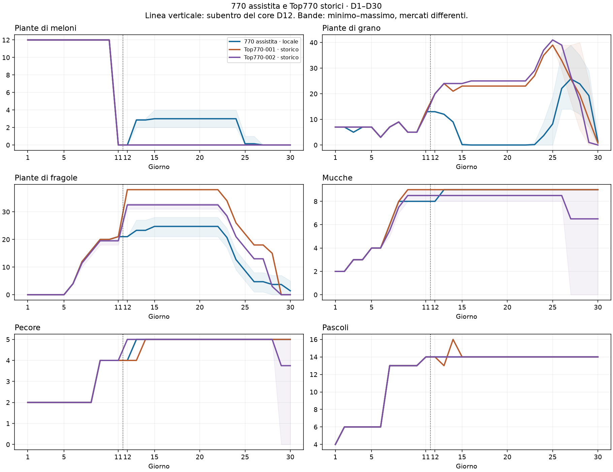
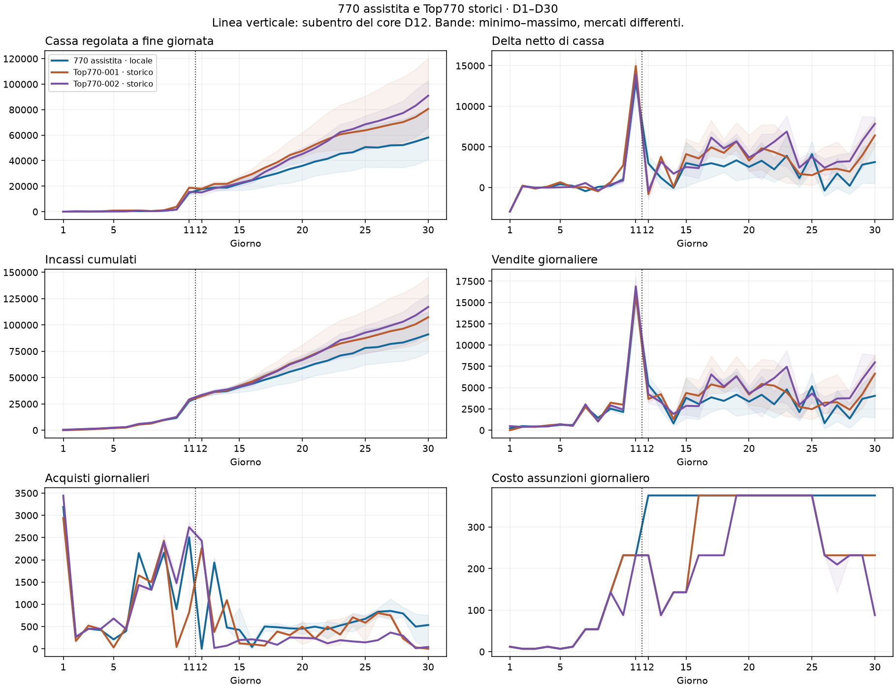
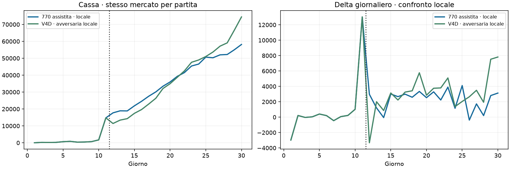
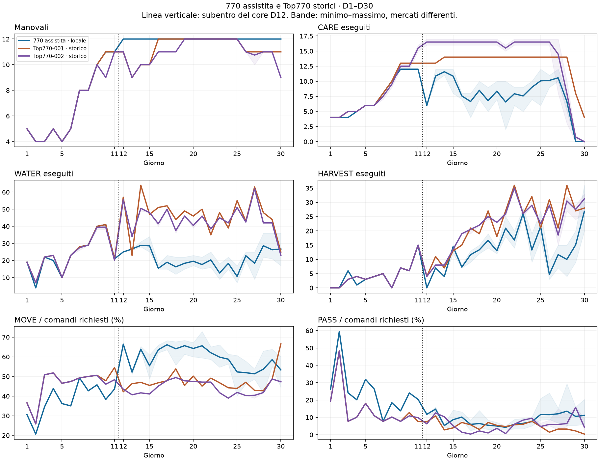

# Nuova 770 assistita rispetto ai Top770 · KPI D1–D30

**Candidata analizzata:** `submission_codex_e18_770_assisted_start_v1_candidate.py`, lo stesso file del test D11, senza modifiche. Guida V4D fino a D11; core parametrico V2 da D12.

## Risultato principale

L’avvio conserva il raccolto di D11. A fine partita la candidata raggiunge **58.157,8** di cassa media contro **74.445,4** della V4D avversaria (-21,9%; 0/14 vittorie locali). Il dato competitivo confrontabile è questo confronto diretto. Le curve Top descrivono invece traiettorie storiche in mercati e contro avversari diversi.

Il passaggio di controllo è il confine D11/D12, indicato nei grafici. L’esperimento estende esattamente i prefissi già verificati; le 264 azioni iniziali coincidono in tutte le 14 partite. Non si attribuisce automaticamente ogni divergenza successiva al solo cambio di controller: anche stato ereditato e interazioni di mercato contribuiscono.

## Traguardi produttivi e monetari

| KPI medio | 770 assistita, locale | Top770-001, storico | Top770-002, storico |
|---|---:|---:|---:|
| Meloni D1 | 12,0 | 12,0 | 12,0 |
| Fragole D10 | 20,0 | 20,0 | 19,5 |
| Delta di cassa D11 | 13.026,0 | 14.952,6 | 13.925,5 |
| Delta di cassa D12 | 2.967,1 | -820,2 | -435,2 |
| Fragole D15 | 24,7 | 38,0 | 32,5 |
| Fragole D20 | 24,7 | 38,0 | 32,5 |
| Mucche D20 | 9,0 | 9,0 | 8,5 |
| Mucche D30 | 9,0 | 9,0 | 6,5 |
| Pecore D30 | 5,0 | 5,0 | 3,8 |
| Cassa D30 — mercati differenti | 58.157,8 | 80.634,2 | 90.968,8 |

## D12–D30: utilizzo del capitale iniziale

Le differenze seguenti sono osservazioni sui campioni, non stime causali di superiorità rispetto ai Top.

- **D12:** fragole 21,0 / 38,0 / 32,5, mucche 8,0 / 9,0 / 8,5, manovali 12,0 / 11,0 / 11,0. Ordine: nuova 770 / Top001 / Top002.
- **D15:** fragole 24,7 / 38,0 / 32,5, mucche 9,0 / 9,0 / 8,5, manovali 12,0 / 10,0 / 10,0. Ordine: nuova 770 / Top001 / Top002.
- **D20:** fragole 24,7 / 38,0 / 32,5, mucche 9,0 / 9,0 / 8,5, manovali 12,0 / 12,0 / 12,0. Ordine: nuova 770 / Top001 / Top002.
- **D30:** fragole 1,4 / 0,0 / 0,0, mucche 9,0 / 9,0 / 6,5, manovali 12,0 / 11,0 / 9,0. Ordine: nuova 770 / Top001 / Top002.

### Lettura delle divergenze

**Il primo stacco produttivo è già a D12.** Le fragole della candidata passano da 21,0 a 21,0; Top001 passa da 21,0 a 38,0 e Top002 da 19,5 a 32,5. Il capitale iniziale è disponibile, ma l’espansione della produzione ricorrente procede diversamente.

**La composizione successiva si separa dai Top.** A D20 la nuova 770 ha 0,0 grani e 3,0 meloni; nei Top i grani sono 23,0 / 25,0 e i meloni 0,0 / 0,0. Questo cambia autoproduzione di mangime, durata dei cicli e fabbisogno di servizio.

**Anche il servizio agli animali cambia al passaggio.** CARE eseguiti a D12: 6,0 contro 13,0 / 16,5 nei Top. Le consistenze animali diverse richiedono cautela, ma il salto interno della candidata da D11 (12,0) segnala una continuità operativa da migliorare.

Il core registra in media 20.712,6 rifiuti nelle valutazioni di crescita per il certificato dei percorsi giornalieri e 64,1 missioni attive ai refresh. Sono contatori di valutazioni/eventi ripetuti, non altrettante opportunità economiche indipendenti. Insieme ai KPI suggeriscono di verificare il coordinamento di percorsi, servizi e nuove piantagioni; non dimostrano che basti allentare i vincoli.

**Priorità suggerita:** mantenere l’apertura D1–D11 e isolare il passaggio D12–D15: continuità di CARE, consegna delle scorte ereditate, ammissione delle fragole e uso delle nuove superfici. Verificare poi la resa e i ricavi per prodotto fino a D30. Evitare di ricopiare i volumi dei Top come obiettivi economici senza tener conto del mercato locale.

| Fase / serie | Vendite | Acquisti | Assunzioni | Terreni | Delta cassa | Fragole raccolte | Latte raccolto |
|---|---:|---:|---:|---:|---:|---:|---:|
| D1–D11 770 assistita · locale | 27.484,7 | 13.972,0 | 772,0 | 1.000,0 | 11.740,7 | 0,0 | 24,0 |
| D1–D11 Top770-001 · storico | 28.623,6 | 11.033,8 | 772,0 | 1.000,0 | 15.817,8 | 0,0 | 24,0 |
| D1–D11 Top770-002 · storico | 29.297,5 | 15.112,8 | 628,0 | 1.000,0 | 12.556,8 | 0,0 | 24,0 |
| D12–D20 770 assistita · locale | 31.409,1 | 4.778,9 | 3.384,0 | 2.000,0 | 21.246,3 | 63,7 | 81,5 |
| D12–D20 Top770-001 · storico | 38.586,2 | 5.222,4 | 2.486,0 | 2.000,0 | 28.877,8 | 80,0 | 111,0 |
| D12–D20 Top770-002 · storico | 37.440,8 | 3.690,8 | 2.054,0 | 2.000,0 | 29.696,0 | 78,0 | 105,0 |
| D21–D30 770 assistita · locale | 32.182,1 | 6.251,3 | 3.760,0 | 0,0 | 22.170,8 | 87,4 | 101,8 |
| D21–D30 Top770-001 · storico | 40.137,0 | 4.158,4 | 3.040,0 | 0,0 | 32.938,6 | 189,0 | 135,0 |
| D21–D30 Top770-002 · storico | 50.360,2 | 1.770,5 | 2.873,8 | 0,0 | 45.716,0 | 180,0 | 106,5 |

## Confronto locale di controllo contro V4D

Stessi 7 semi di sviluppo 180903001–180903007, entrambe le posizioni. V4D è l’avversaria effettiva, quindi domanda e offerta sono quelle della stessa partita. Le due curve partono dallo stesso risultato D11; questo confronto misura se il vantaggio iniziale viene mantenuto durante la continuazione.

| Seed / posizione | Nuova 770 | V4D avversaria | Delta | Missioni residue |
|---|---:|---:|---:|---:|
| 180903001 / 0 | 77.505,0 | 88.805,0 | -11.300,0 | 0 |
| 180903001 / 1 | 77.505,0 | 88.805,0 | -11.300,0 | 0 |
| 180903002 / 0 | 74.344,0 | 102.834,0 | -28.490,0 | 0 |
| 180903002 / 1 | 75.990,0 | 102.418,0 | -26.428,0 | 0 |
| 180903003 / 0 | 43.077,0 | 51.009,0 | -7.932,0 | 0 |
| 180903003 / 1 | 41.969,0 | 51.109,0 | -9.140,0 | 0 |
| 180903004 / 0 | 42.256,0 | 54.331,0 | -12.075,0 | 0 |
| 180903004 / 1 | 41.043,0 | 53.043,0 | -12.000,0 | 0 |
| 180903005 / 0 | 79.594,0 | 97.325,0 | -17.731,0 | 0 |
| 180903005 / 1 | 79.594,0 | 97.325,0 | -17.731,0 | 0 |
| 180903006 / 0 | 41.332,0 | 52.889,0 | -11.557,0 | 0 |
| 180903006 / 1 | 41.332,0 | 52.889,0 | -11.557,0 | 0 |
| 180903007 / 0 | 49.334,0 | 74.727,0 | -25.393,0 | 0 |
| 180903007 / 1 | 49.334,0 | 74.727,0 | -25.393,0 | 0 |

## Lavoro, servizi e chiusura

Errori registrati dal core: **0**. Morti di colture per mancata irrigazione: **0**; fughe di animali: **0**. Partite con missioni residue al termine: **0/14**. Il conteggio delle missioni non misura da solo il valore economico lasciato in campo.

Topologie finali osservate: {"{'Q0': 7, 'Q1': 7, 'Q2': 0, 'Q3': 0}": 14}.

Le azioni di servizio sono esecuzioni effettive ricostruite dal motore. MOVE e PASS sono quote dei comandi richiesti: non equivalgono automaticamente a spreco, perché dipendono anche da percorsi e disponibilità del lavoro.

| Serie | Scorte nel deposito a D30 | Scorte trasportate a D30 | Produzione rimasta sulle caselle |
|---|---|---|---|
| 770 assistita · locale | CARROT: 1,4, FERTILIZER: 1,4, MILK: 0,3, WHEAT: 9,1, WOOL: 0,5 | CARROT: 0,3, WHEAT: 22,9 | CARROT: 4,1, MILK: 2,6, WHEAT: 4,4, WOOL: 1,4 |
| Top770-001 · storico | WHEAT: 1,0 | FERTILIZER: 12,0 | CARROT: 1,2, WHEAT: 0,8 |
| Top770-002 · storico | 0 | 0 | 0 |
| V4D · avversaria locale | SHEEP: 1,0 | 0 | WHEAT: 0,9 |

## KPI giornalieri D1–D30

Ogni cella contiene **770 assistita / Top001 / Top002**. Cassa dopo il regolamento di tutti i batch del giorno; gli altri stock sono al checkpoint D×24−1, prima del refresh (D30 terminale).

| Giorno | Cassa | Fragole | Mucche | Manovali | CARE | WATER | HARVEST |
|---|---:|---:|---:|---:|---:|---:|---:|
| 1 | 22,0 / 46,0 / 25,2 | 0,0 / 0,0 / 0,0 | 2,0 / 2,0 / 2,0 | 5,0 / 5,0 / 5,0 | 4,0 / 4,0 / 4,0 | 19,0 / 19,0 / 19,0 | 0,0 / 0,0 / 0,0 |
| 2 | 237,0 / 261,6 / 147,5 | 0,0 / 0,0 / 0,0 | 2,0 / 2,0 / 2,0 | 4,0 / 4,0 / 4,0 | 4,0 / 4,0 / 4,0 | 4,0 / 7,0 / 7,0 | 0,0 / 0,0 / 0,0 |
| 3 | 201,0 / 125,2 / 141,0 | 0,0 / 0,0 / 0,0 | 3,0 / 3,0 / 3,0 | 4,0 / 4,0 / 4,0 | 4,0 / 5,0 / 5,0 | 22,0 / 22,0 / 22,0 | 6,0 / 3,0 / 3,0 |
| 4 | 243,6 / 242,2 / 122,8 | 0,0 / 0,0 / 0,0 | 3,0 / 3,0 / 3,0 | 5,0 / 5,0 / 5,0 | 5,0 / 5,0 / 5,0 | 20,0 / 23,0 / 23,0 | 1,0 / 4,0 / 4,0 |
| 5 | 650,3 / 894,0 / 150,0 | 0,0 / 0,0 / 0,0 | 4,0 / 4,0 / 4,0 | 4,0 / 4,0 / 4,0 | 6,0 / 6,0 / 6,0 | 10,0 / 10,0 / 10,0 | 3,0 / 3,0 / 3,0 |
| 6 | 850,4 / 911,4 / 210,0 | 4,0 / 4,0 / 4,0 | 4,0 / 4,0 / 4,0 | 5,0 / 5,0 / 5,0 | 6,0 / 6,0 / 6,0 | 23,0 / 23,0 / 23,0 | 4,0 / 4,0 / 4,0 |
| 7 | 396,9 / 950,6 / 761,0 | 12,0 / 12,0 / 11,5 | 6,0 / 6,0 / 5,5 | 8,0 / 8,0 / 8,0 | 8,0 / 8,0 / 7,5 | 28,0 / 28,0 / 27,5 | 5,0 / 5,0 / 5,0 |
| 8 | 466,4 / 478,4 / 401,2 | 16,0 / 16,0 / 15,5 | 8,0 / 8,0 / 7,5 | 8,0 / 8,0 / 8,0 | 10,0 / 10,0 / 9,5 | 29,0 / 29,0 / 29,0 | 0,0 / 0,0 / 0,0 |
| 9 | 694,1 / 1.145,0 / 771,5 | 20,0 / 20,0 / 19,5 | 8,0 / 9,0 / 8,5 | 10,0 / 10,0 / 10,0 | 12,0 / 13,0 / 12,5 | 40,0 / 40,0 / 39,5 | 7,0 / 7,0 / 7,0 |
| 10 | 1.714,7 / 3.865,2 / 1.631,2 | 20,0 / 20,0 / 19,5 | 8,0 / 9,0 / 8,5 | 11,0 / 11,0 / 9,0 | 12,0 / 13,0 / 12,5 | 41,0 / 41,0 / 39,5 | 6,0 / 6,0 / 6,0 |
| 11 | 14.740,7 / 18.817,8 / 15.556,8 | 21,0 / 21,0 / 19,5 | 8,0 / 9,0 / 8,5 | 11,0 / 11,0 / 11,0 | 12,0 / 13,0 / 15,5 | 21,0 / 21,0 / 20,0 | 15,0 / 15,0 / 15,0 |
| 12 | 17.707,9 / 17.997,6 / 15.121,5 | 21,0 / 38,0 / 32,5 | 8,0 / 9,0 / 8,5 | 12,0 / 11,0 / 11,0 | 6,0 / 13,0 / 16,5 | 25,0 / 57,0 / 55,5 | 0,0 / 4,0 / 4,0 |
| 13 | 18.911,0 / 21.760,6 / 18.307,0 | 23,3 / 38,0 / 32,5 | 9,0 / 9,0 / 8,5 | 12,0 / 9,0 / 9,0 | 10,9 / 13,0 / 16,5 | 26,7 / 23,0 / 34,0 | 7,0 / 11,0 / 8,0 |
| 14 | 18.855,9 / 21.828,0 / 20.005,0 | 23,3 / 38,0 / 32,5 | 9,0 / 9,0 / 8,5 | 12,0 / 10,0 / 10,0 | 11,6 / 14,0 / 16,5 | 28,9 / 64,0 / 50,5 | 4,0 / 7,0 / 8,0 |
| 15 | 21.864,9 / 25.938,0 / 22.528,0 | 24,7 / 38,0 / 32,5 | 9,0 / 9,0 / 8,5 | 12,0 / 10,0 / 10,0 | 10,9 / 14,0 / 16,5 | 28,6 / 47,0 / 48,0 | 14,4 / 13,0 / 13,5 |
| 16 | 24.532,1 / 29.514,8 / 24.910,2 | 24,7 / 38,0 / 32,5 | 9,0 / 9,0 / 8,5 | 12,0 / 12,0 / 11,0 | 7,6 / 14,0 / 16,5 | 15,4 / 51,0 / 41,5 | 7,3 / 15,0 / 19,0 |
| 17 | 27.522,5 / 34.446,0 / 31.060,8 | 24,7 / 38,0 / 32,5 | 9,0 / 9,0 / 8,5 | 12,0 / 12,0 / 11,0 | 6,6 / 14,0 / 16,5 | 19,0 / 52,0 / 50,0 | 11,6 / 21,0 / 20,5 |
| 18 | 30.110,1 / 38.713,8 / 35.874,8 | 24,7 / 38,0 / 32,5 | 9,0 / 9,0 / 8,5 | 12,0 / 12,0 / 11,0 | 8,5 / 14,0 / 16,5 | 16,3 / 44,0 / 37,5 | 13,4 / 19,0 / 22,0 |
| 19 | 33.452,9 / 44.382,0 / 41.558,2 | 24,7 / 38,0 / 32,5 | 9,0 / 9,0 / 8,5 | 12,0 / 12,0 / 12,0 | 6,8 / 14,0 / 16,5 | 18,4 / 49,0 / 46,0 | 16,6 / 27,0 / 25,0 |
| 20 | 35.987,0 / 47.695,6 / 45.252,8 | 24,7 / 38,0 / 32,5 | 9,0 / 9,0 / 8,5 | 12,0 / 12,0 / 12,0 | 8,4 / 14,0 / 16,5 | 19,6 / 46,0 / 40,5 | 13,0 / 18,0 / 23,0 |
| 21 | 39.278,4 / 52.525,8 / 49.816,8 | 24,7 / 38,0 / 32,5 | 9,0 / 9,0 / 8,5 | 12,0 / 12,0 / 12,0 | 6,6 / 14,0 / 15,5 | 17,6 / 50,0 / 46,0 | 20,9 / 27,0 / 26,0 |
| 22 | 41.509,1 / 56.884,4 / 55.446,5 | 24,7 / 38,0 / 32,5 | 9,0 / 9,0 / 8,5 | 12,0 / 12,0 / 12,0 | 7,9 / 14,0 / 16,5 | 20,4 / 35,0 / 38,5 | 16,8 / 36,0 / 35,0 |
| 23 | 45.411,6 / 60.627,4 / 62.331,8 | 20,7 / 34,0 / 28,5 | 9,0 / 9,0 / 8,5 | 12,0 / 12,0 / 12,0 | 7,6 / 14,0 / 16,5 | 12,7 / 48,0 / 45,0 | 26,1 / 26,0 / 26,0 |
| 24 | 46.563,0 / 62.295,8 / 64.774,8 | 12,7 / 26,0 / 21,0 | 9,0 / 9,0 / 8,5 | 12,0 / 12,0 / 12,0 | 9,0 / 14,0 / 16,5 | 18,3 / 39,0 / 42,0 | 13,3 / 32,0 / 29,0 |
| 25 | 50.671,7 / 63.810,6 / 68.556,5 | 8,7 / 22,0 / 17,0 | 9,0 / 9,0 / 8,5 | 12,0 / 12,0 / 12,0 | 10,1 / 14,0 / 16,5 | 10,7 / 55,0 / 51,0 | 21,5 / 21,0 / 22,5 |
| 26 | 50.292,5 / 66.006,4 / 70.979,8 | 4,7 / 18,0 / 13,0 | 9,0 / 9,0 / 8,5 | 12,0 / 11,0 / 11,0 | 10,1 / 14,0 / 16,5 | 22,8 / 43,0 / 42,5 | 4,7 / 31,0 / 29,0 |
| 27 | 52.015,4 / 68.308,6 / 74.129,2 | 4,7 / 18,0 / 13,0 | 9,0 / 9,0 / 6,5 | 12,0 / 11,0 / 10,8 | 10,6 / 14,0 / 14,5 | 18,4 / 63,0 / 62,0 | 11,6 / 21,0 / 18,5 |
| 28 | 52.221,1 / 70.260,4 / 77.363,5 | 3,7 / 15,0 / 3,0 | 9,0 / 9,0 / 6,5 | 12,0 / 11,0 / 11,0 | 6,6 / 14,0 / 8,0 | 28,6 / 48,0 / 42,0 | 10,0 / 36,0 / 30,5 |
| 29 | 55.028,6 / 74.221,4 / 83.123,2 | 3,7 / 0,0 / 0,0 | 9,0 / 9,0 / 6,5 | 12,0 / 11,0 / 11,0 | 0,0 / 8,0 / 0,8 | 26,3 / 44,0 / 42,0 | 15,1 / 27,0 / 27,5 |
| 30 | 58.157,8 / 80.634,2 / 90.968,8 | 1,4 / 0,0 / 0,0 | 9,0 / 9,0 / 6,5 | 12,0 / 11,0 / 9,0 | 0,0 / 4,0 / 0,0 | 26,7 / 25,0 / 23,0 | 26,9 / 28,0 / 31,2 |

## Provenienza e limiti

- Nuova 770: 14 partite complete nel motore reale, orizzonte 720 step e 719 batch. Riconciliazione contabile di entrambi i lati e verifica delle perdite biologiche.
- Top770-001: gli stessi cinque replay 105405557, 105384058, 105398563, 105391568, 105565293.
- Top770-002: gli stessi quattro replay 106077622, 106076806, 106073019, 106064835. Il quinto replay 10–7–0 resta escluso secondo il criterio topologico precedente.
- I Top sono campioni già utilizzati, non nuovi holdout. Nessun nuovo episodio esterno acquisito e nessuna submission effettuata.
- I corpus esterni differiscono per semi, avversari, mercati e composizione: Top002 usa anche oche. Le differenze monetarie tra corpus non costituiscono una classifica.
- L’etichetta Top770 identifica i corpus e la configurazione finale selezionata, non garantisce 14 pascoli in ogni istante: le curve riportano anche le deviazioni transitorie effettivamente osservate.
- Cassa giornaliera ricostruita dai flussi e riconciliata alla chiusura; bande dei grafici minimo–massimo, non intervalli di confidenza.
- Il confronto non modifica il codice. Le priorità di intervento vanno decise dai risultati della continuazione, senza rimettere in discussione l’apertura già verificata salvo nuove evidenze.

[Aggregati giornalieri](aggregati.json) · [Sintesi numerica](summary.json) · [Manifest delle fonti](manifest.json).
