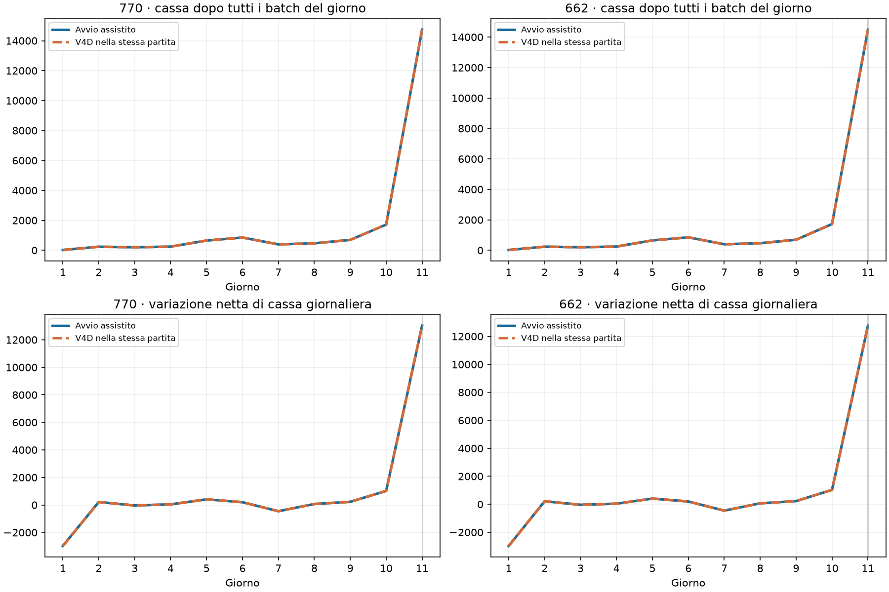

# Avvio assistito comune · E18 770 ed E19 662

## Obiettivo e natura della prova

Recuperare il raccolto e il salto di cassa di D11. La prima versione usa **V4D come guida esecutiva fino alla fine di D11**, con un filtro delle costruzioni basato sulle capacità del profilo. Da D12 subentra il core parametrico V2 comune, senza riavviare il bootstrap grano/carote. È una variante ibrida esplicita: il risultato non dimostra ancora che l’allocatore autonomo abbia imparato questa apertura.

Il riferimento operativo è la V4D campione; il precedente confronto V4C/Top770 ha fornito la lettura dell’apertura. Non viene eseguito il piano storico oltre D11.

## Risultati locali

14 partite per target: semi di sviluppo 180903001–180903007, entrambe le posizioni, contro V4D. Ogni partita conserva l’orizzonte del motore a 720 step e termina la misura dopo 264 batch, con tutti i flussi di D11 regolati. Non sono punteggi finali né benchmark esterni.

| KPI medio | 770 assistita | V4D contro 770 | 662 assistita | V4D contro 662 |
|---|---:|---:|---:|---:|
| Cassa a chiusura D11 | 14.740,7 | 14.740,7 | 14.489,6 | 14.489,6 |
| Delta netto di cassa D11 | 13.026,0 | 13.026,0 | 12.766,6 | 12.766,6 |
| Meloni raccolti a D11, unità | 72,0 | 72,0 | 72,0 | 72,0 |
| Meloni venduti a D11, unità | 54,0 | 54,0 | 54,0 | 54,0 |
| Ricavo meloni D11 | 12.124,0 | 12.124,0 | 12.124,0 | 12.124,0 |
| Piante di fragola a D10 | 20,0 | 20,0 | 20,0 | 20,0 |

Il rapporto fra delta netto assistito e V4D **nella stessa partita** è 100,0% per 770 e 100,0% per 662. Nei precedenti test il delta D11 dei core V2 era rispettivamente 91,1 e 152,4: quei numeri descrivono il vecchio avvio, ma provengono da mercati diversi.

Il ricavo storico di circa 14.797 sui meloni non è un importo invariabile da imporre: con due aperture produttive cambia il mercato. Qui ciascun lato vende 54 delle 72 unità raccolte entro D11, contro le 60 vendute dalla V4D nei precedenti confronti; cambiano quindi sia quantità monetizzata sia prezzi. Il criterio pertinente è conservare produzione e monetizzazione e confrontare il delta con V4D nello stesso mercato.

## Come funziona l’assistenza

- D1: portafoglio iniziale storico di 12 meloni e 7 grani, con 2 mucche e 2 pecore; la guida coordina acquisti, assunzioni e percorsi.
- D2–D10: servizi al ciclo iniziale, crescita degli animali e progressiva introduzione delle fragole secondo la guida, con limiti di pascolo osservati.
- D11: raccolta e vendita; il filtro impedisce i pascoli eccedenti e i pollai, estranei ai profili 770/662.
- D12: subentro del core comune su risorse e inventari realmente osservati. È verificata solo la prima chiamata dell’interfaccia, non la bontà economica della continuazione.

Il filtro riserva anche le costruzioni simultanee dello stesso batch. A 662 evita il settimo pascolo di Q1 e quello di Q0; a 770 questi rientrano nel budget. Non sono richiesti il completamento di 770/662 o l’espansione del terzo quadrante entro D11.

## Verifiche e limiti

- Banco di prova riconciliato con quattro prefissi già consolidati: entrambi i target e le posizioni, tutti i KPI e i flussi di entrambe le fattorie.
- 28 partite, 264 batch ciascuna: riconciliazione della cassa, vincoli di pascolo a ogni stato, parità di 265 azioni fra sorgente e file candidato, inclusa la prima chiamata D12.
- Tre test unitari: prenotazioni simultanee, capacità parametrica e confine del passaggio D11/D12.
- Sono semi di sviluppo già utilizzati. Il governatore resta dipendente dalla guida storica; robustezza fuori campione e prosecuzione oltre D11 non sono valutate.
- Le candidate sono locali e non pubblicate. La V4D competitiva rimane invariata.

## Indicazione per il prossimo sviluppo

Conservare questa apertura assistita come controllo positivo. Per rendere autonoma la governance, sostituire progressivamente le decisioni della guida mantenendo i traguardi osservati: completamento dei 12 meloni entro D1, servizi sufficienti alla resa di 72 unità a D11, grano di servizio e passaggio alle fragole. Il rilascio della guida va verificato separatamente: un buon avvio, da solo, non certifica la capacità del core di sfruttare il capitale dopo D11.

Topologia dei pascoli osservata a D11 nella candidata 770: `{'Q0': 7, 'Q1': 7, 'Q2': 0, 'Q3': 0}`. Fughe di animali nel prefisso: 0.

Topologia dei pascoli osservata a D11 nella candidata 662: `{'Q0': 6, 'Q1': 6, 'Q2': 0, 'Q3': 0}`. Fughe di animali nel prefisso: 0.
