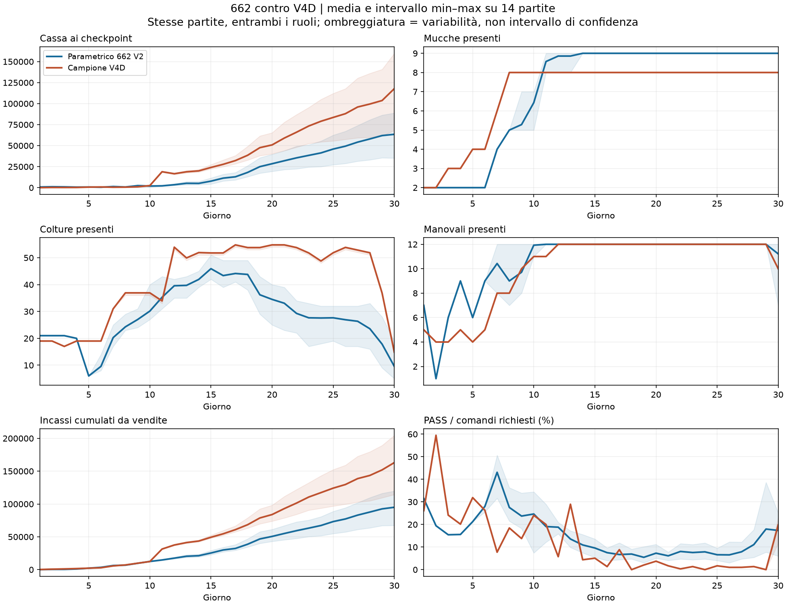
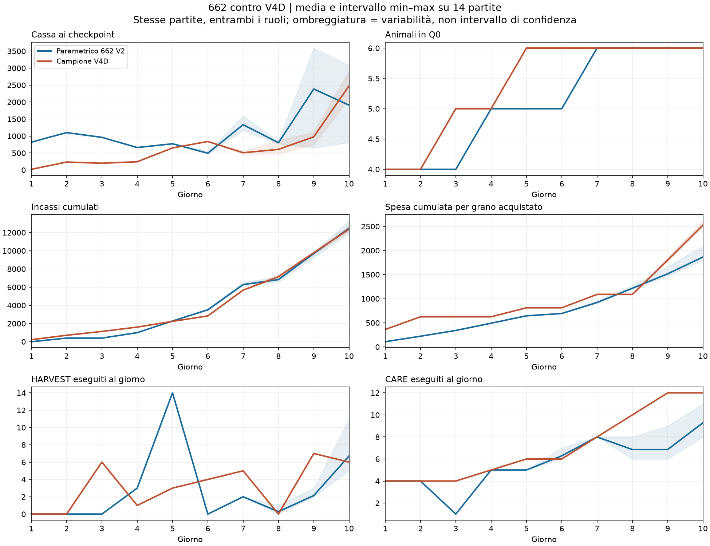
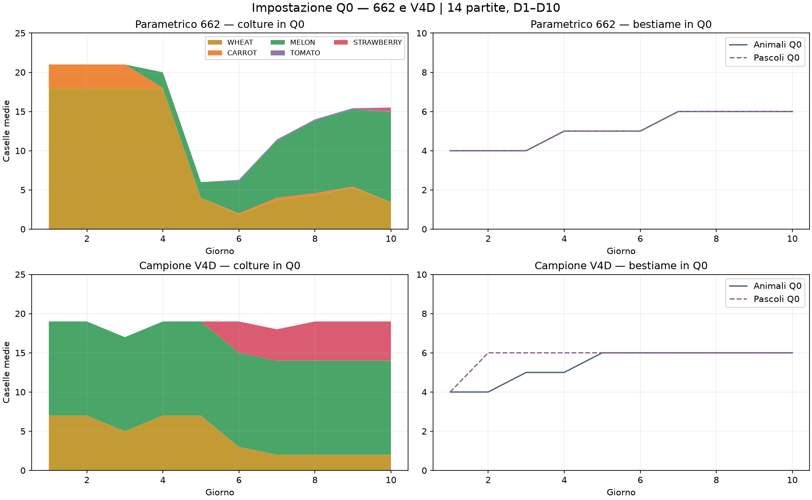
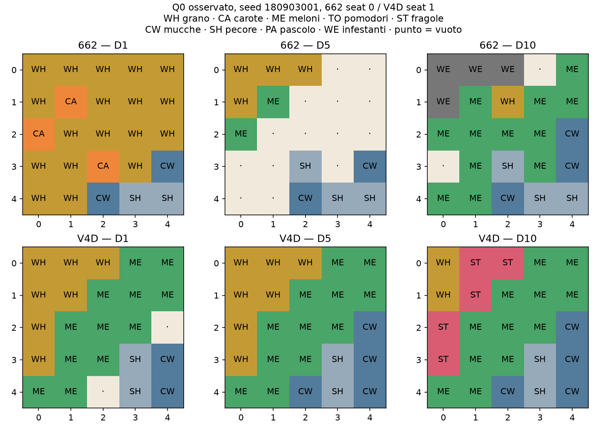

# KPI del parametrico 662 V2 rispetto al campione E18.2 V4D

Confronto locale riprodotto il 2026-09-07. Due lati delle stesse 14 partite: sette seed development, entrambi i ruoli. Nessuna modifica alle strategie e nessun nuovo campione esterno consumato.

Il parametrico termina con cassa media **63.487**, contro **117.808** della V4D. Le 14 partite sono tutte sconfitte. Il riferimento è il campione effettivo, non un altro core parametrico.

## Lettura dei risultati e ipotesi Q0

**L’ipotesi di un avvio Q0 inadeguato è sostenuta dai dati, ma non ancora dimostrata come unica causa del divario.** Il deficit finale medio è -46,1% nel confronto diretto con la V4D.

Il bootstrap attuale è già pilotato: ammette solo WHEAT/CARROT e mantiene il tetto 2 COW/2 SHEEP fino a `first_confirmed_crop_harvest`. Questa guida impedisce proprio il portafoglio iniziale usato dal campione. Non basta quindi aggiungere più vincoli: occorre cambiare quelli economici e verificare l’effetto separatamente.

| Evidenza | Parametrico | V4D nella stessa partita |
|---|---:|---:|
| Meloni Q0 D1, media | 0,0 | 12,0 |
| Grano Q0 D1, media | 18,0 | 7,0 |
| COW D5, media | 2,0 | 4,0 |
| Primo raccolto meloni, giorno mediano (min–max) | 16,0 (16–16) | 11,0 (11–11) |
| Fragole D10, caselle medie | 1,0 | 19,9 |
| Vendite cumulate D15, media | 25.365 | 49.356 |
| Costo manovali D1–D10, media | 1.177 | 540 |

La maggiore liquidità iniziale del parametrico non è un vantaggio sufficiente: il campione investe prima nei meloni e prepara prima le fragole. Il ritardo dei raccolti osservato rende plausibile una propagazione del ritardo verso incassi e reinvestimenti. Anche la composizione successiva diverge: la sola correzione di D1 potrebbe non recuperare tutta la stagione.

**Controevidenza da conservare:** la vecchia variante E18 V19 (profilo V7, pesi grano:meloni 1:2) era già stata respinta: quattro casi, cassa 60.828 contro E18.16 e 57.245 contro E18.2, in entrambi i ruoli. Nel primo caso piantava già 10 meloni D1 e arrivava a 12 D2, ma D10 aveva 23 meloni, 11 grani e soltanto 1 fragola. È un core precedente, quindi non un’ablation causale di questa V2; dimostra però che ripetere soltanto il cambio dei pesi iniziali non è una soluzione già validata. Fonte: [gate V19](../../../e18/artifacts/derived/E18_CLOSEOUT_GATE_V19_INITIAL_PORTFOLIO_20260907.json) e [worklog E18](../../../e18/reports/E18_PARAMETRIC_RELEASE_WORKLOG_20260907_IT.md).

### Scomposizione contabile del divario finale

Differenze medie di contributo alla cassa: parametrico meno V4D. Un numero positivo aiuta il parametrico. Vendite e acquisti sono lordi: per esempio comprare e rivendere grano non va contato come ricavo netto.

| Componente | Contributo al divario |
|---|---:|
| Vendite | -68.033,9 |
| Acquisti | 14.667,2 |
| Manovali | -954,4 |
| Terreni | -0,0 |
| Operazioni sulle caselle | 0,0 |
| **Totale cassa finale** | **-54.321,1** |

### Guida iniziale da sottoporre a prova

1. Usare il portafoglio Q0 della V4D come ipotesi di partenza: 12 meloni, 7 grani e 2 COW/2 SHEEP iniziali, subordinati a budget e certificazione delle cure. Sono quantità osservate nel campione, non nuovi obiettivi già validati per ogni geometria.
2. Riservare esplicitamente capitale e capacità di lavoro per quel portafoglio; impedire che grano opportunistico riempia tutta Q0. Portare l’obiettivo di lavoro dai compiti effettivi, confrontando il costo con la V4D.
3. Verificare una transizione osservabile verso il portafoglio successivo, incluse mucche e fragole. Il primo raccolto di una coltura veloce, da solo, non certifica che l’impostazione economica sia quella desiderata.
4. Isolare gli effetti: A = core congelato; B = solo mix iniziale corretto; C = solo crescita bestiame/lavoro corretta; D = combinazione dopo aver misurato B e C. Stessi avversari, entrambi i ruoli, più campione non usato nel tuning prima di una promozione.
5. Mantenere V4D come gate competitivo. Richiedere sicurezza, flussi di cassa riconciliati e risultati diretti competitivi; non promuovere una variante perché batte soltanto la 770 o la 662 deboli.

**In questo lavoro non sono state modificate né pubblicate strategie.** Le proposte sono esperimenti da progettare dopo questi report.

## Metodo e perimetro

- Modello: `submission/submission_codex_e19_1_662_v2.py`. Profilo iniziale e core congelati V2; per 770 si usa il controllo sullo stesso core della E19 V2, non la vecchia E18 V24.
- Campione: `submission/submission_codex_e18_2_capacity_governed_v4d.py`, invariato.
- Seed 180903001–180903007, seat 0 e 1. Ogni partita riproduce hash di tutte le azioni e ricavi finali del gate precedente.
- Cassa di entrambi i giocatori ricostruita dal motore per 719 batch per partita; nessuna discrepanza ammessa.
- Stock e Q0 ai checkpoint indice D×24−1: ultima osservazione prima del refresh, con D30 terminale. I flussi giornalieri coprono tutti i batch del giorno: possono includere un batch successivo al checkpoint dello stock.
- Curve = medie; bande = minimo/massimo, non intervalli di confidenza. Q0 = quadrante NW, coordinate x,y da 0 a 4. Mappe = un caso dichiarato, non una configurazione media.
- Le due serie V4D dei due report sono i rispettivi avversari effettivi: non vanno unite fingendo identiche condizioni di mercato. Il test descrive differenze; non identifica da solo una causa.

## Avvio D1–D10

| Giorno | Cassa param./V4D | COW param./V4D | SHEEP param./V4D | Colture param./V4D | Manovali param./V4D | Incassi cumulati param./V4D |
|---|---:|---:|---:|---:|---:|---:|
| 1 | 819,0 / 20,0 | 2,0 / 2,0 | 2,0 / 2,0 | 21,0 / 19,0 | 7,0 / 5,0 | 0,0 / 224,0 |
| 2 | 1.102,0 / 235,0 | 2,0 / 2,0 | 2,0 / 2,0 | 21,0 / 19,0 | 1,0 / 4,0 | 398,0 / 709,0 |
| 3 | 962,0 / 200,0 | 2,0 / 3,0 | 2,0 / 2,0 | 21,0 / 17,0 | 6,0 / 4,0 | 398,0 / 1.131,0 |
| 4 | 662,4 / 244,0 | 2,0 / 3,0 | 3,0 / 2,0 | 20,0 / 19,0 | 9,0 / 5,0 | 996,4 / 1.607,0 |
| 5 | 772,4 / 649,9 | 2,0 / 4,0 | 3,0 / 2,0 | 6,0 / 19,0 | 6,0 / 4,0 | 2.280,0 / 2.237,0 |
| 6 | 495,0 / 840,3 | 2,0 / 4,0 | 5,0 / 2,0 | 9,6 / 19,0 | 9,0 / 5,0 | 3.508,3 / 2.839,4 |
| 7 | 1.335,3 / 509,1 | 4,0 / 6,0 | 5,0 / 2,0 | 20,3 / 31,0 | 10,4 / 8,0 | 6.285,9 / 5.671,4 |
| 8 | 804,1 / 608,0 | 5,0 / 8,0 | 5,0 / 2,0 | 24,3 / 36,9 | 9,0 / 8,0 | 6.832,3 / 7.153,3 |
| 9 | 2.385,4 / 978,3 | 5,3 / 8,0 | 5,0 / 4,0 | 27,0 / 36,9 | 9,7 / 10,0 | 9.697,7 / 9.788,0 |
| 10 | 1.909,1 / 2.480,6 | 6,4 / 8,0 | 5,0 / 4,0 | 30,1 / 36,9 | 11,9 / 11,0 | 12.479,1 / 12.374,4 |

## Q0: composizione e geometria

| Giorno / modello | Grano Q0 | Carote Q0 | Meloni Q0 | Pomodori Q0 | Fragole Q0 | Animali Q0 |
|---|---:|---:|---:|---:|---:|---:|
| D1 662 | 18,0 | 3,0 | 0,0 | 0,0 | 0,0 | 4,0 |
| D1 V4D | 7,0 | 0,0 | 12,0 | 0,0 | 0,0 | 4,0 |
| D3 662 | 18,0 | 3,0 | 0,0 | 0,0 | 0,0 | 4,0 |
| D3 V4D | 5,0 | 0,0 | 12,0 | 0,0 | 0,0 | 5,0 |
| D5 662 | 4,0 | 0,0 | 2,0 | 0,0 | 0,0 | 5,0 |
| D5 V4D | 7,0 | 0,0 | 12,0 | 0,0 | 0,0 | 6,0 |
| D7 662 | 3,7 | 0,3 | 7,3 | 0,1 | 0,0 | 6,0 |
| D7 V4D | 2,0 | 0,0 | 12,0 | 0,0 | 4,0 | 6,0 |
| D10 662 | 3,4 | 0,0 | 11,5 | 0,1 | 0,4 | 6,0 |
| D10 V4D | 2,0 | 0,0 | 12,0 | 0,0 | 5,0 | 6,0 |

## Impiego del capitale e vendite

Valori cumulati medi, su giornate complete. La voce operazioni sulle caselle include costruzioni e altri effetti monetari delle azioni.

| Termine / modello | Vendite | Acquisti totali | Animali | Semi | Grano comprato | Manovali | Terreni | Operazioni caselle (saldo) | Cassa riconciliata |
|---|---:|---:|---:|---:|---:|---:|---:|---:|---:|
| D1 662 | 0 | 2.148 | 1.800 | 240 | 108 | 33 | 0 | 0 | 819 |
| D1 V4D | 224 | 3.192 | 1.800 | 1.030 | 362 | 12 | 0 | 0 | 20 |
| D5 662 | 2.280 | 3.346 | 2.300 | 400 | 646 | 162 | 1.000 | 0 | 772 |
| D5 V4D | 2.237 | 4.542 | 2.600 | 1.130 | 812 | 45 | 0 | 0 | 650 |
| D10 662 | 12.479 | 9.273 | 5.071 | 2.336 | 1.865 | 1.177 | 3.000 | 0 | 2.030 |
| D10 V4D | 12.374 | 11.354 | 5.200 | 3.270 | 2.528 | 540 | 1.000 | 0 | 2.481 |
| D20 662 | 50.613 | 17.042 | 6.100 | 4.650 | 6.292 | 4.937 | 3.000 | 0 | 28.634 |
| D20 V4D | 83.915 | 28.448 | 9.000 | 6.320 | 11.634 | 4.156 | 3.000 | 0 | 51.311 |
| D30 662 | 95.016 | 22.891 | 6.100 | 4.746 | 12.045 | 8.637 | 3.000 | 0 | 63.487 |
| D30 V4D | 163.049 | 37.558 | 9.000 | 6.980 | 19.587 | 7.683 | 3.000 | 0 | 117.808 |

### Origine degli incassi nella stagione

Vendite lorde medie per prodotto. Il grano comprende compravendite, non solo produzione propria; confrontarlo insieme alla spesa per grano della tabella precedente.

| Prodotto | Parametrico | V4D | Differenza |
|---|---:|---:|---:|
| WHEAT | 3.004 | 16.625 | -13.622 |
| CARROT | 801 | 0 | 801 |
| MELON | 13.830 | 17.516 | -3.686 |
| TOMATO | 4.083 | 0 | 4.083 |
| STRAWBERRY | 21.531 | 43.771 | -22.240 |
| MILK | 24.110 | 36.544 | -12.434 |
| WOOL | 17.420 | 30.727 | -13.306 |
| FERTILIZER | 10.236 | 16.701 | -6.465 |

### Composizione produttiva dopo l’avvio

| Giorno / modello | Grano | Carote | Meloni | Pomodori | Fragole | COW | SHEEP |
|---|---:|---:|---:|---:|---:|---:|---:|
| D10 662 | 5,3 | 0,0 | 22,3 | 1,6 | 1,0 | 6,4 | 5,0 |
| D10 V4D | 5,0 | 0,0 | 12,0 | 0,0 | 19,9 | 8,0 | 4,0 |
| D15 662 | 0,6 | 0,0 | 23,2 | 3,0 | 19,1 | 9,0 | 5,0 |
| D15 V4D | 14,0 | 0,0 | 8,0 | 0,0 | 29,8 | 8,0 | 10,0 |
| D20 662 | 0,0 | 0,0 | 7,8 | 7,6 | 19,1 | 9,0 | 5,0 |
| D20 V4D | 9,0 | 0,0 | 8,0 | 0,0 | 37,8 | 8,0 | 10,0 |
| D25 662 | 2,4 | 0,0 | 0,0 | 6,1 | 19,1 | 9,0 | 5,0 |
| D25 V4D | 31,0 | 0,0 | 0,0 | 0,0 | 20,9 | 8,0 | 10,0 |
| D30 662 | 0,0 | 0,2 | 0,0 | 1,4 | 7,9 | 9,0 | 5,0 |
| D30 V4D | 1,0 | 0,0 | 0,0 | 0,0 | 13,9 | 8,0 | 10,0 |

### Stato finale e controlli

| Modello | Pascoli Q0/Q1/Q2/Q3 medi | Perdite colture totali | Fughe animali totali |
|---|---|---:|---:|
| 662 | 6,0/6,0/2,0/0,0 | 0 | 0 |
| V4D | 7,0/7,0/5,0/0,0 | 308 | 0 |

## Trend completo D1–D30

| Giorno | Cassa param./V4D | FEED param./V4D | CARE param./V4D | WATER param./V4D | HARVEST param./V4D | MOVE param./V4D | PASS % param./V4D |
|---|---:|---:|---:|---:|---:|---:|---:|
| 1 | 819,0 / 20,0 | 4,0 / 2,0 | 4,0 / 4,0 | 21,0 / 19,0 | 0,0 / 0,0 | 58,0 / 41,0 | 31,5 / 26,1 |
| 2 | 1.102,0 / 235,0 | 4,0 / 4,0 | 4,0 / 4,0 | 0,0 / 4,0 | 0,0 / 0,0 | 9,0 / 24,0 | 19,4 / 59,5 |
| 3 | 962,0 / 200,0 | 4,0 / 4,0 | 1,0 / 4,0 | 21,0 / 22,0 | 0,0 / 6,0 | 72,0 / 40,0 | 15,4 / 24,1 |
| 4 | 662,4 / 244,0 | 5,0 / 3,0 | 5,0 / 5,0 | 23,0 / 20,0 | 3,0 / 1,0 | 85,0 / 61,0 | 15,6 / 20,1 |
| 5 | 772,4 / 649,9 | 5,0 / 5,0 | 5,0 / 6,0 | 18,0 / 10,0 | 14,0 / 3,0 | 60,0 / 42,0 | 21,2 / 31,9 |
| 6 | 495,0 / 840,3 | 7,0 / 6,0 | 6,3 / 6,0 | 9,6 / 23,0 | 0,0 / 4,0 | 69,0 / 48,0 | 28,0 / 26,3 |
| 7 | 1.335,3 / 509,1 | 9,0 / 8,0 | 8,0 / 8,0 | 10,7 / 28,0 | 2,0 / 5,0 | 48,1 / 102,0 | 43,1 / 7,7 |
| 8 | 804,1 / 608,0 | 9,6 / 7,0 | 6,9 / 10,0 | 13,9 / 28,9 | 0,3 / 0,0 | 97,0 / 88,0 | 27,5 / 18,4 |
| 9 | 2.385,4 / 978,3 | 9,7 / 11,0 | 6,9 / 12,0 | 16,9 / 39,9 | 2,1 / 7,0 | 100,0 / 113,0 | 23,7 / 13,8 |
| 10 | 1.909,1 / 2.480,6 | 10,6 / 12,0 | 9,3 / 12,0 | 22,4 / 40,9 | 6,7 / 6,0 | 113,9 / 105,0 | 24,6 / 24,1 |
| 11 | 2.163,4 / 18.964,3 | 13,4 / 12,0 | 11,2 / 12,0 | 24,3 / 21,0 | 4,4 / 15,0 | 140,4 / 120,0 | 19,1 / 20,0 |
| 12 | 3.498,1 / 16.579,6 | 12,5 / 18,0 | 10,6 / 19,0 | 23,3 / 45,9 | 3,0 / 1,0 | 151,4 / 130,0 | 18,8 / 5,7 |
| 13 | 5.207,2 / 18.885,9 | 11,7 / 19,0 | 10,2 / 19,0 | 26,1 / 16,0 | 6,1 / 11,0 | 169,6 / 108,0 | 13,6 / 29,0 |
| 14 | 5.095,8 / 19.978,4 | 12,0 / 18,0 | 10,7 / 18,0 | 32,4 / 48,9 | 0,7 / 3,0 | 171,7 / 155,0 | 10,9 / 4,4 |
| 15 | 7.765,4 / 24.056,3 | 12,0 / 19,0 | 10,9 / 19,0 | 34,1 / 29,9 | 8,6 / 13,0 | 163,4 / 144,0 | 9,6 / 5,1 |
| 16 | 11.355,4 / 27.780,9 | 11,3 / 17,0 | 10,0 / 19,0 | 29,9 / 40,9 | 7,0 / 18,0 | 180,6 / 144,0 | 7,5 / 1,4 |
| 17 | 12.921,6 / 32.233,1 | 11,7 / 19,0 | 10,4 / 19,0 | 34,2 / 26,8 | 5,9 / 12,0 | 179,6 / 138,0 | 6,7 / 8,8 |
| 18 | 18.153,7 / 38.543,1 | 11,4 / 17,0 | 10,2 / 19,0 | 31,4 / 29,0 | 8,8 / 20,9 | 170,3 / 168,0 | 6,9 / 0,0 |
| 19 | 25.001,6 / 47.601,4 | 11,1 / 17,0 | 8,4 / 17,0 | 28,4 / 31,8 | 14,4 / 22,0 | 183,1 / 151,0 | 5,5 / 2,0 |
| 20 | 28.478,4 / 50.865,9 | 11,3 / 19,0 | 8,9 / 19,0 | 25,7 / 35,0 | 10,3 / 14,9 | 176,9 / 144,0 | 7,3 / 3,7 |
| 21 | 32.006,9 / 59.004,9 | 11,1 / 19,0 | 9,0 / 18,0 | 21,6 / 28,8 | 12,9 / 25,0 | 183,6 / 148,0 | 6,1 / 1,7 |
| 22 | 35.461,4 / 65.982,2 | 11,3 / 19,0 | 8,5 / 19,0 | 21,0 / 35,0 | 15,9 / 16,9 | 172,9 / 153,0 | 8,1 / 0,3 |
| 23 | 38.432,1 / 73.358,1 | 11,4 / 19,0 | 8,9 / 19,0 | 17,4 / 17,8 | 13,1 / 21,0 | 183,2 / 162,0 | 7,6 / 1,4 |
| 24 | 41.352,4 / 79.022,5 | 12,4 / 16,0 | 9,4 / 18,0 | 17,0 / 35,0 | 13,4 / 18,9 | 176,7 / 133,0 | 7,9 / 0,0 |
| 25 | 45.941,0 / 83.580,7 | 11,3 / 18,0 | 8,5 / 18,0 | 15,6 / 25,9 | 19,6 / 17,0 | 181,5 / 146,0 | 6,6 / 1,7 |
| 26 | 49.384,5 / 88.027,4 | 11,2 / 17,0 | 8,3 / 18,0 | 17,2 / 41,9 | 17,5 / 15,0 | 179,9 / 142,0 | 6,5 / 1,0 |
| 27 | 54.184,6 / 95.969,2 | 11,0 / 18,0 | 8,5 / 19,0 | 15,6 / 30,0 | 20,5 / 23,0 | 173,2 / 144,0 | 7,9 / 1,0 |
| 28 | 57.975,2 / 99.529,1 | 11,9 / 16,0 | 5,1 / 17,0 | 14,5 / 44,9 | 20,1 / 20,9 | 164,1 / 133,0 | 11,1 / 1,4 |
| 29 | 61.979,9 / 103.678,8 | 13,2 / 19,0 | 0,0 / 0,0 | 9,1 / 12,0 | 17,6 / 28,0 | 157,2 / 219,0 | 18,0 / 0,0 |
| 30 | 63.486,9 / 117.808,0 | 11,1 / 0,0 | 0,0 / 0,0 | 8,2 / 0,0 | 10,6 / 37,4 | 94,4 / 143,2 | 17,4 / 19,8 |

## Dati e riproducibilità

Aggregati: [662_aggregates.json](662_aggregates.json). Dati per partita: `../../artifacts/derived/paired_kpi_v4d_20260907/662_SEED_SEAT.json`.
Bundle parametrico SHA256: `ba0a4780a0d25bc3535d842f6e40bb1ae9954e5da181b46cea28e62f0b1474bc`.
Campione SHA256: `c5fb1fc4966b81f238cdd0de4ca5e15b16ea6b8ae077a08ecc881f8729fd01f7`.
Runner `tools/run_paired_kpi_v4d.py`; generatore `tools/build_paired_kpi_reports.py`. Le osservazioni interpretative sono nel riepilogo iniziale aggiunto dopo l’esame dei risultati.
