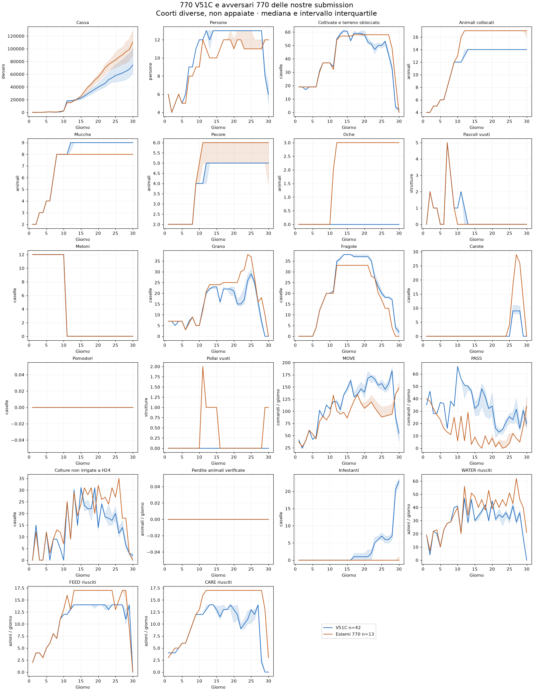

# Base 770 e avversari esterni disponibili

**Base di riavvio: CODEX 770 V51C, submission 56124996.** Bundle recuperato dal commit 977d5e064f2ef9808b4cd03d41c1276ba94348af, SHA256 `43d5c6c3b70cf2940afaa83f3a243cba75e52f89db459d31ecb96187c4f13fda`. Copia identica in `submission/submission_codex_e19_770_v51_candidate.py`; provenienza completa in BASELINE.json.

V49F corregge l'assunzione improduttiva D2; V51C impegna percorsi completi e adegua le assunzioni residue a D29. Sviluppo: 6 casi, +345 cassa media contro V49F; validazione: 4 casi su due seed, +64,50, servizi invariati. Un seed peggiora: non è superiorità uniforme. V50 respinta. V48 submission 56101593 resta controllo storico. La scelta recupera miglioramenti verificati, non deriva dal confronto fra rating di coorti diverse.

## Screening

Esaminati **182 replay unici completi** già scaricati con un nostro lato identificato, in questo checkout e nel worktree V51. Esclusi tecnici: 0. Non è il censimento di tutte le partite di tutte le submission; nessuna nuova partita o simulazione. Deduplicazione per EpisodeId. I replay di leader contro altri leader sono esclusi dal presente screening.

**13 replay di 13 nomi avversari** mantengono 7-7-0-0 a tutti i checkpoint D15–D25. **15** terminano 770; **2** sono 770 soltanto secondo il criterio finale. Il nome del team non identifica necessariamente una policy unica: submission distinte restano distinte quando i metadati sono disponibili. Non sono automaticamente agenti top o adattativi.

| Avversario | Episodio | 770 D15–25 | 770 D30 | Diretto V51C |
|---|---:|---|---|---|
| Farmers Is All You Need | [107083439](https://www.kaggle.com/competitions/episodes/107083439) | sì | sì | no |
| MJVinay | [107923552](https://www.kaggle.com/competitions/episodes/107923552) | sì | sì | no |
| Malte Bories | [106073291](https://www.kaggle.com/competitions/episodes/106073291) | sì | sì | no |
| Moomin and his farm | [107159481](https://www.kaggle.com/competitions/episodes/107159481) | no | sì | sì |
| Nine1Eight | [107467627](https://www.kaggle.com/competitions/episodes/107467627) | no | sì | no |
| Sergei Fironov | [108091470](https://www.kaggle.com/competitions/episodes/108091470) | sì | sì | no |
| Shoma Arakawa | [108128439](https://www.kaggle.com/competitions/episodes/108128439) | sì | sì | no |
| Siva Kumar | [107767227](https://www.kaggle.com/competitions/episodes/107767227) | sì | sì | no |
| Tanuki_boosting | [107341826](https://www.kaggle.com/competitions/episodes/107341826) | sì | sì | no |
| Yam | [107410838](https://www.kaggle.com/competitions/episodes/107410838) | sì | sì | no |
| chudddc | [107150692](https://www.kaggle.com/competitions/episodes/107150692) | sì | sì | no |
| saeNeko | [108019744](https://www.kaggle.com/competitions/episodes/108019744) | sì | sì | no |
| stargazer7c | [107169059](https://www.kaggle.com/competitions/episodes/107169059) | sì | sì | no |
| yuto083 | [107396212](https://www.kaggle.com/competitions/episodes/107396212) | sì | sì | no |
| ömer kiraz | [107382620](https://www.kaggle.com/competitions/episodes/107382620) | sì | sì | no |

## Confronto diretto disponibile

Nei 42 replay V51C recuperati non ci sono avversari che soddisfano il criterio 770 produttiva D15–D25. Moomin and his farm (107159481) soddisfa soltanto il criterio finale: resta nel catalogo, escluso dal confronto delle 770 produttive. Gli scontri diretti V51C–770 stabile richiedono quindi ulteriori replay.

Le topologie giornaliere D1–D30 e gli hash raw sono in SCREEN.json; il catalogo selezionato è CANDIDATES.json. I confronti di leader precedenti sono già disponibili nel worktree V51, cartella reports/top_v51_20260909, e restano distinti dagli avversari delle nostre submission.

## Traiettorie fra coorti

Confronto disponibile: **42 replay V51C** già auditati contro **13 profili avversari 770 produttivi**, auditati in questa analisi. Errori: 0, conservati in TRAJECTORY_ERRORS.json. Sono coorti diverse: il grafico non misura superiorità a mercato o avversario invariati. Tutti i profili selezionati sono inclusi senza filtro economico.

Dati individuali D1–D30: TRAJECTORIES.csv e TRAJECTORIES.json. Il corpus V51C proviene dal report top_v51_20260909 nel worktree recuperato; i profili originali conservano hash e riconciliazione.

| KPI medio giornaliero D16–D25 | V51C | Esterni 770 |
|---|---:|---:|
| people | 13.00 | 11.96 |
| MOVE | 154.18 | 118.58 |
| PASS | 27.08 | 6.91 |
| WATER | 35.06 | 44.38 |
| FEED | 13.71 | 15.92 |
| CARE | 11.61 | 16.39 |
| crop_tiles | 54.15 | 56.76 |
| occupied_livestock_tiles | 14.00 | 16.46 |
| GOOSE | 0.00 | 2.54 |

**770 conta i pascoli, non tutti gli animali.** Nel grafico gli esterni hanno mediana di 3 oche durante la fase produttiva, mentre V51C ne ha zero: i pollai non cambiano la classificazione 770. Non interpretare FEED/CARE maggiori come maggiore copertura a parità di animali. I singoli mix sono nel CSV.

Nel corpus originale V51C resta documentata la discrepanza contabile di 1 sul lato avversario Scorpi, episodio 107183104; il lato V51C qui usato è riconciliato. Quel lato avversario non appartiene ai 13 profili selezionati.

## Approfondimento: pollai e organizzazione comune

L’oca occupa un tile COOP. Nel replay107083439 a D16: 14 pascoli e4 pollai (uno vuoto), 17 animali su18 caselle di strutture. [Analisi del calendario comune, delle visite locali e delle diagnosi precedenti](COMMON_ORGANIZATION.html).
