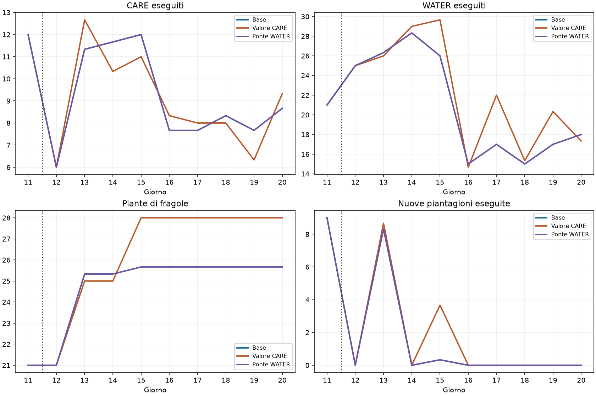

# Studio della transizione D11–D15 · 770 assistita

## Conclusione

**Il collo di bottiglia immediato è il servizio ereditato, non la mancanza di cassa.** Nel caso tracciato D12 comincia con 25 irrigazioni urgenti: il core assegna i primi lavoratori a WATER, rinvia la crescita e completa solo 6 CARE. La diversa valutazione dei CARE esiste nel codice, ma correggerla da sola non sblocca D12.

Questo studio comprende una riproduzione integrale strumentata della base e due esperimenti su tre semi di sviluppo, entrambe le posizioni. È una diagnosi locale: non modifica né promuove le submission congelate.

## Ricostruzione del passaggio nel caso 180903001 / posizione 0

- Cassa iniziale D12: **15.420,0**; riserva di manutenzione stimata dal core: **54,0**. La liquidità non è il vincolo attivo di questa apertura.
- Irrigazioni urgenti: **25** (24 offerte ancora non assegnate più la missione WATER già assegnata al contadino). Nel core priorità 3 significa rischio biologico e prevale sul valore economico delle alternative.
- A H1 non ci sono manovali: il reset giornaliero richiede nuove assunzioni. Il core osserva 6 manovali a H2, 7 a H3 e 12 a H4; i lavoratori disponibili vengono assegnati a visite WATER separate.
- D12 registra **192 movimenti**, pari al **66,4%** dei comandi richiesti, **34 PASS**, **6 CARE** e **0 piantagioni**.
- Il terreno aggiuntivo viene acquistato a H2, ma la capacità agricola non viene immediatamente occupata. Si espande la superficie prima di riuscire ad aumentare il lavoro produttivo svolto.

| Giorno | Cassa a inizio giorno | CARE | Nuove piantagioni | MOVE | PASS | Rifiuti di crescita per percorsi |
|---|---:|---:|---:|---:|---:|---:|
| D12 | 15.420,0 | 6 | {} | 192 | 34 | 2868 |
| D13 | 18.178,0 | 12 | {'MELON': 3, 'STRAWBERRY': 5, 'TOMATO': 1} | 157 | 35 | 1203 |
| D14 | 19.833,0 | 11 | {} | 194 | 13 | 1614 |
| D15 | 20.072,0 | 12 | {'STRAWBERRY': 1} | 172 | 18 | 1431 |

I rifiuti sono valutazioni ripetute, non altrettanti investimenti indipendenti persi. I PASS non sono necessariamente tutti riutilizzabili: contano posizione, inventario e tempo residuo. La traccia dopo l’assegnazione conserva posizioni, inventari, missioni, riserve e servizi non assegnati per ogni ora D12–D15.

### Controllo operativo: V4D nella stessa partita a D12

Le 25 irrigazioni sono un carico ereditato reale, ma non dimostrano un’impossibilità fisica di crescere. La V4D avversaria parte dalla stessa apertura e utilizza una diversa organizzazione del lavoro:

| D12, seed 180903001 | Core nuovo | V4D avversaria |
|---|---:|---:|
| MOVE richiesti | 192 | 130 |
| WATER eseguiti | 25 | 46 |
| CARE eseguiti | 6 | 19 |
| Nuove piantagioni | 0 | 21 |
| PASS richiesti | 34 | 17 |
| Manovali al checkpoint | 12 | 12 |

Le 21 piantagioni V4D sono 8 meloni, 12 grani e 1 fragola. La V4D espande anche il bestiame oltre il perimetro 770: non è un confronto a portafoglio finale identico. Tuttavia, il minor numero di movimenti insieme al maggior servizio eseguito rafforza l’ipotesi che il coordinamento dei percorsi sia una leva concreta; la sola liquidità o il solo numero massimo di manovali non spiegano il divario.

## Tre meccanismi distinti

1. **Precedenza biologica:** il punteggio distingue in modo assoluto le urgenze di priorità 3. Un bonus economico ai CARE di priorità inferiore non può cambiare le prime assegnazioni quando l’irrigazione è urgente.
2. **Valore dei CARE incompleto:** `_services` valuta il latte/lana già raccoglibile e il fertilizzante disponibile, ma non accredita il prodotto futuro aggiuntivo del CARE. Il motore accumula il bonus solo con animale nutrito e curato, dopo l’eventuale produzione del refresh.
3. **Percorsi e ammissione della crescita:** le nuove piantagioni devono lasciare spazio al piano dei servizi osservati. Il certificato include anche attività facoltative, mentre i percorsi operativi sono organizzati per missione su una singola casella. È plausibile che il loro coordinamento limiti la crescita; questa prova non dimostra che sia sicuro eliminare il certificato.

## Esperimenti isolati

**Valore CARE:** aggiunge al servizio una stima marginale di un’unità di latte/lana, usando il prezzo osservato diviso per il ritardo alla successiva produzione utile. Non accredita bonus già saturi. È una stima diagnostica conservativa, non un modello esatto di tutte le produzioni future né ricavo garantito: restano necessari alimentazione, spazio e raccolta. Il risultato riguarda questa specifica stima, non ogni possibile valorizzazione dei CARE. Apertura D1–D11 identica alla base, stessi vincoli e stesso certificato.

**Ponte WATER:** nella sola D11 sostituisce un PASS con WATER se il lavoratore si trova già su una coltura non irrigata, senza muoverlo né cambiare acquisti e raccolte programmati. Verifica se esistono opportunità gratuite per ridurre il servizio urgente ereditato. Il controllo richiede la stessa cassa di chiusura D11 e 72 meloni raccolti.

| KPI, stessi 6 casi | Base | Valore CARE | Ponte WATER |
|---|---:|---:|---:|
| Cassa finale candidata | 65.065,0 | 64.626,5 | 65.065,0 |
| Cassa finale V4D avversaria | 80.830,0 | 82.974,0 | 80.830,0 |
| Scarto relativo rispetto a V4D (%) | -19,5 | -22,1 | -19,5 |
| Vittorie su 6 | 0,0 | 0,0 | 0,0 |
| CARE D12 | 6,0 | 6,0 | 6,0 |
| Piantagioni D12 | 0,0 | 0,0 | 0,0 |
| Fragole D15 | 25,7 | 28,0 | 25,7 |
| Morti colture | 0,0 | 0,0 | 0,0 |
| Fughe animali | 0,0 | 0,0 | 0,0 |
| Casi con missioni residue | 0,0 | 0,0 | 0,0 |

Il valore CARE cambia la cassa media di **-438,5** rispetto alla base. Il confronto relativo con V4D passa da **-19,5%** a **-22,1%**. La maggiore cassa osservata nel primo caso non si conferma come miglioramento medio.

Il ponte WATER ha effettuato **0 sostituzioni** complessive; **6/6** prefissi sono rimasti identici anche come azioni. Non c’erano PASS utilizzabili sulle colture non irrigate: è un controllo nullo, non una smentita dell’utilità di preparare l’irrigazione prima del passaggio.

## Decisione e prossimo intervento proposto

**Nessuna promozione del solo bonus CARE.** Non risolve il blocco D12 e non migliora il risultato medio del campione. Il ponte WATER è una prova della disponibilità di azioni libere, non un nuovo pianificatore di irrigazione.

La prossima modifica da isolare è una **preparazione operativa del passaggio**, con gruppi di visite vicine per irrigare e servire gli animali, seguita dall’ammissione delle nuove colture. Il criterio di rilascio della guida deve considerare le obbligazioni effettivamente eseguibili dalla squadra e il lavoro residuo, oltre alla data e alla cassa. Non basta prolungare il calendario storico o forzare più fragole.

Criteri di verifica: conservare raccolto e cassa D11; zero perdite biologiche; ridurre percorrenze e servizio residuo D12; misurare CARE realmente produttivi, nuove piantagioni D12–D15 e raccolti successivi; accettare solo un miglioramento confermato del confronto con V4D fino a D30. Non abbassare i vincoli di sopravvivenza per ottenere più crescita apparente.

## Evidenza e limiti

- Base strumentata seed 180903001, posizione 0: tutti i KPI, flussi, scorte terminali e risultati D1–D30 di entrambi i lati coincidono con il run già consolidato. La strumentazione non cambia la policy.
- Esperimenti su seed 180903001–180903003, posizioni 0 e 1; sei casi per variante, confrontati con gli stessi sei casi della base. Sono semi di sviluppo, non validazione esterna.
- Mercato endogeno: ogni variante può cambiare anche il comportamento e gli incassi di V4D. Si riportano sempre entrambi i lati e il rapporto fra le medie.
- Il meccanismo dettagliato dei 25 WATER è documentato nel caso tracciato; non va automaticamente generalizzato a qualsiasi stato futuro o topologia.
- Nessuna modifica alla 770 congelata, alla 662 o alla V4D pubblicata; nessuna nuova submission. Le prove sono adattatori locali riproducibili.

[Sintesi numerica](summary.json) · [Manifest delle fonti](manifest.json).
