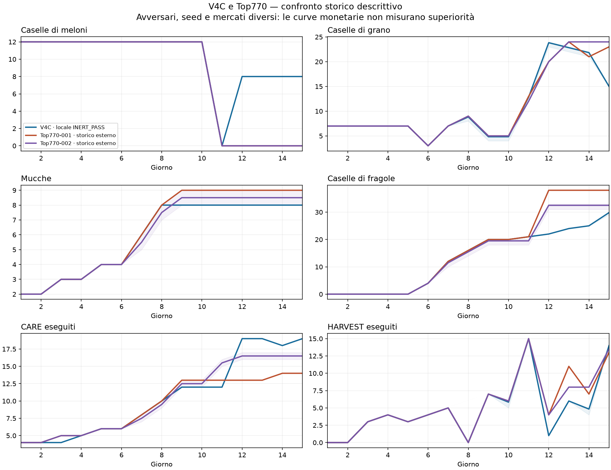
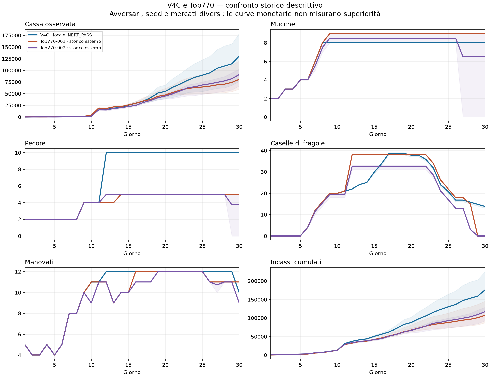
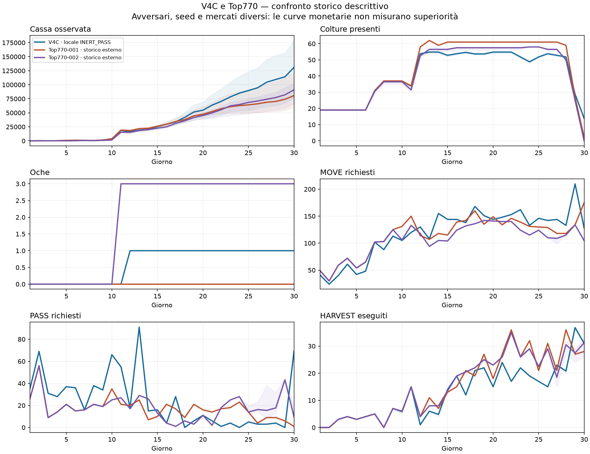

# V4C rispetto ai Top770 — report storico dei KPI

**Modello analizzato: E17.2 V4C**, `CODEX_E17_2_CAPACITY_AWARE_BATCHED_ROUTING_V4C_D28.json`. È distinto dal campione E18.2 capacity-governed V4D discusso nei report precedenti. Il nome V4C della richiesta è seguito letteralmente.

**Questo è un confronto descrittivo, non un torneo né una nuova validazione competitiva.** V4C: sei partite locali contro INERT_PASS; Top770: nove replay esterni in due corpus distinti. Differenze di avversario, mercato e seed impediscono di interpretare un maggiore ricavo come superiorità.

## Risultati principali

L’avvio V4C è già vicino ai Top: 12 meloni e 7 grani iniziali, quattro mucche D5 e circa venti fragole D10. Tutti raggiungono il primo raccolto dei meloni a D11. Il punto di divergenza da studiare è soprattutto il reinvestimento dopo il primo raccolto e la composizione successiva.

**Perimetro diverso:** V4C termina con pascoli 7-7-5, 8 COW, 10 SHEEP e 1 GOOSE nel campione locale, contro i pascoli 7-7-0 dei Top selezionati. Ha quindi più strutture e animali: anche questa differenza impedisce di leggere la maggiore cassa come efficienza superiore a parità di risorse.

La modifica specifica V4C interviene da D28: le somiglianze o differenze di D1–D27 appartengono alla strategia precedente da cui deriva, non al batching V4C. Da D12 V4C torna a piantare meloni, mentre nei due corpus Top i meloni restano assenti e cresce prima la superficie a fragole. Sono scelte diverse da sottoporre a confronto controllato.

| KPI medio | V4C locale | Top770-001 esterno | Top770-002 esterno |
|---|---:|---:|---:|
| Meloni D1 | 12,0 | 12,0 | 12,0 |
| Grano D1 | 7,0 | 7,0 | 7,0 |
| COW D5 | 4,0 | 4,0 | 4,0 |
| COW D10 | 8,0 | 9,0 | 8,5 |
| Fragole D10 | 20,0 | 20,0 | 19,5 |
| Cassa D11 | 18.691,0 | 19.160,4 | 15.409,5 |
| Fragole D20 | 37,8 | 38,0 | 32,5 |
| Cassa D30 — non confrontabile come ranking | 130.953,0 | 80.634,2 | 90.968,8 |

### Primo raccolto dei meloni

| Serie | Primo giorno di raccolta, mediana (min–max) | Vendite meloni D11, media |
|---|---:|---:|
| V4C · locale INERT_PASS | 11,0 (11–11) | 14.797,0 |
| Top770-001 · storico esterno | 11,0 (11–11) | 13.653,8 |
| Top770-002 · storico esterno | 11,0 (11–11) | 14.120,2 |

## Popolazioni, identità e provenienza

- V4C: seed 26090101, 26090102, 26090103, entrambi i ruoli. Tutte le azioni e i ricavi coincidono con il gate storico V4C; contabilità ricostruita e riconciliata per ogni batch.
- Top770-001: cinque replay storici del corpus già esposto, mantenuti integralmente. Alias invariato.
- Top770-002: quattro dei cinque replay dello screening storico hanno topologia finale 770; il quinto 10-7-0 resta documentato nella fonte, escluso dalle curve per il criterio topologico originale, non per il risultato economico.
- I corpus Top sono già consumati: riuso documentale richiesto dal proprietario, nessuna nuova pretesa di holdout e nessuna acquisizione di episodi nuovi.
- Stock al checkpoint D×24−1, prima del refresh; D30 terminale. Flussi su tutti i batch del giorno. Bande minimo–massimo, non intervalli di confidenza.
- Top770 descrive i pascoli: non implica uguaglianza di animali o strutture accessorie. Top770-002 utilizza anche oche.

| Serie | Episodi / seed |
|---|---|
| V4C | 26090101–26090103, seat 0/1 |
| Top770-001 | 105405557, 105384058, 105398563, 105391568, 105565293 |
| Top770-002 | 106077622, 106076806, 106073019, 106064835 |

## D1–D15: impostazione produttiva

| Giorno / serie | Grano | Meloni | Fragole | COW | SHEEP | Manovali |
|---|---:|---:|---:|---:|---:|---:|
| D1 V4C | 7,0 | 12,0 | 0,0 | 2,0 | 2,0 | 5,0 |
| D1 Top001 | 7,0 | 12,0 | 0,0 | 2,0 | 2,0 | 5,0 |
| D1 Top002 | 7,0 | 12,0 | 0,0 | 2,0 | 2,0 | 5,0 |
| D3 V4C | 7,0 | 12,0 | 0,0 | 3,0 | 2,0 | 4,0 |
| D3 Top001 | 7,0 | 12,0 | 0,0 | 3,0 | 2,0 | 4,0 |
| D3 Top002 | 7,0 | 12,0 | 0,0 | 3,0 | 2,0 | 4,0 |
| D5 V4C | 7,0 | 12,0 | 0,0 | 4,0 | 2,0 | 4,0 |
| D5 Top001 | 7,0 | 12,0 | 0,0 | 4,0 | 2,0 | 4,0 |
| D5 Top002 | 7,0 | 12,0 | 0,0 | 4,0 | 2,0 | 4,0 |
| D7 V4C | 7,0 | 12,0 | 12,0 | 6,0 | 2,0 | 8,0 |
| D7 Top001 | 7,0 | 12,0 | 12,0 | 6,0 | 2,0 | 8,0 |
| D7 Top002 | 7,0 | 12,0 | 11,5 | 5,5 | 2,0 | 8,0 |
| D10 V4C | 4,8 | 12,0 | 20,0 | 8,0 | 4,0 | 11,0 |
| D10 Top001 | 5,0 | 12,0 | 20,0 | 9,0 | 4,0 | 11,0 |
| D10 Top002 | 5,0 | 12,0 | 19,5 | 8,5 | 4,0 | 9,0 |
| D11 V4C | 12,8 | 0,0 | 21,0 | 8,0 | 4,0 | 11,0 |
| D11 Top001 | 13,0 | 0,0 | 21,0 | 9,0 | 4,0 | 11,0 |
| D11 Top002 | 12,0 | 0,0 | 19,5 | 8,5 | 4,0 | 11,0 |
| D12 V4C | 23,8 | 8,0 | 22,0 | 8,0 | 10,0 | 12,0 |
| D12 Top001 | 20,0 | 0,0 | 38,0 | 9,0 | 4,0 | 11,0 |
| D12 Top002 | 20,0 | 0,0 | 32,5 | 8,5 | 5,0 | 11,0 |
| D15 V4C | 15,0 | 8,0 | 29,8 | 8,0 | 10,0 | 12,0 |
| D15 Top001 | 23,0 | 0,0 | 38,0 | 9,0 | 5,0 | 10,0 |
| D15 Top002 | 24,0 | 0,0 | 32,5 | 8,5 | 5,0 | 10,0 |

## D1–D30: cassa e servizi

Ogni cella contiene V4C / Top770-001 / Top770-002.

| Giorno | Cassa | FEED | CARE | WATER | HARVEST | MOVE | PASS |
|---|---:|---:|---:|---:|---:|---:|---:|
| 1 | 24,0 / 74,4 / 25,2 | 2,0 / 2,0 / 2,0 | 4,0 / 4,0 / 4,0 | 19,0 / 19,0 / 19,0 | 0,0 / 0,0 / 0,0 | 41,0 / 49,0 / 49,0 | 35,0 / 26,0 / 26,0 |
| 2 | 247,0 / 261,6 / 48,5 | 4,0 / 4,0 / 4,0 | 4,0 / 4,0 / 4,0 | 4,0 / 7,0 / 7,0 | 0,0 / 0,0 / 0,0 | 24,0 / 30,0 / 30,0 | 69,0 / 56,0 / 56,0 |
| 3 | 215,0 / 125,2 / 141,0 | 4,0 / 4,0 / 4,0 | 4,0 / 5,0 / 5,0 | 22,0 / 22,0 / 22,0 | 3,0 / 3,0 / 3,0 | 40,0 / 59,0 / 59,0 | 31,0 / 9,0 / 9,0 |
| 4 | 260,3 / 150,6 / 122,8 | 3,0 / 3,0 / 3,0 | 5,0 / 5,0 / 5,0 | 23,0 / 23,0 / 23,0 | 4,0 / 4,0 / 4,0 | 61,0 / 72,0 / 72,0 | 28,0 / 14,0 / 14,0 |
| 5 | 688,7 / 894,0 / 57,5 | 5,0 / 5,0 / 5,0 | 6,0 / 6,0 / 6,0 | 10,0 / 10,0 / 10,0 | 3,0 / 3,0 / 3,0 | 42,0 / 54,0 / 54,0 | 37,0 / 21,0 / 21,0 |
| 6 | 910,3 / 1.002,8 / 210,0 | 6,0 / 6,0 / 6,0 | 6,0 / 6,0 / 6,0 | 23,0 / 23,0 / 23,0 | 4,0 / 4,0 / 4,0 | 48,0 / 65,0 / 65,0 | 36,0 / 15,0 / 15,0 |
| 7 | 562,0 / 950,6 / 761,0 | 8,0 / 8,0 / 7,5 | 8,0 / 8,0 / 7,5 | 28,0 / 28,0 / 27,5 | 5,0 / 5,0 / 5,0 | 102,0 / 102,0 / 102,0 | 16,0 / 16,0 / 16,0 |
| 8 | 597,7 / 736,0 / 401,2 | 7,0 / 7,0 / 6,5 | 10,0 / 10,0 / 9,5 | 28,8 / 29,0 / 29,0 | 0,0 / 0,0 / 0,0 | 88,0 / 103,0 / 103,0 | 38,0 / 21,0 / 21,0 |
| 9 | 1.402,3 / 1.377,2 / 771,5 | 11,0 / 11,0 / 10,5 | 12,0 / 13,0 / 12,5 | 39,8 / 40,0 / 39,5 | 7,0 / 7,0 / 7,0 | 113,0 / 125,0 / 125,0 | 34,0 / 19,0 / 19,0 |
| 10 | 2.350,0 / 3.865,2 / 1.631,2 | 12,0 / 13,0 / 12,5 | 12,0 / 13,0 / 12,5 | 40,7 / 41,0 / 39,5 | 5,8 / 6,0 / 6,0 | 105,0 / 131,0 / 106,0 | 66,0 / 35,0 / 25,0 |
| 11 | 18.691,0 / 19.160,4 / 15.409,5 | 12,0 / 13,0 / 15,5 | 12,0 / 13,0 / 15,5 | 21,0 / 21,0 / 20,0 | 15,0 / 15,0 / 15,0 | 120,0 / 150,0 / 133,0 | 55,0 / 21,0 / 27,0 |
| 12 | 16.279,7 / 18.349,4 / 15.121,5 | 19,0 / 13,0 / 13,0 | 19,0 / 13,0 / 16,5 | 44,8 / 57,0 / 55,5 | 1,0 / 4,0 / 4,0 | 130,0 / 114,0 / 118,0 | 18,0 / 20,0 / 17,0 |
| 13 | 19.029,8 / 21.719,6 / 18.240,8 | 19,0 / 13,0 / 16,5 | 19,0 / 13,0 / 16,5 | 15,8 / 23,0 / 34,0 | 6,0 / 11,0 / 8,0 | 108,0 / 107,0 / 94,0 | 91,0 / 25,0 / 29,0 |
| 14 | 20.331,7 / 22.390,8 / 20.005,0 | 18,0 / 14,0 / 16,5 | 18,0 / 14,0 / 16,5 | 53,0 / 64,0 / 50,5 | 4,8 / 7,0 / 8,0 | 155,0 / 118,0 / 105,0 | 15,0 / 7,0 / 26,0 |
| 15 | 25.448,3 / 25.978,4 / 22.528,0 | 19,0 / 14,0 / 16,5 | 19,0 / 14,0 / 16,5 | 31,8 / 47,0 / 48,0 | 14,0 / 13,0 / 13,5 | 144,0 / 115,0 / 104,0 | 16,0 / 10,0 / 13,0 |
| 16 | 29.697,2 / 29.555,8 / 24.910,2 | 17,0 / 14,0 / 16,5 | 19,0 / 14,0 / 16,5 | 41,0 / 51,0 / 41,5 | 19,0 / 15,0 / 19,0 | 144,0 / 139,0 / 124,0 | 4,0 / 21,0 / 4,0 |
| 17 | 33.765,0 / 34.446,0 / 31.060,8 | 19,0 / 14,0 / 16,5 | 19,0 / 14,0 / 16,5 | 24,7 / 52,0 / 50,0 | 12,0 / 21,0 / 20,5 | 138,0 / 142,0 / 132,0 | 28,0 / 17,0 / 1,0 |
| 18 | 41.863,7 / 37.853,0 / 35.874,8 | 17,0 / 14,0 / 16,5 | 19,0 / 14,0 / 16,5 | 29,0 / 44,0 / 37,5 | 21,0 / 19,0 / 22,0 | 168,0 / 160,0 / 136,0 | 0,0 / 9,0 / 6,0 |
| 19 | 51.393,2 / 44.609,0 / 41.558,2 | 17,0 / 14,0 / 16,5 | 17,0 / 14,0 / 16,5 | 31,8 / 49,0 / 46,0 | 22,0 / 27,0 / 25,0 | 151,0 / 135,0 / 142,0 | 6,0 / 21,0 / 3,0 |
| 20 | 54.666,0 / 47.401,4 / 45.252,8 | 19,0 / 14,0 / 16,5 | 19,0 / 14,0 / 16,5 | 35,0 / 46,0 / 40,5 | 15,0 / 18,0 / 23,0 | 144,0 / 149,0 / 141,0 | 11,0 / 16,0 / 11,0 |
| 21 | 63.612,3 / 52.218,2 / 49.816,8 | 19,0 / 14,0 / 16,5 | 18,0 / 14,0 / 15,5 | 28,8 / 50,0 / 46,0 | 24,0 / 27,0 / 26,0 | 148,0 / 134,0 / 140,0 | 6,0 / 14,0 / 2,0 |
| 22 | 70.372,8 / 57.320,6 / 55.446,5 | 19,0 / 14,0 / 13,5 | 19,0 / 14,0 / 16,5 | 36,0 / 35,0 / 38,5 | 17,0 / 36,0 / 35,0 | 153,0 / 146,0 / 140,0 | 1,0 / 17,0 / 18,0 |
| 23 | 78.284,5 / 60.847,8 / 62.331,8 | 19,0 / 14,0 / 16,5 | 19,0 / 14,0 / 16,5 | 17,8 / 48,0 / 45,0 | 22,0 / 26,0 / 26,0 | 162,0 / 139,0 / 124,0 | 4,0 / 18,0 / 25,0 |
| 24 | 85.080,0 / 62.864,2 / 64.774,8 | 16,0 / 14,0 / 16,5 | 18,0 / 14,0 / 16,5 | 35,0 / 39,0 / 42,0 | 19,0 / 32,0 / 29,0 | 133,0 / 131,0 / 115,0 | 0,0 / 23,0 / 28,0 |
| 25 | 89.719,7 / 64.179,8 / 68.547,5 | 18,0 / 14,0 / 14,5 | 18,0 / 14,0 / 16,5 | 25,8 / 55,0 / 51,0 | 17,0 / 21,0 / 22,5 | 146,0 / 130,0 / 124,0 | 5,0 / 14,0 / 14,0 |
| 26 | 94.557,8 / 66.044,6 / 70.979,8 | 17,0 / 14,0 / 14,5 | 18,0 / 14,0 / 16,5 | 41,8 / 43,0 / 42,5 | 15,0 / 31,0 / 29,0 | 142,0 / 129,0 / 110,0 | 3,0 / 4,0 / 16,2 |
| 27 | 104.571,5 / 68.809,4 / 74.129,2 | 18,0 / 14,0 / 13,2 | 19,0 / 14,0 / 14,5 | 30,0 / 63,0 / 62,0 | 23,0 / 21,0 / 18,5 | 144,0 / 118,0 / 108,8 | 3,0 / 9,0 / 15,5 |
| 28 | 109.419,5 / 70.260,4 / 77.273,5 | 16,0 / 14,0 / 13,2 | 17,0 / 14,0 / 8,0 | 44,8 / 48,0 / 42,0 | 20,8 / 36,0 / 30,5 | 133,0 / 118,0 / 115,0 | 4,0 / 9,0 / 17,8 |
| 29 | 114.096,8 / 74.122,4 / 82.044,2 | 19,0 / 14,0 / 0,0 | 0,0 / 8,0 / 0,8 | 24,3 / 44,0 / 42,0 | 36,8 / 27,0 / 27,5 | 209,8 / 134,0 / 134,0 | 0,0 / 6,0 / 43,2 |
| 30 | 130.953,0 / 80.634,2 / 90.968,8 | 0,0 / 0,0 / 0,0 | 0,0 / 4,0 / 0,0 | 0,0 / 25,0 / 23,0 | 31,0 / 28,0 / 31,2 | 127,8 / 175,0 / 104,5 | 69,2 / 1,0 / 9,8 |

## Come usare il confronto

Confrontare anzitutto i tempi di semina/raccolta, il passaggio a fragole, la crescita delle mucche e l’impiego del lavoro. Per giudicare il miglioramento specifico V4C serve un’ablation contro il suo parent sullo stesso mercato; per giudicare la competitività servono avversari attivi e condizioni confrontabili. Il confronto monetario INERT_PASS/Top esterni non soddisfa nessuna delle due condizioni.
Prima di trasferire indicazioni ai parametrici, verificare separatamente portafoglio iniziale e transizione D5–D15. Non attribuire a una modifica attiva da D28 il gradino dei raccolti a D11.

## File di evidenza

[Aggregati](aggregati.json) · [Manifest e hash](manifest.json). Strategie non modificate; nessuna submission effettuata.
