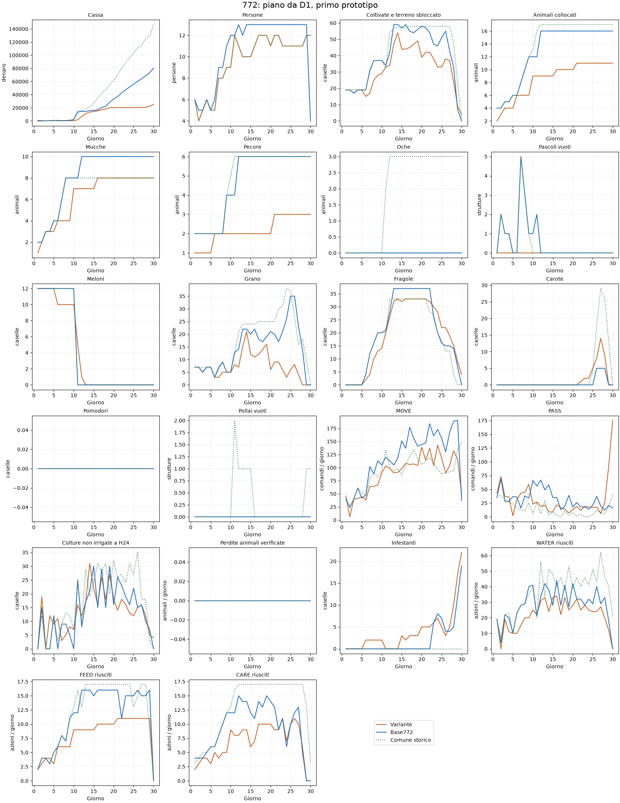

# 772: piano da D1, primo prototipo

**Screening non superato: il calendario comune non è stato realizzato nei tempi richiesti.** Piano attivo da D1, senza apertura congelata. Date e posizioni colturali, organico e apertura dei quadranti provengono dal calendario storico del rappresentante107083439. La policy legge solo osservazioni correnti e questo piano statico, senza prezzi o stati futuri. Conserva come obiettivo la geometria772 e10mucche/6pecore; due colture Q2 sono trasposte nei precedenti siti delle oche. Cambiano apertura, calendario e organico.

Gate temporale: D1 con12meloni e7grani,4fragole aD6,20 aD9 e33 aD12. Un fallimento interrompe gli altri casi: la cassa non valuta il rendimento del calendario comune effettivamente realizzato.

Controllo:772 E20.1 loaderfix pubblicata, submission56142698. Stesso seed, ruolo e avversario775. Mercato e avversario reagiscono alle azioni: non è una prova a prezzi fissati. Seed esposti, nessuna validazione indipendente; seed180912401–407 inutilizzati. Nessuna pubblicazione.

| Seed | Ruolo | Cassa variante | Cassa base | Delta | Topologia | C/S/G | Chiamate | Errori core | Gate tecnico |
|---|---:|---:|---:|---:|---|---|---:|---:|---|
| 180911301 | 0 | 25369 | 80178 | -54809 | [6, 3, 2] | [8, 3, 0] | 719 | 0 | False |

## Calendario realizzato

| Giorno | Modello | Meloni | Grano | Fragole | Carote | Mucche | Pecore | Persone |
|---|---|---:|---:|---:|---:|---:|---:|---:|
| D1 | Variante | 12.0 | 7.0 | 0.0 | 0.0 | 1.0 | 1.0 | 6.0 |
| D1 | Base772 | 12.0 | 7.0 | 0.0 | 0.0 | 2.0 | 2.0 | 6.0 |
| D1 | Comune storico | 12.0 | 7.0 | 0.0 | 0.0 | 2.0 | 2.0 | 6.0 |
| D6 | Variante | 10.0 | 3.0 | 2.0 | 0.0 | 4.0 | 2.0 | 5.0 |
| D6 | Base772 | 12.0 | 3.0 | 4.0 | 0.0 | 4.0 | 2.0 | 6.0 |
| D6 | Comune storico | 12.0 | 3.0 | 4.0 | 0.0 | 4.0 | 2.0 | 5.0 |
| D9 | Variante | 10.0 | 5.0 | 13.0 | 0.0 | 4.0 | 2.0 | 9.0 |
| D9 | Base772 | 12.0 | 5.0 | 20.0 | 0.0 | 8.0 | 4.0 | 11.0 |
| D9 | Comune storico | 12.0 | 5.0 | 20.0 | 0.0 | 8.0 | 4.0 | 9.0 |
| D11 | Variante | 5.0 | 8.0 | 20.0 | 0.0 | 7.0 | 2.0 | 12.0 |
| D11 | Base772 | 0.0 | 13.0 | 21.0 | 0.0 | 8.0 | 4.0 | 12.0 |
| D11 | Comune storico | 0.0 | 12.0 | 20.0 | 0.0 | 8.0 | 6.0 | 12.0 |
| D12 | Variante | 1.0 | 7.0 | 26.0 | 0.0 | 7.0 | 2.0 | 11.0 |
| D12 | Base772 | 0.0 | 14.0 | 28.0 | 0.0 | 10.0 | 6.0 | 13.0 |
| D12 | Comune storico | 0.0 | 21.0 | 33.0 | 0.0 | 8.0 | 6.0 | 11.0 |
| D15 | Variante | 0.0 | 12.0 | 32.0 | 0.0 | 7.0 | 2.0 | 10.0 |
| D15 | Base772 | 0.0 | 20.0 | 37.0 | 0.0 | 10.0 | 6.0 | 13.0 |
| D15 | Comune storico | 0.0 | 24.0 | 33.0 | 0.0 | 8.0 | 6.0 | 10.0 |
| D20 | Variante | 0.0 | 6.0 | 33.0 | 0.0 | 8.0 | 2.0 | 11.0 |
| D20 | Base772 | 0.0 | 21.0 | 37.0 | 0.0 | 10.0 | 6.0 | 13.0 |
| D20 | Comune storico | 0.0 | 25.0 | 33.0 | 0.0 | 8.0 | 6.0 | 11.0 |
| D25 | Variante | 0.0 | 6.0 | 22.0 | 5.0 | 8.0 | 3.0 | 11.0 |
| D25 | Base772 | 0.0 | 35.0 | 16.0 | 0.0 | 10.0 | 6.0 | 13.0 |
| D25 | Comune storico | 0.0 | 37.0 | 17.0 | 4.0 | 8.0 | 6.0 | 11.0 |
| D30 | Variante | 0.0 | 0.0 | 4.0 | 0.0 | 8.0 | 3.0 | 12.0 |
| D30 | Base772 | 0.0 | 0.0 | 0.0 | 0.0 | 10.0 | 6.0 | 4.0 |
| D30 | Comune storico | 0.0 | 0.0 | 0.0 | 0.0 | 8.0 | 6.0 | 12.0 |

## Contabilità e perdite

| Misura media per partita | Variante | Base772 |
|---|---:|---:|
| Vendite | 44346.0 | 110419.0 |
| Acquisti | 15347.0 | 22841.0 |
| Assunzioni | 3630.0 | 7400.0 |
| Perdite colture per sete | 10.0 | 4.0 |
| Fughe animali | 0.0 | 0.0 |

## Traiettorie dei22KPI

Curve medie dei soli casi eseguiti. Il riferimento comune è descrittivo, da altra partita e altro mix animale.

Protocollo e hash in PROTOCOL.json; risultati integrali in RESULTS.json e negli artefatti replay/KPI. Il controllo iniziale della prova calendar772_c1 è stato corretto per distinguere core_errors=null della775 da un errore; policy invariata e audit conservato.
