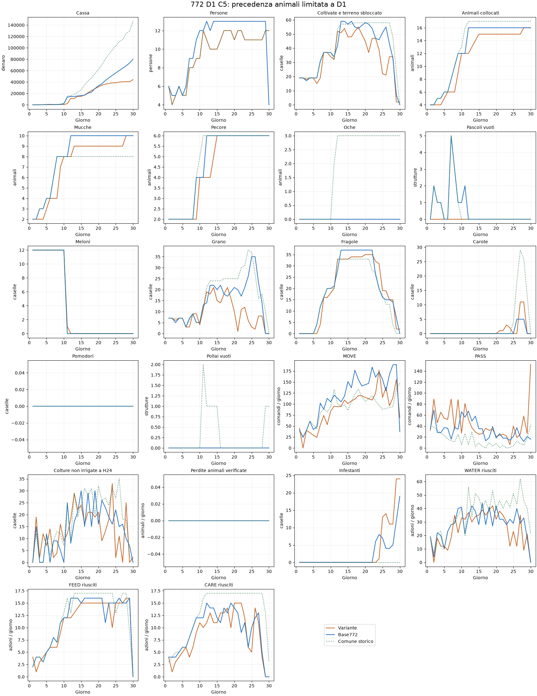

# 772: esecuzione del calendario da D1

**Nessuna variante promossa.** Quattro nuove prove complete, C3–C6, tutte sul seed diagnostico180911301, ruolo0, contro775 congelata. Ogni variante fallisce il primo controllo temporale; non sono quattro repliche della stessa candidata. Il protocollo interrompe gli altri ruoli/seed dopo quel fallimento. C2 è il riferimento precedente,772 E20.1 pubblicata il controllo competitivo:80178 di cassa sul medesimo caso.

La ricerca prosegue esclusivamente sulla772. La774 è esclusa da ulteriori implementazioni per scelta dell'utente. Nessuna submission, commit o push; seed riservati inutilizzati.

## Tutti i risultati

Obiettivo D1:12meloni,7grani,2mucche e2pecore. Fragole previste D6/D9/D12:4/20/33.

| Variante | D1 meloni/grano | D1 mucche/pecore | Fragole D6/D9/D12 | Cassa | Perdite colture | Fughe animali | Gate |
|---|---|---|---|---:|---:|---:|---|
| C2 | 12/7 | 1/1 | 2/11/31 | 30295 | 0 | 0 | non superato |
| C3 | 10/4 | 2/2 | 3/7/33 | 24762 | 2 | 0 | non superato |
| C4 | 12/7 | 2/2 | 0/7/30 | 40311 | 2 | 0 | non superato |
| C5 | 12/7 | 2/2 | 0/16/33 | 44219 | 5 | 0 | non superato |
| C6 | 12/7 | 2/2 | 0/16/33 | 22836 | 3 | 0 | non superato |

Tutte le nuove varianti completano719 chiamate, senza errori core, conservando esattamente la geometria finale772 e il mix10mucche/6pecore. Questo non basta: gli insediamenti e le semine devono arrivare anche nei giorni previsti. Il risultato non è una validazione indipendente né un confronto a prezzi invariati: mercato e avversario reagiscono alle azioni.

## Correzioni e riscontri

- **C3 — Insediamenti iniziali:** priorità7 agli animali dovuti. C2 lasciava due insediamenti ineseguiti aD1, pur mostrando1004 di denaro e888 liberi dopo la riserva aH17. Le offerte erano presenti; i lavori colturali brevi precedevano gli insediamenti e allontanavano i lavoratori. C3 completa4animali ma perde5semine iniziali.
- **C4 — Finanziamento D1:** solo nel primo giorno la riserva copre il cibo corrente e i collocamenti impegnati, mantenendo sottratti gli acquisti prenotati. La riserva per due giorni futuri bloccava parte delle semine. C4 completa12meloni,7grani e4animali, chiudendo con50 di cassa. La scelta aumenta l'esposizione al fabbisogno dei giorni successivi: non è stata promossa.
- **C5 — Concorrenza dopo l'avvio:** mantiene la precedenza speciale agli animali solo aD1. In C4 aD6 un acquisto animale da400 riduce la disponibilità prima delle fragole; le offerte tornano finanziabili versoH18. C5 recupera16fragole aD9 e33 aD12, ma ne ha0 aD6.
- **C6 — Priorità delle fragole:** porta a7 la priorità delle semine di fragole già dovute. Non migliora i conteggi D6/D9/D12 diC5 e peggiora la cassa del caso. Non adottata.

## Che cosa resta irrisolto

**Raggiungere33fragole aD12 non equivale a realizzare il calendario comune.** In C5 eC6 la prima tranche D6 manca: cambiano quindi le età delle piante, le prime produzioni e le successioni. Il protocollo temporale intercetta questo problema e impedisce una falsa promozione.

Il prototipo attiva gli investimenti quando scadono e controlla la capacità giornaliera, ma non garantisce in anticipo che cassa, caselle libere e rotte siano disponibili per tutte le tranche. Le correzioni locali alle priorità spostano il conflitto; serve un piano con prenotazioni coordinate prima delle scadenze. Il passo successivo deve rendere verificabile questo vincolo, non aggiungere un'altra priorità sulla stessa coda.

L'apertura originale772 realizza già le semine comuni D1–D10 nei20replay pubblici analizzati. È un riferimento di esecuzione da conservare: questi test non giustificano la sostituzione del suo avvio con il prototipo più debole.

## Report con22KPI e dati integrali

[C3](../calendar772_d1_c3/REPORT.html) · [C4](../calendar772_d1_c4/REPORT.html) · [C5](../calendar772_d1_c5/REPORT.html) · [C6](../calendar772_d1_c6/REPORT.html).

C5 è mostrata perché recupera parte delle scadenze rispetto aC2, non perché sia adottata. Protocolli fissati prima dei risultati, sorgenti congelati e verificati, replay completi e audit conservati nelle cartelle di ciascuna variante. SUMMARY.json riporta tutte le misure della tabella.
