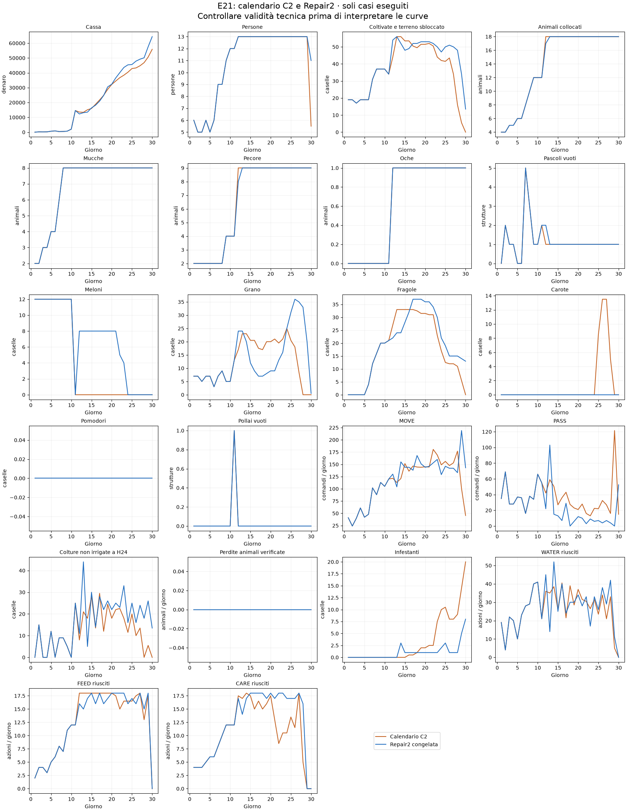

# E21 774: prova del calendario comune

**Stato: quattro casi tecnicamente completati; verificare il gate economico e biologico sotto.** La Repair2 pubblicata non è stata modificata né ripubblicata.

La candidata C2 conserva il prefisso E21 D1–D11 e mira alla stessa geometria 774 e allo stesso mix8C/9S/1G. Da D12 usa il pianificatore osservativo e il dispatcher già esistenti della V48, adattati a caselle riservate, 33 fragole/23 grani, successione delle fragole verso grano e carote nel finale. Questo cambia calendario e dispatcher, non identifica causalmente il solo calendario. L'organico rimane limitato a12 aiutanti; nessun cap artificiale sui MOVE.

## Difetto corretto durante lo screening

C1 si interrompe dopo265 chiamate: il controller770 non classificava GOOSE fra gli animali e tentava di quotarla come prodotto di mercato (KeyError). C2 aggiunge la regola motore dell'oca ai dizionari isolati del controller, senza cambiare il codice congelato degli altri agenti. C1 e relativi sorgenti sono conservati nella cartella calendar774_c1; la sua cassa non è un risultato competitivo valido.

## Tutti i casi eseguiti C2

| Seed | Ruolo | Chiamate | Prefisso uguale | Topologia finale | Animali C/S/G | Cassa candidata | Cassa Repair2 | Delta | Tecnica |
|---|---:|---:|---|---|---|---:|---:|---:|---|
| 180911301 | 0 | 719 | True | [7, 7, 4] | [8, 9, 1] | 63435 | 65391 | -1956 | True |
| 180911301 | 1 | 719 | True | [7, 7, 4] | [8, 9, 1] | 63435 | 65391 | -1956 | True |
| 180911303 | 0 | 719 | True | [7, 7, 4] | [8, 9, 1] | 48254 | 63410 | -15156 | True |
| 180911303 | 1 | 719 | True | [7, 7, 4] | [8, 9, 1] | 48254 | 63410 | -15156 | True |

Il confronto locale usa lo stesso seed, ruolo e avversario775 delle prove Repair2 già salvate. Le reazioni del mercato e dell’avversario possono divergere dopo il cambio di azioni. Seed già esposti, nessuna conferma indipendente e nessuna prova di mantenere il vantaggio iniziale di rating. I seed riservati180912401–407 restano inutilizzati.

**Gate di sviluppo: NON SUPERATO.** Cassa positiva in ciascun seed: False; perdite biologiche non peggiori in ciascun caso: True. Delta mediando i ruoli per seed: {180911301: -1956.0, 180911303: -15156.0}.

## Calendario effettivamente realizzato

Le quote sono intenzioni soggette a capacità, non semine forzate. Il raggiungimento tardivo delle 33 fragole non equivale al calendario esterno D12.

| Giorno | Modello | Fragole | Grano | Meloni | Carote | MOVE | PASS |
|---|---|---:|---:|---:|---:|---:|---:|
| 12 | C2 | 27.0 | 17.0 | 0.0 | 0.0 | 121.5 | 42.0 |
| 12 | Repair2 | 22.0 | 24.0 | 8.0 | 0.0 | 130.0 | 22.0 |
| 15 | C2 | 33.0 | 20.5 | 0.0 | 0.0 | 151.5 | 27.0 |
| 15 | Repair2 | 28.0 | 12.0 | 8.0 | 0.0 | 144.0 | 13.0 |
| 20 | C2 | 31.5 | 20.0 | 0.0 | 0.0 | 145.0 | 21.0 |
| 20 | Repair2 | 36.0 | 9.0 | 8.0 | 0.0 | 144.0 | 12.0 |
| 25 | C2 | 12.5 | 20.5 | 0.0 | 8.5 | 156.0 | 22.0 |
| 25 | Repair2 | 19.0 | 31.0 | 0.0 | 0.0 | 146.0 | 7.0 |
| 30 | C2 | 0.0 | 0.0 | 0.0 | 0.0 | 45.5 | 15.0 |
| 30 | Repair2 | 13.0 | 0.5 | 0.0 | 0.0 | 143.0 | 52.5 |

## Contabilità e sicurezza

Medie per partita, intera stagione.

| Misura | C2 | Repair2 |
|---|---:|---:|
| Vendite | 88429.50 | 109288.50 |
| Acquisti | 25033.00 | 37205.00 |
| Assunzioni | 7552.00 | 7683.00 |
| Perdite crop per sete | 5.00 | 25.00 |
| Fughe animali | 0.00 | 0.00 |

Dati completi in DIAGNOSIS.json, RESULTS.json e negli artefatti .kpi.json/.replay.json.gz. Le perdite e i servizi non vengono esclusi quando sfavorevoli. Protocollo e hash fissati prima dei risultati in PROTOCOL.json.

## Esito

C2 non promossa: delta medio −8.556, negativo in entrambi i seed. Meno perdite crop (5 anziché25), ma maggiore inattività e ricavi insufficienti a compensare. Il calendario target non è stato riprodotto nei tempi:33fragole aD15, non D12. Il test respinge questa implementazione del trasferimento, non dimostra che il calendario comune sia inadatto in generale alla774. Posizioni/specie finali e assenza di animali residui verificate in FINAL_VERIFICATION.json; nessuna modifica alla submission pubblicata.
