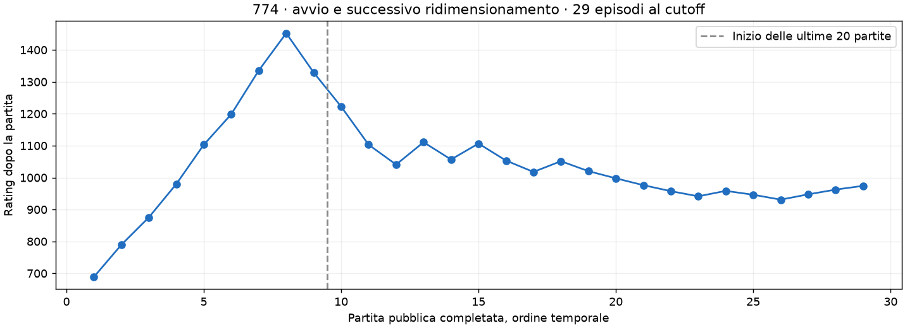
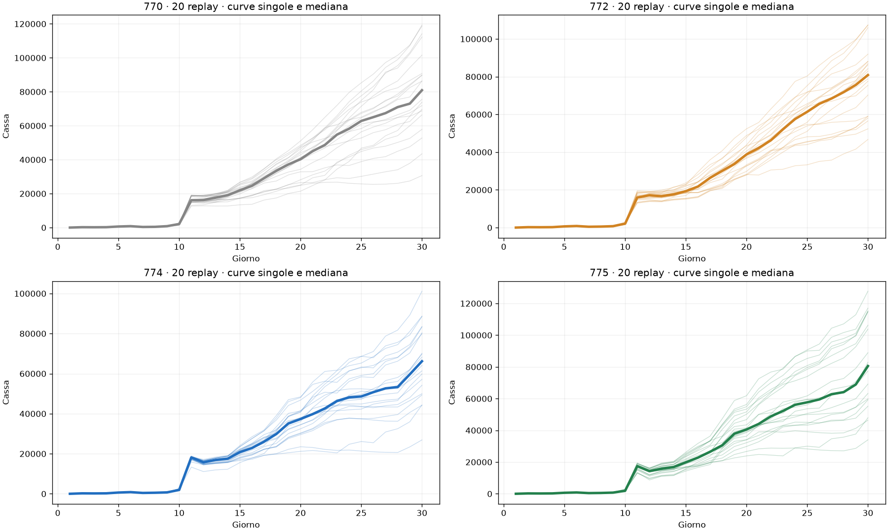
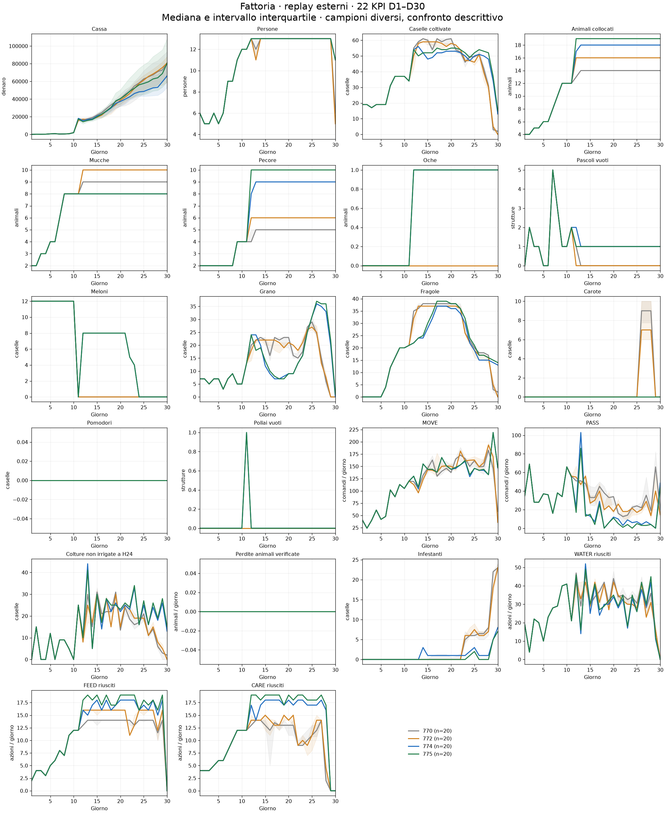
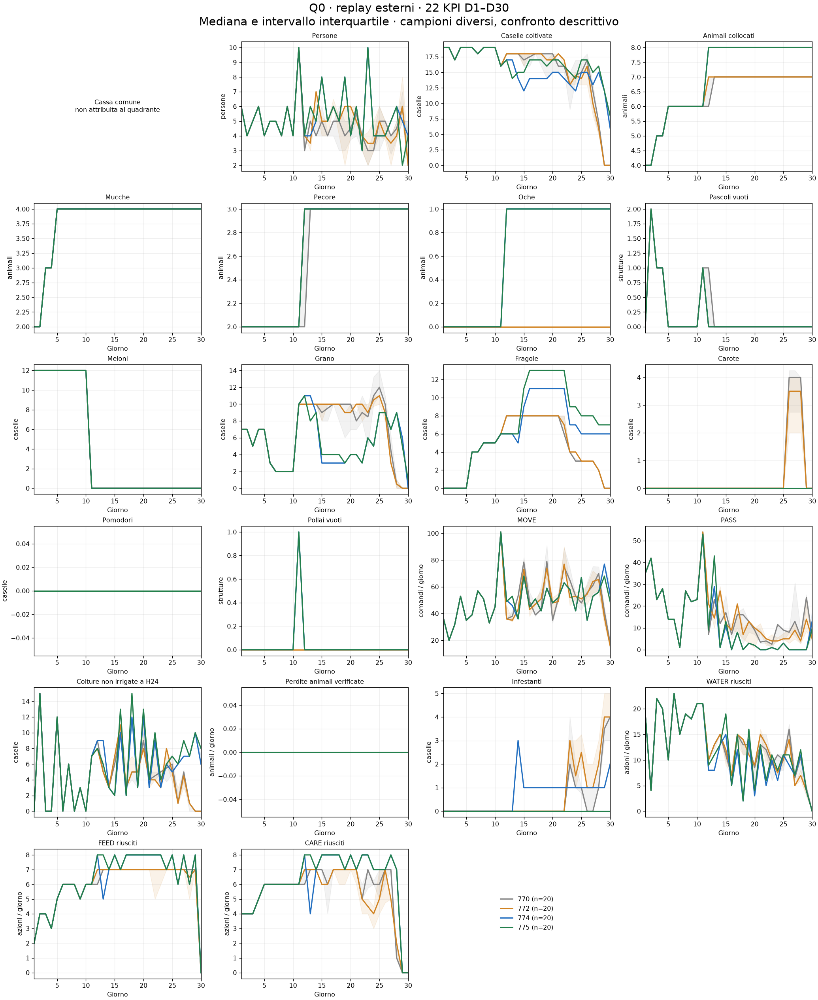
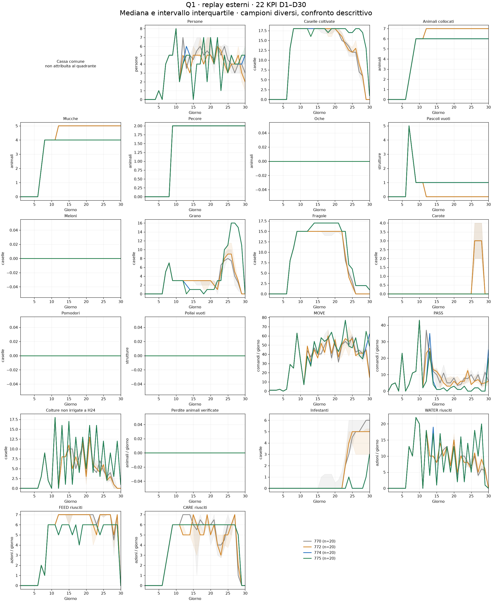

# 770 / 772 / 774 / 775 — confronto dei replay esterni

Acquisizione richiesta alle 17:00 Europe/Rome del 12 settembre 2026. Cutoff registrato: 2026-09-12T15:00:59.457444+00:00. Analisi di **80 replay completi**. Errori di acquisizione/analisi: **0**, dettagli in AUDIT_ERRORS.json. Nessuna simulazione o modifica della policy.

## Risultato

| Modello | n | Vittorie | Cassa media | Mediana | Q25–Q75 | Margine medio sull'avversario | Rating ultimo episodio |
|---|---:|---:|---:|---:|---:|---:|---:|
| 770 | 20 | 6/20 | 80.988 | 80.921 | 68.130–93.488 | -17.207 | 932.6 |
| 772 | 20 | 5/20 | 78.160 | 80.874 | 59.064–88.088 | -14.412 | 877.0 |
| 774 | 20 | 7/20 | 66.253 | 66.194 | 53.146–81.096 | -4.891 | 974.2 |
| 775 | 20 | 6/20 | 82.261 | 80.557 | 59.668–108.360 | -6.851 | 977.8 |

Rating provvisori ricavati dai metadati dell'ultimo episodio della coorte, non una rilettura della classifica live. Vittorie e cassa si riferiscono ai 20 episodi selezionati, non a tutta la vita della submission.
### L'avvio era forte, ma al cutoff il segnale si è ridimensionato

La cronologia conferma **8 vittorie nelle prime 8 partite** e un picco provvisorio di rating **1.452,5**. Alle 17:00 sono disponibili **29 partite pubbliche complete**, con **15 vittorie complessive**. Nel campione preregistrato delle **ultime 20**, la 774 fa **7 vittorie e 13 sconfitte**, rating dell'ultimo episodio **974,2**. La prima impressione positiva era reale, ma non descrive tutta l'evoluzione successiva. I primi nove episodi non entrano nei 22 KPI della coorte recente; la loro cronologia è conservata nei metadati.

La 774 ha **cassa media 66.252,8**, contro **82.260,8** della 775: circa **16.008 in meno**. Ha però un margine medio sull'avversario meno negativo (−4.890,7 contro −6.850,9) e 7 vittorie contro 6. Questi ordinamenti diversi mostrano perché cassa assoluta, rating e vittorie non sono intercambiabili. Gli avversari della 774 e della 775 hanno rating iniziale medio rispettivamente 1.034,3 e 1.029,9; quelli di 770/772 970,4/908,2. Non sono partite appaiate.

### La differenza di cassa nasce soprattutto dopo D12

Rispetto alla 775, la 774 guadagna **821,4** di flusso netto medio in D1–11, poi perde **5.833,8** in D12–19, **9.166,5** in D20–29 e **1.829,1** a D30. Nel bilancio complessivo: ricavi **−16.561,0**, acquisti **−557,9** (risparmio), manodopera **+4,8** (maggior costo), terra invariata. È una riconciliazione contabile delle due coorti, non un effetto causale stimato della rimozione del pascolo.

I ricavi mancanti principali sono **latte −7.414**, **lana −5.224** e **fragole −4.681**; altri prodotti compensano in parte. Il latte raccolto è quasi uguale, **237,95 contro 239,80**, ma il prezzo realizzato scende da **89,15 a 58,69**. La differenza sul latte è quindi soprattutto di monetizzazione nel mercato incontrato, non di quantità raccolta. La lana risente sia della quantità (venduto 210,3 contro 234,0) sia del prezzo (103,57 contro 115,41). Non attribuire questi prezzi alla sola topologia.

### Correzioni tecniche confermate, servizio agricolo ancora debole

La 774 mantiene **7-7-4 in 20/20 replay**, sempre **8 mucche, 9 pecore e un'oca**, senza fughe. Le perdite crop per sete restano **24,9 per partita**, contro **21,9** della 775 e **4,35/3,25** circa di 770/772: un limite della routine agricola che il confronto esterno rende visibile. I conteggi riguardano eventi di perdita, non il numero di giorni senza WATER.

La 775 conserva nel campione l'episodio **108072534**, con finale **5-7-5** e una fuga: escluderlo migliorerebbe artificialmente il suo risultato. In quel replay e in un replay 770 compaiono comandi MOVE/PASS per lavoratori non presenti. Restano contati come richieste globali, ma non attribuiti a un quadrante inventato; quantità e giorni sono nel CSV sotto NON_ATTRIBUIBILE.

**Esito:** pubblicare ha prodotto informazione utile e confermato le correzioni tecniche. Questo primo confronto non dimostra ancora che la 774 sia competitivamente superiore. Nessuna modifica o nuova pubblicazione è stata eseguita a seguito dei risultati.

## Dove si forma la cassa

Flusso netto medio per fase, da libro contabile (vendite − acquisti − lavoratori − terra + variazioni da azioni). La somma delle fasi più il capitale iniziale riconcilia la cassa finale in ogni replay.

| Modello | D1–11 | D12–19 | D20–29 | D30 |
|---|---:|---:|---:|---:|
| 770 | 13.536 | 18.595 | 39.401 | 6.456 |
| 772 | 13.224 | 17.850 | 38.759 | 5.326 |
| 774 | 14.575 | 16.943 | 25.308 | 6.426 |
| 775 | 13.754 | 22.777 | 34.475 | 8.255 |

PHASE_CASH.csv separa ricavi, acquisti, manodopera e terra; PRODUCTS.csv riporta quantità raccolte/vendute e prezzi realizzati. Quantità vendute possono includere prodotti comprati. Prezzi medi ponderati per le unità vendute, non quotazioni finali.

| Modello | Prodotto | Raccolto medio | Venduto medio | Ricavi medi | Prezzo realizzato |
|---|---|---:|---:|---:|---:|
| 770 | STRAWBERRY | 236.2 | 235.7 | 31.850 | 135.16 |
| 770 | MILK | 241.2 | 240.8 | 25.818 | 107.22 |
| 770 | WOOL | 127.2 | 126.7 | 12.582 | 99.31 |
| 772 | STRAWBERRY | 238.1 | 238.1 | 33.830 | 142.08 |
| 772 | MILK | 253.6 | 253.6 | 17.773 | 70.08 |
| 772 | WOOL | 142.9 | 142.9 | 17.571 | 122.92 |
| 774 | STRAWBERRY | 205.5 | 195.3 | 23.840 | 122.07 |
| 774 | MILK | 237.9 | 237.9 | 13.965 | 58.69 |
| 774 | WOOL | 212.0 | 210.3 | 21.781 | 103.57 |
| 775 | STRAWBERRY | 218.8 | 211.8 | 28.520 | 134.63 |
| 775 | MILK | 239.8 | 239.8 | 21.379 | 89.15 |
| 775 | WOOL | 235.2 | 234.0 | 27.005 | 115.41 |

## 22 KPI e quadranti

Mediana e intervallo interquartile per giorno. FLOW come MOVE/PASS/WATER/FEED/CARE sono conteggi giornalieri; gli altri KPI sono stock ai checkpoint. D1–D29: stato H24 prima dell'ultima azione del giorno; D30: terminale. Le fasi contabili usano tutte le azioni effettive e non differenze tra quei checkpoint. PHASE_KPI.csv riporta livelli/conteggi medi giornalieri per fase; DAILY_KPI.csv conserva tutti i singoli replay.

Cassa comune non attribuita arbitrariamente a Q0/Q1. I 21 KPI additivi sono riconciliati con i quattro quadranti e un residuo esplicito NON_ATTRIBUIBILE per richieste MOVE/PASS a lavoratori inesistenti, quando presenti. Quel residuo non rappresenta lavoro eseguito. MOVE/PASS sono richieste; WATER/FEED/CARE sono azioni riuscite verificate dal motore sulle osservazioni salvate, senza generare nuove partite.

## Anomalie e dati di contesto

- 770: {'[7, 7, 0, 0]': 20}; fughe totali 0; perdite crop per sete medie 4.3.
- 772: {'[7, 7, 2, 0]': 20}; fughe totali 0; perdite crop per sete medie 3.2.
- 774: {'[7, 7, 4, 0]': 20}; fughe totali 0; perdite crop per sete medie 24.9.
- 775: {'[7, 7, 5, 0]': 19, '[5, 7, 5, 0]': 1}; fughe totali 1; perdite crop per sete medie 21.9.

Scorte terminali per episodio in GAMES.csv; dettagli di deposito, inventari, semi, rese residue e prezzi in profiles_1700. I profili conservano anche i cambiamenti della città osservati e tutti i metadati dell'avversario. Nessuna anomalia di topologia è rimossa dal campione.

## Identità, selezione e limiti

770 = **V48 56101593**; 772 = **E20.1 loaderfix 56142698**, non E20.2 locale; 774 = **E21 Repair2 56185961**; 775 = **E18.2 56147218**. La V51 770 è una versione distinta e non mescolata alla V48. Ultimi 20 episodi PUBLIC completati per submission, ordine createTime/ID, esclusi self-play per team e validation; history complete salvate, compresi esclusi e partite in corso. Gli episodi incompleti o con dati insufficienti vengono segnalati e non entrano negli aggregati stagionali.

Coorti diverse per avversari, seed, epoca e domanda: confronto descrittivo, non stima causale della topologia. Il campione 774 iniziale può essere influenzato dall'abbinamento basato sul rating. Anche i prezzi e i negozi dipendono dalle azioni tramite RNG condiviso del motore. Le bande interquartili descrivono la dispersione, non sono intervalli di confidenza.

Verificati hash raw, 720 stati/DONE, identità submission/ruolo, campi per KPI, parità contabile, riconciliazione dei quadranti. Nessun errore è ignorato; esclusioni elencate separatamente. La baseline del primo cutoff resta in BASELINE_INVENTORY.json.
