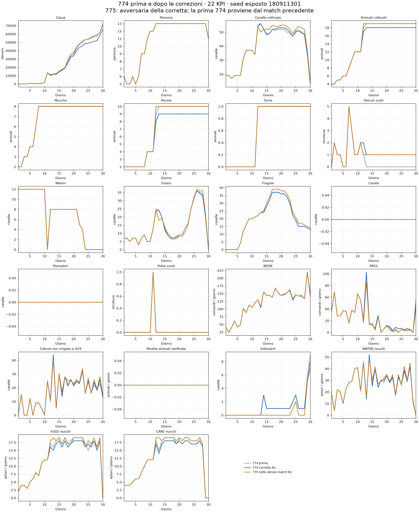

# Correzioni 774 e verifica successiva

Versione: **CODEX-E21-774-REPAIR2**. Esito tecnico: **PASS** su 4 partite seriali, seed esposti 180911301 e 180911303, entrambi i ruoli. Nessuna pubblicazione effettuata. Nessun seed riservato consumato.

## Correzioni effettive

1. **Acquisti e collocamenti:** cap di 17 bovini/ovini, obiettivo 8 mucche + 9 pecore, oltre a un'oca. Il pascolo Q1 (6,3) resta vuoto; la missione di completamento può riempire Q2. Verificati portafoglio finale esatto e zero animali inutilizzati in tutti i casi.
2. **Routine:** le escursioni prive di lavoro agricolo sul target (4,7) vengono saltate e sostituite da una tratta verso la successiva tappa originaria. Il suo orario resta un vincolo verificato. Il tempo disponibile può servire colture sul posto; non viene aperta un'altra tratta. Gli altri segmenti del piano possono comunque reagire alla fattoria modificata: non è una misura isolata del valore di una pecora.
3. **Identificazione:** modello E21-774-REPAIR2 e topologia 7-7-4 nei metadati; bundle e protocolli distinti dalla 774 ricostruita del report precedente.

## Altri difetti trovati e risolti durante il controllo

La prima correzione R1 comprava il numero giusto di pecore ma ne lasciava una nel deposito e il pascolo (3,6) vuoto. È conservata come tentativo fallito. R2 ripristina una missione di collocamento limitata, escludendo il pascolo Q1 che deve rimanere vuoto.

R1 ha inoltre evidenziato una risemina sul target senza acqua successiva, già presente nel comportamento ereditato. R2 ammette la semina quando un lavoratore presente ha uno slot compatibile nel turno seguente; il filtro agricolo usa quello slot per WATER. Nei replay verificati tutte le semine riuscite sul target sono seguite da acqua e non si osservano morti per sete su quella casella. Questa regola prudente può rinunciare a semine: non è ancora un pianificatore ottimale del ciclo completo.

Nel finale la gestione E18 di trasporto/consegna resta autorevole: il filtro non può sostituirla con compiti agricoli. Restano le protezioni contro costruzioni/collocamenti animali sul target. Normalizzato anche il campo opzionale `step` dai dati giorno/ora.

## Verifiche

719 chiamate per partita, riproduzione esatta dall'ingresso pubblico, reset episodio, nessun errore/fallback rilevato anche nei controller annidati, prefisso D1–D11 identico alla versione congelata, topologia massima e finale 774, massimo 18 animali, portafoglio finale 8/9/1, zero scorte animali, zero comandi animali sul target, rientri di tutte le tratte completati, contabilità di cassa riconciliata e zero fughe. Dettagli in VERIFICATION.json.

| Seed | Ruolo 774 | Cassa 774 R2 | Cassa E18 | Margine | Verifiche |
|---|---:|---:|---:|---:|---|
| 180911301 | 1 | 65,391 | 70,555 | -5,164 | PASS |
| 180911303 | 1 | 63,410 | 68,032 | -4,622 | PASS |
| 180911301 | 0 | 65,391 | 70,555 | -5,164 | PASS |
| 180911303 | 0 | 63,410 | 68,032 | -4,622 | PASS |

Questi sono controlli diagnostici su seed già esposti. I ruoli non sono repliche indipendenti. Non dimostrano una superiorità competitiva.

## Effetti economici e limiti rimasti

Sul seed 301, ruolo 0, la vecchia ricostruzione faceva 72,473; R2 fa 65,391, variazione -7,082. La variazione deriva da vendite -7,791, acquisti -709 (una riduzione è un risparmio) e altri flussi netti +0. La 775 avversaria cambia anch'essa risultato tra i due match. Il motore accoppia infestanti e calendario dei negozi tramite RNG condiviso: non attribuire tutta la differenza al minor allevamento. Quantità e ricavi per prodotto sono in CASH_COMPARISON.json.

La copertura delle altre colture resta un limite della routine ereditata: nei due ruoli del seed 301 non è stato introdotto un pianificatore biologico generale. Nel ruolo 0 si rilevano 25 eventi di perdita per sete, contro 25 della precedente 774 e 22 della 775 nello stesso nuovo match. Le correzioni tecniche non garantiscono un aumento della cassa.

**Conclusione operativa:** le correzioni richieste sono verificate come baseline diagnostica; pubblicazione non eseguita e nessuna promozione competitiva automatica. Non avviare ulteriori varianti economiche soltanto per recuperare il risultato sul campione.

## Traiettorie dei 22 KPI

Dati giornalieri in KPI22.csv. L'originale e R2 provengono da match distinti; la curva 775 è l'avversaria di R2. Il precedente report 774/772/775 e il suo bundle non sono stati sovrascritti.
