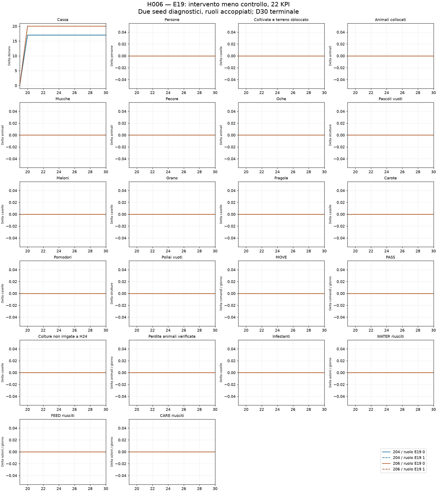
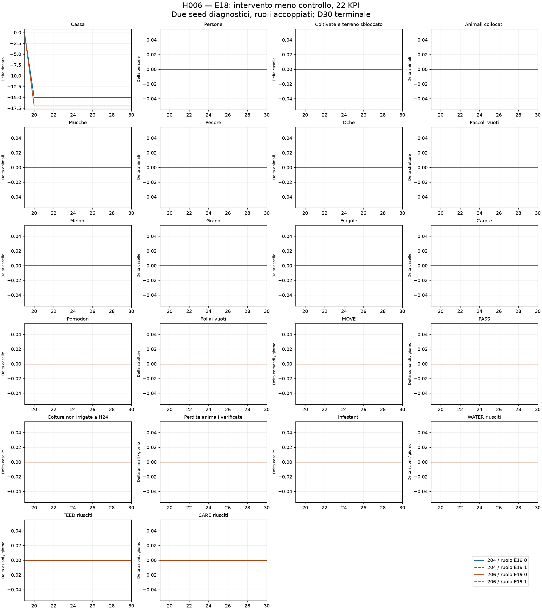

# H006: verifica fino a D30

Quattro interventi E19 contro E18, due seed diagnostici gia esposti e due ruoli accoppiati. Quattro controlli nuovi riproducono esattamente 263 transizioni dopo il checkpoint. Forecast ricostruito dalla storia propria e confrontato con le predizioni congelate; avversari liberi di reagire. Nessuna promozione.

| Seed | Ruolo E19 | Delta cassa D30 | Delta margine D30 | Stress controllo/intervento | Fughe controllo/intervento | Fattorie fisiche / servizi identici |
|---|---:|---:|---:|---:|---:|---|
| 180910204 | 0 | +17 | +32 | 2/2 | 0/0 | True / True |
| 180910206 | 0 | +20 | +37 | 2/2 | 0/0 | True / True |
| 180910204 | 1 | +17 | +32 | 2/2 | 0/0 | True / True |
| 180910206 | 1 | +20 | +37 | 2/2 | 0/0 | True / True |

## Traiettoria economica

| Seed | Ruolo | Finestra | Delta cassa | Delta margine | Delta incassi fragole | Delta altre vendite | Delta acquisti | Delta salari | Delta unita fragole | Delta stock fragole |
|---|---:|---|---:|---:|---:|---:|---:|---:|---:|---:|
| 180910204 | 0 | D20 | +17 | +32 | +17 | +0 | +0 | +0 | +0 | +0 |
| 180910204 | 0 | D20-D22 | +17 | +32 | +17 | +0 | +0 | +0 | +0 | +0 |
| 180910204 | 0 | D20-D30 | +17 | +32 | +17 | +0 | +0 | +0 | +0 | +0 |
| 180910206 | 0 | D20 | +20 | +37 | +20 | +0 | +0 | +0 | +0 | +0 |
| 180910206 | 0 | D20-D22 | +20 | +37 | +20 | +0 | +0 | +0 | +0 | +0 |
| 180910206 | 0 | D20-D30 | +20 | +37 | +20 | +0 | +0 | +0 | +0 | +0 |
| 180910204 | 1 | D20 | +17 | +32 | +17 | +0 | +0 | +0 | +0 | +0 |
| 180910204 | 1 | D20-D22 | +17 | +32 | +17 | +0 | +0 | +0 | +0 | +0 |
| 180910204 | 1 | D20-D30 | +17 | +32 | +17 | +0 | +0 | +0 | +0 | +0 |
| 180910206 | 1 | D20 | +20 | +37 | +20 | +0 | +0 | +0 | +0 | +0 |
| 180910206 | 1 | D20-D22 | +20 | +37 | +20 | +0 | +0 | +0 | +0 | +0 |
| 180910206 | 1 | D20-D30 | +20 | +37 | +20 | +0 | +0 | +0 | +0 | +0 |

## I 22 KPI: massima differenza assoluta giornaliera D20-D30

La tabella copre tutte e quattro le coppie; le serie complete, incluse entrambe le condizioni, sono nei CSV. Un massimo nullo significa traiettoria giornaliera identica nel campione.

| KPI | E19 | E18 |
|---|---:|---:|
| Cassa (money) | 20 | 17 |
| Persone (people) | 0 | 0 |
| Coltivate e terreno sbloccato (crop_tiles) | 0 | 0 |
| Animali collocati (occupied_livestock_tiles) | 0 | 0 |
| Mucche (COW) | 0 | 0 |
| Pecore (SHEEP) | 0 | 0 |
| Oche (GOOSE) | 0 | 0 |
| Pascoli vuoti (empty_pastures) | 0 | 0 |
| Meloni (MELON) | 0 | 0 |
| Grano (WHEAT) | 0 | 0 |
| Fragole (STRAWBERRY) | 0 | 0 |
| Carote (CARROT) | 0 | 0 |
| Pomodori (TOMATO) | 0 | 0 |
| Pollai vuoti (empty_coops) | 0 | 0 |
| MOVE (MOVE) | 0 | 0 |
| PASS (PASS) | 0 | 0 |
| Colture non irrigate a H24 (unwatered_tiles_h24) | 0 | 0 |
| Perdite animali verificate (verified_animal_losses) | 0 | 0 |
| Infestanti (weed_tiles) | 0 | 0 |
| WATER riusciti (WATER) | 0 | 0 |
| FEED riusciti (FEED) | 0 | 0 |
| CARE riusciti (CARE) | 0 | 0 |

Tutti gli otto rami: 719 chiamate per agente, DONE/DONE e zero errori nei core strumentati. I ruoli non sono repliche indipendenti; questi seed sono gia esposti. Nessuna conclusione sulla generalizzazione e nessuna modifica di E18, E19 o E20.1.

[Protocollo](../../H006_CONTINUATION_PROTOCOL.md) · [Risultati](RESULT.json) · [22 KPI completi](daily_22_kpi.csv) · [Differenze giornaliere](delta_22_kpi.csv).

## Grafici delle differenze

Le quattro linee mantengono separati seed e ruoli; le linee sovrapposte indicano valori coincidenti.

## Valutazione conclusiva

Completate quattro prosecuzioni modificate e quattro controlli esatti fino a D30, E19 contro E18, seed 180910204 e 180910206, entrambi i ruoli. Tutti gli otto rami hanno 719 chiamate per agente, DONE/DONE e zero errori nei core strumentati; ogni controllo riproduce 263 transizioni complete dopo 456 azioni ricostruite per agente. Il forecast H006 e ricostruito dalla storia propria e coincide con le predizioni congelate.

Delta cassa terminale medio +18.5, intervallo [+17, +20]; delta margine medio +34.5, intervallo [+32, +37]. Due seed, non quattro repliche indipendenti. Beneficio iniziale esattamente conservato fino a D30: True. Lavoro, servizi e fattorie fisiche invariati in entrambi gli agenti: True. Differenza di cassa isolata negli incassi delle fragole, con uguali volumi/stock finali, altre vendite, acquisti e salari: True.

Sono disponibili le traiettorie dei 22 KPI di entrambi gli agenti, le differenze giornaliere e due grafici completi. Nessuna modifica o promozione dei modelli. Il campione e diagnostico gia esposto; i seed riservati restano inutilizzati. Questa verifica misura la persistenza di un singolo riordino D20 H1: non dimostra una regola utile ogni giorno, un miglioramento della manodopera o un vantaggio su altri avversari.
