# E13 — BLIND FORENSIC REPLAY ANALYSIS
## Episode 101971376: Pietro Valocchi ($7,123) vs Harith Al-Ani ($133,049)

- **Date of Analysis**: 2026-08-28
- **Analyst**: Antigravity (Independent Forensic Review)
- **Primary Source**: `docs/benchmark/101971376.json`
- **Integrity Statement**: Blind analysis executed independently without prior consultation of external E13 reports or inter-agent analyses.

---

## 1. Executive Summary & Episode Metadata

| Parameter | Observed Value |
|---|---|
| **Episode ID** | `101971376` |
| **Seed** | `1630102796` |
| **Total Steps** | `720` (30 days × 24 turns) |
| **Player 0** | **Pietro Valocchi** — Final Money: **$7,123.00** |
| **Player 1** | **Harith Al-Ani** — Final Money: **$133,049.00** |
| **Absolute Gap** | **$125,926.00** (Harith achieved **18.68x** Pietro's score) |
| **Episode Status** | `["DONE", "DONE"]` (Completed normally, no timeouts/errors) |

---

## 2. Quantitative Revenue & Spending Summary

### A. Realized Revenue Composition

| Commodity | Pietro Valocchi (P0) Revenue | P0 Qty Sold | P0 Rev % | Harith Al-Ani (P1) Revenue | P1 Qty Sold | P1 Rev % | Revenue Delta (P1 - P0) |
|:---|---:|---:|---:|---:|---:|---:|---:|
| **Strawberry** | **$0.00** | 0 | 0.0% | **$56,303.00** | 239 | 32.8% | **+$56,303.00** |
| **Wool** | **$19,451.00** | 84 | 23.3% | **$38,039.00** | 162 | 22.1% | **+$18,588.00** |
| **Milk** | **$24,482.00** | 242 | 29.3% | **$27,402.00** | 208 | 15.9% | **+$2,920.00** |
| **Melon** | **$0.00** | 0 | 0.0% | **$20,248.00** | 84 | 11.8% | **+$20,248.00** |
| **Fertilizer** | **$1,385.00** | 16 | 1.7% | **$16,983.00** | 228 | 9.9% | **+$15,598.00** |
| **Wheat** | **$38,100.00** | 712 | 45.7% | **$12,895.00** | 253 | 7.5% | **-$25,205.00** |
| **Total Realized Revenue** | **$83,418.00** | **1,054** | **100.0%** | **$171,870.00** | **1,174** | **100.0%** | **+$88,452.00** |

- **Crop Revenue Engine**:
  - Harith: **$89,446.00** (52.0% of total revenue)
  - Pietro: **$38,100.00** (45.7% of revenue — 100% Wheat, **$0 from Strawberry/Melon**)
- **Livestock-Product Engine**:
  - Harith: **$65,441.00** (38.1% of total revenue — Wool + Milk)
  - Pietro: **$43,933.00** (52.7% of total revenue — Milk + Wool)
- **Byproduct Engine (Fertilizer)**:
  - Harith: **$16,983.00** (9.9% of revenue, 228 units sold)
  - Pietro: **$1,385.00** (1.7% of revenue, 16 units sold)

---

### B. Tracked Market Spending

| Spending Category | Pietro Valocchi (P0) Spending | P0 Qty Bought | Harith Al-Ani (P1) Spending | P1 Qty Bought | Spending Delta (P0 - P1) |
|:---|---:|---:|---:|---:|---:|
| **Wheat Feed (Market Product)** | **$42,477.00** | 860 units | **$14,768.00** | 312 units | **+$27,709.00 (P0 overspent)** |
| **Livestock Acquisition** | **$7,600.00** | 14 Cow, 4 Sheep | **$9,200.00** | 8 Cow, 12 Sheep | **-$1,600.00** |
| **Seed Purchases** | **$4,800.00** | 145 seeds | **$3,960.00** | 151 seeds | **+$840.00** |
| **Workforce Hires (Fibonacci)** | **~$5,800.00** | 292 hires | **~$5,800.00** | 291 hires | **~$0.00** |
| **Land Expansion (Q1 + Q2)** | **$3,000.00** | 2 quadrants | **$3,000.00** | 2 quadrants | **$0.00** |
| **Total Tracked Spending** | **~$63,677.00** | — | **~$36,728.00** | — | **+$26,949.00 (P0 overspent)** |

> [!CRITICAL]
> **The Wheat Drain**: Pietro spent **$42,477.00** buying Wheat from the market to feed animals while selling Wheat for **$38,100.00**, incurring a net trading loss on Wheat of **-$4,377.00**! In contrast, Harith grew his own feed, spent only $14,768 on emergency wheat, and monetized $89,446 from cash crops.

---

## 3. Action Accounting & Worker Throughput

| Action Category | Pietro Valocchi (P0) Count | P0 Share | Harith Al-Ani (P1) Count | P1 Share | Ratio (P1 / P0) |
|:---|---:|---:|---:|---:|---:|
| **WATER** | **79** | 1.0% | **1,145** | 14.0% | **14.49x** |
| **PLANT** | **89** | 1.1% | **140** | 1.7% | **1.57x** |
| **HARVEST (Crop + Animal)** | **398** | 5.1% | **314** | 3.8% | **0.79x** |
| **FEED (Livestock)** | **327** | 4.2% | **333** | 4.1% | **1.02x** |
| **CARE (Livestock)** | **291** | 3.7% | **354** | 4.3% | **1.22x** |
| **COLLECT_FERTILIZER** | **16** | 0.2% | **338** | 4.1% | **21.13x** |
| **FERTILIZE (Crop)** | **0** | 0.0% | **92** | 1.1% | **∞** |
| **DIG (Weeds)** | **91** | 1.2% | **48** | 0.6% | **0.53x** |
| **BUILD_PASTURE** | **18** | 0.2% | **17** | 0.2% | **0.94x** |
| **PICKUP (Shed)** | **377** | 4.8% | **278** | 3.4% | **0.74x** |
| **PLACE / DROP** | **253** | 3.2% | **70** | 0.9% | **0.28x** |
| **HIRE** | **292** | 3.7% | **291** | 3.6% | **1.00x** |
| **SELL** | **202** | 2.6% | **383** | 4.7% | **1.90x** |
| **BUY (Seed/Animal/Product/Land)**| **255** | 3.3% | **265** | 3.2% | **1.04x** |
| **Movement (N/S/E/W)** | **4,936** | 63.0% | **3,464** | 42.4% | **0.70x** |
| **PASS (Idle)** | **205** | 2.6% | **634** | 7.8% | **3.10x** |
| **Total Actions** | **7,829** | 100.0% | **8,166** | 100.0% | **1.04x** |

### Worker Efficiency Diagnostic
- **Pietro's Movement Overhead**: 63.0% of all worker-turns were consumed by walking back and forth across the farm (4,936 movement steps).
- **Harith's Movement Efficiency**: Only 42.4% spent moving; 43.1% spent on high-ROI productive actions (Watering, Harvesting, Feeding, Caring, Fertilizer).
- **Watering Disparity**: Harith executed **1,145 watering actions** (averaging 38.2 watered crops/day), while Pietro executed only **79 watering actions** across the entire 30-day game (averaging 2.6 watered crops/day).

---

## 4. Point of First Material Divergence

### Definition of Material Divergence
The earliest moment in the episode where an operational or capital allocation divergence produces an irreversible disparity in compounding productive capacity.

### Exact Event: **Day 1, Turn 6 to 14 (Steps 6–14)**

#### State Immediately Before (Day 1 Hour 5):
- **Pietro**: Cash $232, 5 Hands hired. Bought 2 Cows, 2 Sheep, 10 Wheat product, 10 Wheat seeds, 8 Melon seeds. Built 2 pastures. 4 crops planted.
- **Harith**: Cash $590, 8 Hands hired (3 additional hires across Hours 1–2). Bought 1 Cow, 1 Sheep, 10 Wheat seeds, 9 Melon seeds. Built 1 pasture. 5 crops planted.

#### Actions Generating the Divergence:
1. **Watering Pipeline vs Infinite Harvest Loop**:
   - **Harith (Hours 6–14)**: Worker actions immediately pivoted to `WATER` and `PLANT`. Harith planted 17 tiles (Wheat + Melon) and **watered all 17 crops on Day 1**.
   - **Pietro (Hours 6–23)**: At Hour 6, Pietro's workers became trapped in a pathfinding/dispatch bug: the farmer and 3 hands repeatedly executed `["HARVEST"]` on empty or already harvested tiles (`[3, 1]`) for 18 consecutive hours! Pietro executed **0 WATER actions on Day 1**.
2. **Day 3 Harvest & Compounding**:
   - **Harith (Day 3)**: All 17 watered crops matured on Day 3 morning, generating an immediate influx of 20+ Wheat feed and high-value Melons. Harith reinvested this cash directly into Strawberry seeds and expanding herd.
   - **Pietro (Day 3–5)**: Unwatered crops failed to grow, forcing Pietro to buy emergency Wheat feed at inflated market prices ($40+/unit).

#### Irreversibility:
By Day 5, Harith had **13 active cash crops continuously watered and $351 cash**, while Pietro had **0 active crops and was down to $131 cash**. Harith unlocked Q1 on Day 8 and Q2 on Day 12; Pietro could not afford Q1 until Day 10 and Q2 until Day 17.

---

## 5. Gap Decomposition: 5 Main Causes

### Cause 1: Zero Cash Crop Engine (Watering Deficit)
- **Status**: `OBSERVED`
- **Evidence**:
  - Harith: 1,145 WATER actions -> $56,303 Strawberry + $20,248 Melon = **$76,551 cash crop revenue**.
  - Pietro: 79 WATER actions -> $0 Strawberry + $0 Melon = **$0 cash crop revenue**.
- **Economic Mechanism**: Cash crops (Strawberry: 4 days, $120; Melon: 5 days, $250) yield massive ROI when watered daily. Without watering, planted seeds decay into weeds or remain dormant, completely eliminating the primary revenue stream.
- **Confidence**: `HIGH`
- **Alternative Explanation**: None. The $76.5k cash crop gap directly accounts for 60.8% of the entire $125.9k gap.

---

### Cause 2: Negative Feed Trade & Feed Market Drain
- **Status**: `OBSERVED`
- **Evidence**:
  - Pietro spent **$42,477 on BUY_PRODUCT WHEAT** (860 units) while earning **$38,100 on SELL WHEAT** (net loss: -$4,377).
  - Harith spent **$14,768 on BUY_PRODUCT WHEAT** (312 units) while earning **$12,895 on SELL WHEAT**.
- **Economic Mechanism**: Because Pietro failed to grow and harvest his own wheat on a dedicated crop rotation, his 18 animals starved unless he constantly bought wheat from the market. Market price curves increase dynamically with heavy purchases ($30-$50/unit), creating a catastrophic cash hemorrhage.
- **Confidence**: `HIGH`
- **Alternative Explanation**: Seed price variations; however, seed spending was only $4.8k vs $3.9k, proving the drain was entirely feed products.

---

### Cause 3: Fertilizer Monetization and Crop Acceleration
- **Status**: `OBSERVED`
- **Evidence**:
  - Harith: 338 COLLECT_FERTILIZER actions, 228 units sold for **$16,983**, and 92 FERTILIZE actions applied to crops.
  - Pietro: 16 COLLECT_FERTILIZER actions, 16 units sold for **$1,385**, and 0 FERTILIZE actions applied.
- **Economic Mechanism**: Fertilizer provides dual economic value: (1) direct monetization at $100/unit (pure margin byproduct of livestock care), and (2) accelerating crop cycles, enabling extra Strawberry/Melon harvest rotations before Day 30. Harith captured $17.0k cash plus accelerated crop yields.
- **Confidence**: `HIGH`
- **Alternative Explanation**: None.

---

### Cause 4: Herd Specialization (Sheep/Wool vs Cow/Milk)
- **Status**: `OBSERVED`
- **Evidence**:
  - Harith: Scaled to **12 Sheep + 8 Cows** -> Wool revenue **$38,039** + Milk revenue **$27,402** = **$65,441**.
  - Pietro: Scaled to **14 Cows + 4 Sheep** -> Milk revenue **$24,482** + Wool revenue **$19,451** = **$43,933**.
- **Economic Mechanism**: Wool sells at base $200/unit (higher margin than Milk at $160/unit) and sheep have lower feed overhead per unit of revenue. Harith prioritized sheep scaling once baseline cows were established, generating an additional **+$21,508** in livestock product revenue.
- **Confidence**: `HIGH`
- **Alternative Explanation**: Pietro's lower milk revenue was partially caused by cows starving on unwatered feed shortage days.

---

### Cause 5: Expansion Timing & Land Utilization (Day 12 Q2 vs Day 17 Q2)
- **Status**: `OBSERVED`
- **Evidence**:
  - Harith: Q1 unlocked on Day 8, Q2 unlocked on **Day 12**. Maintained **48–59 active crops + 15 pastures** (74/75 productive tiles) for 18 days.
  - Pietro: Q1 unlocked on Day 10, Q2 unlocked on **Day 17**. Maintained **0–9 active crops + 18 pastures** (23/75 productive tiles).
- **Economic Mechanism**: Unlocking Q2 5 days earlier gave Harith an additional 25 productive tiles during the highest-yielding mid-game compounding phase (Days 12–20), enabling 2 full additional Strawberry rotations across 30+ tiles.
- **Confidence**: `HIGH`
- **Alternative Explanation**: None.

---

## 6. Falsification of Simple Hypotheses

| Hypothesis | Classification | Quantitative Justification |
|:---|:---:|:---|
| **1. Harith vince semplicemente perché compra Q2.** | **CONTRADICTED** | Pietro **also bought Q2** (Day 17) and owned 3 quadrants for 13 days, yet finished at $7,123. Owning Q2 without crop throughput generated $0 extra revenue. |
| **2. Harith vince semplicemente perché ha più Hands.** | **CONTRADICTED** | Pietro purchased **292 total HIREs** vs Harith's **291 total HIREs**. Both maintained 12 hands throughout the second half of the game. |
| **3. Harith vince semplicemente perché ha più livestock.** | **CONTRADICTED** | Pietro had **18 animals on field** (14 Cows + 4 Sheep) vs Harith's **15 animals on field** (8 Cows + 7 Sheep). Pietro had MORE livestock but less revenue due to feed drain. |
| **4. Harith vince perché mantiene il campo più pulito.** | **NOT_SUPPORTED** | Pietro had few weeds in late game simply because he had **empty unplanted land**, not because of superior weed management. |
| **5. Harith vince perché usa più superficie.** | **SUPPORTED** | Both owned 75 tiles, but Harith actively utilized **65–74 productive tiles** (55 crops + 15 pastures), whereas Pietro utilized only **23 productive tiles** (18 pastures + 5 crops). |
| **6. Harith vince soprattutto per crop revenue.** | **SUPPORTED** | Crop revenue delta is **+$51,346.00** ($89.4k vs $38.1k, with $76.5k from cash crops), which is the single largest component of the gap. |
| **7. Harith vince soprattutto per livestock-product revenue.** | **PARTIALLY_SUPPORTED** | Livestock revenue contributed **+$21,508.00** ($65.4k vs $43.9k), but crop revenue was 2.4x larger as a differentiator. |
| **8. Il gap nasce principalmente nel late game.** | **CONTRADICTED** | Material divergence occurred on **Day 1 (Hour 6)** with the 17-water vs 0-water opening, compounding irreversibly by Day 5 ($351 vs $131). |
| **9. Le due architetture sono realmente simili economicamente.** | **CONTRADICTED** | Visually both occupy 3 quadrants with center pastures; economically, Harith is an integrated dual-engine surplus generator, while Pietro is a feed-consuming livestock sink. |

---

## 7. Deep Economic Chain Reconstruction

```mermaid
graph TD
    subgraph Harith [Harith Al-Ani: Compounding Dual-Engine]
        H_D1[Day 1: 8 Hands, 17 Planted & Watered] --> H_D3[Day 3: 20+ Wheat Harvested -> Internal Feed Surplus]
        H_D3 --> H_D5[Day 5: Melon Harvest -> $2.5k Cash Injection]
        H_D5 --> H_Q1[Day 8: Q1 Unlocked + Strawberry Scale-Up]
        H_Q1 --> H_Q2[Day 12: Q2 Unlocked -> 55 Crop Tiles + 15 Pastures]
        H_Q2 --> H_Prod[1,145 Waters + 338 Fertilizer + 12 Sheep / 8 Cows]
        H_Prod --> H_End["Final Money: $133,049"]
    end

    subgraph Pietro [Pietro Valocchi: Unwatered Livestock Drain]
        P_D1[Day 1: 5 Hands, 4 Planted, 0 Watered -> Harvest Bug Loop] --> P_D3[Day 3: Zero Crop Growth -> No Internal Feed]
        P_D3 --> P_D5[Day 5: Starvation Threat -> $42.5k Market Wheat Drain]
        P_D5 --> P_Q1[Day 10: Delayed Q1]
        P_Q1 --> P_Q2[Day 17: Delayed Q2 -> Empty Land, 0 Cash Crops]
        P_Q2 --> P_Sink[79 Waters + 18 Animals + $4.4k Net Loss on Wheat Trade]
        P_Sink --> P_End["Final Money: $7,123"]
    end
```

---

## 8. What Remains NOT_OBSERVABLE

1. **Exact Internal Valuation of Opponent Policy**:
   - The raw replay records observations and actions, but the internal decision heuristics (e.g. why Pietro's agent chose not to water on Day 1 or why it became trapped in a `["HARVEST"]` loop) must be inferred from state conditions.
2. **Hidden Inventory Losses at Midnight**:
   - Items held in worker inventories when contracts expire at Hour 24 are discarded by the simulation; exact discarded unit counts can only be calculated by comparing inventory at Hour 23 to shed inventory at Hour 0.

---

## 9. Local vs Kaggle Fidelity Recommendations

For future validation of agent candidate policies before Kaggle submission:
1. **Watering Action Rate Metric**: Track `water_actions / total_planted_crops` per day in local eval; any rate below 90% must fail the benchmark gate.
2. **Feed Autarky Metric**: Track `market_wheat_bought / total_feed_consumed`; policies spending >$5,000 on market feed are economically broken.
3. **Productive Tile Utilization**: Measure active crops + active pastures vs owned land across Days 15–28; must maintain >85% utilization on 3 quadrants.
4. **Action Dispatch Failsafe**: Add assert tests to ensure units never execute redundant actions (e.g. `["HARVEST"]` on empty tiles) for more than 1 consecutive hour.

---

## 10. Audit Files Generated

The following evidence artifacts were generated in `results/e13/episode_101971376/antigravity/`:
- [FORENSIC_REPLAY_ANALYSIS.md](file:///c:/Users/pietr/Projects/kaggriculture-agent/results/e13/episode_101971376/antigravity/FORENSIC_REPLAY_ANALYSIS.md)
- [DAILY_TIMELINE.csv](file:///c:/Users/pietr/Projects/kaggriculture-agent/results/e13/episode_101971376/antigravity/DAILY_TIMELINE.csv)
- [ACTION_LEDGER.csv](file:///c:/Users/pietr/Projects/kaggriculture-agent/results/e13/episode_101971376/antigravity/ACTION_LEDGER.csv)
- [MARKET_LEDGER.csv](file:///c:/Users/pietr/Projects/kaggriculture-agent/results/e13/episode_101971376/antigravity/MARKET_LEDGER.csv)
- [EVIDENCE_MATRIX.csv](file:///c:/Users/pietr/Projects/kaggriculture-agent/results/e13/episode_101971376/antigravity/EVIDENCE_MATRIX.csv)
- [git_status_short.txt](file:///c:/Users/pietr/Projects/kaggriculture-agent/results/e13/episode_101971376/antigravity/git_status_short.txt)

---

E13 EPISODE 101971376 FORENSIC ANALYSIS: COMPLETE
